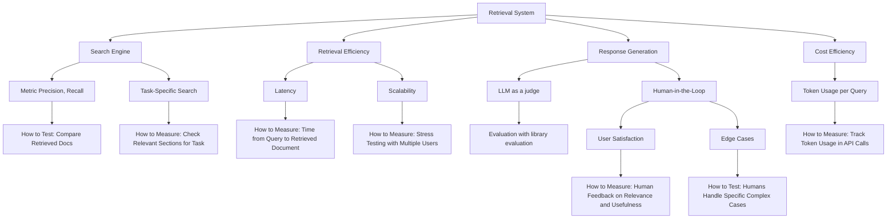
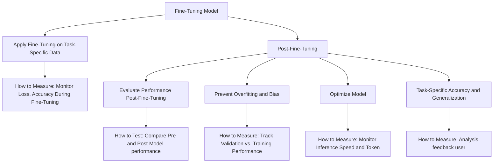
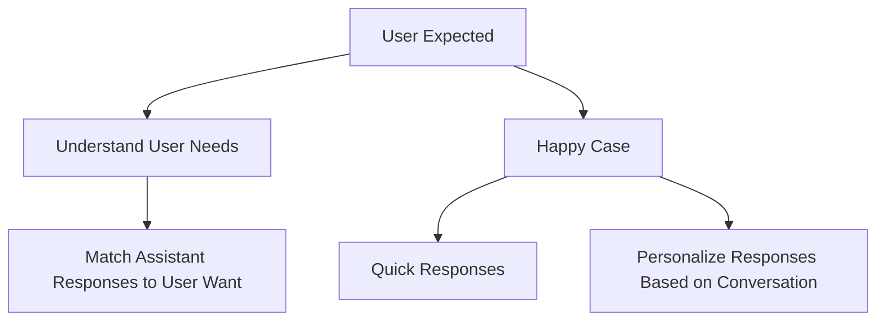
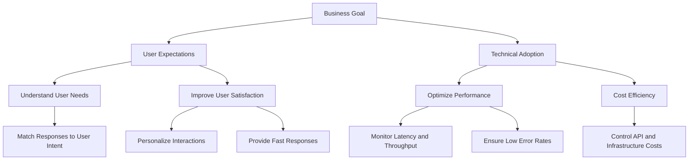

---
tags:
  - llm
  - evaluation
title: Evaluation Guidelines for LLM Applications
date: 2024-09-26
description: "This guide offers a structured approach to evaluating and optimizing the integration of third-party Large Language Models (LLMs) into applications, ensuring alignment with business goals and user needs through detailed checklists and evaluation metrics."
authors:
  - datnguyennnx
---

## Overview

Evaluation is a hard part of building an RAG system, especially for application-integrated LLM solving your business problem. This guide outlines a clear, step-by-step approach to effectively evaluating and optimizing the integration of a third-party Large Language Model (LLM) into your application. By following these articles, you'll make sure the model fits your business goals and technical needs.

## Evaluation checklist

The evaluation checklist helps make sure that all important parts of the LLM are reviewed during integration. Each checklist item should address a key part of the system or model to confirm it meets technical, business, and user needs.

By providing a structured way to assess the system’s performance, the checklist helps we ensure that the model meets both technical and business needs while delivering a positive user experience. For additional insights, you can refer to the following articles: [**LLM Product Development Checklist**](https://www.linkedin.com/pulse/llm-product-development-checklist-how-make-products-generative-pines/) and [**Understanding LLM User Experience Expectations**](https://blog.kore.ai/cobus-greyling/understanding-llm-user-experience-expectation).

### Product evaluation checklist

**In case RAG system:** 

- **Search Engine**
    - If a user searches for legal clauses related to "contract termination" the search engine should retrieve documents with high relevance (precision) and not miss any key documents (recall).
    - **Metric**: Precision = 85%, Recall = 90% in test dataset.
    - For a legal query, the system should retrieve and highlight clauses on "contract termination" and ignore irrelevant sections, like "payment terms."
    - **Task-Specific Accuracy**: 95% task-specific match in legal datasets.
- **Latency**
    - The system should retrieve documents within 2 seconds in a real-time customer support scenario.
    - **Expected Latency**: <2 seconds for 95% of queries.
- **Response Generation**
    - For a customer query about a "refund policy," the LLM should generate a response that directly references the correct clauses in the retrieved refund policy document.
    - **LLM Evaluation**: Coherence score >80% using a library evaluation metric.
    - **Human in the loop:** Annotate response of LLM.
- **Token Usage and Cost Efficiency**
    - For a legal document retrieval and summarization task, the system should use fewer than 10,000 tokens per query to balance cost and performance.
    - **Max Token Usage**: 10,000 tokens per query to maintain cost-effectiveness. Comparing each model together to find cost effectively.

**In case of fine-tuning model:**

- **Fine-Tuning on Task-Specific Data**
    - **Example**: A financial chatbot should correctly identify and respond to "interest rate change" queries 90% of the time in a test set.
    - **Metric**: Fine-tuning loss should decrease steadily, with an accuracy improvement of at least 5% compared to the base model.
- **Evaluate Performance Post-Fine-Tuning**
    - **Example**: In a legal document retrieval system, the fine-tuned model should correctly identify relevant clauses with 95% task-specific accuracy.
    - **Metric**: Precision = 90%, Recall = 88% for post-fine-tuning tests.
- **Prevent Overfitting**
    - **Example**: If training accuracy is 95%, validation accuracy should be no lower than 93%. If the gap increases, early stopping should be applied.
    - **Metric**: Validation loss should stay within 2% of the training loss.
- **Optimize Model Efficiency**
    - **Example**: A customer support model should deliver responses in less than 1.5 seconds while using fewer than 8,000 tokens.
    - **Expected Latency**: The fine-tuned model should respond in under 1.5 seconds for 95% of queries.
    - **Max Token Usage**: Limit token usage to under 8,000 tokens per query for cost-efficient operation.
- **Task-Specific Generalization and User Feedback**
    - **Example**: A medical chatbot, after fine-tuning, should correctly diagnose 90% of unseen cases based on the user feedback and test cases.
    - **Task-Specific Accuracy**: Achieve 93% accuracy in task-specific domains like healthcare diagnostics or legal assistance.

### Business and user expectation

This section is all about putting users first! It helps us understand what users need and ensures they get quick, personalized responses. By matching the assistant’s replies to what users really want, we create a satisfying experience for everyone.

Here, we focus on our goals as a business. This part guides us in making sure our system runs smoothly, stays affordable, and meets user needs effectively. By keeping an eye on performance and costs, we can deliver a reliable and efficient service that users want.

## The type of evaluation

### Model evaluations

- **Synthetic Dataset**: This method uses controlled synthetic datasets to evaluate model performance on specific tasks, testing unique scenarios and edge cases not typically found in real-world data, such as fictional customer service interactions. The [article](https://www.confident-ai.com/blog/the-definitive-guide-to-synthetic-data-generation-using-llms) shares the benefits of synthetic data, like protecting privacy and saving costs, while also touching on some challenges with quality and relevance.
- **Evaluation Search Engine**: To measure the accuracy of the model's responses, consider different types of search queries, including:
    - **Vector Search** Vector search works by embedding both queries and documents into a shared vector space, where the goal is to measure how "close" or similar they are. This method is particularly good for understanding context and meaning, rather than exact word matches.
        - To evaluate vector search, metrics like **NDCG (Normalized Discounted Cumulative Gain)** or **MRR (Mean Reciprocal Rank)** are used. The focus is on whether the most semantically relevant documents appear at the top of the results.
    - **Full-Text Search** Full-text search operates by matching specific words or phrases from the query to the documents. This method emphasizes exact matches, making it useful for cases where precise terms are critical.
        - The accuracy of full-text search is typically measured with metrics like **Precision**, **Recall**, and **F1 Score**. These metrics focus on how well the system retrieves documents that contain the exact terms from the query and whether it misses any relevant results. **Top-K accuracy** can also be applied to evaluate the system's ability to place relevant results within the first few returned.
    - **Hybrid Search:** Hybrid search combines vector and full-text methods to leverage both semantic similarity and keyword matching. This method seeks to balance understanding the broader meaning with finding exact terms, making it useful for varied query types.
        - A combination of metrics from both vector and full-text search is typically used for hybrid search evaluations. Metrics like **F1 Score** and **Top-K Accuracy** can assess its performance on keyword matches, while **NDCG** and **MRR** are helpful in evaluating how well the system ranks semantically relevant documents.

Let’s look at the key metrics for calculates accuracy of search engine.

| **Metric** | **Description** | **Example** |
| --- | --- | --- |
| **Precision** | How many of the documents you retrieved are actually relevant. | If you retrieved 10 documents and 8 were relevant, your precision is 80%. |
| **Recall** | How many of the relevant documents were actually retrieved. | If there were 20 relevant documents total and you retrieved 15, your recall is 75%. |
| **F1 Score** | A balance between precision and recall, giving you a single accuracy score. | With a precision of 80% and recall of 75%, your F1 score would be around 77%. |
| **Hit Rate** | The percentage of searches that returned at least one relevant document. | If users made 100 searches and found relevant info in 85, your hit rate is 85%. |
| **Top-K Accuracy** | How many relevant documents are in the top K results returned. | If your system returns 10 documents and 7 of them are relevant, your top-10 accuracy is 70%. |
| **Mean Average Precision (MAP)** | The average precision for several queries, taking into account the order of results. | If you had 5 different queries, you could average their precisions to get MAP. |
| **Mean Reciprocal Rank (MRR)** | The average position where the first relevant document shows up in the results. | If relevant docs appear at positions 1, 3, and 5 across multiple searches, MRR would reflect the average of those positions. |
| **Normalized Discounted Cumulative Gain (NDCG)** | Measures how useful the ranked results are, considering their positions. | If your top result is highly relevant and the second is less so, NDCG will reflect that importance. |
- **LLM as a judge**, you can score a model's responses based on key areas like **Relevance**, **Clarity**, **Helpfulness**, and more. This is useful because LLMs are good at understanding the context and intent behind responses, just like a human evaluator would.
    - **Closer to Human Judgment**: LLMs can evaluate outputs with higher human correlation, meaning their scores align more closely with what real users would think.
    - **Availability** – LLMs can operate 24/7 without breaks, providing immediate feedback or evaluations as needed. This constant availability can be particularly valuable in time-sensitive applications or in providing instant feedback in educational contexts.
    - **Cost-effectiveness** – Once developed and deployed, using LLMs as judges can be more cost-effective than employing human judges, especially for large-scale or ongoing evaluation tasks.
    - **Multilingual capabilities** – Advanced LLMs can operate across multiple languages, making them helpful for global applications where finding qualified human judges for all necessary languages might be challenging.
    - **Adaptability** – LLMs can be quickly adapted to judge different types of content or apply different criteria through prompt engineering, without the need for extensive retraining that human judges might require.

LLMs can act as reliable judges for evaluating outputs quickly. Below is a list of common metrics used for evaluation.

| **Metric** | **What it Checks** | **When to Use** | **Example** |
| --- | --- | --- | --- |
| **Correctness** | Ensures the output is factually accurate based on the information provided. | Use when verifying that responses are grounded in correct information or facts. | Checking if the answer to "Who is the current president of the US?" returns the correct name. |
| **Answer Relevancy** | Determines if the response is directly related to the user's query. | Use when you need to evaluate whether the response is aligned with the question asked. | Ensuring that a question about weather forecasts gives weather-related responses. |
| **Faithfulness** | Verifies whether the output stays true to the source material without hallucinating or adding incorrect info. | Use when you need to guarantee that a summary or paraphrase accurately reflects the original content. | Checking if a model’s summary of an article stays true to the key points without adding extra information. |
| **Coherence** | Checks whether the response logically flows and makes sense as a whole. | Use for long-form answers where the response needs to be consistent and easy to follow. | Reviewing if a multi-sentence response explaining a technical concept is coherent and logical. |
| **Contextual Recall** | Measures how well the response retrieves all relevant information from the context provided. | Use when evaluating the completeness of information retrieval tasks. | Ensuring that a model answers all aspects of a multi-part question based on the context provided. |
| **Contextual Relevancy** | Ensures the response uses the given context to directly address the user’s query. | Use when it’s critical for the response to be specifically tied to the context or previous conversation. | Checking if a chatbot follows up correctly on a previous conversation about booking a flight. |
| **Contextual Precision** | Measures the relevance and precision of the retrieved information from the context. | Use when the response must be highly accurate and precise based on the context. | Evaluating if a model picks the most relevant part of a conversation to respond to a follow-up query. |
| **Bias** | Detects whether the response shows signs of prejudice or unfair bias in its content. | Use when ensuring fairness, especially in sensitive or controversial topics. | Checking if a model-generated description of a profession avoids gender or racial bias. |
| **Toxicity** | Identifies if the response contains harmful, offensive, or inappropriate language. | Use when generating public-facing content where safety and neutrality are priorities. | Evaluating a chatbot response to ensure it avoids offensive or inflammatory language. |

**Tools to define and evaluate these metrics**

- **RAGAS**: [RAGAS](https://docs.ragas.io/en/stable/) is designed specifically for Retrieval-Augmented Generation (RAG) systems and allows you to define and evaluate metrics like **Answer Relevancy**, **Contextual Precision**, and **Faithfulness**. It provides a framework to score responses based on how well they match user queries while considering the context retrieved.
- **G-Eval**: [G-Eval](https://docs.confident-ai.com/docs/metrics-llm-evals) is great for more general LLM evaluation and supports custom metrics such as **Correctness** and **Coherence**. It allows you to tailor the evaluation process, making it easier to ensure that the output meets the required factual and logical standards.

### Product evaluations

Defining baselines, targets, and acceptable ranges for our RAG system metrics helps us stay on track and reach our goals. These benchmarks guide improvements and adapt to changes, ensuring we deliver the best experience for users while adding value to our organization.

| **Metric** | **Baseline** | **Target** | **Acceptable Range** |
| --- | --- | --- | --- |
| **Accuracy** | 85% correct responses | 90% correct responses | 85% – 95% |
| **Latency** | 700ms per query | 400ms per query | 300ms – 500ms |
| **Throughput** | 100 queries/second | 150 queries/second | 120 – 200 queries/second |
| **Cost per Query** | $0.01/query | $0.008/query | $0.007 – $0.012/query |
| **Context Window Size** | 4,096 tokens | 8,192 tokens | 6,000 – 10,000 tokens |
| **Error Rate** | 3% failure rate | 1% failure rate | 0.5% – 2% |

**Tools for tracing and monitoring**

- **LangFuse**: This tool is specifically designed to track user interactions and model outputs within Retrieval-Augmented Generation (RAG) systems. [LangFuse](https://langfuse.com/) provides detailed insights into how the model responds to various queries, enabling teams to identify patterns and areas for improvement in real time.
- **LangSmith**: Known for its robust monitoring capabilities, [LangSmith](https://www.langchain.com/langsmith) allows organizations to analyze key performance indicators such as response accuracy and latency. This tool helps ensure that the RAG system operates efficiently and meets performance benchmarks, facilitating ongoing optimization based on real user feedback.

## **Considerations**

### **Coverage and monitoring**

To keep your LLM application running smoothly, you’ll want to:

- **Create comprehensive test sets**: Make sure your test set covers a wide range of scenarios, including edge cases, so you can better understand what your application can and can’t handle. This coverage helps spot areas that need improvement and ensures reliable performance.
- **Integrate with CI/CD**: Adding evaluations into your CI/CD pipeline means you can keep an eye on things and catch problems early, helping you quickly fix any issues during development. When debugging, we can easy to understanding what is good conversation and not good conversation based on score.

### **Use analytics and user feedback**

- **Combine analytics with evaluations**: Bringing together analytics and evaluation results gives you a complete picture of how your app is performing and how users are interacting with it.
- **Build strong feedback loops**: Listening to user feedback as part of your evaluation process helps make sure the app meets both technical goals and what users actually need. Users can often point out things that automated tests might miss. The [article](https://klu.ai/glossary/human-in-the-loop) provides insight into how integrating human feedback enhances AI system accuracy and performance.

### Need fine-tuning model

RAG systems are fantastic for retrieving information, but they sometimes miss the mark when it comes to understanding the finer details of specific tasks. Fine-tuning serves as a solution to this challenge by adapting pre-trained models to specific datasets to apply specific tasks. 

1. **Deeper Understanding of Context**: Fine-tuning allows a model to learn the ins and outs of specific tasks, making it better at understanding details that are important for accurate responses
2. **Fewer errors in specific scenarios**: By focusing on task-related examples, fine-tuning reduces the chances of mistakes, allowing the model to perform reliably—especially in complex or unique requests.
3. **Handling edge cases**: Fine-tuning prepares the model to tackle unusual or rare scenarios better, ensuring it can provide the right answers when faced with unexpected questions.

Assume how the model's performance changes before and after fine-tuning:

| **Metric** | **Before Fine-Tuning** | **After Fine-Tuning** | **Change** |
| --- | --- | --- | --- |
| Task-Specific Accuracy | 75% | 90% | +15% |
| Error Rate | 5% | 2% | –3% |
| Edge Case Handling | 70% | 85% | +15% |
| Search Precision | 80% | 95% | +15% |

## Summary

This guide provides a simple, step-by-step approach to evaluating and optimizing your RAG system, ensuring it meets your business goals and user needs. With handy checklists and tools, you’ll effectively assess model performance and improve user experience!

## Reference

- https://www.iguazio.com/glossary/llm-as-a-judge/
- https://blog.context.ai/the-ultimate-guide-to-llm-product-evaluation/