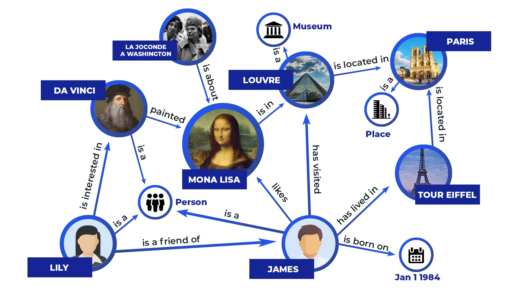
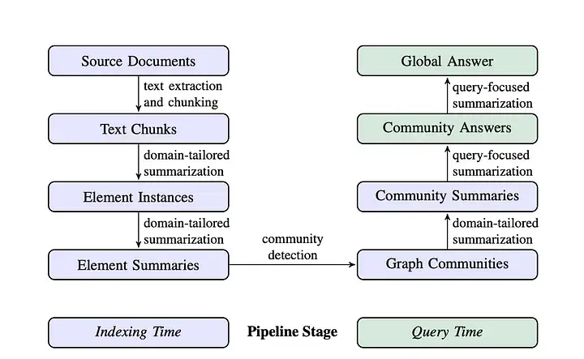
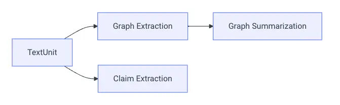
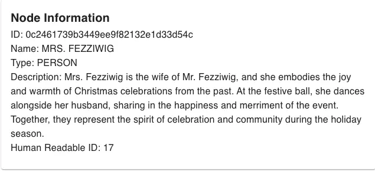
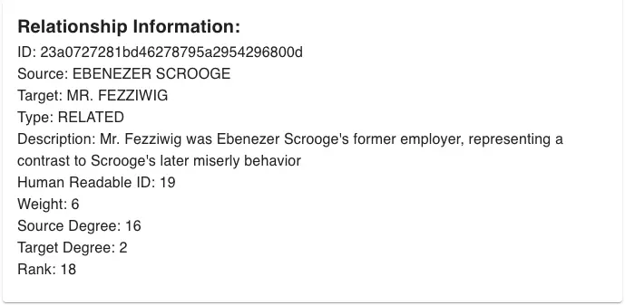
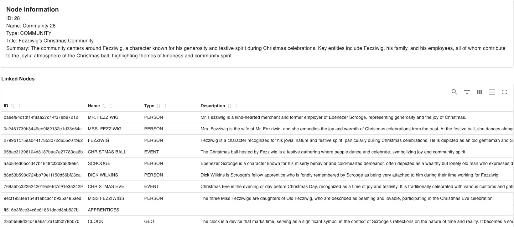
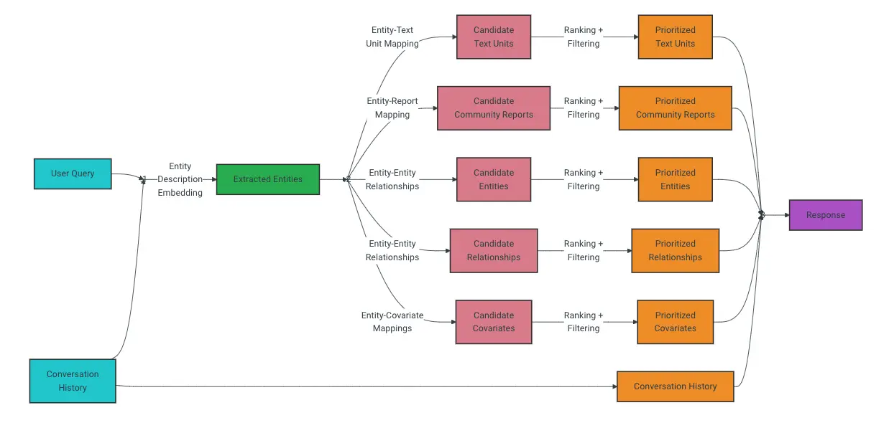
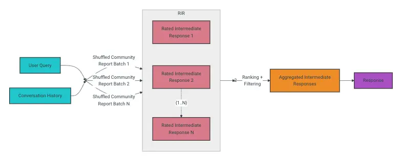

---
tags:
  - llm
  - rag
title: GraphRAG - Building a knowledge graph for RAG system
description: "In baseline Retrieval Augmented Generation (RAG), sometimes the result might not be accurate as expected since the query itself have multiple layers of reasoning or the answer requires traversing disparate pieces of information through their shared attributes in order to provide new synthesized insights. In this post, we will explore a new approach called GraphRAG which combines the strengths of knowledge graphs and large language models to improve the accuracy of RAG systems"
date: 2024-11-01
authors:
  - hoangnnh
---

In baseline Retrieval Augmented Generation (RAG), sometimes the result might not be accurate as expected since the query itself have multiple layers of reasoning or the answer requires traversing disparate pieces of information through their shared attributes in order to provide new synthesized insights. In this post, we will explore a new approach called GraphRAG which combines the strengths of knowledge graphs and large language models to improve the accuracy of RAG systems.

## What is Knowledge Graph?

A knowledge graph is an organized representation of real-world entities and their relationships. It is typically stored in a graph database, which natively stores the relationships between data entities. Entities in a knowledge graph can represent objects, events, situations, or concepts. Knowledge graphs contain 2 key chracteristics: 
 - **Nodes**: Represent entities such as people, places, organizations, events, or concepts,... Each node can have properties or attributes that describe it. For example, A node with type Person might have properties like name, age, and occupation.
 - **Edges**: Represent the relationships or connections between entities. Edges can have types and properties as well. For example, an edge with type FRIEND_OF might have a property called "since", indicating when the friendship began.

## Why Knowledge Graph is used in RAG?

Naive RAG systems built with keyword or similarity search-based retrieval fail in complex queries that require reasoning. Suppose user asks a query: "Who directed the sci-fi movie where the lead actor was also in The Revenant?", a standard RAG system will retrieve documents about The Revenant, then find information about cast and crew members, but it will fail identiy the lead actor, Leo DiCaprio who starred in other movies but not existed in the query to retrieve document. However, taking advantage of knowledge graph, the ideally process will be: identify the lead actor of The Revenant, then find other movies he starred in, then find the sci-fi movie which meet ciriteria.

## How GraphRAG works?

GraphRAG workflow contain 2 main stage: Index and Query. 

### Index

Indexing in GraphRAG is data pipeline and transformation suite that is designed to extract meaningful, structured data from unstructured text using LLMs. Following above diagram, Index stage contain 6 main steps:
 - **Compose TextUnits**: TextUnit is a chunk of text that is used used for our graph extraction techniques. In this step, we will split the raw text into TextUnits.
 - **Graph Extraction**: In this step, we will use LLM to extract entities and relationships from TextUnits. 

Entity will have name, type, description propeties. Relationship will have source, target, descrption properties. Each entity and relationship will have a short summary description.

| Entity Example | Relationship Example |
|----------------|----------------------|
|  |  |

 - **Graph Augmentation**: In this step, we generate a hierarchy of entity communities using the [Hierarchical Leiden Algorithm](https://en.wikipedia.org/wiki/Leiden_algorithm). The purpose to group nodes into comunity is represent closely-related groups of information that can be summarized independently.

 - **Community Summarization**: At this point, we have a functional graph of entities and relationships, a hierarchy of communities for the entities. We use LLM to summarize each community. These summaries are independently useful in their own right as a way to understand the global structure and semantics of the dataset, and may themselves be used to make sense of a corpus in the absence of a question

### Query

Query stage is the process of answering a question using the graph and the summaries of the communities. The query has 2 mode: Local Query and Global Query.

 - **Local Query**: Local query method generates answers by combining relevant data from the AI-extracted knowledge-graph with text chunks of the raw documents. It is well-suited for answering questions that require an understanding of specific entities mentioned in the input documents. For example: "Who is Ebenezer Scroog".

Following above diagrams, the user query will be extracted entities. Then, these entities will be semantic-searched though knowledge graph to find relevant informations. Then it flow to some filter and sorting steps to get the final answer.

 - **Global Query**: Global query method generates answers by searching over all AI-generated community reports in a map-reduce fashion. It is well-suited for reasoning about holistic questions related to the whole data corpus by leveraging the community summaries. For example: "Who is the most famous author in the corpus?".

In this mode, the collections of communiites will be used to generate response to user query in a map-reduce manner. At the Map step, community reports are segmented into text chunks of pre-defined size. Each text chunk is then used to produce an intermediate response containing a list of point, each of which is accompanied by a numerical rating indicating the importance of the point. And in Reduce step, the intermediate responses will be filtered and re-ranking and then aggregrated to produce the final answer.

## Conclusion
GraphRAG is ideal for tackling complex tasks such as multi-hop reasoning and answering comprehensive questions that require linking disparate pieces of information. However, using a lot of LLM calls in both index and query stage make it expensive and should be consider.

## References
- https://arxiv.org/abs/2404.16130
- https://microsoft.github.io/graphrag/
- https://medium.com/@zilliz_learn/graphrag-explained-enhancing-rag-with-knowledge-graphs-3312065f99e1