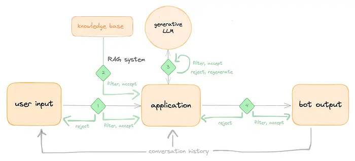

---
tags:
  - llm
title: Guardrails in LLM
description: "Inspite of having strength to process and produce highly coherent human-like, behavior of LLM is unpredictable, so the need of a safety mechanisms and boundaries that control and direct an AI model's behavior to ensure it operates safely, ethically, and within intended parameters is crucial..."
date: 2024-10-24
authors:
  - hoangnnh
---

Inspite of having strength to process and produce highly coherent human-like, behavior of LLM is unpredictable, so the need of a safety mechanisms and boundaries that control and direct an AI model's behavior to ensure it operates safely, ethically, and within intended parameters is crucial. That why we need guardrails in LLM.

## Introduction

Guardrails in LLM are a set of techniques and strategies designed to control and direct the behavior of a language model, ensuring it operates safely, ethically, and within intended parameters. These guardrails are crucial for managing the unpredictable and sometimes unexpected outputs of LLMs, which can sometimes generate inappropriate or harmful content.


## Types of Guardrails


1. **Input Guardrails**: This involves pre-processing the input to the model to remove or modify any potentially harmful or inappropriate content. This can include filtering out profanity, hate speech, or sensitive information. Some common usecases:
   - **Topical Guardrails**: Limit the model's responses to a specific topic or domain to prevent it from generating off-topic or irrelevant content.
   - **Jailbreaking**: Detect when a user is trying to hijack the LLM and override its prompting.
   - **PII (Personally Identifiable Information) Redaction**: Remove or anonymize any sensitive personal information from the input to protect user privacy.

```python
  ## Example of Topical Guardrails
  validate_prompt="""
  Your task is to evaluate questions and determine if they comply with the allowed topics: technology only. Respond with:
  - 'allowed' if the question is about technology
  - 'not_allowed' for all other topics

  Examples:
  "What is RAG?" -> allowed
  "How tall are giraffes?" -> not_allowed
  """
#-----------------------------------------------
  question = "How tall the 2023 World Series winner?"
  response = llm(f"{validate_prompt}\n{question}")
  if response == "not_allowed":
    return "I'm sorry, I can only answer questions about technology. Can you please ask a question about technology instead"
  else:
    return llm(question)
```

2. **Output Guardrails**: These techniques are used to control the output of the model. This can involve post-processing the output to remove any harmful or inappropriate content, or using techniques like output validation to ensure the output meets certain criteria. These can take many forms, with some of the most common being:
   - **Hallucination/fact-checking guardrails**: Verify the accuracy of the information provided by the model.
   - **Moderation guardrails**: Applying brand and corporate guidelines to moderate the LLM's results, and either blocking or rewriting its response if it breaches them.
   - **Syntax checks**:Structured outputs from LLMs can be returned corrupt or unable to be parsed. This is a common control to apply with function calling.

```python
  ## Example of Moderation Guardrails

  domain = "technology"

  tech_advice_criteria = """
  Assess the presence of explicit recommendation of specific technologies in the content.
  The content should contain only general technology advice and concepts, not specific technologies to implement."""

  tech_advice_steps = """
  1. Read the content and the criteria carefully.
  2. Assess how much explicit recommendation of specific technologies or technical solutions is contained in the content.
  3. Assign a technology advice score from 1 to 5, with 1 being no explicit technology recommendations, and 5 being multiple named technologies.
  """

  moderation_system_prompt = """
  You are a moderation assistant. Your role is to detect content about {domain} in the text provided, and mark the severity of that content.

  ## {domain}

  ### Criteria

  {scoring_criteria}

  ### Instructions

  {scoring_steps}

  ### Content

  {content}

  ### Evaluation (score only!)
  """

  question= "What is the best programming language for a beginner to learn?"
  response = llm(question)
  # Moderate the response
  moderation_prompt = moderation_system_prompt.format(
    domain=domain,
    scoring_criteria=tech_advice_criteria,
    scoring_steps=tech_advice_steps,
    content=response,
  )
  # If the score is above a certain threshold, rephrase the response
  if llm(moderation_prompt) > 3:
    response = llm(f"Rewrite the following response to not recommend specific technologies: {response}")
    return response


```

## Trade-offs

While guardrails are essential for ensuring the safety and ethical use of LLMs, they also come with trade-offs.
 - Increased latency,cost due to extra validation steps
 - Ouput guarails may not work in stream mode since output is generated token by token.
 - Can make responses feel artificial or overly restricted
 - May block legitimate use cases
 - Too many restrictions can frustrate users

## Conclusion
Apply Guardrails into LLM pipeline is a should-have strategy to ensure the safety, ethical, and intended use of LLMs. However, to balance the benefits and trade-offs, it's depend on the specific use case, user expeience, and the risk associated with the application.

## References
- https://www.ml6.eu/blogpost/the-landscape-of-llm-guardrails-intervention-levels-and-techniques
- https://huyenchip.com/2024/07/25/genai-platform.html#query_rewriting
- https://cookbook.openai.com/examples/how_to_use_guardrails