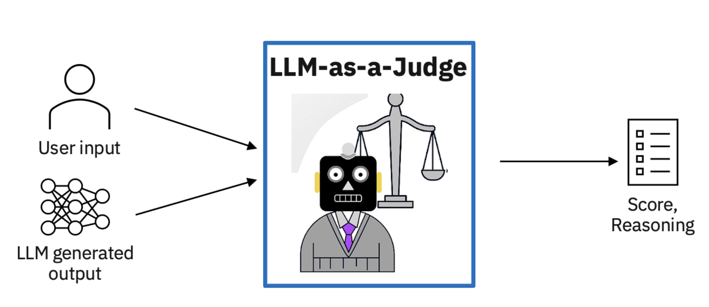
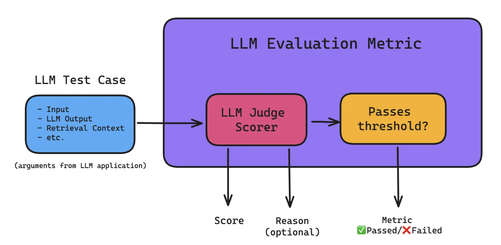

---
authors:
  - "hoangnnh"
date: "2024-10-04"
description: "With the robust growth of LLM models currently , there is a new method is used to evaluate the performance of large language models (LLMs): LLM-as-a-Judge, also known as LLM-evaluators. This approach take adavantages of other advanced language models to assess the quality and effectiveness of responses generated by other LLMs."
hashnode_meta:
  id: "670f482a3eef1c09124dad27"
  slug: "llm-as-a-judge"
sync: "hashnode"
tags:
  - "llm"
  - "evaluation"
title: "LLM as a Judge"
---
With the robust growth of LLM models currently , there is a new method is used to evaluate the performance of large language models (LLMs): LLM-as-a-Judge, also known as LLM-evaluators. This approach take adavantages of other advanced language models to assess the quality and effectiveness of responses generated by other LLMs.

## Introduction

LLM-as-a-Judge is a powerful solution that uses LLMs to evaluate LLM responses based on any specific criteria of your choice, which means using LLMs to carry out LLM (system) evaluation. This approach offers an alternative to traditional human evaluation, which can be both costly and time-consuming. The LLM-as-a-Judge framework encompasses three main types:

- **Single Output Scoring (without reference)**: In this approach, a judge LLM is given a scoring rubric and asked to evaluate LLM responses. The assessment can consider various factors, including the input provided to the LLM system and the retrieval context in Retrieval-Augmented Generation (RAG) pipelines.

- **Single Output Scoring (with reference)**: This method is similar to the first, but it includes a reference or ideal output. This addition helps the judge LLM provide more consistent scores, addressing potential inconsistencies that may arise in LLM judgments.

- **Pairwise Comparison**: the judge LLM compares two LLM-generated outputs and determines which is superior based on the given input. This approach requires a predefined set of criteria to establish what constitutes a "better" response.

Example:

```python
prompt= """
Given the folowing question and answer, evaluate how good the answer is for the question. Use the score from 1 to 5:

Q: {{question}}
A: {{answer}}
Score:
"""
```

The idea is simple: give an AI language model a set of criteria and let it evaluate responses for you.



## Problems

As you might expect, LLM judges are not all rainbows and sunshines. They also suffer from several drawbacks, which includes:

- **Inconsistency**: LLM can be reliable judges when making high-level decisions, such as determining binary factual correctness or rating generated text on a simple 1–5 scale. But when you ask them to use more detailed scoring systems, they start to struggle. The more precise you ask them to be, the more likely they are to give random or unreliable scores. It's like asking someone to judge the exact shade of blue in the sky - they might be fine saying if it's light or dark, but they'll have a hard time giving an exact color code.
- **Narcissistic Bias**: Human have biases, and so do AI judges, LLM model favors its own responses over the responses generated by other models/systems. This bias can lead to overly positive evaluations of its own performance and underestimations of other models' capabilities.
- **Position Bias**: When using LLM judges for pairwise comparisons, it has been shown that LLMs such as GPT-4 generally prefer the first generated LLM output over the second one.
- **Hallucination**: LLMs can sometimes generate false information, which can lead to incorrect evaluations.

## Improving LLM Judgements

**Chain-Of-Thought Prompting**

Chain-of-thought (CoT) prompting helps LLM explain their thinking step-by-step. When using this method for AI evaluators, we make them reasoning detailed instructions on how to judge, rather than vague guidelines. This approach helps the AI make more accurate and consistent evaluations. It also makes the AI's judgments more in line with what humans would expect.

```python
prompt= """
Decide if the following summary is consistent with the corresponding article. Note that
consistency means all information in the summary is supported by the article.

Article: [Article]
Summary: [Summary]
Explain your reasoning step by step then answer (yes or no) the question:

"""
```

**Confining LLM Judgements**

Instead of giving LLMs the entire generated output to evaluate, you can consider breaking it down into more fine-grained evaluations. For example, for question-answer-generation (QAG), you can first extract all sentences in output and pass each of them through LLM with `prompt = Is this sentence relevant to the input? answer yes or no only`.After that, calculate the proportion of relevant sentences. This proportion becomes the "answer relevancy score."

**Using LLM Judges in LLM Evaluation Metrics**

LLM judges can be and are currently most widely used to evaluate LLM systems by incorporating it as a scorer in an LLM evaluation metric.



**Fine-tuning LLM Judges**

Fine-tuning LLM judges can help improve their performance. This involves training the LLM on a dataset of examples where the correct score is already known. This can help the LLM learn to be more consistent and accurate in its evaluations.

## Conclusion

LLM-as-a-Judge contribute a significant impact to the field of AI evaluation. By leveraging the power of advanced language models to evaluate other models, we're entering a new era of more accurate, scalable, and insightful AI assessment. While challenges remain, such as potential biases and the need for careful prompt engineering, the benefits of this approach are clear.

As LLMs continue to evolve and improve, as well as their ability to serve as judges. The relationship between LLMs and AI evaluation is likely to become even more symbiotic, with each side benefiting from the other.

## References

- https://eugeneyan.com/writing/llm-evaluators/#key-considerations-before-adopting-an-llm-evaluator
- https://www.confident-ai.com/blog/why-llm-as-a-judge-is-the-best-llm-evaluation-method
- https://leehanchung.github.io/blogs/2024/08/11/llm-as-a-judge/