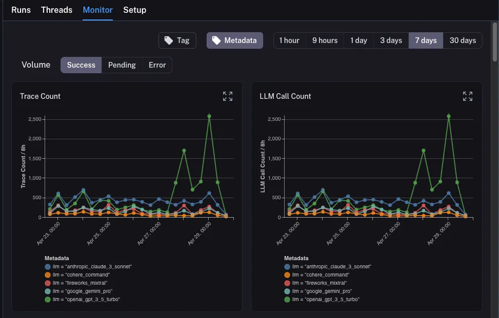
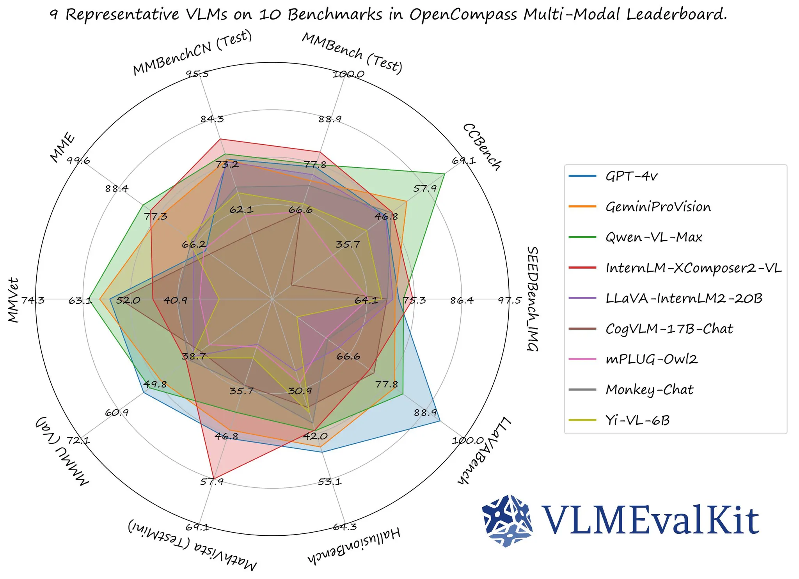
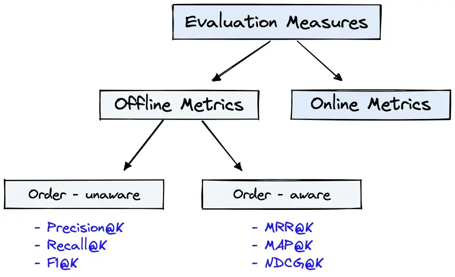
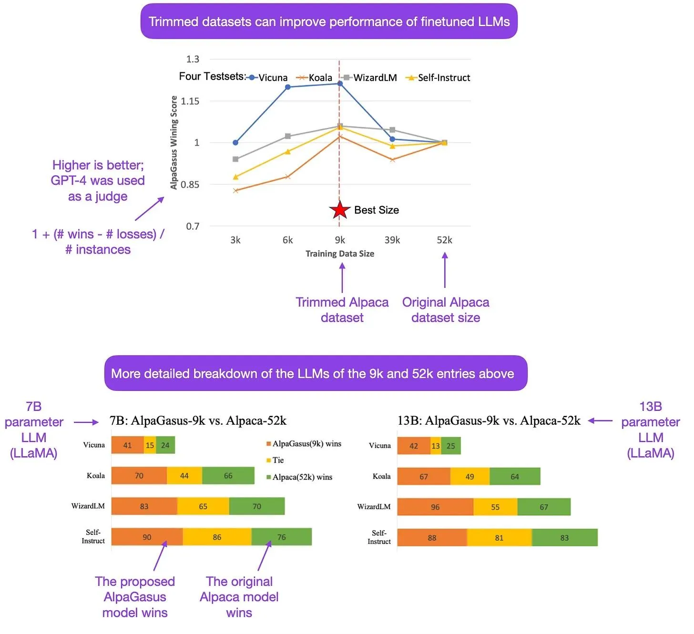
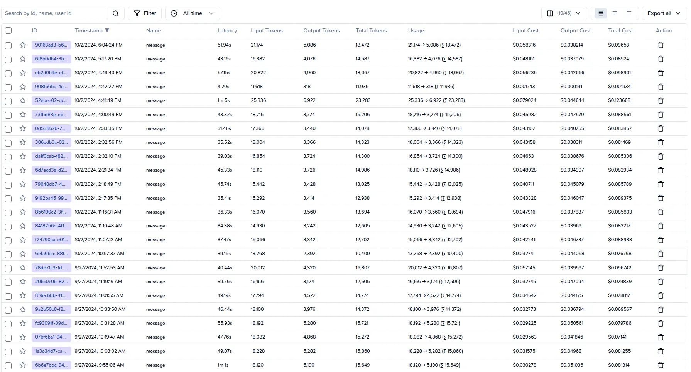

---
tags:
  - llm
  - observability
  - metric
  - pillar
title: Metric Pillar
date: 2024-10-11
description: 'Metrics give you the rundown on how your LLM’s performing. We will show how to use these metrics to identify issues, increase efficiency, and make changes for improved outcomes.'
authors:
  - datnguyennnx
---

When it comes to observability in Large Language Model (LLM) applications, metrics have significance delivering that these systems work correctly. Metrics provide information on both system performance and model efficiency, enabling developers and researchers to fine-tune their systems. In this article, we'll look at important metrics for monitoring and evaluating LLMs.

## System Metrics

System metrics are essential for understanding the overall health and performance of your LLM application. Here are four key system metrics to keep an eye on:

- **Latency**: This metric indicates how long it takes for the system to react to a user query. Monitoring latency is important because it directly affects user experience. High latency can cause unhappiness, while low latency is often associated with a fast application.
- **Throughput**: The amount of requests that the system can handle in a given time period. High throughput is expected, especially in high-demand contexts, because it shows the system can handle multiple requests at once without decreasing performance.
- **Error Rate**: This metric tracks the percentage of failed requests or errors generated by the system.A high error rate may indicate underlying issues that must be solved immediately to ensure customer trust and happiness.
- **Resource Utilization**: Monitor CPU, memory, and disk utilization to discover bottlenecks and improve resource allocation. Understanding how resources are used can result in improved scalability and performance improvements.

| Metric Type | Description | Importance |
| --- | --- | --- |
| Latency | Time taken for a response | Direct impact on user experience |
| Throughput | Queries handled per time unit | Essential in high-demand scenarios |
| Error Rate | Percentage of failed requests | Indicates system reliability |
| Resource Utilization | CPU, memory, and disk usage | Helps identify performance bottlenecks |

## Model Metrics

Model metrics examine the performance of the LLM itself. We'll separate them into two sections: metrics for model-based scoring and metrics for retrieval-augmented generation (RAG) systems.

### Scoring based on the model

Evaluating the performance of an LLM requires specific metrics that quantify its output quality. Almost they are testing based on public dataset or benchmarks. Here are four key metrics used for model scoring:

- **Perplexity**: Perplexity measures how well a probability distribution predicts a sample. Lower perplexity indicates better predictive performance, making it a valuable metric for evaluating language models.
- **BLEU Score**: The BLEU (Bilingual Evaluation Understudy) score is used to assess the quality of machine-generated text by comparing it to one or more reference texts. A higher BLEU score indicates a closer match to human-generated outputs.
- **METEOR**: This metric improves upon BLEU by considering synonyms and stemming, providing a more nuanced evaluation of generated text quality. Higher METEOR scores reflect better semantic meaning.
- **ROUGE**: ROUGE (Recall-Oriented Understudy for Gisting Evaluation) focuses on recall and is particularly useful for summarization tasks. It compares the overlap of n-grams between the generated text and reference texts.

| Metric Type | Description | Importance |
| --- | --- | --- |
| Perplexity | Predictive performance measure | Lower values indicate better models |
| BLEU | Quality comparison to reference texts | Higher scores reflect closer matches |
| METEOR | Evaluates semantic similarity | Enhances BLEU's effectiveness |
| ROUGE | Measures overlap in summarization | Useful for content generation tasks |

### Scoring based on RAG systems

In retrieval-augmented generation systems, the effectiveness of information retrieval can be as important as the quality of generated text. Some metrics below help us understand the quality and precision of search engine. 

- **Precision@K**: This measures the proportion of relevant documents within the top K results returned by the system. A higher Precision@K indicates that the system effectively retrieves relevant content, which is vital for generating accurate responses.
- **Recall@K**: Recall@K evaluates how many of the total relevant documents were retrieved. This metric helps ensure the system captures all necessary information, thus preventing critical data loss.
- **Mean Reciprocal Rank (MRR)**: MRR assesses the average rank of the first relevant result returned. A higher MRR indicates that relevant results appear earlier in the list, which enhances user satisfaction.
- **Normalized Discounted Cumulative Gain (NDCG)**: NDCG considers the position of relevant documents in the result list, providing a comprehensive view of ranking quality. High NDCG scores signify that relevant documents are prioritized, improving user experience.

| Metric Type | Description | Importance |
| --- | --- | --- |
| Precision@K | Relevant documents among top K results | Importance for content quality |
| Recall@K | Proportion of relevant documents retrieved | Ensures no critical info is missed |
| Mean Reciprocal Rank | Average rank of the first relevant result | Improves user satisfaction |
| Normalized Discounted Cumulative Gain | Evaluates ranking quality | Enhances overall user experience |

### Metrics for Fine-Tuning model

Fine-tuning models is an essential step for improving performance when the RAG technique cannot improve the behavior and predictability of the model.

- **Performance Improvement**: This metric compares model performance before and after fine-tuning using various scores (e.g., BLEU, ROUGE). It provides a clear indication of whether the fine-tuning process was successful
- **Training Time**: Monitoring the time taken for fine-tuning helps assess the efficiency of the training process. Reducing training time while maintaining performance is a key goal.
- **Overfitting Rate**: The overfitting rate evaluates how well the model generalizes to unseen data after fine-tuning. A low overfitting rate indicates that the model has retained its ability to perform well across different datasets.
- **Loss Reduction**: Tracking the loss function before and after fine-tuning gives insights into how well the model learns from the data. A significant reduction in loss indicates effective fine-tuning.
- **User Feedback**: Gathering qualitative feedback from users can provide insights into perceived improvements in model performance, helping to complement quantitative metrics.

| Metric Type | Description | Importance |
| --- | --- | --- |
| Performance | Comparison of scores pre- and post-fine-tuning | Indicates success of fine-tuning |
| Training Time | Duration of the fine-tuning process | Critical for efficiency |
| Overfitting Rate | Generalization capability post-tuning | Ensures model robustness |
| Loss Reduction | Change in the loss function | Reflects learning effectiveness |
| User Feedback | Qualitative assessment of model performance | Provides context to quantitative data |

## Cost Metrics

Finally, the operating system should mention cost and price of the amount of model to help us understand the behavior of the user when choosing the model. A balance between pricing and performance is good for we observability. 

- **Pricing per Request**: This metric reflects the cost associated with processing each user request. Understanding this is crucial for budgeting and resource allocation.
- **Token In/Out**: Tracking the number of tokens processed (input and output) helps in understanding usage patterns and associated costs. Many third-party providers charge based on token counts.
- **Total Time**: This metric aggregates the total time spent processing requests, which can be correlated with costs, especially in cloud environments where time translates to billing.
- **Resource Costs**: Monitoring costs associated with cloud resources (e.g., CPU, storage) is essential for calculating total operational costs.
- **Service Rate Limits**: Understanding the rate limits imposed by third-party services helps in planning usage and avoiding unexpected costs or service interruptions.

| Metric Type | Description | Importance |
| --- | --- | --- |
| Pricing per Request | Cost per processed user request | Important for budgeting |
| Token In/Out | Count of processed tokens | Affects overall cost |
| Total Time | Aggregate processing time | Correlates with operational costs |
| Resource Costs | Expenses linked to resource utilization | Essential for cost management |
| Service Rate Limits | Limits set by service providers | Important for usage planning |

## Conclusion

Knowing and implementing a robust set of observability metrics in LLM applications is important for making sure high performance and client happiness. Reviewing all the metrics mentioned in the article gives a lot of valuable insights into why each one is important and why we should be using them. 

## Reference

- https://aman.ai/primers/ai/LLM/
- https://www.pinecone.io/learn/offline-evaluation/
- https://docs.smith.langchain.com/tutorials/Developers/observability
- https://konfuzio.com/de/limits-llms-retrieval-augmented-generation/
- https://sebastianraschka.com/blog/2023/optimizing-LLMs-dataset-perspective.html
- https://www.trulens.org/trulens/getting_started/core_concepts/feedback_functions/#large-language-model-evaluations
- https://kili-technology.com/large-language-models-llms/how-to-build-llm-evaluation-datasets-for-your-domain-specific-use-cases