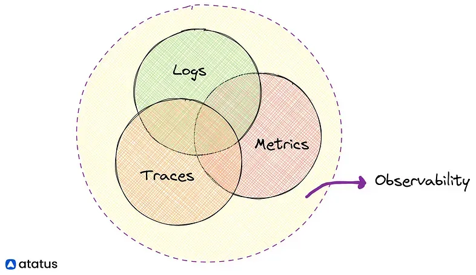

---
tags:
  - llm
  - observability
title: Observability in AI Platforms
date: 2024-10-11
description: 'Observability in AI is all about understanding what’s going on inside complex systems. It gives you the tools - logs, metrics, and traces - to monitor, troubleshoot, and optimize how AI models and services run.'
authors:
  - datnguyennnx
---

## Introduction

### Importance of Observability

Observability in AI systems, especially LLMs, is about understanding what’s happening behind the scenes. It’s essential for ensuring smooth operations, building user trust, and meeting compliance standards by monitoring performance, spotting issues, and staying accountable. As AI becomes more central to our lives, observability directly affects system stability and performance.

### Integrating Observability Early

The best advice is to integrate observability tools right from the start of your project. Delaying it can cause worse issues later on. Early integration helps catch issues before they escalate and sets foundation for scaling as your systems grow more complex. 

## The Three Pillars of Observability

Understanding observability requires understanding its three pillars: **Metrics**, **Logs**, and **Traces**. Each plays a different role in creating a overview of your LLM application.

### Metrics

[Metrics](metric-pillar.md) are the foundation of AI observability, including system- and model-specific indications. System indicators like throughput and hardware usage are common, whereas model metrics like accuracy and hallucination rates are AI-specific. Cost tracking includes tracking query volumes and token usage. Using a combination of spot and extensive checks ensures complete monitoring.

### Logs

[Logging](logs-pillar.md) in AI applications ensures detailed records are maintained, enabling effective monitoring and debugging throughout the system’s operation. The golden rule of logging is to record everything: system parameters, queries, outputs, and component lifecycles. Effective logging needs consistent tagging and identification assignment for traceability.

### Traces

[Tracing](race-pillar.md) in AI applications provides a full picture of the execution path, from query to response. It includes document retrieval, prompting, and model interactions, as well as time and cost estimates for each step. Visualization tools such as Langsmith provide simple trace representations.

## Benefits of LLM bbservability

Using LLM observability tools brings a range of benefits to business:

- **LLM Performance:** Ongoing monitoring helps fine-tune LLMs, improving speed and accuracy.
- **Faster Problem Diagnosis:** Detailed logs and metrics make it easier to spot and fix problems fast, reducing downtime.
- **Cost Savings:** Early detection of inefficiencies and better resource management can lower operating expenses.
- **Better Explainability:** A clearer understanding of how LLMs work helps companies explain decisions, especially in regulated industries.
- **Increased Reliability:** Proactive monitoring helps catch issues early, making LLMs more dependable.

## Challenges in LLM observability

Monitoring LLMs presents several challenges:

- **Model Complexity:** LLMs are costly and complex, making them difficult to monitor and optimize effectively.
- **Third-Party Rate Limits:** A lot of LLMs use third-party APIs with rate limits, which can slow down monitoring and make it harder to get real-time data.
- **Dynamic Workloads:** LLM performance can change in response to shifting demands, requiring adaptive monitoring strategies.
- **Data privacy:** Ensuring data privacy when monitoring LLMs is important because businesses must meet legal requirements without sacrificing insights.

## References

- https://theblue.ai/blog/llm-observability-en/
- https://medium.com/@aiswaryasomanathan4/logging-traces-and-metrics-whats-the-difference-c796ea276c98