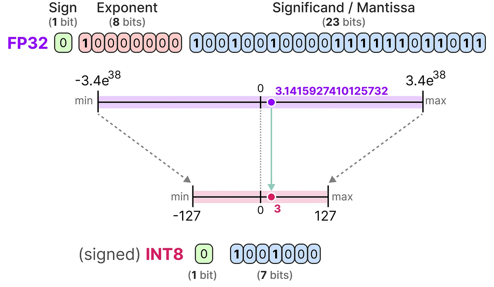
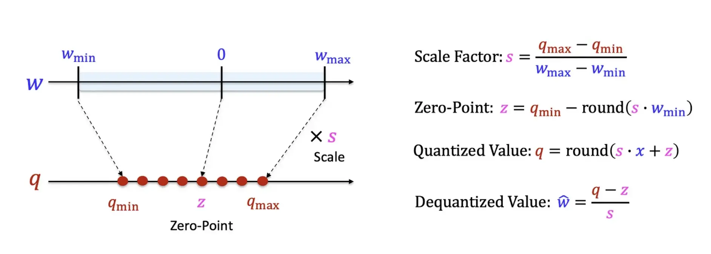
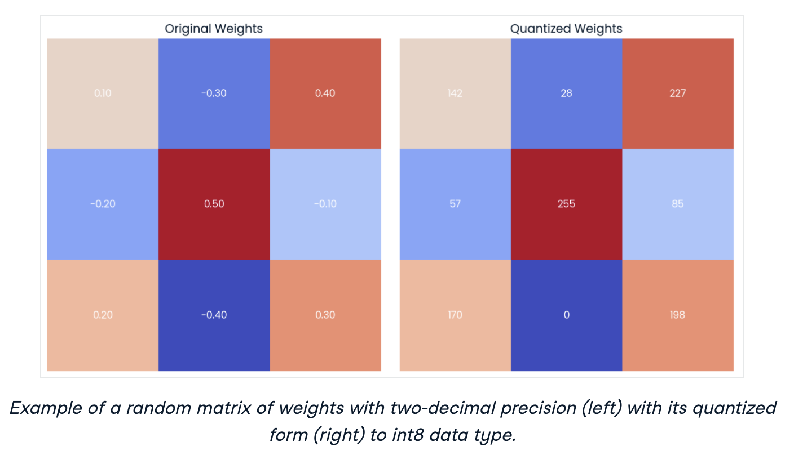
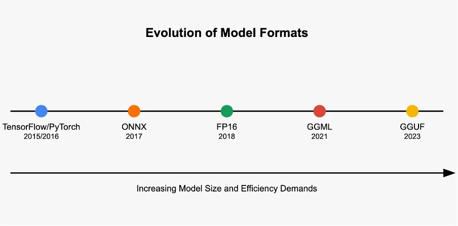
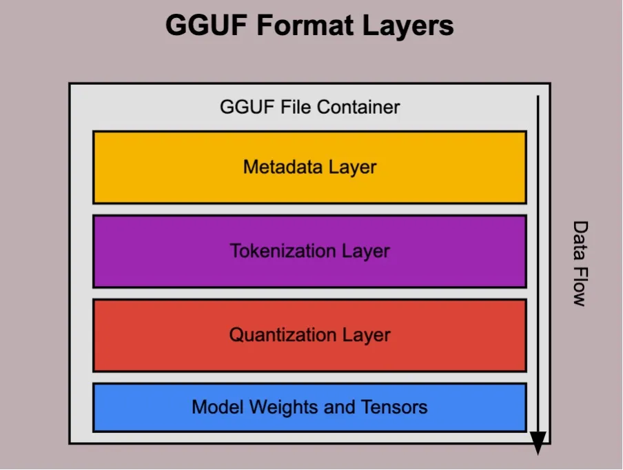

---
tags:
  - llm
  - ai
authors:
  - hoangnnh
date: 2024-11-21
title: "Quantization for large language models"
description: "As large language models (LLMs) continue to evolve, their parameter counts grow exponentially, with some models reaching trillions of parameters. This exponential growth presents significant challenges for deployment on edge devices and in resource-constrained environments due to extensive memory and computational requirements. Quantization emerges as a crucial technique to reduce model footprint while preserving acceptable performance."
---

As large language models (LLMs) continue to evolve, their parameter counts grow exponentially, with some models reaching trillions of parameters. This exponential growth presents significant challenges for deployment on edge devices and in resource-constrained environments due to extensive memory and computational requirements. Quantization emerges as a crucial technique to reduce model footprint while preserving acceptable performance.

## Understanding quantization

Quantization is a sophisticated model compression technique that transforms weights and activations within a large language model from high-precision to lower-precision values. For instance, converting 32-bit floating-point numbers to 8-bit integers. This transformation yields multiple benefits:

- Reduced model size
- Lower memory consumption
- Decreased storage requirements
- Enhanced energy efficiency

While precision reduction may introduce some accuracy loss and output noise, quantization remains viable when accuracy degradation stays within acceptable thresholds.

## Types of quantization

Two primary approaches exist for LLM quantization:

- **Post-training quantization (PTQ)**: Applied to pre-trained models after training completion. Weights and activations undergo quantization to lower-precision representations for inference purposes.

- **Quantization-aware training (QAT)**: Implemented during the training process itself. The model learns with simulated low-precision operations, utilizing the quantized format for both training and inference.

## How quantization works

There are many quantization schema to reduce the size of the model. One technique is called Linear Qunatization - which is used to map the floating point values to the smaller range of values by shifting and scaling. There are 2 main modes in this technique:

- **Symmetric**: The zero-point is zero ,  i.e. 0.0 of the floating point range is the same as 0 in the quantized range. Typically, this is more efficient to compute at runtime but may result in lower accuracy if the floating point range is unequally distributed around the floating point 0.0.
- **Asymmetric**: Zero-point that is non-zero in value. This can result in higher accuracy but may be less efficient to compute at runtime.

In this part, we focus on the asymmetric mode.

In this part, we focus on the asymmetric mode.

The fundamental formula is:

$$
q = round(s * w + z)
$$

where:

- $q$ represents the quantized value
- $s$ denotes the scale factor
- $w$ indicates the original value
- $z$ signifies the zero point

The process maps values from higher to lower precision (e.g., `FP32` to `INT8`). `FP32` values range from $[-3.402823466 \times 10^{38}, +3.402823466 \times 10^{38}]$, while quantized values fall within $[-128, +127]$. The process follows these steps:

1. **Data range determination**: Identify minimum and maximum values in the dataset. The puropose is to determine the range of values that need to be mapped to the quantized range. In real-world scenarios, the value range may not be the min and max of the dataset, but a range that covers most of the values in the dataset - following the distriubtion of the data.

| Original Value | Quantized Value |
|---------------|-----------------|
| $w = [-24.43, -17.4, 1.2345, 12.654]$ | $q = [-128, +127]$ |
| $w_{max} = 12.654$ | $q_{max} = 127$ |
| $w_{min} = -24.43$ | $q_{min} = -128$ |

2. **Scale factor calculation**: Scaling factor represent for 1 unit of the original value, how many units of the quantized value it corresponds to.

$$
s = \frac{q_{max} - q_{min}}{w_{max} - w_{min}}
$$

Example calculation:
$$
s = \frac{127-(-128)}{12.654-(-24.43)} = 6.8763
$$

3. **Zero point calculation**: Zero point is the value that corresponds to the original value of 0.0 in the quantized value range.

$$
z = q_{min} - round(s * w_{min})
$$

Example calculation:
$$
z = -128 - round(6.8763 * (-24.43)) = 40
$$

1. **Quantization application**:

$$
q = round(s * w + z)
$$

Resulting values:
$$
q = [-128, -100, 41, 86]
$$

5. **De-quantization process**:

$$
w = \frac{q - z}{s}
$$

To reproduce the 1st original value:
$$
w = \frac{-128 - 40}{6.8763} = -24.431743
$$

You can see there is some difference between the original value and the de-quantized value. This is called **quantization error**. The quantization error is a result of the fact that we are mapping a continuous range of values to a discrete range of values. The quantization error is usually small and can be ignored in most cases. However, it can accumulate over time and cause a significant error in the final result. To minimize the quantization error, we can use a larger quantized range or a higher precision.

Resulting values:

## Quantizated model file format

Introduced in 2023, GGUF (Generic GPT Unified Format) facilitates efficient storage and execution of quantized large language models. This format enables GPT-based model compression and deployment on CPU or low-power devices while maintaining reasonable precision.

GGUF's core objectives include:

- **Efficiency**: Enabling large model deployment on resource-constrained devices
- **Compatibility**: Supporting diverse model architectures, sizes, and quantization levels
- **Scalability**: Managing extensive models beyond GGML limitations

## Naming quantizated model

In some platform like HuggingFace, sometimes you will see models with name like `author/{model_name}:q8_0`, `q4_0`, `q4_1`, `q5_0`, `q5_1`, `q6_k`, `q8_k`, `q2_k`, `q3_k`. It means that the model is quantized with the specified quantization method. The number after the `q` represents the number of bits used to represent the weights (and activations). The letter after the number represents the type of quantization method used. For example, `q8_0` means that the model is quantized with 8 bits and using uniform quantization to represent the weights (and activations). `q4_1` means that the model is quantized with 4 bits and using uniform quantization to represent the sign of the weights (and activations). `q6_k` means that the model is quantized with 6 bits and the k-means algorithm is used to cluster the weights (and activations).

## Conclusion

Quantization stands as a pivotal technique in LLM optimization, enabling efficient model deployment across various hardware platforms. Through precision reduction, quantization dramatically decreases memory and computational demands, facilitating model deployment on resource-limited devices.

## References

- <https://medium.com/@lmpo/understanding-model-quantization-for-llms-1573490d44ad>
- <https://www.datacamp.com/tutorial/quantization-for-large-language-models>
- <https://medium.com/@vimalkansal/understanding-the-gguf-format-a-comprehensive-guide-67de48848256>
- <https://newsletter.maartengrootendorst.com/p/a-visual-guide-to-quantization>
