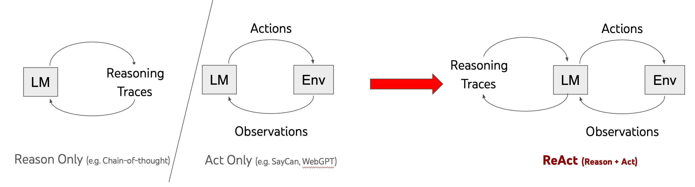

---
tags:
  - llm
  - ai
authors:
  - hoangnnh
date: 2024-10-18
title: "ReAct(Reason + Act) in LLM"
description: "Working with Large Language Models (LLMs) may seem straightforward at first glance. Initially, we might think that simply prompting the AI model with a task is sufficient for it to assist us. However, when faced with more complex tasks, we need to break down the problem into smaller sub-tasks and guide the AI model to solve them sequentially. This is where the ReAct approach comes into play."
---

Working with Large Language Models (LLMs) may seem straightforward at first glance. Initially, we might think that simply prompting the AI model with a task is sufficient for it to assist us. However, when faced with more complex tasks, we need to break down the problem into smaller sub-tasks and guide the AI model to solve them sequentially. This is where the ReAct approach comes into play.

## Introduction

ReAct(Reason + Act) is a paradigm that enables Large Language Models (LLMs) to solve complex tasks through natural language reasoning and actions. It allows an LLM to perform certain actions, such as retrieving external information, and then reason based on the retrieved data. It leveages the power of Chain-of-Thought (CoT) prompting to break down complex tasks into manageable steps. However, they have a difference when CoT just only reasoning step by step in its own knowledge, ReAct also allows the model to interact with external tools or APIs to retrieve additional information, and then observe the result in each step to make decisions.



## Example

To demonstrate the difference between CoT and ReAct, let's consider a simple example:

Question: "Finding the Capital of France and Its Population"

- Chain-of-Thought(CoT):
  
```
Reason:
  - The question asks for the capital of France and its population.
  - I know that the capital of France is Paris.
  - I recall that Paris is one of the largest cities in Europe.
  - From my knowledge, I believe the population of Paris is approximately 2.2 million people in the city proper.
  - However, I should note that the greater Paris area (metropolis) has a much larger population, around 12 million.
  For the purpose of this question, I'll use the city proper population.

Answer: The capital of France is Paris, with a population of approximately 2.2 million people.
```

- ReAct:

```
Step 1:
 -Reason: To answer this question, I need to find the capital of France and then its population. Let's start with identifying the capital.
 -Act: Search for "capital of France"
 -Observe: The capital of France is Paris.

Step 2:
 -Reason: Now that I know the capital is Paris, I need to find its population.
 -Act: Search for "population of Paris, France"
 -Observe: As of 2024, the population of Paris city proper is estimated to be around 2.16 million. The Paris metropolitan area has a population of about 12.6 million.

Step 3:
 -Reason: I have both pieces of information needed to answer the question.

Answer: The capital of France is Paris, with a population of approximately 2.16 million people in the city proper (or 12.6 million in the metropolitan area).
```
As you can see, when Chain-of-Thought just only reasoning step by step in its own knowledge, ReAct interact with external tools to gather needed information to support next reasoning step.

## Implementation

To implement ReAct, we can use Langgraph - a famous library for building applications with LLMs. First let construct a main prompt:

```ts
const prompt=`You run in a loop of Thought, Action, PAUSE, Observation.
At the end of the loop you output an Answer
Use Thought to describe your thoughts about the question you have been asked.
Use Action to run one of the tools available to you - then return PAUSE.
Observation will be the result of running those actions.

Your available tools are:

tavily_search_results_json:
e.g. tavily_search_results_json: "What is the mass of Earth?"
returns search results in JSON format

llm_tool:
e.g. llm_tool: "3 + 3"
returns the result of the general knowledge 


Example session:

Question: what is the hometown of the winner of the 2023 men australian open
Thought: I need to find the 2023 Australian Open winner
Action: tavily_search_results_json: "2023 Australian Open winner"
PAUSE 

You will be called again with this:

Observation: Novak Djokovic

Thought: I need to find the hometown of Novak Djokovic
Action: tavily_search_results_json: "Novak Djokovic hometown"
PAUSE

You will be called again with this: 

Observation: Belgrade, Serbia

If you have the answer, output it as the Answer.

Answer: Belgrade, Serbia

Now it's your turn:
--------------------
messages: {input}`
```

Now let start with Nodes:


```ts
const toolNode = async (
  data: typeof AgentState.State,
  config?: RunnableConfig,
): Promise<Partial<typeof AgentState.State>> => {
  const { messages } = data
  const lastMsg = messages[messages.length - 1].content.toString()

  const pattern = new RegExp('Action:\\s*(\\w+):\\s*"(.*?)"')
  const match = lastMsg.match(pattern)
  if (match) {
    const toolName = match[1]
    const toolInput = match[2]
    const tool = tools.find((tool) => tool.name === toolName)
    if (tool) {
      const result = await tool.invoke(toolInput)
      return {
        messages: [new AIMessage({ content: result })],
      }
    }
  }
  return {
    messages: [new AIMessage({ content: 'Invalid tool call' })],
  }
}

```

```ts
const callModel = async (
  data: typeof AgentState.State,
  config?: RunnableConfig,
): Promise<Partial<typeof AgentState.State>> => {
  const { messages } = data
  const lastMsg = messages[messages.length - 1]
  if (lastMsg._getType() !== 'human') {
    messages[messages.length - 1].content = 'Observation: ' + lastMsg.content
  }
  const chat = messages.map((msg) => msg.content).join('\n')
  const promptTemplate = ChatPromptTemplate.fromMessages([['system', prompt]])
  const pipe = promptTemplate.pipe(llm)
  const result = await pipe.invoke({ input: chat }, config)

  return {
    messages: [result],
  }
}
```

And final is construct a graph:

```ts
const workflow = new StateGraph(AgentState)
  // Define the two nodes we will cycle between
  .addNode('callModel', callModel)
  .addNode('executeTools', toolNode)
  // Set the entrypoint as `callModel`
  // This means that this node is the first one called
  .addEdge(START, 'callModel')
  // We now add a conditional edge
  .addConditionalEdges(
    // First, we define the start node. We use `callModel`.
    // This means these are the edges taken after the `agent` node is called.
    'callModel',
    // Next, we pass in the function that will determine which node is called next.
    shouldContinue,
  )
  // We now add a normal edge from `tools` to `agent`.
  // This means that after `tools` is called, `agent` node is called next.
  .addEdge('executeTools', 'callModel')

const app = workflow.compile()
```

Now let test with question: "How many times is Germany's GDP larger than Austria's?

Result: [Link](https://smith.langchain.com/public/ba3f7dd2-4c99-44d9-9b64-7cd7ad6317ea/r)

## Conclusion

ReAct play a significant role of the LLM development, it leverage the power of LLM to solve complex problem by breaking down into sub-problem and solve them step by step. Nowadays, many LLM framwork support ReAct out of the box, such as LangChain, LlamaIndex, etc.

## Reference
- https://arxiv.org/abs/2210.03629
- https://www.promptingguide.ai/techniques/react