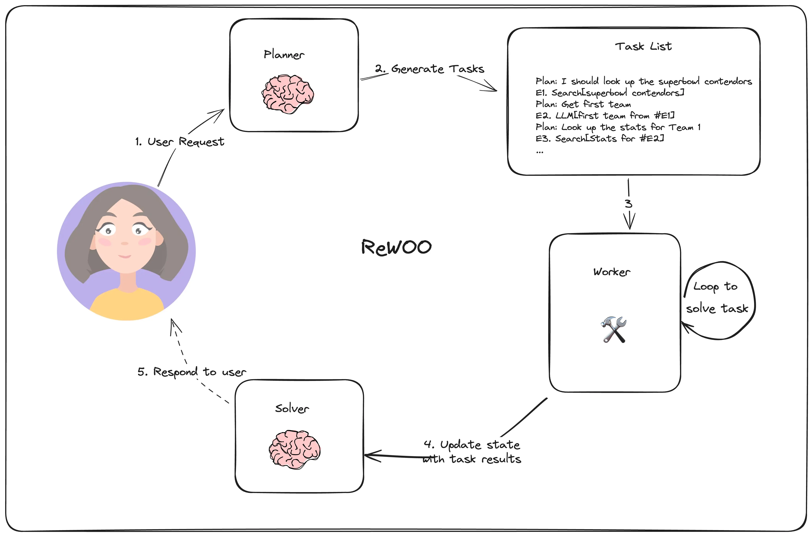
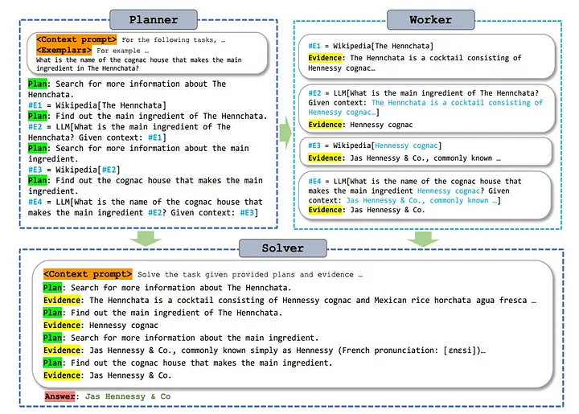
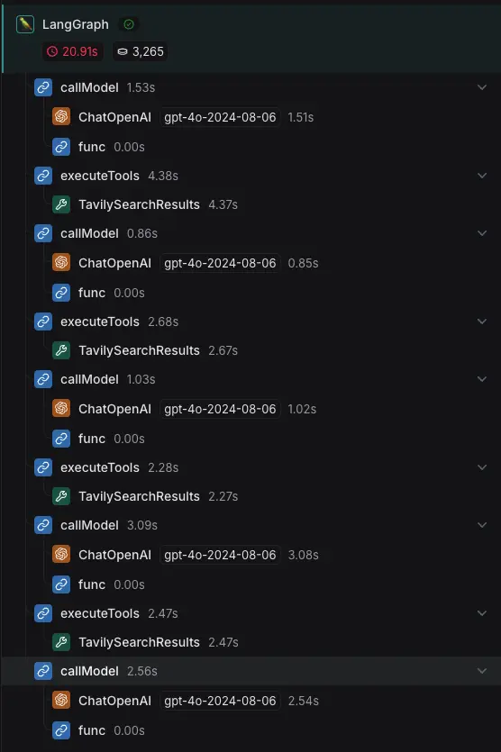
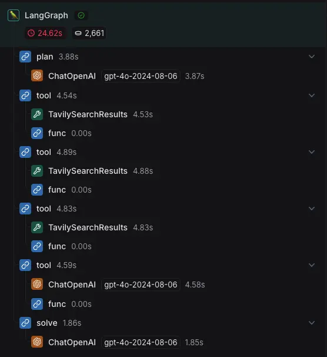

---
tags:
  - llm
  - ai
authors:
  - hoangnnh
date: 2024-10-18
title: "ReWOO: Reasoning WithOut Observation - A deeper look"
description: "In the process of improving Large Language Model (LLM) performance, many techniques have been proposed. The Augmented Language Model (ALM) approach boosted LLM accuracy by enabling the attachment of external sources to enhance the model's knowledge. However, ALMs still had limitations in terms of time consumption and token resources. To address these issues, ReWOO was developed as a more efficient solution."
---

In the process of improving Large Language Model (LLM) performance, many techniques have been proposed. The Augmented Language Model (ALM) approach boosted LLM accuracy by enabling the attachment of external sources to enhance the model's knowledge. However, ALMs still had limitations in terms of time consumption and token resources. To address these issues, ReWOO was developed as a more efficient solution.

## Introduction

ReWOO which stands for Reasoning WithOut Observation, is a modular paradigm that decouples the reasoning process from external observation. Benefits of this approach can be summarized as follows:
 - Modular design: Easy to modify, maintain component while cause no harm to other
 - Save token usage: It reducde the number of call to LLM model for repeated executions and by ability to interact with external tools.

## How it Works

ReWOO divided core 3-step reasoning process into 3 modules:
 - **Planner**: Uses the predictable reasoning of LLMs to create a solution blueprint. It consists plans and steps for each plan to exeucte.
 - **Worker**: Executes the plan and collect evidence by calling external tools or APIs.
 - **Solver**: Examines all plans and evidences from worker to analyze and synthsize the final answer.



ReWOO can referring to plans from earlier stages in instructions to Workers. This allows next step and subsequent steps to build on the results of previous steps, enabling the model to handle complex tasks more effectively. The final solver prompt is designed to be concise and efficient, ensuring that the model can accurately synthesize the final answer based on the evidence provided by the workers.

## Example



As you can see in above example, The planner prompt list all the plans need to do. Then the task list will pass that list to Worker, Worker will execute each plan step by step, it can be a API call or external tools, in each step the result will be store to support the next plan if needed. At the end, the Solver prompt will be called to analyze all the evidences and synthesize the final answer. You can realize that the total LLM model call is just 2+(+ number of LLM call in tools if had). It reduce a lot of token usage when compare with other reasoning techniques(with number of LLM call = number of reasoning step + tool uses) when they have to call LLM model every step of reasoning to decide what to do next. Besides that, you can have an overview of all the process at the beginning, it can help you to understand the problem better snf support in debugging.

## Implementation
To implement ReWOO, we can use many LLM framwork to build the pipeline. In this article, I will illustrate it by Langgraph - a Langchain-based library for building language model applications.

- Firstly, We need defined from for planner and solver:

```ts
const plannerPrompt = `For the following task, make plans that can solve the problem step by step. For each plan, indicate
which external tool together with tool input to retrieve evidence. You can store the evidence into a 
variable #E that can be called by later tools. (Plan, #E1, Plan, #E2, Plan, ...)

Tools can be one of the following:
(1) Google[input]: Worker that searches results from Google. Useful when you need to find short
and succinct answers about a specific topic. The input should be a search query.
(2) LLM[input]: A pre-trained LLM like yourself. Useful when you need to act with general 
world knowledge and common sense. Prioritize it when you are confident in solving the problem
yourself. Input can be any instruction.

For example,
Task: Thomas, Toby, and Rebecca worked a total of 157 hours in one week. Thomas worked x 
hours. Toby worked 10 hours less than twice what Thomas worked, and Rebecca worked 8 hours 
less than Toby. How many hours did Rebecca work? 
Plan: Given Thomas worked x hours, translate the problem into algebraic expressions and solve with Wolfram Alpha.
#E1 = WolframAlpha[Solve x + (2x - 10) + ((2x - 10) - 8) = 157]
Plan: Find out the number of hours Thomas worked.
#E2 = LLM[What is x, given #E1]
Plan: Calculate the number of hours Rebecca worked.
#E3 = Calculator[(2 * #E2 - 10) - 8]

Important!
Variables/results MUST be referenced using the # symbol!
The plan will be executed as a program, so no coreference resolution apart from naive variable replacement is allowed.
The ONLY way for steps to share context is by including #E<step> within the arguments of the tool.

Begin! 
Describe your plans with rich details. Each Plan should be followed by only one #E.

Task: {task}`

const solverPrompt = `Solve the following task or problem. To solve the problem, we have made step-by-step Plan and
retrieved corresponding Evidence to each Plan. Use them with caution since long evidence might
contain irrelevant information.

{plan}

Now solve the question or task according to provided Evidence above. Respond with the answer
directly with no extra words.

Task: {task}
Response:`
```

 - Secondly, we craete nodes for each components:

```ts
async function Planner(
  state: typeof GraphState.State,
  config?: RunnableConfig,
) {
  console.log('---GET PLAN---')
  const task = state.task
  const result = await planner.invoke({ task }, config)

  const regexPattern = new RegExp(
  'Plan\\s*(?:\\d+)?:\\s*(.*?)\\s+(#E\\d+)\\s*=\\s*(\\w+)\\[(.*?)\\]',
  'gs',
)
  // Find all matches in the sample text.
  const matches = result.content.toString().matchAll(regexPattern)
  let steps: string[][] = []
  for (const match of matches) {
    console.log(match)

    const item = [match[1], match[2], match[3], match[4], match[0]]
    if (item.some((i) => i === undefined)) {
      throw new Error('Invalid match')
    }
    steps.push(item as string[])
  }
  return {
    steps,
    planString: result.content.toString(),
  }
}

async function Worker(
  state: typeof GraphState.State,
  config?: RunnableConfig,
) {
  console.log('---EXECUTE TOOL---')
  const _step = _getCurrentTask(state)
  if (_step === null) {
    throw new Error('No current task found')
  }
  const [_, stepName, tool, toolInputTemplate] = state.steps[_step - 1]
  let toolInput = toolInputTemplate
  const _results = state.results || {}
  for (const [k, v] of Object.entries(_results)) {
    toolInput = toolInput.replace(k, v)
  }
  console.log(tool)

  let result
  if (tool === 'Google') {
    result = await search.invoke(toolInput.replaceAll('"', ''), config)
  } else if (tool === 'LLM') {
    result = await model.invoke(toolInput, config)
  } else {
    throw new Error('Invalid tool specified')
  }
  _results[stepName] = JSON.stringify(_parseResult(result), null, 2)
  return { results: _results }
}

async function Solver(state: typeof GraphState.State, config?: RunnableConfig) {
  console.log('---SOLVE---')
  let plan = ''
  const _results = state.results || {}
  for (let [_plan, stepName, tool, toolInput] of state.steps) {
    for (const [k, v] of Object.entries(_results)) {
      toolInput = toolInput.replace(k, v)
    }
    plan += `Plan: ${_plan}\n${stepName} = ${tool}[${toolInput}]\n`
  }
  const result = await solvePrompt
    .pipe(model)
    .invoke({ plan, task: state.task }, config)
  return {
    result: result.content.toString(),
  }
}
```

- Finally we will construct a graph"

```ts
const workflow = new StateGraph(GraphState)
  .addNode('plan', Planner)
  .addNode('tool', Worker)
  .addNode('solve', Solver)
  .addEdge('plan', 'tool')
  .addEdge('solve', END)
  .addConditionalEdges('tool', _route)
  .addEdge(START, 'plan')

// Compile
const app = workflow.compile()
```

Now let test with question: "What is the mass of earth and how many natural satelite of it. Calculate different in mass of Jupyter and Earth?"

Result: [Link](https://smith.langchain.com/public/624cb78d-e55e-40a6-8cd5-912a2046a864/r)

## Comparison with ReAct
To demonstrate the token usage saving of ReWOO, we will make a comparision with traditional technique like ReAct(Reason + Act). If you do not know what is ReAct? Can take a look to this memo: [ReAct(Reason + Act) in LLM](react-in-llm.md).
We run a same question to ReAct, and see the difference:

| ReAct    | ReWOO |
| -------- | ------- |
|   |     |
| Token usage: 3265 | Token usage: 2661     |

As you can see, ReWOO save 604 tokens compared to ReAct. It because ReWOO not need to make LLM call for each step of reasoning. Image if we have more complicated task, it will have much more steps, then the tokens will be save much more.

## Conclusion
The development of LLM is cannot be denial, many new techniques are being developed to make LLM more powerful. ReWOO is one of them, it saving token usage and modulize the system, make it easy to modify and mantain.

## References
- https://arxiv.org/abs/2305.18323
- https://medium.com/@minhleduc_0210/on-short-of-rewoo-decoupling-reasoning-from-observations-for-efficient-augmented-language-models-151f53f09630
- https://langchain-ai.github.io/langgraph/tutorials/rewoo/rewoo/