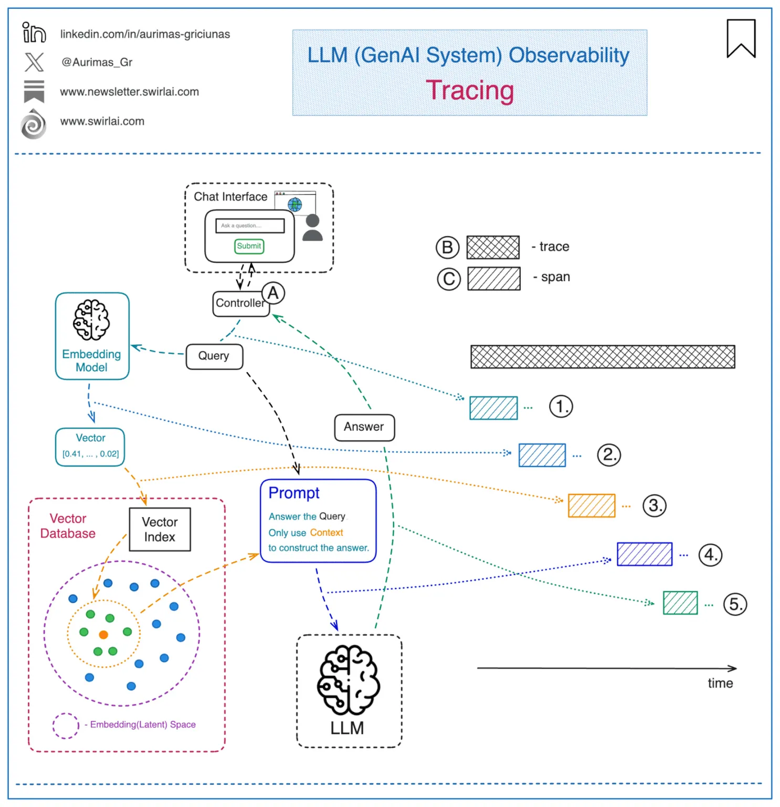
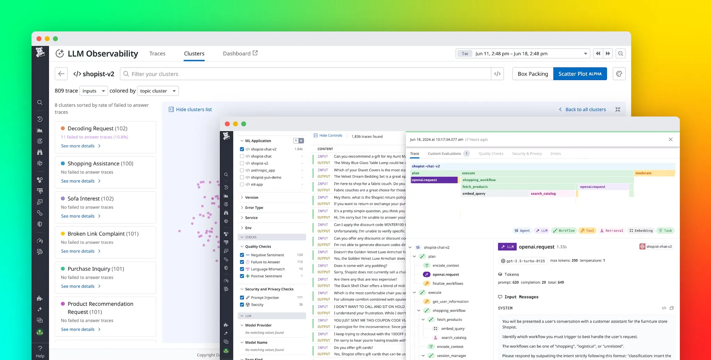
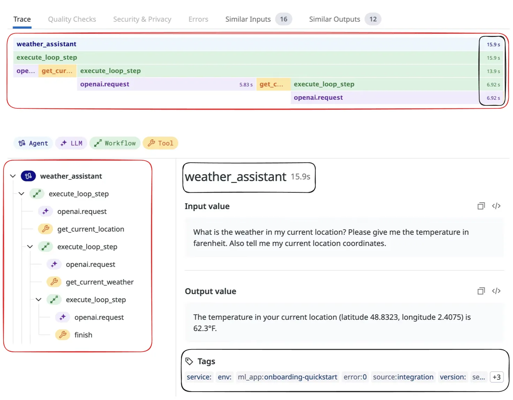
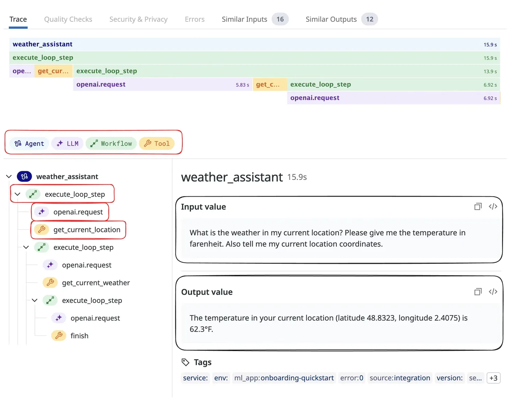

---
authors:
- "datnguyennnx"
date: "2024-10-11"
description: "Tracing is like following your LLM’s journey, step by step. We will explain how tracing makes it easy to identify and address problems by allowing you to track the entire process."
hashnode_meta:
  coverImageOptions:
    coverImageURL: "https://memo.d.foundation/playground/ai/building-llm-system/assets/trace-pillar-tracing-roadmap.webp"
  id: "670f4d46b25a9930f0551616"
  slug: "tracing"
sync: "hashnode"
tags:
- "llm"
- "observability"
- "tracing"
- "pillar"
title: "Tracing"
---
## What is tracing

Tracing is a way to keep track of, debug, and get a clear picture of how an LLM app is running. It gives a detailed snapshot of a specific action, like making a call to the LLM, formatting a prompt, or running a function.

A trace is just a bunch of actions, set up like a tree or graph. Each action is called a “span,” and it has its own inputs and outputs. The top-level action, known as the “Root Run” is the one that’s triggered by the user or app.

Tracing helps you see how well an LLM app is performing, including details like how long things take, how many tokens are used, and what the sequence of actions looks like. It’s great for finding and fixing errors, seeing the full path of a request, and improving overall performance.

There are different tools available for tracing LLMs, like [Klu.ai](http://klu.ai/), [LangSmith](https://docs.smith.langchain.com/), which can log all calls made to LLMs, agents, and other tools, showing you visual breakdowns of inputs, outputs, and even tracking errors and costs. Besides performance and debugging, tracing is also useful for figuring out where LLMs come from, which is getting trickier as more companies release their own models.

## Why tracing is necessary

Tracing can help you track down issues like:

- **Application latency:** showing delayed LLM and Retriever invocations.
- **Token usage:** provides a breakdown of token usage with LLMs to highlight your most expensive LLM calls.
- **Runtime exceptions:** important runtime errors, such as rate limitation, are recorded as exception events.
- **Retrieved documents:** view all the documents retrieved during a retriever call, including the score and order in which they were returned.
- **LLM parameters:** view the parameters used when calling out to an LLM to debug things like temperature and system prompts.
- **Prompt templates:** determine which prompt template was used during the prompting step, as well as the variables used.

## Element in tracing

We should be making clear the difference between trace and span.

| **Attribute**       | **Trace**                                               | **Span**                                                                      |
| ------------------- | ------------------------------------------------------- | ----------------------------------------------------------------------------- |
| **Scope**           | Covers the entire lifecycle of a request                | Focuses on individual operations or steps                                     |
| **Level of Detail** | High-level overview                                     | Detailed, includes specific metrics                                           |
| **Granularity**     | Includes multiple spans                                 | Captures single actions                                                       |
| **Primary Use**     | Understanding overall application flow and dependencies | Debugging or optimizing specific components/tasks                             |
| **Data Collected**  | Timeline of operations, parent-child relationships      | Duration, input/output, token usage, errors, attributes like provider, scores |
| **Examples**        | Full document retrieval process                         | Querying a database, calling an API, embedding query                          |

### Trace

Traces, also known as distributed traces, provide a view of a system by crossing agent, process, and function. Spans form the fundamental components of a trace.

A trace consists of a tree structure of spans, beginning with a root span that has no parent. This root span encapsulates the total time required to complete a task, representing a single logical operation such as adding an step to a get current weather. The root span serves as the foundation, with child spans branching off to provide more detailed information about specific subtasks or processes within the overall operation.

### Span

Span help define the main operations within LLM applications. These types of operations are broken down into different categories to keep things organized and easy to understand.

- **Chain ( Workflow )**: This is like a roadmap of static steps, which can include things like retrieving data, embedding text, or making LLM calls.
- **Embedding**: This deals with embedding tasks, such as working with text embeddings, often used for making similarity-based queries or refining questions.
- **Retrieval**: In setups like RAG system, this fetches data from a vector database to give the LLM more context for better, more accurate responses.
- **LLM**: Calls to the LLM itself for things like generating text or getting inferences, often using various APIs or SDKs.
- **Tool**: External tool calls, like grabbing info from a weather API or using a calculator to get real-time data.
- **Agent**: In intelligent agent scenarios, this handles more dynamic workflows, making decisions based on LLM outputs.

## Conclusion

Tracing lets you see what’s going on in your LLM app, from tracking performance to fixing errors and understanding token usage. It’s a simple way to debug and optimize everything from prompts to external tool calls.

## Reference

- https://www.datadoghq.com/blog/datadog-llm-observability/
- https://mlflow.org/docs/latest/llms/tracing/tracing-schema.html
- https://arize.com/blog/llm-tracing-and-observability-with-arize-phoenix/
- https://arize.com/blog-course/traces-spans-large-language-model-orchestration/
- https://www.linkedin.com/posts/aurimas-griciunas_llm-genai-llmops-activity-7250055380553084928-9XAA
- https://www.alibabacloud.com/blog/observability-of-llm-applications-exploration-and-practice-from-the-perspective-of-trace_601604