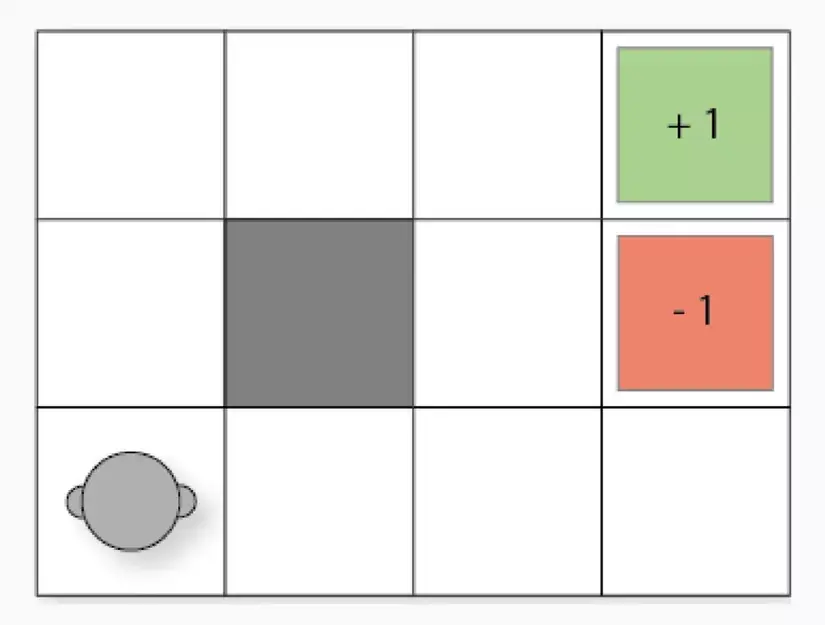
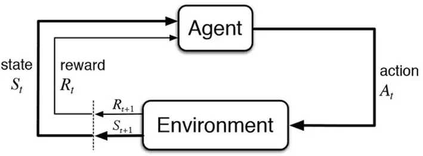

Q-learning is a model-free reinforcement learning algorithm used to learn an optimal policy in a Markov Decision Process (MDP). It is an off-policy method, meaning that it learns by observing and updating a value function based on the maximum expected future rewards.

Q-learning has applications in various domains, including autonomous robotics, traffic signal control, resource management, and more. The core idea behind Q-learning is to iteratively update the Q-values based on the agent's experiences. The agent explores the environment, takes actions, and receives rewards. With each interaction, the Q-values are updated using a formula that incorporates the reward received, the maximum Q-value of the next state, and a learning rate.

## Main components

- **Agent**: The entity that interacts with the environment and learns from it.
- **Environment**: The external environment in which the agent operates and receives feedback.
- **State**: The current situation or configuration of the environment.
- **Action**: The decision or choice made by the agent in a given state.
- **Reward**: The feedback or reinforcement signal received by the agent after taking an action in a particular state.
- **Episode**: A sequence of interactions between the agent and the environment, starting from the initial state until a terminal state or goal is reached.
- **Policy**: The strategy or set of rules that the agent uses to determine its actions in different states.

## How it works

The working of Q-learning involves the following steps:

- Initialize a Q-table: Create a table with rows representing states and columns representing actions. Initialize the Q-values arbitrarily.
- Choose an action: Based on the current state and the Q-values, select an action using an exploration-exploitation strategy.
- Perform the action and observe the reward and next state: Execute the chosen action in the environment and receive the reward and the resulting next state.
- Update the Q-value: Update the Q-value of the current state-action pair using the Bellman equation, which combines the immediate reward and the maximum expected future rewards from the next state.
- Repeat steps 2-4 until convergence or a predefined number of iterations.

However, it has limitations, such as the need for large storage space for state-action pairs, difficulties in handling complex and interdependent environments, and challenges in dealing with continuous states (approximation techniques may be required). Thus Deep Q-Learning extends Q-learning was born by using a deep neural network as a function approximator to handle high-dimensional state spaces. It allows for learning in complex environments and can achieve better performance.The algorithm employs an epsilon-greedy action selection strategy to balance exploration and exploitation of the environment. The learning process is based on the Bellman equation, which updates the Q-value according to an optimal learning rule.

## Potential drawbacks

- Storage limitations in complex environments: The storage requirements of Q-learning can become overwhelming when dealing with large state and action spaces, making it impractical for such scenarios.
- Challenges in complex and interdependent environments: Q-learning may face difficulties in finding optimal strategies when actions have strong dependencies and long-term consequences, as it primarily focuses on immediate rewards and may not effectively capture long-term dependencies.
- Incompatibility with continuous states: Q-learning is not directly applicable to problems with continuous state spaces. While approximation techniques like discretization or function approximation can be used, they often come at the cost of reduced performance and accuracy.

It's important to note that while Q-learning has these limitations, there are techniques and variations, such as Deep Q-learning, that aim to address some of these challenges and improve its applicability in complex and continuous environments.

## References

- https://www.techtarget.com/searchenterpriseai/definition/Q-learning
- https://huggingface.co/learn/deep-rl-course/unit2/introduction
