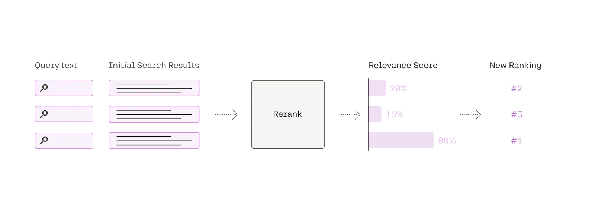
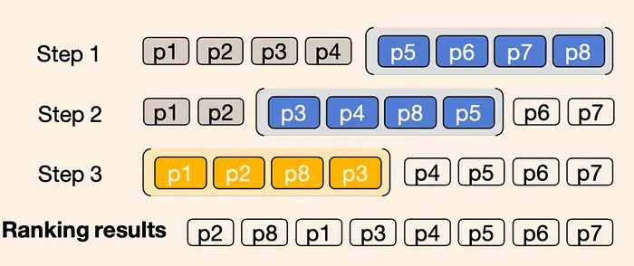
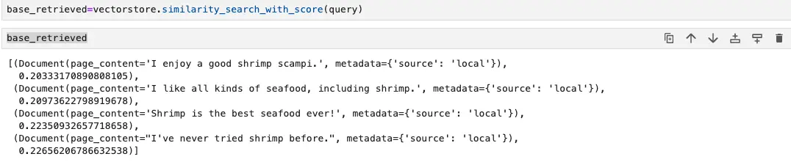
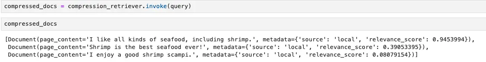

---
authors:
  - "hoangnnh"
date: "2024-07-26"
description: "Re-ranking is a crucial step in Retrieval-Augmented Generation (RAG) systems that addresses the challenge of retrieving heterogeneous and potentially irrelevant information. By evaluating and re-ordering retrieved documents, re-ranking ensures that only the most relevant and useful information is passed to the generation model. This process significantly improves the coherence, accuracy, and relevance of the generated text, ultimately enhancing the reliability and effectiveness of RAG systems."
hashnode_meta:
  id: "670f4d4cd5896edcae3c1255"
  slug: "re-ranking-in-rag"
sync: "hashnode"
tags:
  - "llm"
  - "rag"
  - "ai"
title: "Re-ranking in RAG"
---
One of the primary problems in RAG systems is the retrieval of a heterogeneous set of documents or pieces of information. These documents, while related to the query, often include extraneous details that can clutter the generation model's input. As a result, the generated text may lack coherence, accuracy, or pertinence, ultimately undermining the system's reliability and effectiveness. To address this issue, the concept of re-ranking has emerged as a critical solution.

## Problem

When we do pre-processing step, embeddings capture semantic information, they sometimes lack contrastive information. For example, embedding may struggle to distinguish between "I love shrimp" and "I used to love shimps" since both convey a similar semantic meaning but it have completely different meaning. Besides that, embeddings documents or sentences is constrainted in fix number of dimension (e.g, 1024). This limitation challengeing to encode all relevant information accurately, especially for longer documents or queries. From these reason, relevant context retrieved from Retrieval step will be mixed with noise. that why we need re-ranking step to filter out those irrelevant data.

## What is re-ranking

Re-ranking is the step, functioning as the second-pass document filter in information retrieval(IR) systems, it involves the evaluation and re-ordering of retrieved documents to prioritize the most relevant and useful ones before they are passed on to the generation model. In simpler terms, re-ranking is like helping you choose the most relevant references from a pile of study materials during an open-book exam, so that you can answer the questions more efficiently and accurately.



## Re-ranking methods

There are several methos to re-ranking data, but they mostly is divided into these types:

1. `Re-ranking models`: Using some specific re-ranking model like BERT-based Reranker, CohereRerank,... which are capable of understanding context and semantics at a deeper level than traditional retrieval methods.

2. `LLM Re-ranking`: Using the thoroughly understanding the entire document and query, LLM is possible to capture semantic information more comprehensively.

```python
    reranking_prompt = """the following are passages realated to query {query}. \
      {passage_1} \
      {passage_2} \
      #...
      ranke these passages base on their relevance to the query """
```

Besides that, should be careful with the LLM input because it have fixed size limit, In that case we can apply sliding window with bubble sort to get the highest rank context



**Extra**: `Reciprocal Rank Fusion(RRF)`: In some RAG system which is used Hybrid search or applied multiple initial retrievals, can apply RRF to unified ranking from multiple retrieval models.

## Implementation

We implement the first method which using popular [Cohere](https://cohere.com/rerank) reranker model.

**Prepare data**

```python
  documents = [
      "Shrimp is the best seafood ever!",
      "I'm allergic to shellfish, including shrimp.",
      "Seafood is delicious, but I prefer fish.",
      "I enjoy a good shrimp scampi.",
      "Shrimp cocktail is a classic appetizer.",
      "I'm not a fan of crustaceans.",
      "Shrimp pasta is one of my favorite dishes.",
      "I've never tried shrimp before.",
      "Seafood is overrated, especially shrimp.",
      "I like all kinds of seafood, including shrimp.",
      "Shrimp is too small for my liking.",
      "I've heard good things about shrimp, but haven't tried it.",
      "Shrimp curry sounds interesting.",
      "I'm not a big fan of seafood, except for shrimp.",
      "Shrimp scampi is a dish I'd like to try.",
      "I prefer beef to seafood.",
      "Shrimp is a good source of protein.",
      "I'm not sure how to cook shrimp.",
      "Shrimp salad sounds refreshing.",
      "I've had bad experiences with shrimp."
  ]
  doc=[]
  for item in documents:
      page = Document(page_content=item,
      metadata={"source": "local"})
      doc.append(page)

  vectorstore = Chroma.from_documents(documents=doc,
                                    embedding=OpenAIEmbeddings())

  retriever = vectorstore.as_retriever()

  llm = Cohere(temperature=0)
  compressor = CohereRerank(model="rerank-english-v3.0", top_n=3)
  compression_retriever = ContextualCompressionRetriever(
  base_compressor=compressor, base_retriever=retriever

  query= 'Do I love eating shrimp?'
)
```

we list of 20 strings includes various opinions about shrimp, ranging from positive to negative, and some neutral statements. This variety will challenge a reranker to accurately identify the document that expresses a love for shrimp. We will fetch cosine similartiy and then pass it through cohere reranking to demonstrate it improve accuracy.

**Cosine distance**



**Cohere Reranker**



As we can see, with the query 'Do I love eating shrimp?', the highest rank context by using cosine distance similarity is not the most accurated context we want. However, when pass through Cohere reranker model, the ranking order is changed, top hight ranking context now are 'I like all kinds of seafood, including shrimp.' and 'Shrimp is the best seafood ever!', which are more relevant to the query.

## Conclusion

Re-ranking in Retrieval-Augmented Generation (RAG) systems is an essential component that enhances the accuracy and relevance of generated responses. By evaluating and prioritizing retrieved documents based on their relevance and quality, re-ranking ensures that only the most pertinent information is used in the generation phase. This process mitigates the risk of incorporating noise and irrelevant data, leading to more coherent, accurate, and reliable outputs.

## References

- https://cohere.com/blog/rerank
- https://cohere.com/rerank
- https://www.rungalileo.io/blog/mastering-rag-how-to-select-a-reranking-model