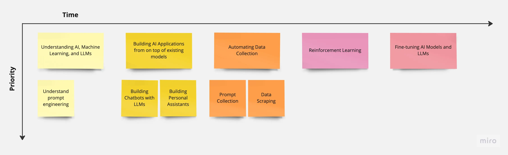
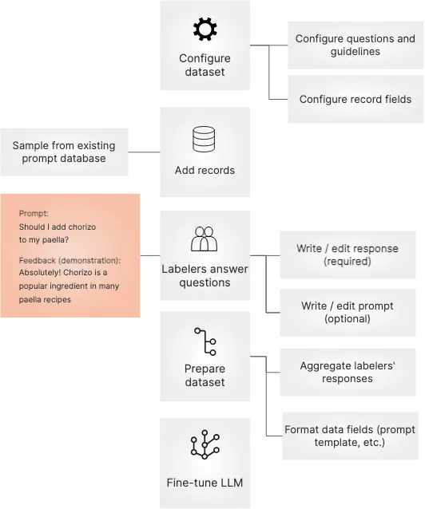
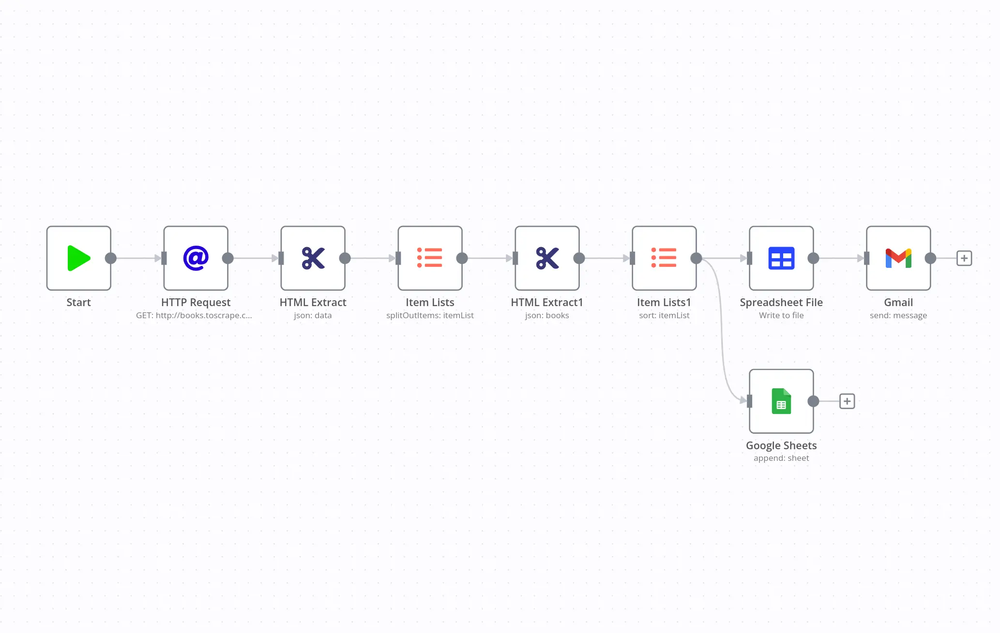
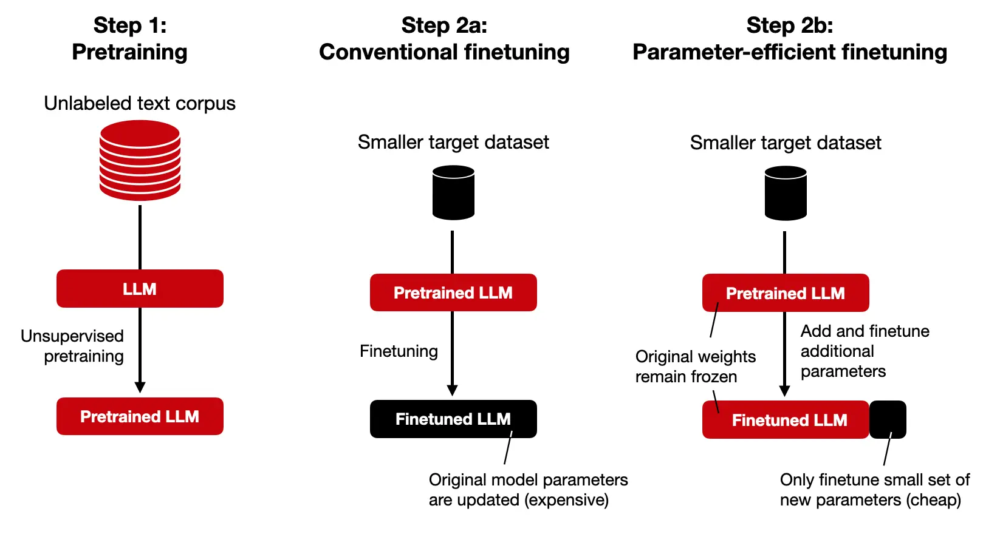

## Story Map: Journey for Engineers Developing Applications on top of Large Language Models (LLMs)

Below is a story map of a kind of simplified learning and execution path for engineers starting out in developing AI. Not every engineering story follows the same path, but hopefully below will give you a general idea as to where you are in your story and what is left ahead.

### 1. Understanding AI, Machine Learning, and LLMs

Most of us begin by learning about artificial intelligence (AI), machine learning, and their capabilities. We explore various applications, such as natural language processing, computer vision, and recommendation systems. Developing a strong foundation is needed in large language models and understanding the basics of LLMs will help us appreciate their potential and the wide range of applications they can be used for.

It's best to follow step-by-step guides and tutorials on various AI topics, including LLMs like ChatGPT, LLaMA, GPT-J, and HuggingGPT. We can deepen our understanding of AI, machine learning, and LLMs through guides, tutorials, videos, or courses. Continuous learning and staying up-to-date with the latest advancements in AI will help in understanding the landscape of LLMs in the market and what we can apply with it. You can learn on YouTube through:

- [Standford's YouTube playlist](https://www.youtube.com/playlist?list=PLoROMvodv4rMiGQp3WXShtMGgzqpfVfbU)
- [MIT's YouTube playlist](https://www.youtube.com/playlist?list=PLoROMvodv4rMiGQp3WXShtMGgzqpfVfbU)
- [DeepLearning.AI's YouTube playlist](https://www.youtube.com/playlist?list=PLoROMvodv4rMiGQp3WXShtMGgzqpfVfbU)
- [Lex Fridman's up-to-date deep learning course](https://www.youtube.com/watch?v=0VH1Lim8gL8&list=PLrAXtmErZgOeiKm4sgNOknGvNjby9efdf&ab_channel=LexFridman)

#### a. Understand prompt engineering and why it's important for LLMs and generative AI

Prompt engineering involves providing enough context, instruction, and examples to the model at inference time without changing the underlying weights of the model. It focuses on coaxing the model's latent space to produce the desired output. Prompt engineering uses manually-provided "hard prompts" to guide the model's behavior. It is about getting the model to do what you want without updating the model parameters. You can learn more about prompt engineering at:

- https://learnprompting.org/docs/intro

### 2. Building AI Applications from on top of existing models

Most startups using LLMs like ChatGPT in their applications ultimately build on top of the model without the need to fine-tune it. Understand the process of building, testing, and deploying AI applications, which will enable you to create custom AI solutions tailored to specific use cases and requirements. Developing AI applications from scratch will give you the flexibility to create unique and innovative solutions that leverage the power of AI.

#### a. Building Chatbots with LLMs

Most often, the first step to working with LLMs is by creating a chatbot to enable conversations with it. This requires exploring various APIs for machine learning-based chatbot development and familiarizing yourself with chatbot templates like [OpenAssistant](https://open-assistant.io/) or creating your own. Building chatbots with LLMs will enable to create more advanced and interactive conversational agents that can handle complex tasks and provide better user experiences.

#### b. Building Personal Assistants

Eventually, chatbots turn into personal assistants to handle more nuanced roles. Roles for AI assistants are highly dependent on the industry and domain of the person that it is assisting. Workflow patterns, certain communication and interpersonal skills are often required for modeling AI assistant roles. These communication nuances are essential for creating AI applications that effectively interact with users and provide valuable assistance. Good examples that are heavily nuanced is anything related to law, programming, human resources, etc.

### 3. Automating Data Collection

Data collection is particularly important for AI, and especially LLMs. Data collection is important for LLMs for several reasons:

1. **Training**: LLMs require a large amount of data to train effectively. The collection of demonstration data, which consists of prompts and demonstrations, plays a significant role in training LLMs. This data is used to teach the model how to generate coherent and contextually relevant responses. This training could help improve the structure, prose, or style of content the LLM outputs.

2. **Relevance**: The data collected for LLMs needs to be relevant to the task the model is being trained for. For example, if the LLM is being trained for sentiment analysis, the collected data should include a large number of reviews, comments, and social media posts. Relevant data ensures that the LLM learns patterns and context specific to the desired task. Certain prompts that are not relevant would require adversarial prompts based on input data from the user.

3. **Performance**: Continuous monitoring of the quality and relevance of the collected data is important to improve the performance of LLMs. Regular updates to the data can help keep the model up-to-date and ensure its effectiveness in generating accurate and relevant responses. This would include performance monitoring for vector databases on how their indexes perform or how data is consolidated (through techniques such as Map Reduce) within a certain time frame.

4. **Data Standards**: LLMs can play a role in developing data standards, particularly in areas such as disinformation data. Their expertise in data collection and handling, as well as their technological capabilities, can contribute to setting open standards and ensuring the quality and integrity of data used in various applications. This could include data that requires neutral stances on facts on opinioned data, or programming data that requires nuances specific a package manager for instance.

5. **Efficiency**: LLMs are trained on large datasets, which allows them to have a broader understanding and generate text similar to human-produced content. The availability of large-scale data sets and the use of LLMs can make data search and analysis more efficient and effective for data scientists.

#### a. Through Prompt collection

We can collect internal data through prompts inputted by users. Data collection of prompts in large language models refers to the process of gathering and curating input prompts that are used to guide the behavior and output of the language model. Prompts are the starting questions or instructions given to the model to condition its predictions for a specific task.

#### b. Through Data scraping

We can gather external data through data scraping. Data scraping is commonly used to gather large amounts of data from websites for various purposes, such as market research, competitor analysis, price comparison, data analysis, and more. It allows users to extract specific information from websites without manually visiting each page and copying the data.

### 4. Reinforcement Learning

Eventually, we want to reward certain behaviors from our augmented models. Although a more advanced approach to training a model, understanding the concept of reinforcement learning and its applications in AI is important for the following reasons::

1. **Steering LLMs in the right direction**: RLHF helps guide LLMs by treating language generation as a reinforcement learning problem. The LLM acts as the reinforcement learning agent and learns to produce optimal text output based on human feedback.

2. **Understanding instructions and generating helpful responses**: RLHF enables training LLMs to comprehend instructions and generate responses that are more useful and aligned with human preferences.

3. **Reducing bias and improving fairness**: RLHF is a novel approach to reducing bias in LLMs. By incorporating human feedback, it helps mitigate biases that may be present in the training data and promotes fairness in language generation.

4. **Improving accuracy and reliability**: In applications such as search engines, where accurate and reliable responses are crucial, RLHF can be an ideal solution to fine-tune LLMs and ensure high-quality outputs.

However, it's important to note that RLHF is not a perfect solution and has its limitations. Human preferences can be subjective and not always clear-cut, which can introduce challenges in defining the reward signal for RL training. Additionally, RLHF may trade off diversity in generation abilities for improved consistency in answers, which may vary depending on the specific use case.

### 5. Fine-tuning AI Models and LLMs

Fine-tuning, involves updating the model parameters directly using a dataset that captures the distribution of tasks you want the model to accomplish. It requires retraining the model on a specific dataset to adapt it to a specific task or domain. Fine-tuning allows for more targeted adjustments to the model's behavior and can lead to more accurate and relevant outputs. It requires more computational resources and time compared to prompt engineering. The difference between it and prompt engineering is that:

- Prompt engineering is preferred when you want to guide the model's behavior **without retraining it**. It can be useful when you have limited computational resources or when you want to experiment with different prompts to achieve a desired output.

- Fine-tuning is preferred when you have a specific dataset or task that you want the model to perform well on. It allows for more precise control over the model's behavior and can lead to better performance on the specific task or domain. Things like instruction LLMs (for domains such as emails, stories, poems, etc.) or chat LLMs (for conversational responses) are behaviors that are achieved through fine-tuning

It's also best to learn the process of fine-tuning AI models and LLMs like ChatGPT, LLaMA, and other alternatives for specific tasks and applications. Understand the benefits and challenges of fine-tuning AI models and LLMs, which will help optimize their performance and create more effective AI applications.

## Conclusion

The general idea of this story map is to help engineers develop a strong foundation in researching and creating AI applications, such as chatbots, code automation, personal assistants, and fine-tuning AI models with LLMs like ChatGPT and LLaMA. A lot of these skills involve a bit of ad-hoc ingenuity, but will help has a basic foundation of patterns we see in AI development.

## References

- https://en.wikipedia.org/wiki/LLaMA
- https://ai.meta.com/llama/
- https://lmsys.org/blog/2023-03-30-vicuna/
- https://en.wikipedia.org/wiki/GPT-J
- https://huggingface.co/spaces/microsoft/HuggingGPT
- https://ai.meta.com/blog/large-language-model-llama-meta-ai/
- https://huggingface.co/blog/llama2
- https://ai.plainenglish.io/vicuna-the-unparalleled-open-source-ai-model-for-local-computer-installation-334c693c4931
- https://huggingface.co/EleutherAI/gpt-j-6b
- https://arxiv.org/abs/2303.17580
- https://huggingface.co/docs/transformers/main/model_doc/llama
- https://fortune.com/2023/08/08/how-to-use-meta-generative-ai-llama2-as-chatbot/
- https://medium.com/mlearning-ai/the-significance-of-vicuna-an-open-source-large-language-model-for-chatbots-23b4765711ff
- https://huggingface.co/docs/transformers/model_doc/gptj
- https://www.marktechpost.com/2023/04/07/meet-hugginggpt-a-framework-that-leverages-llms-to-connect-various-ai-models-in-machine-learning-communities-hugging-face-to-solve-ai-tasks/
- https://research.facebook.com/publications/llama-open-and-efficient-foundation-language-models/
- https://arxiv.org/abs/2307.09288
- https://pub.towardsai.net/meet-vicuna-the-latest-metas-llama-model-that-matches-chatgpt-performance-e23b2fc67e6b
- https://www.eleuther.ai/artifacts/gpt-j
- https://www.kdnuggets.com/2023/05/hugginggpt-secret-weapon-solve-complex-ai-tasks.html
- https://about.fb.com/news/2023/07/llama-2/
- https://agi-sphere.com/llama-2/
- https://huggingface.co/lmsys/vicuna-13b-delta-v1.1
- https://6b.eleuther.ai
- https://gpt3demo.com/apps/hugginggpt
- https://encord.com/blog/llama2-explained/
- https://www.youtube.com/watch?v=J8TgKxomS2g
- https://www.nextbigfuture.com/2023/04/vicuna-is-the-current-best-open-source-ai-model-for-local-computer-installation.html
- https://gpt3demo.com/apps/gpt-j-6b
- https://www.infoq.com/news/2023/04/hugginggpt-complex-ai-tasks/
- https://arxiv.org/abs/2302.13971
- https://www.youtube.com/watch?v=zJBpRn2zTco
- https://gpt3demo.com/apps/vicuna
- https://towardsdatascience.com/how-you-can-use-gpt-j-9c4299dd8526
- https://www.linkedin.com/pulse/hugginggpt-new-way-solve-complex-ai-tasks-language-giuliano-liguori-
- https://www.marktechpost.com/2023/04/02/meet-vicuna-an-open-source-chatbot-that-achieves-90-chatgpt-quality-and-is-based-on-llama-13b/
- https://www.width.ai/post/gpt-j-vs-gpt-3
- https://paperswithcode.com/paper/hugginggpt-solving-ai-tasks-with-chatgpt-and/review/
- https://docs.argilla.io/en/latest/guides/llms/conceptual_guides/rlhf.html
- https://blog.apify.com/what-is-data-ingestion-for-large-language-models/
- https://www.oasis-open.org/2023/06/12/the-importance-of-llm-in-developing-disinformation-data-standards/
- https://wandb.ai/wandb_gen/llm-data-processing/reports/Processing-Data-for-Large-Language-Models--VmlldzozMDg4MTM2
- https://www.snowflake.com/guides/what-large-language-model-and-what-can-llms-do-data-science
- https://www.snowflake.com/guides/large-language-models-llms-machine-learning
- https://www.v7labs.com/blog/rlhf-reinforcement-learning-from-human-feedback
- https://www.linkedin.com/pulse/benefits-training-llms-rlhf-surge-ai
- https://bdtechtalks.com/2023/01/16/what-is-rlhf/
- https://wandb.ai/ayush-thakur/Intro-RLAIF/reports/An-Introduction-to-Training-LLMs-Using-Reinforcement-Learning-From-Human-Feedback-RLHF---VmlldzozMzYyNjcy
- https://www.superannotate.com/blog/rlhf-for-llm
- https://www.assemblyai.com/blog/the-full-story-of-large-language-models-and-rlhf/
