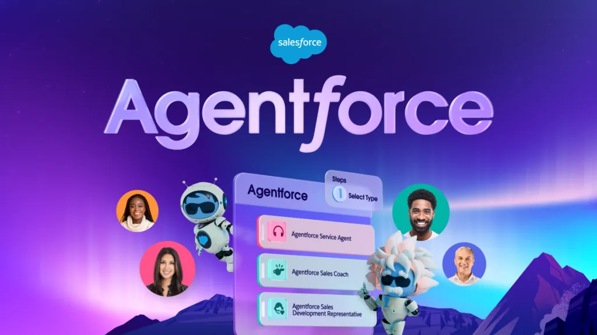
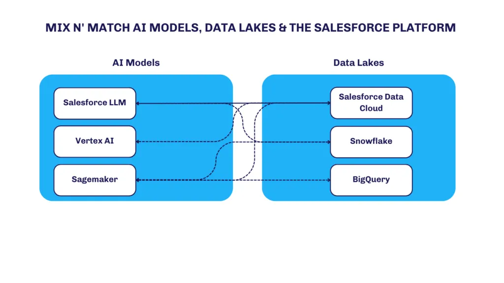
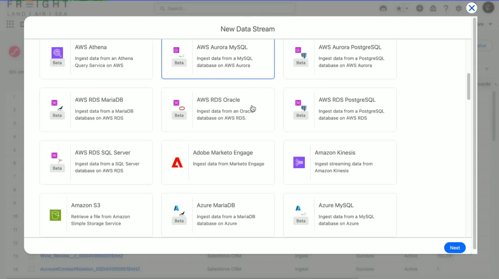
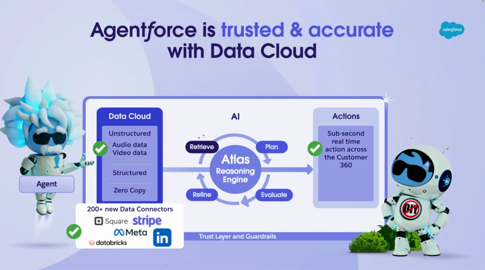
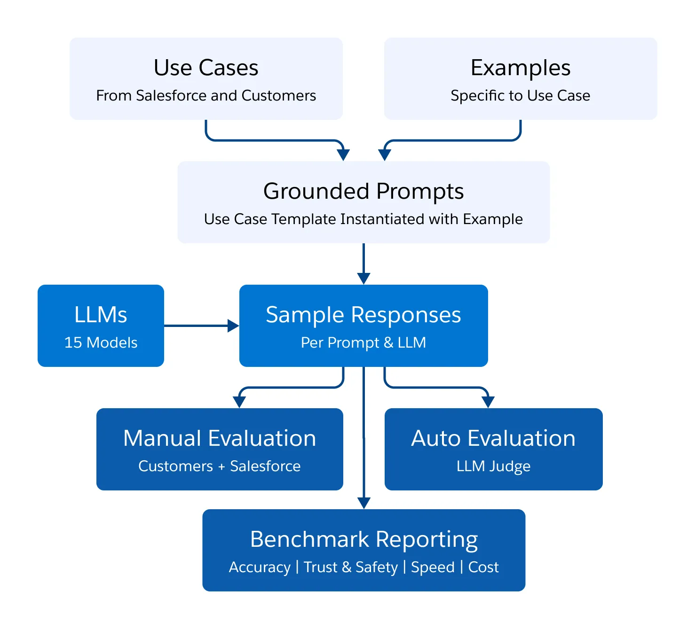
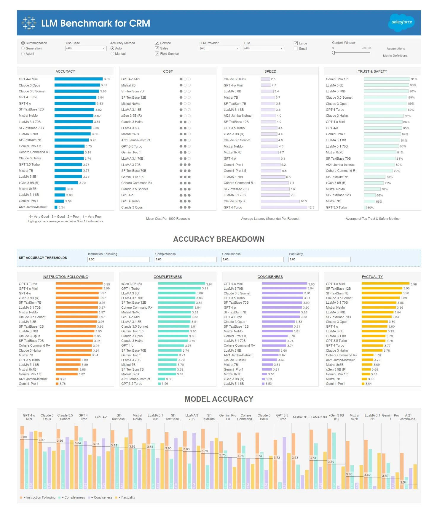

---
authors:
  - datnguyennnx
date: 2024-11-01
description: Salesforce is taking AI to the next level with large language models that make customer service smoother, sales more strategic, and insights faster. By automating routine tasks, these tools free up teams to focus on real connections with customers. The result? Happier customers, smarter sales, and big wins for businesses.
tags:
  - llm
  - salesforce
  - use cases
title: Salesforce use cases
---

## Salesforce agentforce platform

Salesforce's Einstein GPT is a key component of their AI-driven capabilities. It serves as a user interface that connects Salesforce's core offerings (Sales Cloud, Service Cloud, Marketing Cloud, etc.) with different LLMs. Einstein GPT helps Salesforce customers generate natural language-based insights and operational support like automated responses, summaries, and content creation.

- **Customization and integration:** The agnostic approach allows users to customize AI to their specific organizational or industry needs. By supporting multiple LLMs, different businesses can pick models based on cost, performance, or specific functionality.
- **Multiple LLM support:** Einstein GPT can integrate not only with models like OpenAI’s GPT series but also with other LLM providers like Cohere, Anthropic, or Google’s AI. This means enterprises can leverage their LLM of choice with Salesforce.
- **Apex models layer:** Salesforce built a flexible AI layer called "**Apex models**" which interfaces between Salesforce applications and various third-party and in-house LLMs. The Apex models layer helps to filter data, improve operations, and produce generative outcomes, regardless of which LLM is used.
- **Einstein trust layer:** Security and trust are of utmost importance for Salesforce, which is why this approach ensures the safeguarding of customer data. The company needs to ensure that customer-specific, private information is secure when interacting with these language models. Salesforce allows customers to have control over where data is processed and stored while benefiting from advanced AI functionality.

There are other AI models out there, like Google’s Vertex AI, Amazon SageMaker, OpenAI (you know, ChatGPT), Claude (from Anthropic), and a bunch more. These models can be trained to provide the best results for businesses when prompted correctly.

To train these LLMs effectively, you need a ton of data. Organizations with lots of data usually turn to data lakes, with names you might recognize like Snowflake, Databricks, BigQuery (from Google), and Redshift (from Amazon).

So, when you mix AI models with data lakes, you get data harmonization and generative AI that can really benefit the business. Salesforce’s LLM works with Data Cloud or can connect to other data lakes, making it super flexible for using GenAI with your Salesforce data.

Data required for generating highly contextual responses may not always reside within Salesforce. As a result, **Salesforce provides flexible methods for interacting with external data sources** while ensuring that data is available to produce optimal results.

- **Data cloud ingestion** : One way to interact with external data is by **ingesting structured and unstructured data** from different sources into the Salesforce Data Cloud. This can be configured to occur on a scheduled basis, bringing data into Data Cloud for further processing and analysis. The ingestion process allows Salesforce to directly **move or copy data** from external systems into the platform.
- **Zero-copy access** : In cases where it's unnecessary or inefficient to physically move data into Salesforce, the **zero-copy architecture** is useful. Zero-copy refers to **"virtualizing" data** by connecting to and querying it in real-time without moving or replicating the data into the Data Cloud. This is a form of **data federation** where Salesforce links to external records but does not store them directly.
- **MuleSoft APIs** : For systems that require more customized integrations, **MuleSoft APIs** serve as connectors between Salesforce and external systems. By leveraging these APIs, you can **create real-time data pipelines** between external data platforms and Salesforce without the need for complex data transformations or manual processes. MuleSoft supports connectors for several major platforms, such as **Snowflake** (for order management systems, for example).

The **Atlas reasoning engine** uses a technique called **retrieval augmented generation (RAG)** to search and retrieve pertinent information from the connected data streams before generating a response based on user prompts. Here's how the search operates:

**RAG's search retriever** : This module is responsible for **retrieving relevant data** from the connected systems (e.g., Data Cloud, virtualized data sources). The retriever uses **search indexes** and configured filters to pull the most relevant data at the time of the request.

## How Salesforce applies LLMs for CRM tasks

Salesforce integrates LLMs into its **customer relationship management (CRM)** system to automate, streamline, and enhance the performance of "knowledge-work" tasks across different CRM components. Here are some of the primary CRM use cases where LLMs are applied:

1. **Conversational AI and agent-assisted responses** :
   - **LLMs can power chatbots and virtual agents** that assist service agents by understanding customer inquiries and responding accordingly. Agent-assist models use LLMs to provide **recommendations for replies** or pre-populate responses that agents can refine and send.
   - LLMs are trained to understand CRM-specific vocabulary (e.g., customer service issues, billing inquiries, product questions) and adjust to the nuances of language used in different industries like financial services, health care, etc.
2. **Summarizing conversations** :
   - LLMs help automatically **summarize key points from customer interactions** (e.g., chat, email, or call transcripts) to reduce manual effort and support follow-up actions. This ensures that client-facing teams have a high-level view of client interactions without having to go through all communication manually.
3. **Automatic data entry & updating CRM records** :
   - One of the critical challenges in CRM is keeping records up to date. **Large Language Models automate the entry and updating** of CRM data, based on textual inputs such as customer emails, meeting notes, or even unstructured data.
   - For instance, LLMs can convert a support interaction into an updated customer profile or case ticket, ensuring that teams are constantly working with accurate and up-to-date information.
4. **Content generation** :
   - LLM models allow CRM users to automatically generate content like **email drafts, marketing messages, or knowledge base articles** . By integrating CRM context with generation capabilities (provided by LLMs like GPT-4 or Claude), the system can generate more relevant, personalized content for marketing or customer touchpoints.
5. **Sentiment analysis and predictive customer insights** :
   - LLMs are used for **sentiment analysis** —understanding the tone and emotional sentiment of customer feedback. This leads to predictive insights regarding customer churn risk, intent to buy, satisfaction levels, and areas of improvement.
   - Through **specialized prompt engineering** and training on CRM-specific data, LLMs can derive insights, trends, and predictions from historical customer interactions, enabling teams to be more proactive in managing customer relationships

## How Salesforce tests LLMs for CRM

Salesforce emphasizes the need for **extensive and rigorous benchmarking** when testing the performance of different LLMs in CRM tasks. [The blog](https://www.salesforce.com/blog/llm-benchmark-crm/) highlights several dimensions of testing LLMs for CRM environments, including metrics of **precision** , accuracy, response quality, and user satisfaction. Below are the main aspects Salesforce considers for testing and evaluation:

1. **Tasks-based benchmarking** :
   - Salesforce uses **task-specific benchmarks** that are aligned with CRM goals, such as:
     - **Content generation quality** (for tasks like marketing campaigns or email drafts).
     - **Response accuracy and fluency** (for conversational AI models).
     - **Data extraction and record update precision** (for automating data entry with LLMs).
   - The **LLM benchmarks are carried out under CRM-specific scenarios** where real-world customer data (e.g., case tickets, emails) is used to test the LLM’s capabilities in handling CRM tasks.
2. **Multi-phase evaluation** :
   - Salesforce splits the evaluation of LLMs into **several phases** to ensure robustness:
     - **Training phase** : The model is fine-tuned on CRM datasets (such as customer service transcripts, marketing copy, etc.).
     - **Validation phase** : Using real use cases, Salesforce evaluates how well the model can perform tasks like summarization, sentiment analysis, or auto-population of records.
     - **Live testing phase** : Once trained, partial deployment allows teams to run live testing in operational environments (e.g., on actual customer emails or service chats).
   - The models are also tested against **specific CRM domains and industries** , assessing whether they adapt well to customized use cases (e.g., understanding legal or medical terminology).
3. **Metrics for performance and reliability** :
   - Key performance metrics cited include:
     - **Accuracy & precision** : Especially for tasks like auto-generating case summaries or extracting key customer data from interactions.
     - **Fluency and coherency** : Tested in **generated content** like marketing emails and customer replies. This ensures that LLMs don’t generate awkward or off-brand content.
     - **Latency** : The speed at which the system responds with LLM-assisted features is a key measure, especially for use cases in customer service where real-time responses are needed.
     - **User satisfaction** : The final goal is providing **improved end-user outcomes** , so **agent satisfaction scores** and customer feedback on chatbot interactions help measure the model’s actual performance.
4. **Scenario-specific performance:**
   - Salesforce tests **representative CRM use cases** to benchmark how well each model adapts to those use cases. For example:
     - **B2B sales** : Evaluating if LLM-powered insights improve win rates for deals.
     - **Service agent responses** : The ability of LLMs to **reduce the average handling time (AHT)** by providing relevant contextual recommendations automatically.
     - **Customer engagement** : How well LLMs drive better click-through rates (CTR) in personalized marketing campaigns.
5. **Overall insights and model performance** :
   - From the benchmarking efforts, Salesforce found that the **top LLM models had a 63% average improvement** in CRM task success rate compared to traditional rule-based or older NLP systems. Some of the key insights include:
     - **Increased agent efficiency** : LLMs reduced case resolution time by an average of **20-30%** by reducing back-and-forth between departments or manual research.
     - **Improved customer response quality** : Models fine-tuned on CRM data demonstrated the ability to **reduce response errors by 25%** and provide more consistent, high-quality customer interaction outputs.
     - **Enhanced personalization in marketing** : LLM-generated content led to **a 15% increase in engagement** metrics (e.g., open rates, conversion rates) in marketing emails and campaigns.
6. **Feedback loops for model improvement** :
   - Salesforce emphasizes the role of **continuous improvement and real-time feedback loops** . Data from **live use cases** (e.g., how well autogenerated responses or CRM updates performed) is continuously fed back into the system to help the model adapt and improve its accuracy over time.

## Reference

- https://www.salesforce.com/blog/llm-benchmark-crm/
- https://www.salesforceairesearch.com/crm-benchmark
- https://www.salesforceben.com/ai-wars-how-salesforces-agnostic-llm-approach-works/
