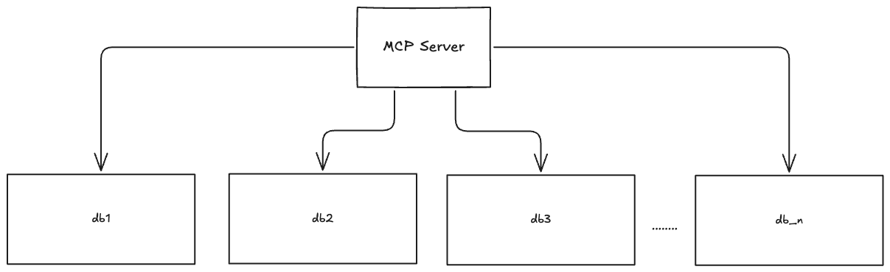
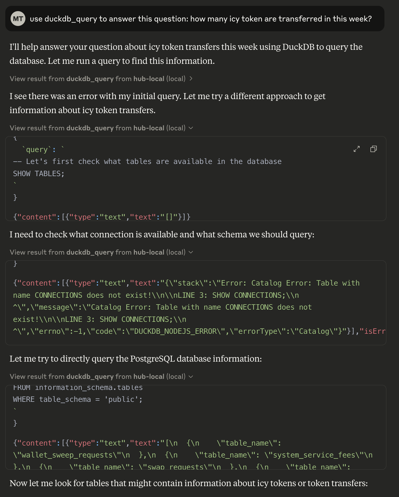

## Introduction

System prompts are the hidden architects of AI interactions. They silently guide AI assistants like Claude to produce consistent, useful responses tailored to specific use cases. But crafting an effective system prompt is both art and science - especially for complex technical scenarios.

In this article, I'll walk through a real process of developing a system prompt for a multi-database analytics use case, drawing from an actual conversation where we identified requirements, tested approaches, and refined instructions to create a specialized database assistant.

To access multiple databases, we needed an MCP server to provide tools that will be using `duckdb` to connect databases. This setup allowed us to merge tables from different databases and perform complex queries.



## Understanding the use case: multi-database analysis

Our journey began with a specific need: creating a system prompt that would enable Claude to effectively explore and query information across multiple databases. The challenge was significant as the assistant needed to add the MCP server to Claude's configuration, discover available databases, identify and understand tables within those databases, connect information across different data sources, and present findings in a useful format.

This represents a common pattern in enterprise environments where data exists in silos, but insights require connecting information across those boundaries.

## Discovery

### Initial exploration

Before diving into the system prompt, we needed to understand Claude's capabilities and limitations. This involved a series of exploratory queries to see how well Claude could interact with the databases.

We started with a simple question: "How many ICY token are transferred in this week?" This query was intended to test Claude's ability to navigate the databases and provide relevant information.

In the beginning, Claude struggled to find the right information. The initial attempts resulted in errors and confusion, Claude will attempt to use different queries and approaches, or in worst cases, it would need more guidance on how to access and query the databases effectively.



### Testing basic database interactions

Claude's first attempt to understand its database interaction capabilities:

```sql
SELECT datname FROM pg_catalog.pg_database;
```

This initial query revealed the available databases in the system, which included specialized databases like `pay_db`, `profile_db`, and `central_db`.

### Exploring database structures

The next step involved exploring the structure of the databases. Claude understood that it needed to identify the tables within each database to find relevant information:

```sql
SELECT tablename FROM pg_catalog.pg_tables WHERE schemaname = 'public';
```

This revealed dozens of tables across different databases. We discovered that similar entities (like "tokens" and "profiles") existed in multiple databases, suggesting potential relationship points.

So it then examined specific table structures:

```sql
SELECT column_name, data_type 
FROM information_schema.columns 
WHERE table_schema = 'public' AND table_name = 'tokens' 
ORDER BY ordinal_position;
```

### Testing cross-database queries

A critical moment came when Claude tested cross-database queries. It encountered an error trying to directly access the `public.tokens` table without specifying the database:

```sh
Error: Table with name tokens does not exist!
Did you mean "pay_db.public.tokens or central_db.public.tokens"?
```

This error revealed that Claude needed to use fully qualified table names when accessing tables across databases, a crucial insight for the system prompt.

### Practical use case testing

So we asked Claude to move from exploration to practical application by testing a real-world query:

```sql
SELECT gct.*, t.symbol, t.name 
FROM central_db.public.guild_config_community_tokens gct
JOIN pay_db.public.tokens t ON gct.mochi_token_id = t.id
WHERE t.symbol = 'ICY';
```

This successful cross-database query demonstrated that with proper guidance, Claude could indeed connect information across databases - in this case, linking community tokens from one database with token definitions from another.

## Crafting the system prompt

What made this system prompt development process unique was that it emerged from actual problem-solving rather than theoretical planning. Here's how the process unfolded:

### Self-Exploration and learning through errors

When initially asked about ICY token emissions, Claude didn't have a predefined approach. Instead, it began by:

1. **Exploring blindly**: The first query to find ICY tokens led to an error because Claude didn't specify the database:

   ```sh
   Error: Catalog Error: Table with name tokens does not exist!
   Did you mean "pay_db.public.tokens or central_db.public.tokens"?
   ```

2. **Learning from failures**: This error actually provided valuable information - it revealed that "tokens" existed in multiple databases and required qualification.

3. **Iterative correction**: So Claude adjusted its approach:

   ```sql
   SELECT * FROM pay_db.public.tokens WHERE symbol = 'ICY' OR name LIKE '%ICY%' LIMIT 1;
   ```

   This worked and revealed the token information.

4. **Building complexity gradually**: After finding the token, Claude needed to locate transactions. It discovered through trial and error that the token was part of a community token system with relations spanning multiple databases.

5. **Cross-database discovery**: Through incremental exploration, Claude discovered how the `community_token_transactions` table in the `central_db` database related to tokens in the `pay_db` database.

6. **Solving real problems**: Eventually, Claude constructed a cross-database query that successfully pulled ICY token emission data:

   ```sql
   SELECT category, SUM(CAST(amount AS DECIMAL)) as total_amount
   FROM central_db.public.community_token_transactions
   WHERE community_token_id = '9232d25e-b7c6-ad4b-d3d8-14becc6deb58'
   AND created_at >= CURRENT_DATE - INTERVAL 7 DAY
   AND source = 'automation'
   GROUP BY category
   ORDER BY total_amount DESC;
   ```

### From experience to instruction

After achieving correct results through iterative exploration, I asked Claude to generate a system prompt based on the previous steps and information gathered. This request marked a critical transition from practical problem-solving to creating reusable guidance.

"After confirming that you could successfully query and connect data across multiple databases, please generate a system prompt that would capture this process systematically," I explained. "The goal was to transform the ad-hoc exploration we had just witnessed into a repeatable methodology that could be applied to similar multi-database scenarios."

This request initiated the crystallization of practical experience into formal instruction. Starting with the database discovery techniques that had worked in practice, Claude developed a comprehensive framework that covered the sequence of queries that successfully identified available databases and their contents, techniques for preventing the catalog errors encountered during our session, templates for the successful joins across different databases, and structured methods for organizing complex multi-database results.


The resulting system prompt wasn't theoretical - it was anchored in the actual steps that had successfully answered complex queries spanning multiple data sources. Each component was directly informed by our experience working through real database challenges.

By asking for this formalization, I effectively transformed a single successful interaction into a reusable template that captured both the technical approach and the strategic thinking behind multi-database exploration.

## Testing the system prompt

After creating our system prompt, we tested it with a practical query: "Which guild using vault?", Claude followed our exploration protocol to discover relationships between guilds and vaults, then provided comprehensive information about the guild, its vault configuration, and transaction patterns.


## Key takeaways for effective system prompts

From our process, several principles emerged for creating effective system prompts:

1. **Let the AI learn by doing**: Allow the AI to explore and solve real problems before creating the system prompt
2. **Build from real experiences**: Base your prompt on actual successful problem-solving patterns
3. **Document both successes and failures**: Include guidance based on errors encountered and how they were overcome
4. **Provide structured protocols**: Formalize the successful exploration paths into step-by-step instructions
5. **Crystallize best practices**: Extract patterns from successful interactions that can be reused
6. **Test in real scenarios**: Validate the system prompt against actual use cases
