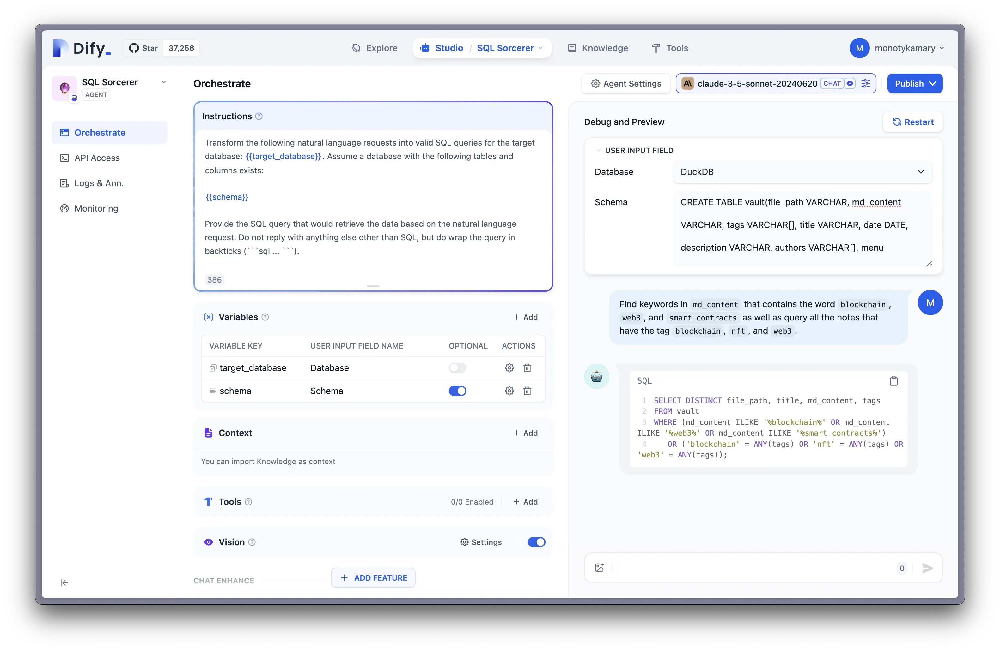
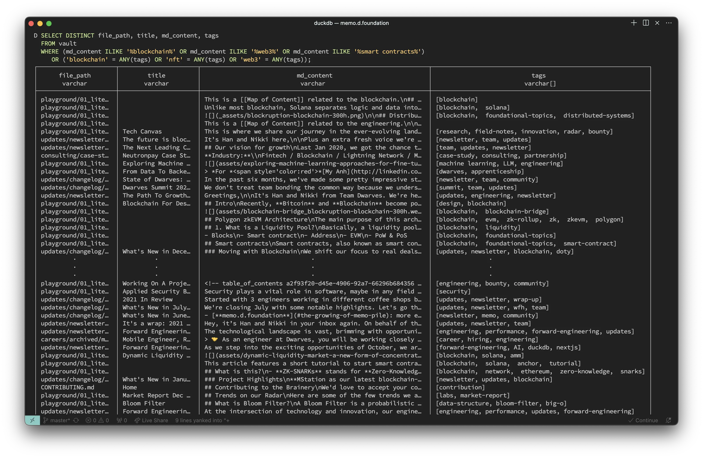
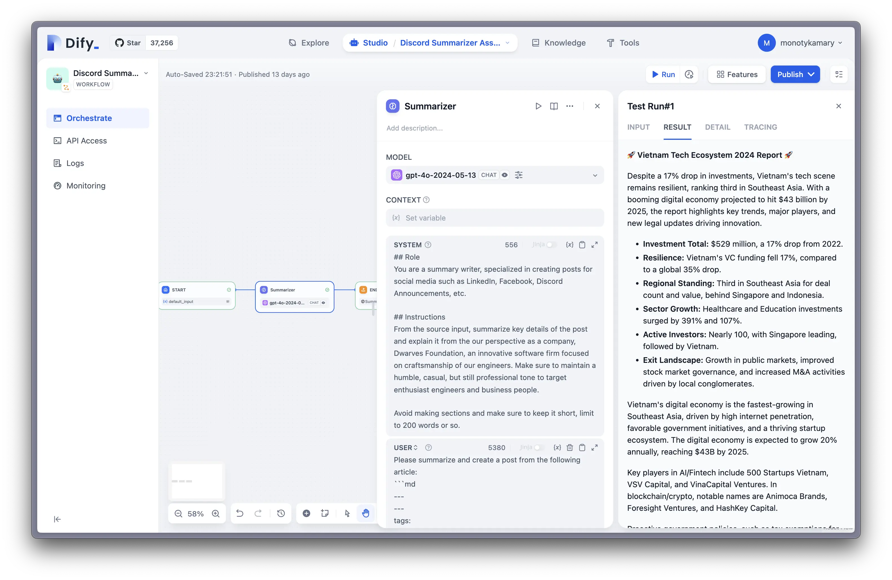

---
authors:
- "monotykamary"
- "innno_"
- "ics3rd"
date: "2024-07-12"
description: "Discover how managed LLMOps platforms like Dify streamline the development of AI-powered internal tools. Learn about the challenges of integrating LLMs, the benefits of managed solutions, and real-world examples of efficient AI tool creation. Perfect for businesses looking to enhance productivity with AI without extensive technical expertise.\""
hashnode_meta:
  coverImageOptions:
    coverImageURL: "https://memo.d.foundation/playground/ai/assets/building-llm-powered-tools-with-dify-sql-sorcerer.webp"
  id: "670f4d50b25a9930f055161a"
  slug: "streamlining-internal-tool-development-with-managed-llmops-a-dify-case-study"
sync: "hashnode"
tags:
- "ai-powered"
- "ai"
- "llm"
title: "Streamlining Internal Tool Development with Managed LLMOps: A Dify Case Study"
---
Organizations are always looking for ways to improve efficiency and productivity. Large Language Models (LLMs) are a powerful technology that can help create smart internal tools. However, using LLMs in existing workflows can be complicated and resource-heavy. This is where managed LLMOps comes into play, providing a smoother way to develop and deploy LLM-powered tools. In this post, we'll see how platforms like Dify enhance the workflow for building internal AI tools.

## The challenge of building LLM-powered internal tools

LLMs have great potential to enhance business processes, but using them for internal tools comes with challenges:

1. **Complexity**: Using LLMs requires deep technical knowledge of AI and machine learning.
2. **Resource Intensity**: Training and fine-tuning LLMs can be expensive and time-consuming.
3. **Maintenance**: Keeping LLM-based tools updated and running well needs ongoing attention.

These factors make it hard for many organizations to fully use LLM technology, especially those without dedicated AI teams.

## Managed LLMOps: A solution for efficient development

Managed LLMOps platforms solve these challenges by offering a complete environment for developing, deploying, and managing LLM-powered applications. These platforms simplify the complexity of LLMs, allowing developers and business users to focus on creating valuable tools instead of dealing with AI infrastructure.

## Dify: An example of managed LLMOps in action

Dify is a great example of a managed LLMOps platform that makes creating LLM-powered internal tools easier. Here are some key features:

1. **User-Friendly Interface**: Dify has an easy-to-use interface that lets both technical and non-technical users create AI applications.
2. **Pre-built Templates**: Users can start quickly with templates for common use cases.
3. **Customization Options**: Dify allows for deep customization when needed.
4. **Integrated Workflow Management**: The platform includes tools for managing the entire lifecycle of AI applications.

To make the deployment process even smoother and manage resources better, we use [elest.io](http://elest.io/) to deploy Dify. [Elest.io](http://elest.io/) is a fully managed DevOps platform, similar to DigitalOcean's marketplace but with more open-source applications. This approach offers several benefits:

- **Simplified Setup**: [Elest.io](http://elest.io/) automates much of the deployment process, reducing the time and expertise needed to get Dify up and running.
- **Cost Control**: By using [elest.io](http://elest.io/)'s infrastructure, we can easily manage and optimize costs across different cloud providers.
- **Flexibility**: [Elest.io](http://elest.io/) supports various cloud providers, allowing us to choose the best and most cost-effective option for our needs.
- **Scalability**: As our LLM tool usage grows, [elest.io](http://elest.io/) makes it easier to scale our Dify deployment to meet increasing demands.

This combination of Dify's powerful LLMOps capabilities and [elest.io](http://elest.io/)'s streamlined deployment process creates an efficient, cost-effective solution for organizations looking to use LLMs in their internal tools. This makes it possible for an average developer to build and deploy an internal tool in minutes.

## Case studies: Internal tools built with Dify

To show the advantage of managed LLMOps, let's look at some example tools built using Dify:

### 1. SQL sorcerer

This tool turns everyday language into SQL queries, allowing non-technical team members to extract insights from databases without learning complex query languages. We use it to make queries to our DuckDB database, integrating it with our memo website and knowledge base.

### 2. OGIF memo summarizer

Specialized in extracting information from YouTube transcripts, this tool quickly generates time-stamped summaries with key points, saving hours of manual video analysis. We recently wrote an article about this tool, which you can read [here](../01_literature/how-we-crafted-the-ogif-summarizer-bot-to-streamline-weekly-knowledge-sharing.md).

### 3. Discord summarizer assistant

Using large language models, this workflow helps translate and summarize conversations across different languages, making global team communication easier.

These tools help us significantly increase our productivity. We extensively use Claude 3.5 Sonnet, and occasionally GPT-4 for more detailed instructions. Without the hard work of @innno\_ and her efforts on our social media platforms, we wouldn't be able to build these tools.

## Best practices for developing internal LLM tools

When using managed LLMOps platforms like Dify to create internal tools, consider these best practices:

1. **Start with a Clear Use Case**: Identify specific pain points or inefficiencies in your workflows that LLMs can address.
2. **Iterate Based on Feedback**: Regularly collect and incorporate user feedback to improve your tools.
3. **Ensure Data Privacy**: When dealing with sensitive internal data, make sure your LLM applications follow your organization's security policies.
4. **Monitor Performance**: Use the analytics provided by your LLMOps platform to track usage and optimize performance.

## Conclusion

Managed LLMOps platforms like Dify are making AI technology accessible to organizations of all sizes, allowing them to create powerful internal tools without needing extensive AI expertise. By simplifying the development and deployment process, these platforms are paving the way for a new era of AI-augmented productivity tools. As LLM technology continues to advance, we can expect to see even more innovative applications that transform the way we work.