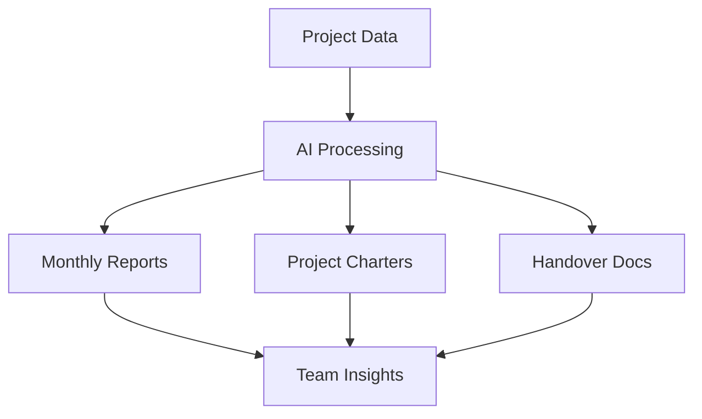

---
authors:
- "monotykamary"
date: "2024-09-11"
description: "Project Operations Copilots is a suite of AI assistants designed to streamline project management and reporting processes. These copilots, built using Dify and custom implementations, help teams generate insightful project reports, create comprehensive project charters, and facilitate smooth project handovers. This approach represents a shift towards AI-assisted project management, enhancing team efficiency and project success rates."
hashnode_meta:
  id: "670b661ff2607e24aa5fecb2"
  slug: "project-operations-copilots-ai-assisted-project-management"
sync: "hashnode"
tags:
- "ai"
- "project-management"
- "copilots"
title: "Project Operations Copilots: AI-Assisted Project Management"
---

## Introduction to Project Operations Copilots

Managing projects effectively requires careful attention to documentation, reporting, and smooth transitions between team members. Our suite of project operations copilots addresses these key areas by providing AI-assisted tools for generating reports, creating project charters, and handling project handovers.

## The Three Pillars of Project Operations

### 1. Monthly Project Report Copilot

This copilot specializes in analyzing project data and generating comprehensive monthly reports. It helps teams by:

- Aggregating project metrics and KPIs
- Identifying key achievements and milestones
- Highlighting potential risks and challenges
- Providing trend analysis and recommendations

### 2. Project Charter Copilot

The Project Charter copilot assists in creating detailed project initialization documents by:

- Defining project scope and objectives
- Outlining roles and responsibilities
- Establishing success criteria
- Setting preliminary timelines and milestones
- Identifying key stakeholders

### 3. Project Handover Copilot

This copilot ensures smooth transitions between team members by:

- Documenting current project status
- Creating comprehensive handover documentation
- Identifying critical pending tasks
- Mapping key relationships and dependencies
- Preserving project context and history

## Implementation and Integration

## Benefits and Impact

The implementation of these copilots brings several key advantages:

1. **Time Efficiency**
   - Automated report generation
   - Standardized documentation
   - Quick access to project insights

2. **Quality Consistency**
   - Standardized formats
   - Comprehensive coverage
   - Reduced human error

3. **Knowledge Preservation**
   - Better documentation
   - Improved context sharing
   - Enhanced team continuity

## Best Practices for Using Copilots

To get the most out of these AI assistants:

1. **Regular Updates**
   - Keep project data current
   - Maintain consistent reporting schedules
   - Review and validate AI outputs

2. **Team Integration**
   - Train team members on copilot usage
   - Establish clear workflows
   - Encourage feedback and improvements

3. **Continuous Improvement**
   - Monitor copilot effectiveness
   - Gather user feedback
   - Iterate on implementations

## Future Developments

The roadmap for these copilots includes:

- Enhanced data integration capabilities
- More sophisticated analysis features
- Improved customization options
- Better collaboration tools

## Conclusion

Project Operations Copilots represent a significant step forward in how we manage and oversee projects. By leveraging AI to handle routine documentation and analysis tasks, teams can focus more on strategic decision-making and project execution.

The future of project management lies in this harmonious blend of human expertise and AI assistance, creating more efficient, consistent, and successful project outcomes.
