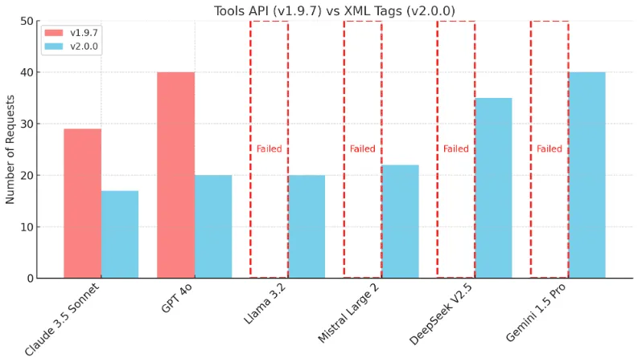
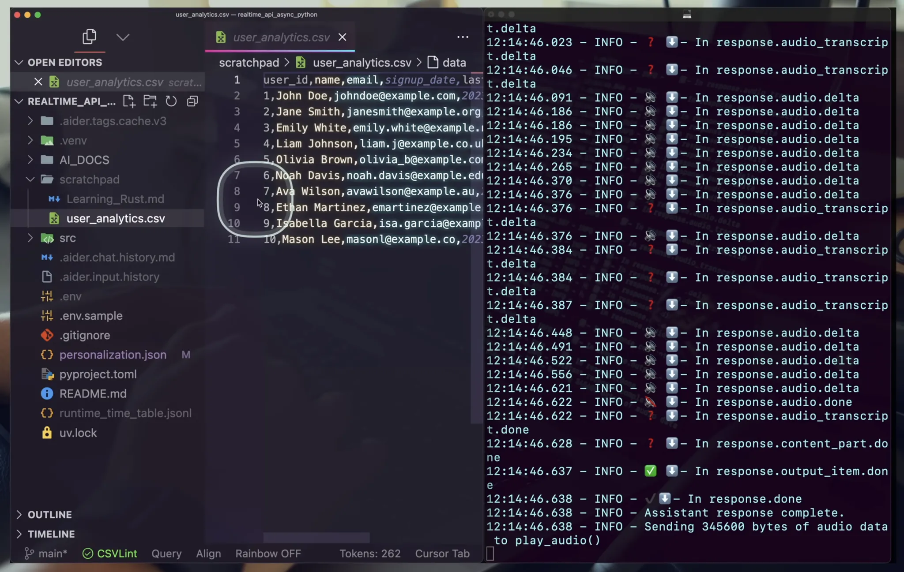
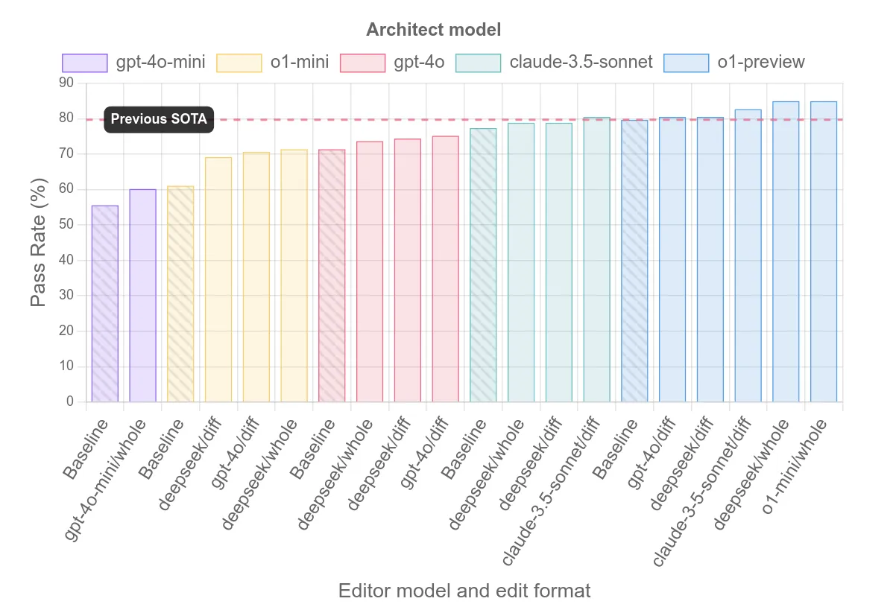

---
authors:
- "datnguyennnx"
date: "2024-10-25"
description: "Stay updated on the latest in AI tools for developers with this week’s digest, featuring Cline's v2.0.0 update, OpenAI’s Realtime API, and Aider’s Architect/Editor split for enhanced coding workflows."
tags:
- "llm"
- "tooling" 
- "aider"
- "cline"
- "realtime api"
title: "AI digest #1 Aider reasoning, OpenAI Realtime API, Cline - pre Claude-dev "
---


This week's AI updates are all about making life easier for developers working with agentic tools. **Cline**, formerly known as Claude Dev, just dropped its v2.0.0 update with faster response times and real-time interactions, perfect for streamlining workflows. **OpenAI’s Realtime API** is a game-changer for real-time function chaining and voice-based coding with Ada. And finally, **Aider’s Architect/Editor** split simplifies complex code reasoning, making pair programming smoother than ever. 

## [Cline - (prev. Claude Dev)](https://github.com/cline/cline)

The new **Cline v2.0.0** update is packed with cool upgrades. First off, "**Claude Dev**" has been rebranded as **Cline**, and it now works faster across different models. You get **real-time responses** streamed right into your editor, and there's a cancel button so you can stop things if **Cline** heads in the wrong direction. They also switched to using XML tags for tool interactions, which cuts down on requests by 40%, making everything smoother. Another, you can search and use any **OpenRouter** model easily, and the project now runs under the Apache 2.0 license.



## [Realtime API with o1 assistant](https://www.youtube.com/watch?v=vN0t-kcPOXo)

We founded it [github repository](https://github.com/disler/poc-realtime-ai-assistant) 2 week ago. The speaker talks about [**real-time APIs** provide by OpenAI](https://openai.com/index/introducing-the-realtime-api/) and the way communicate with **o1 assistant**. It's cool to see how OpenAI has made a game challenge for the coding assistant, letting software engineers now interact with LLMs using voice. Here are some key points from the talk:

- **Realtime API Features**: The speaker explains how this API makes **real-time tool chaining** and **function chaining** possible, allowing Ada to handle complex tasks with great accuracy.
- **Technical Insights**: They dive into how Ada uses different AI agents, with a focus on file management (CRUD operations) and testing out file-related AI agents.
- **Trade-offs and Risks**: The speaker also talks about the trade-offs with using the Realtime API, pointing out that while there are risks, the benefits for engineers and developers are huge. He encourages devs to jump on board to stay competitive.



## [Aider - separating code reasoning and editing](https://aider.chat/2024/09/26/architect.html)

**New approach from Aider:** 

- **Architect Role**: Generates a solution to the coding problem, focusing purely on reasoning. ( Use a strong reasoning model like o1-preview as your Architect. )
- **Editor Role**: Converts the Architect's solution into specific, well-formatted code edits. ( Use a cheaper, faster model like gpt-4o as your Editor. )
- **Performance test**: Using o1-preview as the Architect with either DeepSeek or o1-mini as the Editor produced the SOTA score of 85%. Sonnet, GPT-4o and GPT-4o-mini all scored higher when used as an Architect/Editor pair.

Aider's new "Architect/Editor" feature is inspired by OpenAI’s o1 models. Instead of struggling with perfect code edits, it lets the LLM describe the solution freely, then passes that to a second LLM to generate code updates. This way, it's faster and smoother, making complex sources code easier to handle while still keeping that interactive, pair-programming feel.

```bash
pip install -U aider-chat

# Change directory into a git repo
cd /to/your/git/repo

# Work with Claude 3.5 Sonnet as the Architect and Editor
export ANTHROPIC_API_KEY=your-key-goes-here
aider --sonnet --architect

# Work with OpenAI models, using gpt-o1 as the Architect & gpt-4o-mini as the Editor 
export OPENAI_API_KEY=your-key-goes-here
aider --model openrouter/openai/o1-preview --architect --editor-model openrouter/openai/gpt-4o-mini
```

