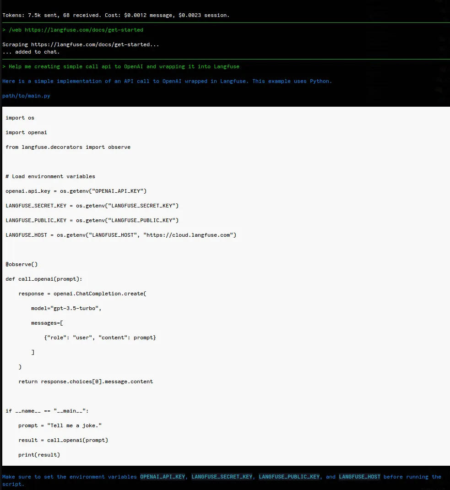
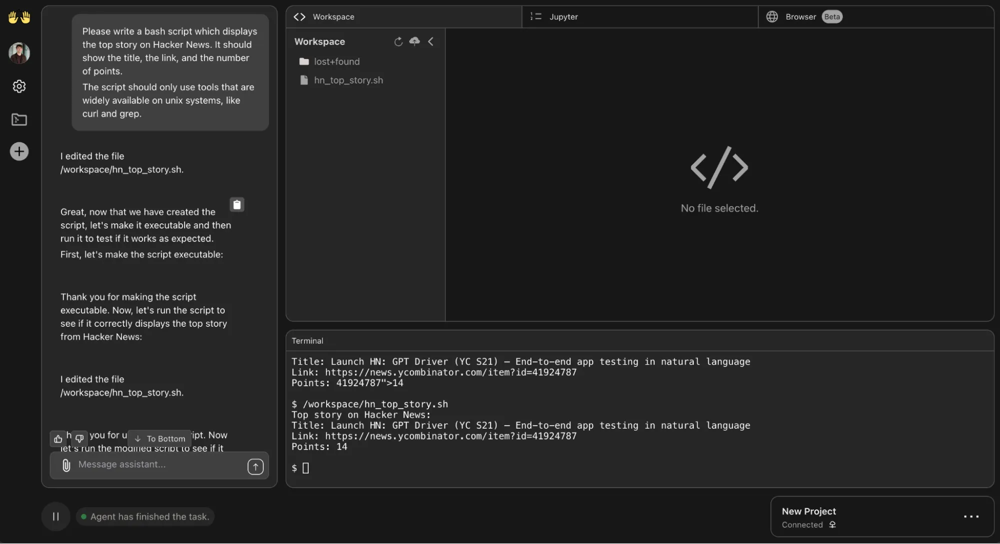
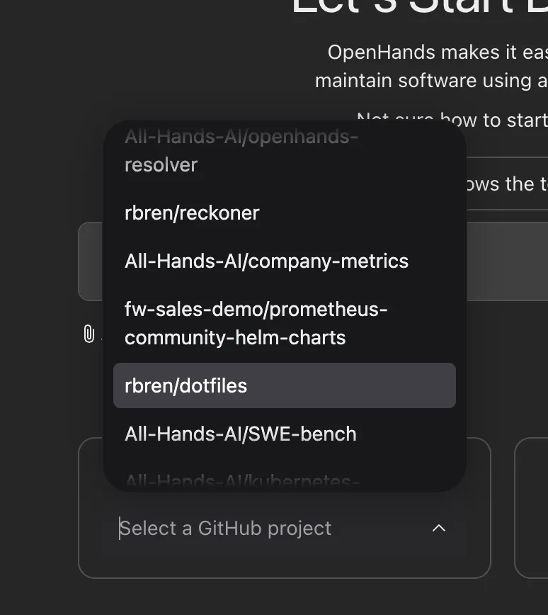
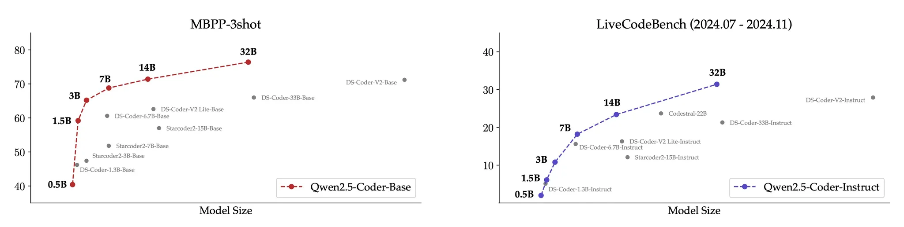
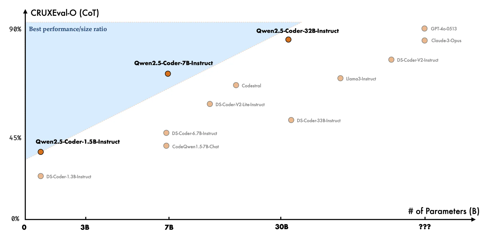

---
authors:
- "datnguyennnx"
date: "2024-11-15"
description: "Stay updated on the latest in AI tools for developers with this week’s digest, new command Aider, OpenHands, Qwen2.5 Coder 32B"
tags:
- "llm"
- "tooling" 
- "aider"
- "qwen2.5"
- "openhand"
- "predicted output"
title: "AI digest #2 New command Aider, OpenHands, Qwen2.5 Coder 32B, Predicted Output"
---


## Aider v0.63.0 release

- Support for Qwen 2.5 Coder 32B.
- `/web` command just adds the page to the chat, without triggering an LLM response.

Qwen 2.5 Coder 32B has been making waves in the past week. This could be a turning point for self-hosting models for coding without needing to call a third-party API. Additionally, the new `/web` command allows developers to easily input a URL as documentation context for Aider.

Here's an example of how to use the `/web` command. The developer provides the documentation URL for initializing Langfuse, which is used to trace API calls for a wrapper.



## OpenHands

OpenHands just took a huge step forward with *All Hands Online (Beta)*, a new hosted version of its AI software development tool. This means no more wrestling with setup—just go to app.all-hands.dev, and you’re good to go in seconds! OpenHands has already proven itself by solving over half of real GitHub issues on the SWE-Bench Verified benchmark, and now it’s easier than ever to get started.



The hosted version also comes with a fresh, redesigned interface and smooth GitHub integration. With the GitHub integration, you can hook up your repos directly, clone projects, and push changes right from OpenHands, keeping everything in one place. And this is just the beginning—more features are on the way to make the tool even smarter, more customizable, and ready to tackle bigger challenges.



## Qwen2.5 Coder 32B

The Qwen team is excited to announce the open-source release of the Qwen2.5-Coder series, a set of highly capable AI coding models designed for practical, real-world programming tasks. Headlining the series is the Qwen2.5-Coder-32B-Instruct, which has set a new standard as the top open-source code model, rivaling the performance of commercial models like GPT-4o. With six model sizes ranging from 0.5B to 32B, Qwen2.5-Coder meets diverse developer needs, whether for lightweight tasks or complex code generation. The models excel in coding benchmarks like EvalPlus and BigCodeBench, offering robust performance across over 40 programming languages, making it a flexiable assistant for a wide range of coding needs.



In addition to coding and code repair, Qwen2.5-Coder also demonstrates strengths in code reasoning and multi-language support, with impressive scores on benchmarks such as McEval and MdEval. This release is a big win for open-source developers who want a powerful, accessible alternative to proprietary models for code generation, repair, and reasoning tasks. Qwen2.5-Coder is also licensed under Apache 2.0, ensuring flexibility and ease of use. The team is looking forward to expanding its capabilities, exploring advanced reasoning models, and unlocking new possibilities in collaboration with the coding community.



## Predicted outputs - OpenAI

Predicted Outputs let you speed up model responses by giving the model a heads-up about parts of the response you know won’t change. This is super handy when you’re making small edits to code or text since most of it stays the same. You just pass the existing content as a "prediction" to the model, and it can skip regenerating what it already knows.

For example, say you have a function that logs messages, and you want to tweak it to include the current date. Instead of rewriting the whole thing, you send the original function as a prediction. The model then quickly returns just the updated version, where it logs both the date and the message, saving time and effort.

### Original Code

```jsx
function logMessage(message) {
  console.log("Log:", message);
}

export default logMessage;
```

### Prediction Setup and Code Update Prompt

In this case, we want to modify the `logMessage` function to include the date. Here’s how you’d set up the request with a `Predicted Output`:

```jsx
import OpenAI from "openai";

const code = `
function logMessage(message) {
  console.log("Log:", message);
}

export default logMessage;
`.trim();

const openai = new OpenAI();

const updatePrompt = `
Modify the logMessage function to log the current date and the message.
Return only the code.
`;

const completion = await openai.chat.completions.create({
  model: "gpt-4o",
  messages: [
    { role: "user", content: updatePrompt },
    { role: "user", content: code }
  ],
  prediction: {
    type: "content",
    content: code
  }
});

// Inspect the response
console.log(completion.choices[0].message.content);
```

### Expected Response

The model will likely return the following:

```jsx
function logMessage(message) {
  const date = new Date().toLocaleString();
  console.log("Log:", date, message);
}

export default logMessage;
```

In this example:

- `Predicted Outputs` speed up the response by leveraging the known structure of the original function.
- The only change made is the addition of the date logging, saving on both response time and computational resources for minor modifications.

Using predictions helps accelerate similar tasks, particularly when refactoring or adding minor updates to existing code or text documents.

## Reference

- https://aider.chat/HISTORY.html
- https://qwenlm.github.io/blog/qwen2.5-coder-family/
- https://www.all-hands.dev/blog/announcing-all-hands-online-beta
- https://platform.openai.com/docs/guides/predicted-outputs