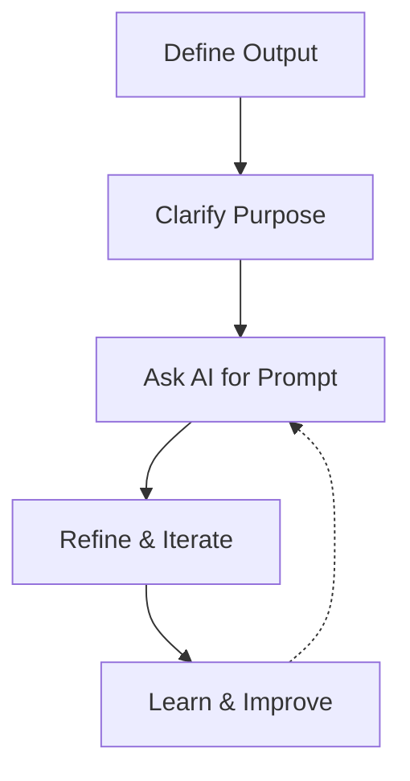
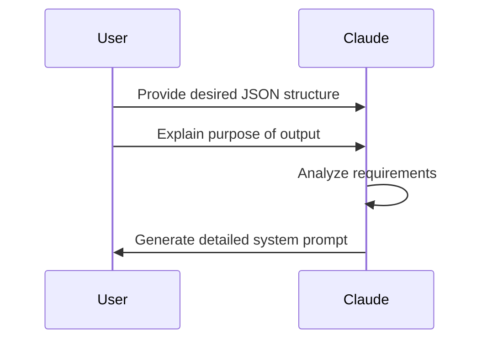
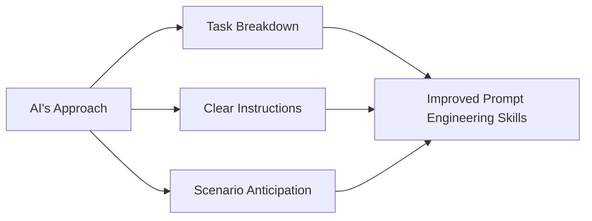
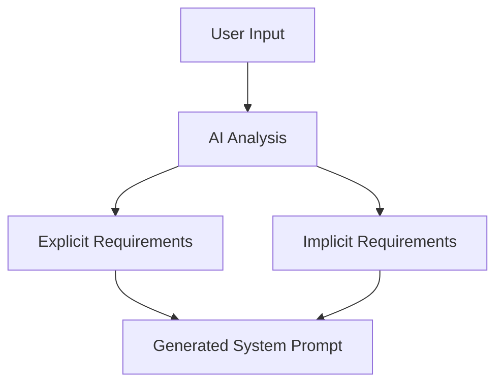

---
authors:
- "monotykamary"
date: "2024-09-11"
description: "Journey of Thought Prompting is an innovative technique that leverages AI to craft more effective prompts for large language models. This approach uses the analytical capabilities of AI assistants to help users create detailed system prompts, fill in missing details, and iteratively refine their prompt engineering skills. It represents a shift towards collaborative AI interaction, enhancing problem-solving capabilities for businesses and engineers."
hashnode_meta:
  id: "670b661ff2607e24aa5fecb2"
  slug: "journey-of-thought-prompting-harnessing-ai-to-craft-better-prompts"
sync: "hashnode"
tags:
- "ai"
- "prompt-engineering"
- "llm"
title: "Journey of Thought Prompting: Harnessing AI to Craft Better Prompts"
---
## The Problem with Prompt Engineering

Let's face it: prompt engineering is hard. We're all fumbling in the dark, trying to coax these large language models into doing what we want. It's like trying to program a computer using natural language - a task that's as frustrating as it is fascinating.

But what if we could turn the tables? What if we could use the AI itself to help us write better prompts? That's where the Journey of Thought Prompting comes in.

## Flipping the Script on AI Interaction

The idea is simple, yet powerful: instead of struggling to write the perfect prompt ourselves, we leverage the AI's analytical capabilities to do it for us. Here's how it works:



## Start with the End in Mind

We begin by clearly defining what we want. In our case, it was a specific JSON structure for spatial and location data. Here's what we started with:

```json
{
  "spatial_markers": [],
  "geographical_relationships": [],
  "topological_features": [],
  "location_based_patterns": [],
  "key_coordinates": [
    {
      "latitude": 0.0,
      "longitude": 0.0,
      "description": "",
      "google_maps_link": ""
    }
  ]
}
```

This isn't about being vague or general - it's about being precise and explicit.

## Explain the 'Why'

Next, we articulate why we need this output. In our example, we explained:

"The idea is to extrapolate information from the user's input, either an image or a conversation, and get back location and spatial data related to their inputs. The purpose of this is to get enough spatial data, and a google maps link(s), to pinpoint, as close as possible, the location of the content."

This isn't just busywork - it provides crucial context that helps the AI understand our goals and constraints.

## Let the AI Do the Heavy Lifting

Here's where it gets interesting. Instead of racking our brains trying to craft the perfect prompt, we ask the AI to do it for us. We give it our desired output and purpose, and let it work its magic.



In our case, we asked the AI to "Create me a system prompt that outputs JSON for the purposes" of our spatial data structure. The AI responded with a detailed system prompt that included:

- An explanation of the AI assistant's role
- The exact JSON structure to be used
- Guidelines for populating each section of the JSON
- Instructions for handling both text and image inputs
- Directions on how to deal with uncertain or missing information

Here's a snippet of the AI's response:

"You are an AI assistant specialized in extracting spatial and geographical information from user inputs, which can be either text descriptions or image analyses. Your task is to process the input and generate a JSON output containing relevant spatial data..."

## Iterate and Refine

The first attempt might not be perfect, and that's okay. The beauty of this approach is its iterative nature. We can engage in a dialogue with the AI, refining and improving the prompt until it meets our needs.

## Learn from the Machine

By examining how the AI structures the prompt, we gain valuable insights into effective prompt engineering. In our spatial data example, the AI included details we hadn't explicitly mentioned, such as:

- How to format Google Maps links
- What types of elements to look for in spatial markers and topological features
- How to describe geographical relationships
- What to do if certain information isn't available

It's like having a master programmer explain their thought process as they code.



## The Power of This Approach

This method isn't just about saving time or reducing frustration (although it does both). It's about leveraging AI to improve our own skills and understanding. It's a collaborative approach that recognizes the strengths of both human and machine intelligence.



## Implications for Business and Engineering

For businesses, this approach can lead to more efficient and effective use of AI tools, potentially saving countless hours of trial and error. For engineers, it offers a new way to approach problem-solving with AI, turning the AI itself into a collaborative partner in the development process.

## The Road Ahead

As AI continues to evolve, techniques like Journey of Thought Prompting will become increasingly valuable. They allow us to work with AI in a more sophisticated way, moving beyond simple query-response interactions to a true collaborative partnership.

The future of AI isn't just about better models or more data. It's about finding smarter ways to interact with these powerful tools. Journey of Thought Prompting is a step in that direction - a way to use AI not just as a tool, but as a collaborator in our quest for better solutions.

In the end, it's not about AI replacing human thinking. It's about AI enhancing and amplifying our cognitive abilities, allowing us to tackle complex problems in new and innovative ways. And that, I believe, is where the true potential of AI lies.