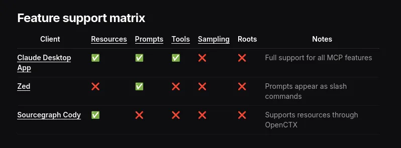

---
authors:
- datnguyennnx
date: 2024-11-29
description: "Explore Anthropic's Model Context Protocol (MCP) - a groundbreaking approach to enhancing AI assistants. Learn how MCP integrates with local and remote resources, enabling smarter interactions with tools and databases."
tags:
- llm
- protocol
- mcp
title: "Intro to Model Context Protocol"
---

Just a few days ago, Anthropic introduced the **Model Context Protocol (MCP)**, and it’s a pretty exciting development for AI! MCP is designed to make AI assistants way smarter and more useful by helping them connect seamlessly with tools, data, and apps we use every day.

## Understanding Model Context Protocol (MCP)

The Model Context Protocol (MCP) follows a client-host-server architecture where each host can run multiple client instances. This architecture enables users to integrate AI capabilities across applications while maintaining clear security boundaries and isolating concerns. Built on JSON-RPC, MCP provides a stateful session protocol focused on context exchange and sampling coordination between clients and servers.

MCP is a structured approach that allows AI systems to communicate effectively with various data sources and tools. It consists of several key components:

- **MCP Hosts**: Programs like Claude Desktop, IDEs, or AI tools that want to access resources through MCP.
- **MCP Clients**: Protocol clients that maintain 1:1 connections with servers.
- **MCP Servers**: Lightweight programs that each expose specific capabilities through the standardized Model Context Protocol.
- **Local Resources**: Your computer’s resources (databases, files, services) that MCP servers can securely access.
- **Remote Resources**: Resources available over the internet (e.g., through APIs) that MCP servers can connect to.


## Integration multiple source for AI Assistants

MCP significantly enhances AI assistants by enabling seamless integration with various data sources and tools. Here’s how:

- **Integration with Data Sources**: AI assistants can pull in relevant information from different databases, ensuring they provide accurate and timely responses.
- **Interaction with Business Tools**: MCP allows AI assistants to work directly with tools used in businesses, improving efficiency.
- I**nteraction with local resources**:  MCP server shares more than just data as well. In addition to resources (files, docs, data), they can expose tools (API integrations, actions) and prompts (templated interactions)

Examples of using the Claude Desktop as an MCP client ( MCP Host ) might look like:

```json
{
  "mcpServers": {
    "filesystem": {
      "command": "npx",
      "args": ["-y", "@modelcontextprotocol/server-filesystem", "/path/to/allowed/files"]
    },
    "git": {
      "command": "uvx",
      "args": ["mcp-server-git", "--repository", "path/to/git/repo"]
    },
    "github": {
      "command": "npx",
      "args": ["-y", "@modelcontextprotocol/server-github"],
      "env": {
        "GITHUB_PERSONAL_ACCESS_TOKEN": "<YOUR_TOKEN>"
      }
    },
    "postgres": {
      "command": "npx",
      "args": ["-y", "@modelcontextprotocol/server-postgres", "postgresql://localhost/mydb"]
    }
  }
}
```

## Benefit & limited

### Benefits of adding MCP support

- Enable users to bring their own context and tools.
- Join a growing ecosystem of interoperable AI applications.
- Provide users with flexible integration options.
- **Support local-first AI workflows.**

### Limited client support

Claude Desktop’s MCP support is currently in developer preview and only supports connecting to local MCP servers running on your machine. Remote MCP connections are not yet supported. This integration is only available in the Claude Desktop app, not the Claude web interface ([claude.ai](http://claude.ai/)).

Each client may support different MCP features, allowing for varying levels of integration with MCP servers.



## Reference

- https://github.com/modelcontextprotocol
- https://www.anthropic.com/news/model-context-protocol
- https://github.com/modelcontextprotocol/servers/blob/main/src/github/index.ts
- https://www.infoworld.com/article/3613143/anthropic-introduces-the-model-context-protocol.html