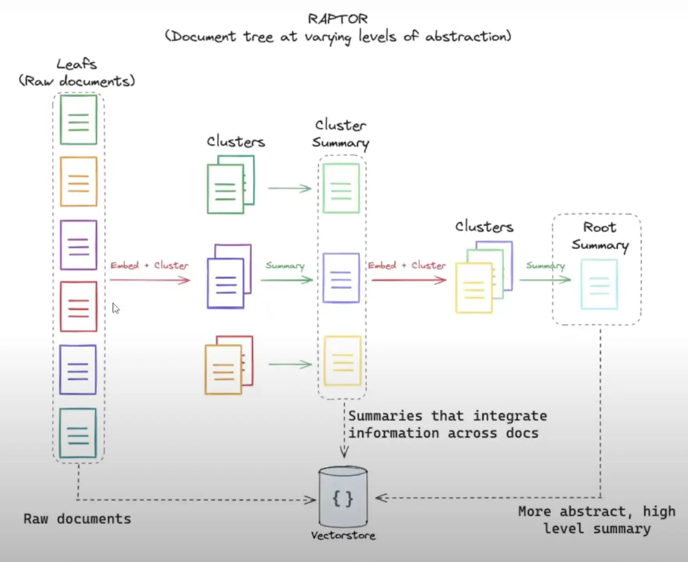

---
tags:
  - llm
  - document-processing
  - information-retrieval
authors:
  - monotykamary
title: 'RAPTOR: Tree-based Retrieval for Language Models'
description: 'An overview of RAPTOR, a novel approach for improving retrieval-augmented language models for long documents using hierarchical tree summaries.'
date: 2024-07-10
---

## What is it?

RAPTOR (Recursive Abstractive Processing for Tree-Organized Retrieval) is a new technique for improving retrieval-augmented language models, particularly for long documents: https://arxiv.org/html/2401.18059v1

### Problems addressed

Most existing retrieval methods only retrieve short, contiguous text chunks, limiting their ability to represent large-scale discourse structure and answer thematic questions that require integrating knowledge from multiple parts of a text.

### Approach

- Recursively embeds, clusters, and summarizes chunks of text
- Constructs a tree with different levels of summarization from bottom up
- At inference time, retrieves from this tree, integrating information across lengthy documents at different levels of abstraction

### Process

The process begins by segmenting text into 100-token chunks and embedding them using SBERT. RAPTOR then employs Gaussian Mixture Models for clustering similar chunks, which are summarized using GPT-3.5-turbo. This process is repeated, building the tree from bottom up:

i. Segments text into 100-token chunks ii. Embeds chunks using SBERT iii. Clusters similar chunks iv. Summarizes clusters using GPT-3.5-turbo v. Repeats process, building tree from bottom up

### Querying

- Collapsed tree method outperforms tree traversal
- Retrieves nodes across all layers based on relevance
- Uses cosine similarity for matching

### Key features

- Builds hierarchical tree of text summaries
- Retrieves from multiple abstraction levels
- Uses clustering (GMMs) and summarization (LLMs)
- Offers flexible querying (tree traversal / collapsed tree)

### Benefits:

- Outperforms traditional methods (e.g., BM25, DPR) on QA tasks
- Excels at complex queries needing multi-part info
- Scales linearly with document length
- Sets new SOTA on some benchmarks when paired with GPT-4

Evaluation was conducted on NarrativeQA, QASPER, and QuALITY datasets, using metrics such as BLEU, ROUGE, METEOR, F1 score, and Accuracy.

