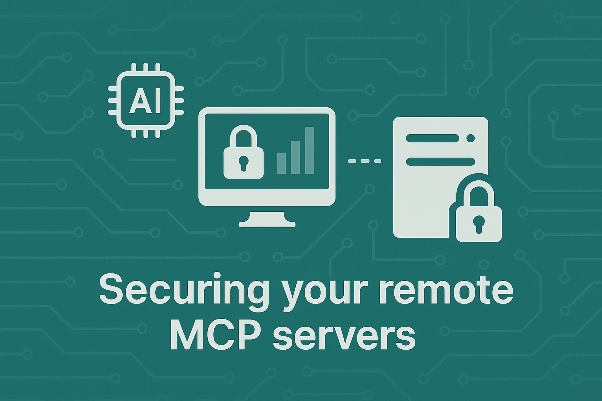

The AI ecosystem is rapidly evolving beyond isolated systems toward integrated networks of AI models and tools. At the core of this evolution lies the **Model Context Protocol (MCP)**, a standardized communication framework that enables AI systems to interact with external tools and services. However, as we build these powerful interconnections, security becomes paramount.

This guide explores how to implement robust authorization for MCP over **Server-Sent Events (SSE)** transport. While the core MCP specification establishes a foundation for AI-to-tool communication, it intentionally leaves security implementation details to system architects. Here, we'll extend the MCP draft authorization guidelines while maintaining vendor independence.

## TL;DR: Speedrunning MCP auth with SSE transport

Here is a practical implementation of authorization for the Model Context Protocol (MCP) following Anthropic's [specifications](https://spec.modelcontextprotocol.io/specification/draft/basic/authorization/). We use standard OAuth 2.1 with PKCE for authentication while leveraging SSE for transport. The approach uses Bearer token authorization in request headers to secure the connection.

**Client-side implementation:**
```typescript
// Configure Mastra with authorization for SSE transport
const mcpConfig: MCPConfiguration = {
  servers: {
    defaultServer: {
      type: 'sse',
      url: 'https://mcp.d.foundation/sse',
      headers: {
        'Authorization': `Bearer ${accessToken}`
      }
    }
  }
};
```

**Server-side implementation:**
```javascript
app.get("/sse", async (req, res) => {
  const authHeader = req.headers.authorization;

  // Validate the Bearer token
  if (!authHeader || !authHeader.startsWith('Bearer ')) {
    return res.status(401).json({ error: 'unauthorized' });
  }

  // Initialize SSE transport with validated session
  const transport = new SSEServerTransport('/messages', res);
  transports[transport.sessionId] = transport;
  res.on("close", () => {
    delete transports[transport.sessionId];
  });
  await server.connect(transport);
});

app.post("/messages", async (req, res) => {
  const sessionId = req.query.sessionId as string;
  const transport = transports[sessionId];
  if (transport) {
    await transport.handlePostMessage(req, res);
  } else {
    res.status(400).send('No transport found for sessionId');
  }
});
```

The [typescript-sdk](https://github.com/modelcontextprotocol/typescript-sdk) provides a reference implementation we can adapt to our needs, with security controls integrated into the standard MCP connection flow. YMMV for clients that don't pass headers.

---

## Understanding the security challenge

When deploying MCP in production environments, we need comprehensive security controls to protect access to potentially sensitive tools and data. The unique properties of SSE transport—which establishes an asymmetric communication channel where the server streams data to clients while clients initiate communication through standard HTTP requests—require specialized security considerations.

Our approach creates a vendor-neutral security framework for MCP over SSE by defining precise authorization flows that integrate with existing security standards. We'll provide concrete implementation guidance for both server and client developers while ensuring a frictionless authentication experience for end users.

## Security architecture foundation

The authorization architecture consists of three principal components working together to establish secure connections:

1. The **MCP Client** represents applications requesting access to MCP tools, such as AI assistants or development environments.
2. The **MCP Server** delivers MCP tools and capabilities, exposing functionality through a standardized interface.
3. The **Authorization Server** implements OAuth 2.1 compliance, authenticating users and issuing security tokens.

The MCP Server functions in a dual role as both an **OAuth Resource Server** that consumes access tokens and potentially an **Authorization Server** that issues tokens. For organizations with existing identity infrastructure, the MCP Server may additionally act as an **OAuth Client** to external identity providers, creating a federated security model.

## Building the connection pipeline

The cornerstone of our implementation is a dedicated SSE endpoint that functions as the primary communication channel between clients and tools. This endpoint accepts standard HTTP requests to initiate connections, then transitions to a persistent stream for event delivery.

When a client makes its initial connection request, the server performs comprehensive authorization validation, verifying the presence and validity of the provided access token. After successful authentication, the server maintains a persistent connection, allowing bidirectional communication through a combination of the SSE event stream and separate HTTP endpoints for command submission.

## Implementing OAuth 2.1 authorization flow

Our security model implements the **OAuth 2.1** authorization framework with **PKCE (Proof Key for Code Exchange)** enhancement to protect against authorization code interception attacks. The complete authorization sequence unfolds through seven distinct stages:

1. The client attempts an initial connection to the SSE endpoint without authentication.
2. The server responds with a 401 Unauthorized status, signaling authentication is required.
3. The client discovers the server's OAuth endpoints and redirects the user to the authorization endpoint.
4. After user authentication, the server issues an authorization code to the client.
5. The client exchanges this code for access and refresh tokens.
6. The client establishes an authenticated SSE connection using the access token.
7. Throughout the connection lifetime, the client monitors token expiration and refreshes credentials proactively.

This approach creates a secure channel while maintaining compatibility with existing OAuth infrastructure and providing a smooth user experience.

## Server implementation

Let's examine a functional implementation of the authorization server using Node.js and Express:

```javascript
const express = require('express');
const { v4: uuidv4 } = require('uuid');
const crypto = require('crypto');
const app = express();

// In-memory storage systems (replace with database persistence in production)
const authRequests = new Map();
const tokens = new Map();
const sessions = new Map();

// SSE connection endpoint implementation
app.get('/sse', (req, res) => {
  const authHeader = req.headers.authorization;

  if (!authHeader || !authHeader.startsWith('Bearer ')) {
    return res.status(401).json({
      error: 'unauthorized',
      error_description: 'Authentication required'
    });
  }

  const token = authHeader.substring(7);
  const session = tokens.get(token);

  if (!session || session.expires < Date.now()) {
    return res.status(401).json({
      error: 'invalid_token',
      error_description: 'Token is invalid or expired'
    });
  }

  // Configure SSE connection headers
  res.setHeader('Content-Type', 'text/event-stream');
  res.setHeader('Cache-Control', 'no-cache');
  res.setHeader('Connection', 'keep-alive');

  // Eliminate request timeout for persistent connection
  req.setTimeout(0);

  // Record the client connection in session management
  const clientId = session.userId;
  sessions.set(clientId, { res, userId: session.userId });

  // Send connection confirmation event
  res.write(`data: ${JSON.stringify({ type: 'connection_established' })}\n\n`);

  // Handle connection termination
  req.on('close', () => {
    sessions.delete(clientId);
  });
});

// OAuth authorization endpoint implementation
app.get('/authorize', (req, res) => {
  const { client_id, redirect_uri, code_challenge, code_challenge_method, state } = req.query;

  if (!client_id || !redirect_uri || !code_challenge || code_challenge_method !== 'S256') {
    return res.status(400).json({ error: 'invalid_request' });
  }

  // Persist authorization request parameters
  const requestId = uuidv4();
  authRequests.set(requestId, {
    client_id,
    redirect_uri,
    code_challenge,
    state,
    created: Date.now()
  });

  // In production, render login UI here instead of auto-approval
  // This simplified implementation immediately generates a code

  // Generate authorization code
  const code = uuidv4();

  // Associate code with authorization request
  authRequests.get(requestId).code = code;

  // Redirect to client callback with authorization code
  const redirectUrl = new URL(redirect_uri);
  redirectUrl.searchParams.append('code', code);
  if (state) {
    redirectUrl.searchParams.append('state', state);
  }

  res.redirect(redirectUrl.toString());
});

// OAuth token endpoint implementation
app.post('/token', express.urlencoded({ extended: true }), (req, res) => {
  const { grant_type, code, client_id, redirect_uri, code_verifier } = req.body;

  if (grant_type !== 'authorization_code') {
    return res.status(400).json({ error: 'unsupported_grant_type' });
  }

  // Locate authorization request associated with the code
  let authRequest = null;
  for (const [id, request] of authRequests.entries()) {
    if (request.code === code) {
      authRequest = request;
      authRequests.delete(id);
      break;
    }
  }

  if (!authRequest) {
    return res.status(400).json({ error: 'invalid_grant' });
  }

  // Validate PKCE code challenge match
  const codeChallenge = crypto
    .createHash('sha256')
    .update(code_verifier)
    .digest('base64')
    .replace(/\+/g, '-')
    .replace(/\//g, '_')
    .replace(/=/g, '');

  if (codeChallenge !== authRequest.code_challenge) {
    return res.status(400).json({ error: 'invalid_grant' });
  }

  // Generate access and refresh tokens
  const accessToken = uuidv4();
  const refreshToken = uuidv4();

  // Record token information for validation
  tokens.set(accessToken, {
    userId: client_id, // In production, use real user identifier
    clientId: client_id,
    scope: 'mcp',
    expires: Date.now() + 3600000 // 1 hour expiration
  });

  // Return OAuth token response
  res.json({
    access_token: accessToken,
    token_type: 'bearer',
    expires_in: 3600,
    refresh_token: refreshToken
  });
});

// OAuth discovery metadata endpoint
app.get('/.well-known/oauth-authorization-server', (req, res) => {
  const baseUrl = `${req.protocol}://${req.get('host')}`;

  res.json({
    issuer: baseUrl,
    authorization_endpoint: `${baseUrl}/authorize`,
    token_endpoint: `${baseUrl}/token`,
    registration_endpoint: `${baseUrl}/register`,
    scopes_supported: ['mcp'],
    response_types_supported: ['code'],
    grant_types_supported: ['authorization_code', 'refresh_token'],
    token_endpoint_auth_methods_supported: ['none'],
    code_challenge_methods_supported: ['S256']
  });
});

app.listen(3000, () => {
  console.log('MCP Server running on port 3000');
});
```

This implementation provides a foundation for secure MCP communication. The server exposes essential OAuth endpoints while maintaining the stateful connections needed for SSE transport. When deployed in production environments, you would enhance this implementation with persistent storage, proper user authentication interfaces, and additional security hardening.

## Client implementation

The client component of our authorization system must handle the OAuth flow, manage tokens securely, and maintain persistent connections. Here's how we can implement a robust MCP client using the Mastra framework:

```typescript
import { Mastra, MCPConfiguration } from 'mastra';
import * as crypto from 'crypto';
import * as http from 'http';
import open from 'open';

class AuthenticatedMCPClient {
  private mastra: Mastra;
  private baseUrl: string;
  private clientId: string;
  private redirectPort: number;
  private accessToken: string | null = null;
  private refreshToken: string | null = null;
  private tokenExpiry: number = 0;
  private callbackServer: http.Server | null = null;

  constructor(baseUrl: string, clientId: string, redirectPort: number = 8000) {
    this.baseUrl = baseUrl;
    this.clientId = clientId;
    this.redirectPort = redirectPort;

    // Initialize Mastra instance
    this.mastra = new Mastra();
  }

  async connect(): Promise<void> {
    try {
      // Try direct connection first (in case we have a valid token cached)
      if (this.accessToken) {
        await this.setupMastraWithToken();
        console.log('Connected using existing token');
        return;
      }
    } catch (error) {
      console.log('No valid token available, initiating authorization flow');
    }

    // Start authorization flow
    await this.authorize();
    await this.setupMastraWithToken();
  }

  private async setupMastraWithToken(): Promise<void> {
    if (!this.accessToken) {
      throw new Error('No access token available');
    }

    // Configure MCP in Mastra with the SSE endpoint and authentication
    const mcpConfig: MCPConfiguration = {
      servers: {
        defaultServer: {
          type: 'sse',
          url: `${this.baseUrl}/sse`,
          headers: {
            'Authorization': `Bearer ${this.accessToken}`
          }
        }
      }
    };

    // Apply the configuration to Mastra
    await this.mastra.configure({ mcp: mcpConfig });

    // Verify connection by listing available tools
    const tools = await this.mastra.getTools();
    console.log(`Connected to MCP server with ${tools.length} available tools`);
  }

  private async discoverOAuthEndpoints(): Promise<any> {
    try {
      const response = await fetch(`${this.baseUrl}/.well-known/oauth-authorization-server`);

      if (response.ok) {
        return await response.json();
      }
    } catch (error) {
      console.warn('OAuth discovery failed, using default endpoints');
    }

    // Fall back to default endpoint structure
    return {
      authorization_endpoint: `${this.baseUrl}/authorize`,
      token_endpoint: `${this.baseUrl}/token`
    };
  }

  private async authorize(): Promise<void> {
    const metadata = await this.discoverOAuthEndpoints();

    // Generate PKCE security parameters
    const codeVerifier = this.generateCodeVerifier();
    const codeChallenge = this.generateCodeChallenge(codeVerifier);
    const state = crypto.randomBytes(16).toString('hex');

    // Define the redirect URI for the OAuth flow
    const redirectUri = `http://localhost:${this.redirectPort}/callback`;

    // Construct the authorization request URL
    const authUrl = new URL(metadata.authorization_endpoint);
    authUrl.searchParams.append('response_type', 'code');
    authUrl.searchParams.append('client_id', this.clientId);
    authUrl.searchParams.append('redirect_uri', redirectUri);
    authUrl.searchParams.append('code_challenge', codeChallenge);
    authUrl.searchParams.append('code_challenge_method', 'S256');
    authUrl.searchParams.append('state', state);

    // Obtain authorization code through browser interaction
    const code = await this.getAuthorizationCode(authUrl.toString(), redirectUri, state);

    // Exchange code for access and refresh tokens
    await this.exchangeCodeForTokens(code, codeVerifier, redirectUri, metadata.token_endpoint);
  }

  private async getAuthorizationCode(authUrl: string, redirectUri: string, state: string): Promise<string> {
    return new Promise((resolve, reject) => {
      // Create temporary web server to handle the OAuth callback
      this.callbackServer = http.createServer((req, res) => {
        const url = new URL(req.url!, `http://localhost:${this.redirectPort}`);

        if (url.pathname === '/callback') {
          // Extract authorization parameters from callback
          const receivedCode = url.searchParams.get('code');
          const receivedState = url.searchParams.get('state');

          // Validate state parameter to prevent CSRF attacks
          if (receivedState !== state) {
            res.writeHead(400, { 'Content-Type': 'text/html' });
            res.end('<html><body><h1>Authentication Error</h1><p>Invalid state parameter</p></body></html>');
            reject(new Error('Invalid state parameter'));
            return;
          }

          if (!receivedCode) {
            res.writeHead(400, { 'Content-Type': 'text/html' });
            res.end('<html><body><h1>Authentication Error</h1><p>No code received</p></body></html>');
            reject(new Error('No code received'));
            return;
          }

          // Send success response to the browser
          res.writeHead(200, { 'Content-Type': 'text/html' });
          res.end('<html><body><h1>Authentication Successful</h1><p>You can close this window now.</p></body></html>');

          // Clean up the temporary server
          this.callbackServer!.close();
          this.callbackServer = null;

          // Return the authorization code
          resolve(receivedCode);
        }
      });

      // Start the callback server and launch browser
      this.callbackServer.listen(this.redirectPort, () => {
        open(authUrl);
      });
    });
  }

  private async exchangeCodeForTokens(
    code: string,
    codeVerifier: string,
    redirectUri: string,
    tokenEndpoint: string
  ): Promise<void> {
    const response = await fetch(tokenEndpoint, {
      method: 'POST',
      headers: {
        'Content-Type': 'application/x-www-form-urlencoded',
      },
      body: new URLSearchParams({
        grant_type: 'authorization_code',
        code,
        client_id: this.clientId,
        redirect_uri: redirectUri,
        code_verifier: codeVerifier,
      }).toString(),
    });

    if (!response.ok) {
      throw new Error(`Token exchange failed: ${response.statusText}`);
    }

    const tokenData = await response.json();

    // Store tokens for subsequent connections
    this.accessToken = tokenData.access_token;
    this.refreshToken = tokenData.refresh_token;
    this.tokenExpiry = Date.now() + tokenData.expires_in * 1000;

    console.log('Successfully obtained access token');
  }

  private generateCodeVerifier(): string {
    return crypto.randomBytes(32).toString('base64url');
  }

  private generateCodeChallenge(verifier: string): string {
    return crypto
      .createHash('sha256')
      .update(verifier)
      .digest('base64')
      .replace(/\+/g, '-')
      .replace(/\//g, '_')
      .replace(/=/g, '');
  }

  getMastra(): Mastra {
    return this.mastra;
  }

  async disconnect(): Promise<void> {
    if (this.callbackServer) {
      this.callbackServer.close();
      this.callbackServer = null;
    }

    // Mastra will handle closing the underlying connections
  }
}
```

This client implementation handles the complete OAuth flow, including PKCE security, token management, and browser-based authentication. Once connected, it provides access to the Mastra API for interacting with the available MCP tools.

## Integrating with existing identity systems

Many organizations maintain existing identity management systems which they wish to leverage for MCP authorization. The MCP Server can be designed to function as an **OAuth client** to external identity providers, creating a federation pattern. This architecture establishes a two-level authorization hierarchy where the MCP Server delegates the authentication to external providers while maintaining control over MCP-specific permissions.

When implementing this federated model, the MCP client initiates the standard OAuth flow with the MCP Server. Upon receiving the authorization request, the MCP Server redirects the user to the external provider's authentication interface. After successful authentication at the external provider, the MCP Server establishes an internal session linked to the external identity. The server then issues its own access tokens to the MCP Client, binding them to the externally authenticated session.

This approach enables MCP Server administrators to leverage existing enterprise identity infrastructure while maintaining granular control over MCP-specific permissions and access policies.

## Security considerations

Implementing a robust MCP authorization system requires attention to several critical security aspects:

**Token protection** represents the cornerstone of the security architecture. Access tokens must never be transmitted over unencrypted connections, requiring **Transport Layer Security (TLS)** for all authorization and API interactions. Token storage requires similar protection, leveraging secure storage mechanisms appropriate to the deployment environment.

**PKCE implementation** is mandatory for all client applications regardless of their classification as public or confidential OAuth clients. This requirement mitigates authorization code interception attacks that can occur during the OAuth redirect flow.

**State parameter validation** prevents cross-site request forgery attacks that could otherwise trick users into initiating unintended authorization flows. Each authorization request must include a cryptographically random state value that is validated when the authorization code is received.

**Refresh token rotation** enhances security by limiting the lifetime of authentication credentials. When a refresh token is used to obtain a new access token, the authorization server issues a new refresh token while invalidating the previous one.

**Rate limiting** must be applied to authentication endpoints to prevent brute force attacks and credential stuffing. Sophisticated rate limiting implementations should employ progressive delays for repeated failures rather than hard cutoffs.

**Audit logging** provides essential visibility into authentication events for security monitoring. Each authentication attempt, token issuance, token validation, and connection establishment should generate audit records with appropriate detail.

## Deployment considerations

A production-ready MCP Server must address several critical infrastructure concerns:

**Horizontal scalability** becomes essential when supporting multiple concurrent SSE connections, requiring an architecture that distributes connection load across multiple server instances. This typically involves implementing a connection pooling system with sticky sessions or distributed session storage mechanisms.

**Connection management** demands sophisticated systems for tracking the creation, monitoring, and termination of persistent connections. Implementing heartbeat mechanisms and idle timeouts helps maintain clean connection states.

**Token storage** requires secure, persistent, and potentially distributed data storage systems. Access tokens, refresh tokens, and associated metadata must be stored with appropriate encryption and protected from unauthorized access.

**User management** typically integrates with existing organizational identity systems. This integration must account for user provisioning, deprovisioning, and permission changes that occur in the primary identity system.

## Building the secure AI-tool bridge

By implementing this authorization framework for MCP over SSE, you establish a secure foundation for AI-to-tool communication that balances robust security with practical implementation requirements. The standardized approach enables seamless integration with existing identity infrastructure while maintaining the flexibility needed in diverse deployment environments.

As the MCP ecosystem continues to evolve, this security foundation will support increasingly sophisticated interactions between AI systems and external tools, enabling new capabilities while maintaining appropriate security boundaries. By embracing open standards and security best practices, your MCP implementation will remain both secure and interoperable in a rapidly evolving AI landscape.
