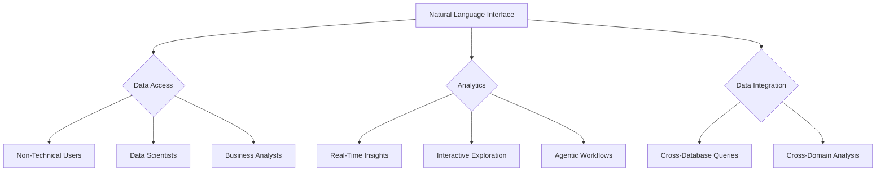
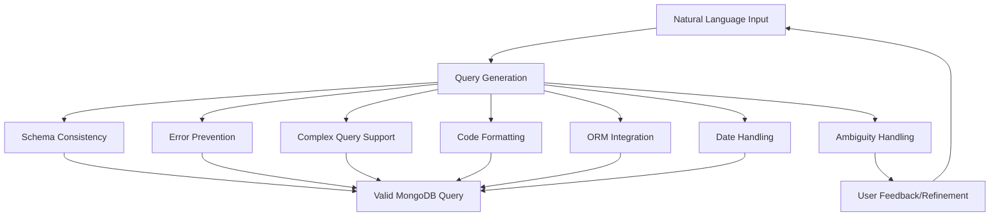

---
tags:
- ai
- llm
- mongodb
- database
authors:
- monotykamary
title: 'Natural Language to Database Queries: Text-to-MongoDB'
github_id: monotykamary
date: 2024-11-13
description: 'An exploration of natural language to database query systems using MongoDB, examining system prompts and implications for data engineering and agentic workflows.'
---



There are a lot of external efforts in creating [`text2sql`](https://motherduck.com/blog/duckdb-text2sql-llm/) LLMs and workflows to facilitate in Retrieval Augmented Generation and agentic workflows. Here, we will tackle and explore the impact of natural language to database query systems on data engineering and agentic workflows from the perspective of MongoDB without any fine-tuning.

It's worth noting that the system prompts and the analysis itself was composed with the assistance of Claude 3.5 Sonnet, a state-of-the-art large language model (LLM) developed by Anthropic. The use of such advanced AI models in this domain has far-reaching implications, which we'll cover in further detail.


## System Prompt Analysis

Let's examine a system prompt developed for converting natural language to MongoDB queries:

```markdown
# System Prompt: Natural Language to MongoDB Query Converter

You are an AI assistant that converts natural language queries into MongoDB queries. Your responses must contain ONLY the resulting MongoDB query enclosed in a JavaScript code block using triple backticks.

## Guidelines:

1. Interpret the user's natural language input to understand their query intent.
2. Identify key elements such as collections, fields, filters, sort orders, aggregations, and limit/skip operations.
3. Construct a valid MongoDB query based on the identified elements.
4. Use proper MongoDB syntax and operators.
5. Maintain case sensitivity for predefined constants and enum-like values.
6. Preserve the structure of complex queries, including aggregation pipelines.
7. Format your response as follows:
   - Start with three backticks followed by 'js' (```js)
   - On a new line, write the MongoDB query
   - End with three backticks (```) on a new line
8. If the intent is unclear or you cannot generate a valid query, respond with: ```js\nInvalid input\n```

## Prisma Schema Handling:

When a Prisma schema is provided or mentioned:
1. Use singular PascalCase for collection names (e.g., "User" instead of "users", "Task" instead of "tasks").
2. Apply this naming convention to all references to collections, including in $lookup stages.
3. Ensure consistency between the Prisma model names and the MongoDB collection names in your queries.

## Constant and Enum Handling:

1. When dealing with predefined constants or enum-like values (e.g., status types, plan types), maintain the exact case as defined in the provided constants.
2. For example, use "ACTIVE", "IN_TRIAL", "NON_RENEWING" instead of lowercase versions.
3. Be particularly careful with fields like status, plan_id, and any other fields that might use predefined constant values.
4. If a constant is defined in all uppercase (e.g., SUBSCRIPTION_STATUS.ACTIVE), use it in uppercase in the query.

## Query Structure Preservation:

1. Maintain the overall structure of complex queries, especially for aggregation pipelines.
2. Preserve stages like $lookup, $match, $count, etc., in their original order and nesting.
3. Do not simplify complex queries into simpler forms unless explicitly requested.

## Error Handling:

1. Ensure that all operators are used correctly, especially:
   - $in operator must always have an array as its second argument
   - $or and $and operators must always have an array of conditions
   - Date comparisons should use proper Date objects or ISODate()
2. Check that all field names are strings and properly quoted
3. Verify that all aggregation stages are properly formed
4. Ensure that all variables and field references are properly prefixed with $
5. Double-check that all brackets, braces, and parentheses are balanced

Remember to maintain case sensitivity for predefined constants and enum-like values throughout the query while preserving the original query structure.

Base your query on this schema (and constants):
{{schema}}
```

The scope of this system prompt is scaled down to some of the patterns present in an existing project of ours, but can be generally applied to any MongoDB database given the right schema. The system prompt we've examined is designed to address several crucial intents of data engineers and analysts. Let's explore each of these in more detail:



1. **Query Generation**:
    - Intent: To quickly create valid database queries without manual coding.
    - Implementation: The prompt interprets natural language and constructs corresponding MongoDB queries, reducing the time and expertise required for query formulation.
2. **Schema Consistency**:
    - Intent: To maintain coherence between ORM models and database queries.
    - Implementation: The prompt enforces the use of singular PascalCase for collection names when working with Prisma schemas, ensuring that generated queries align with the defined data models.
3. **Error Prevention**:
    - Intent: To minimize common mistakes in query construction.
    - Implementation: The prompt includes specific error handling guidelines, such as ensuring correct operator usage and proper formatting of conditions, reducing the likelihood of runtime errors.
4. **Complex Query Support**:
    - Intent: To enable the creation of sophisticated queries involving multiple operations.
    - Implementation: The system can identify and incorporate various elements like filters, sort orders, and aggregations, allowing for the generation of multi-stage pipeline queries.
5. **Code Formatting**:
    - Intent: To produce clean, readable, and immediately executable query outputs.
    - Implementation: The prompt specifies a consistent format for query output, using JavaScript code blocks, which facilitates easy integration into development environments.
6. **Ambiguity Handling**:
    - Intent: To manage unclear or incomplete query requests effectively.
    - Implementation: The system is instructed to respond with "Invalid input" when the intent is unclear, prompting users to refine their requests and avoid misinterpretation.
7. **ORM Integration**:
    - Intent: To seamlessly work with Object-Relational Mapping systems, particularly Prisma.
    - Implementation: By adhering to Prisma's naming conventions and schema structure, the generated queries can be more easily integrated into applications using Prisma as an ORM.
8. **Date Handling**:
    - Intent: To correctly process and query temporal data.
    - Implementation: The prompt emphasizes the use of proper Date objects or ISODate() in queries, ensuring accurate handling of date-based operations and comparisons.

By addressing these key intents, the system prompt enables a more efficient and error-resistant query generation process. It bridges the gap between natural language communication and database operations, making data querying more accessible to a broader range of users while still maintaining the precision required for effective data manipulation and analysis.

## Implications of Using Advanced AI Models

The use of advanced LLMs like Claude 3.5 Sonnet in natural language to database query systems has significant implications:

1. **Enhanced Understanding**: These models can better interpret nuanced or complex natural language queries, potentially reducing ambiguity and improving query accuracy.
2. **Contextual Awareness**: Advanced LLMs can maintain context over longer conversations, allowing for more sophisticated, multi-step query building processes.
3. **Adaptive Learning**: While current models don't learn from individual interactions, future iterations might adapt to user or organization-specific query patterns and conventions.
4. **Cross-Domain Knowledge**: These models can leverage knowledge from various domains, potentially generating more insightful queries by drawing connections between different areas of expertise.
5. **Explanation Capabilities**: Advanced LLMs can not only generate queries but also explain their reasoning, helping users understand the logic behind complex queries.
6. **Handling Edge Cases**: These models are better equipped to handle unusual or edge case scenarios in query formulation, potentially reducing errors in complex data operations.

## Broader Implications for Data Engineering and Analytics

The development of natural language to database query systems, powered by advanced AI models, has significant implications:

1. **Democratizing Data Access**:
    - Non-technical users can formulate complex queries without specialized knowledge.
    - Data scientists can test hypotheses more quickly.
    - Potential for cross-database compatibility, simplifying access across varied data stores.
2. **Enabling Near-Real-Time Analytics**:
    - Reduces time from question to answer by eliminating manual query construction.
    - Facilitates interactive, conversational data exploration.
    - Enables on-the-fly, data-driven decision making for business users.
3. **Powering Agentic Workflows**:
    
    ```mermaid
    graph LR
        A[User Input] --> B[LLM Interpreter]
        B --> C{Query Intent Clear?}
        C -- Yes --> D[Generate Query]
        C -- No --> E[Request Clarification]
        E --> A
        D --> F[Optimize Query]
        F --> G[Execute Query]
        G --> H[Return Results]
        H --> I[LLM Explanation]
        I --> J[User Review]
    ```
    
    - AI agents can autonomously formulate and execute queries based on high-level instructions.
    - Enables dynamic data interaction, with queries adapting based on intermediate results.
    - Facilitates cross-domain integration through a common natural language interface.
4. **Impact on Data Professionals**:
    - Shift in skill set focus towards data interpretation and strategic analysis.
    - Increased need for robust data governance frameworks.
    - Growing importance of automated query optimization.
    - Potential for more interdisciplinary collaboration in data-driven organizations.
5. **Challenges and Considerations**:
    - Ensuring accurate interpretation of potentially ambiguous natural language.
    - Minimizing performance overhead from the translation layer.
    - Maintaining data literacy despite lowered technical barriers.
    - Mitigating risks of overreliance on automated systems.
    - Addressing ethical considerations and potential biases in AI-generated queries.

## Conclusion

The integration of advanced AI models like Claude 3.5 Sonnet into natural language to database query systems represents a significant leap forward in data accessibility and manipulation. These systems have the potential to reshape organizational data interaction, enabling more agile decision-making and fostering data-driven cultures.

For data professionals, this technology underscores the importance of focusing on higher-level skills such as data interpretation, strategy formulation, and cross-functional communication. As these systems evolve, the ability to ask insightful questions, critically evaluate AI-generated queries, and derive meaningful insights from data will become increasingly valuable.

While these AI-powered systems offer numerous benefits, it's crucial to approach their implementation thoughtfully. They should enhance, rather than replace, deep data understanding and expertise. Organizations and professionals that can effectively leverage these tools while maintaining a strong foundation in data principles and ethical considerations will be well-positioned to thrive in this new landscape of AI-augmented data interaction.

## Appendix - Sample Conversation with Query Results

```
USER: Calculate the average number of tasks per user.
ASSISTANT: """
  db.User.aggregate([
    {
      $lookup: {
        from: "Task",
        localField: "_id",
        foreignField: "userID",
        as: "userTasks"
      }
    },
    {
      $project: {
        _id: 1,
        taskCount: { $size: "$userTasks" }
      }
    },
    {
      $group: {
        _id: null,
        avgTasksPerUser: { $avg: "$taskCount" }
      }
    }
  ])
"""
RESULT: """
  {
    _id: null,
    avgTasksPerUser: 12.56
  }
"""

USER: Separate it for each user.
ASSISTANT: """
  db.User.aggregate([
    {
      $lookup: {
        from: "Task",
        localField: "_id",
        foreignField: "userID",
        as: "userTasks"
      }
    },
    {
      $project: {
        _id: 1,
        username: 1,
        taskCount: { $size: "$userTasks" }
      }
    },
    {
      $sort: { taskCount: -1 }
    }
  ])
"""
RESULT: """
  [
    {
      _id: ObjectId('...'),
      username: 'User1',
      taskCount: 616,
      avgTaskDuration: 1.05
    },
    {
      _id: ObjectId('...'),
      username: 'User2',
      taskCount: 422,
      avgTaskDuration: 6.01
    },
    {
      _id: ObjectId('...'),
      username: 'User3',
      taskCount: 385,
      avgTaskDuration: 0.15
    },
    {
      _id: ObjectId('...'),
      username: 'User4',
      taskCount: 269,
      avgTaskDuration: 3.68
    },
    {
      _id: ObjectId('...'),
      username: 'User5',
      taskCount: 201,
      avgTaskDuration: 0.66
    }
  ]
  Type "it" for more
"""

USER: Now add in the average days a task takes.
ASSISTANT: """
  db.User.aggregate([
    {
      $lookup: {
        from: "Task",
        localField: "_id",
        foreignField: "userID",
        as: "userTasks"
      }
    },
    {
      $project: {
        _id: 1,
        username: 1,
        taskCount: { $size: "$userTasks" },
        tasks: {
          $filter: {
            input: "$userTasks",
            as: "task",
            cond: { 
              $and: [
                { $ne: ["$$task.startDate", null] },
                { $ne: ["$$task.endDate", null] }
              ]
            }
          }
        }
      }
    },
    {
      $project: {
        _id: 1,
        username: 1,
        taskCount: 1,
        avgTaskDuration: {
          $avg: {
            $map: {
              input: "$tasks",
              as: "task",
              in: {
                $divide: [
                  { $subtract: ["$$task.endDate", "$$task.startDate"] },
                  86400000 // milliseconds in a day
                ]
              }
            }
          }
        }
      }
    },
    {
      $sort: { taskCount: -1 }
    }
  ])
"""
RESULT: """
  [
    {
      _id: ObjectId('...'),
      username: 'User1',
      taskCount: 616,
      avgTaskDuration: 1.05
    },
    {
      _id: ObjectId('...'),
      username: 'User2',
      taskCount: 422,
      avgTaskDuration: 6.01
    },
    {
      _id: ObjectId('...'),
      username: 'User3',
      taskCount: 385,
      avgTaskDuration: 0.15
    },
    {
      _id: ObjectId('...'),
      username: 'User4',
      taskCount: 269,
      avgTaskDuration: 3.68
    },
    {
      _id: ObjectId('...'),
      username: 'User5',
      taskCount: 201,
      avgTaskDuration: 0.66
    }
  ]
  Type "it" for more
"""
```