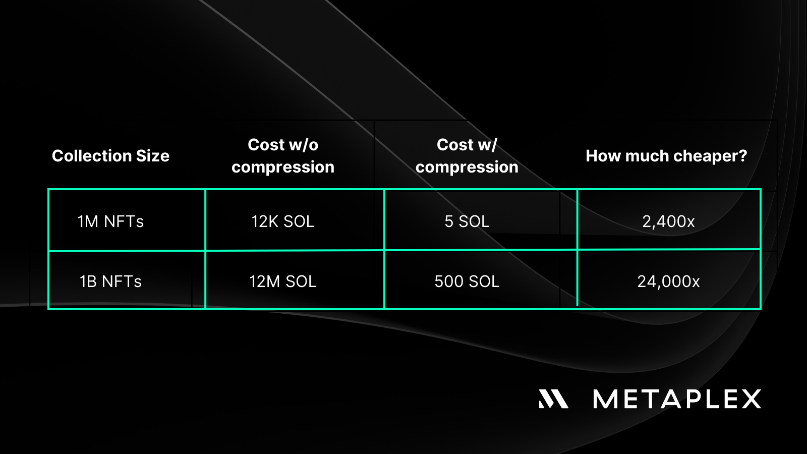

With the rise of NFTs on the Solana blockchain, there is a growing demand for these digital assets to be as commonplace as any other item on the internet. This includes every single item in a game's inventory, proof of engagement in popular consumer apps, and even a personal profile for every human on Earth.

While the cost of renting NFTs on Solana is relatively cheap (at ◎0.012), it scales linearly, making it costly to have a large number of NFTs. However, through compression, the cost of on-chain storage for NFTs can be drastically reduced, enabling creators to fully leverage the technology to express themselves. For example, with compression, the cost of 10,000 NFTs at ◎3.5 (34x) reduces, as does the cost of 1 million NFTs at ◎5 (2,400x) and 1 billion NFTs at ◎500 (24,000x).

## How Compression for NFTs works
Compressed NFTs are stored in Merkle trees via the Gummyroll program where:

- Roots of Merkle trees are stored and updated on-chain in a buffer stored in a program account
- Modifications to a tree (e.g. mint, transfer, delegate) are encoded in the Solana ledger
- Off-chain indexers observe changes to the tree via the ledger and cache NFT-related metadata, and serve data and proofs needed to power dApps and smart contracts

The Merkle root's on-chain buffer in the Gummyroll program enables multiple write requests to a single Merkle tree to be processed simultaneously. As updates to the tree cause the root to change, the program ensures that outdated requests to update the tree remain valid if they would have updated a prior version of the tree, given the nature of how Merkle trees operate.

The implementation of Compression for NFTs will have a significant impact on the Solana ecosystem, and Metaplex is working towards making this a reality. To achieve this, Metaplex is collaborating with various partners, including wallets and RPCs. Some of the partners that have already implemented solutions include Solflare for wallets, Crossmint for enterprise tools, and GenysysGo and Triton for RPCs. Additionally, partners such as Phantom for wallets and Quicknode and Alchemy for RPCs are expected to launch their solutions soon.

## Conclusion
This is just a brief overview of Compression for NFTs. There is much more to explore, whether from a technical perspective or in terms of potential use cases. Nevertheless, this technological advancement marks a significant shift in how users, developers, and businesses can approach NFTs in Solana blockchain.

## Reference
- https://www.metaplex.com/posts/expanding-digital-assets-with-compression-for-nfts
- https://metaplex.notion.site/Compression-for-NFTs-Public-94f9faa25f034110b513414a11a85bbe
