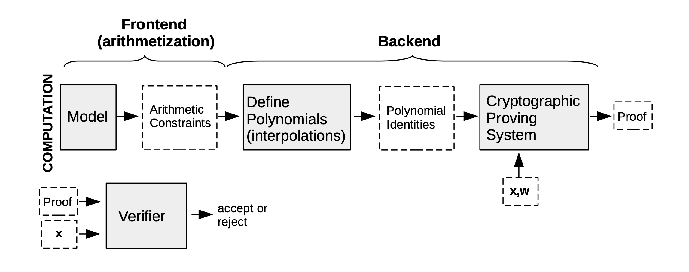

## Polygon zkEVM Architecture
The main purpose of this architecture is Efficiency, the first strategy is incentivize the most efficient aggregators to participate in the proof generation process. The second is move all computation off-chain but keep only the necessary data zk-proof on-chain. Make the bridge decentralize. Utilization of special cryptographic  primitive within the zkProver in order to speed up computation and minimize proof size. 

### Main components:
- **Proof of Efficiency** is a consensus mechanism based on an automatically conducted decentralized auction, with participants bidding on a certain amount of tokens to be selected to create the next batch added support for permissionless participation of multiple coordinators to create batches in L2
- **zkNode** is software to be run by any zkEVM node, it not required to install Synchronization and adjust the roles of the participants. They can join as a node to know the state of the network, or can participate in production processing in any role: Sequencer or Aggregator.
    - Synchronizer
    - Sequencer & Aggregators
    - RPC

- **zkProver**  is techinal to create validity proof using zero-knowledge. it consists of a main state machine executor ( a collection of secondary state machines), a STARK proof builder, and a SNARK-proof builder. All valid batch must satisfy specific polynomial constraint.

- **LX-to-Ly Bridge** is a smart contract can help users transfer assets between two layers.

### How does it work?

#### What is Proof of Efficiency?

PoE solve the problem relate to decentralized and permissionless validators in Layer 2. Using zk-STARK for proving purpose, this proof are very fast but they are very big size. So, using zk-SNARK to attest to the correctness of the zk-STARK proofs. This help in reducing the gas cost from 5M to 350k.

**Sequencer** create a batch of Layer 2 transaction from users and so select and pre-process a new L2 batch in network by sending a L1 tx with the data of all selected Layer 2 TXs. The transaction in L2 will be in format on L1 transaction with information in the **CALLDATA**, it will be used as the data available for the L2 network and L2 node will be able to synchronize the state. The new state is settled (validity proof of new state is generated and mined in L1) these data availability on L1 transaction define the L2 TXs that will be executed in specific order.

The batch is process when the sequencer to do base on the incentives they have:

**Aggregators** receives all transaction information form Sequencer and send it to prover to get proof and send proof to smart contract to check. The first aggregator submit the proof will earn the right to create the validity proof of new state of the Layer 2

This mechanism will avoid control of a single party and many of the potential attacks, since any Sequencer can propose a batch, but there is a cost on it.

#### How to incentivization for Sequencer and Aggregators?
The two permissionless participants of the zkEVM network are: Sequencers and Aggregators. Proper incentive structures have been devised to keep the zkEVM network fast and secure. Below is a summary of the fee structure for Sequencers and Aggregators:

- **Sequencer**
    - Collect transactions and publish them in a batch
    - Receive fees from the published transactions
    - Pay L1 transaction fees + MATIC (depends on pending batches)
    - MATIC goes to Aggregators
    - Profitable if: txs fees > L1 call + MATIC fee
- **Aggregator?**
    - Process transactions published by Sequencers
    - Build zkProof
    - Receive MATIC from Sequencer
    - Static Cost: L1 call cost + Server cost (to build a proof)
    - Profitable if: MATIC fee > L1 call + Server cost

#### zkEVM
zkEVM was design to take advantage of ZK folklore to minimize size validity proof for validation, reduce transaction finality time and save gas costs.

#### zkProver
Have 4 main components:
- The Executor, which is the Main State Machine Executor
- The STARK Recursion Component
- The CIRCOM Library
- The zk-SNARK Prover

Prover generate verifiable proof process:

You can read more [here](https://docs.hermez.io/zkEVM/zkProver/Overview/zkProver-Overview/#the-stark-recursion-component)

#### Bridge flow

**The Bridge L1 contract** have two operations, it requires two Merkle trees in order to work: globalExitTree and mainnet exit tree.
- **bridge** transfer asset from one rollup to another
- **claim** make claim from any rollup

**The Bridge L2 contract** named the global exit root manager L2 is responsible for managing the exit roots across multiple networks.

#### RPC

Provide a RPC interface compatible with ethereum so application like Metamask, etherscan can connect and interact. RPC also add transactions o the pool and interact with the state via read-only methods.

#### State

State implement a Merkle Tree and connect to DB backend. it checks integrity of block, transaction information. State also stores smart contract code in to the merkle tree and process transaction using EVM.

## Reference

- [Polygon zkEVM documentation](https://docs.hermez.io/zkEVM/Basic-Concepts/Intro-zkProver%27s-Design-Approach/)
- [Proof of Efficiency](https://ethresear.ch/t/proof-of-efficiency-a-new-consensus-mechanism-for-zk-rollups/11988)
- [LX-to-LY Bridge](https://wiki.polygon.technology/docs/zkEVM/lx-ly-bridge)
- [zkEvm](https://wiki.polygon.technology/docs/zkEVM/proof-of-efficiency)
- [Repo zkevm](https://github.com/0xPolygonHermez/zkevm-node)
- [Polygon zkEVM](https://mirror.xyz/msfew.eth/JJudP_Kf-IS6VhbF-qU0BUor1Ap6SFEb0TzYOHZ34Rc)

---
<!-- cta -->
### Contributing

At Dwarves, we encourage our people to read, write, share what we learn with others, and [[CONTRIBUTING|contributing to the Brainery]] is an important part of our learning culture. For visitors, you are welcome to read them, contribute to them, and suggest additions. We maintain a monthly pool of $1500 to reward contributors who support our journey of lifelong growth in knowledge and network.

### Love what we are doing?

- Check out our [products](https://superbits.co)
- Hire us to [build your software](https://d.foundation)
- Join us, [we are also hiring](https://github.com/dwarvesf/WeAreHiring)
- Visit our [Discord Learning Site](https://discord.gg/dzNBpNTVEZ)
- Visit our [GitHub](https://github.com/dwarvesf)