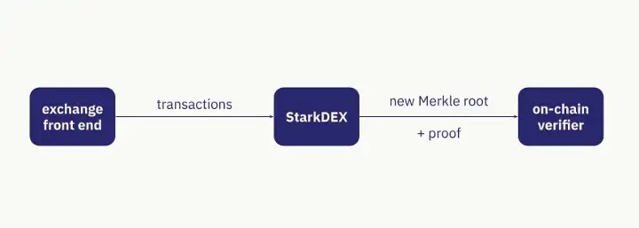

## STARKnet layer 2 system

Starknet is a layer 2 blockchain solution using ZK rollup, it provides StarkDex technology for well-known applications such as dYdX, ImmutableX, Sorare. It allows decentralized exchanges to process transactions with fast speed and low costs. Its essence is to reduce computations, store on-chain, replace with off-chain computations and store off-chain, Store balance using merkle tree with root merkle tree stored on-chain

## Starknet architecture overview

The system consists of 6 main components:

- **User account** is a smart contract and expands the ability to create a recovery mechanism that depends on social information such as friends, family, colleagues, can handle offline authentication instead of use seed phrases. There is now an Argent X wallet that uses this method.
- **Sequencer** validates off-chain transactions, manages orders, verifies and bundles transactions into blocks. The system has only 1 sequencer to ensure it works consistently. It also uses a virtual machine similar to EVM called Cairo
- **Prover** generates proof to verify transactions wrapped by sequencer to generate global state by processing transactions in new block. To generate a valid proof it requires an execution trace of the Sequencer's computations. Prover generates proof for all other applications running on StarkEx.
- **Full Node** is a component that keeps a record of all transactions made during the rollup and tracks the global state of the network. They communicate p2p sharing information about the global state and validating every time a new block is created.
- **Verifier** is a smart contract running on Layer 1 Ethereum that is responsible for verifying on-chain proofs generated by Prover and transactions on Layer 1. Verification results are sent to smart contract Starketnet Core for storage. and mark the start of a new set of transactions on Layer 1 from Starknet to update the Global state on-chain.
- **Starknet Core** Is a smart contract running on layer 1 that receives changes to Layer 2 global state from Starknet every time there is a new L2 block and its proof is successfully verified on-chain by Verifier. StarkNet Fullnode will decrypt the data in the "call data" to recreate the history of the network on the first sync

## How does it work

The process consists of four steps:
1. **Batching** is Sequencer, groups together multiple transactions into a batch for processing. The entireed batch is submit on-chain as a single compressed state update with a proof.
2. **Validating & Updateing** The update is then compresse4d in the form of a hash on the entire state of the system : ℎ(ℎ(ℎ(class_hash,storage_root),0),0) 
Where:
- class_hash is the hash of the contract’s definition discussed here
- storage_root is the root of another Merkle-Patricia tree of height 251 that is constructed from the contract’s storage
- ℎ is the Pedersen hash function.
3. **Generating a Proof** Once the batch transaction is processed, StarkEx generates a STARK proof to confirm the correctness of the transactions.
4. **On-chain Verification** Once the proof is verified, the state update is committed and settled on layer 1 Ethereum

## Messaging Mechanism

Contracts on L2 can interact asynchronously with contracts on L1 via the L2→L1 messaging protocol.

Contracts on L1 can interact asynchronously with contracts on L2 via the L1→L2 messaging protocol. The protocol consists of the following stages:

## StarkNet transaction lifecycle

When the transaction is submitted to the starknet, it is sent to the Sequence node. **Sequencer** takes a batch of transactions and generates:

- List of changes made by transactions (storage, balance, data...)
- As a proof, if every transaction in the batch is successfully processed compared to the previous state of the network then the result will be the list of changes listed previously.

## Node clients

StarkNet nodes use the [Pathfinder](https://github.com/eqlabs/pathfinder) or the [Juno](https://github.com/NethermindEth/juno) client and they are similar to the nodes running Go Ethereum

## Reference

- [StarkDEX Deep Dive : Introduction](https://medium.com/starkware/starkdex-deep-dive-introduction-7b4ef0dedba8)
- [StarkNet’s Architecture Review](https://david-barreto.com/starknets-architecture-review/)
- [Starknet docs](https://docs.starknet.io/documentation/)

### Smart contract 

- [Starknet core](https://etherscan.io/address/0xc662c410c0ecf747543f5ba90660f6abebd9c8c4)
- [Starknet Operator](https://etherscan.io/address/0x2c169dfe5fbba12957bdd0ba47d9cedbfe260ca7)

