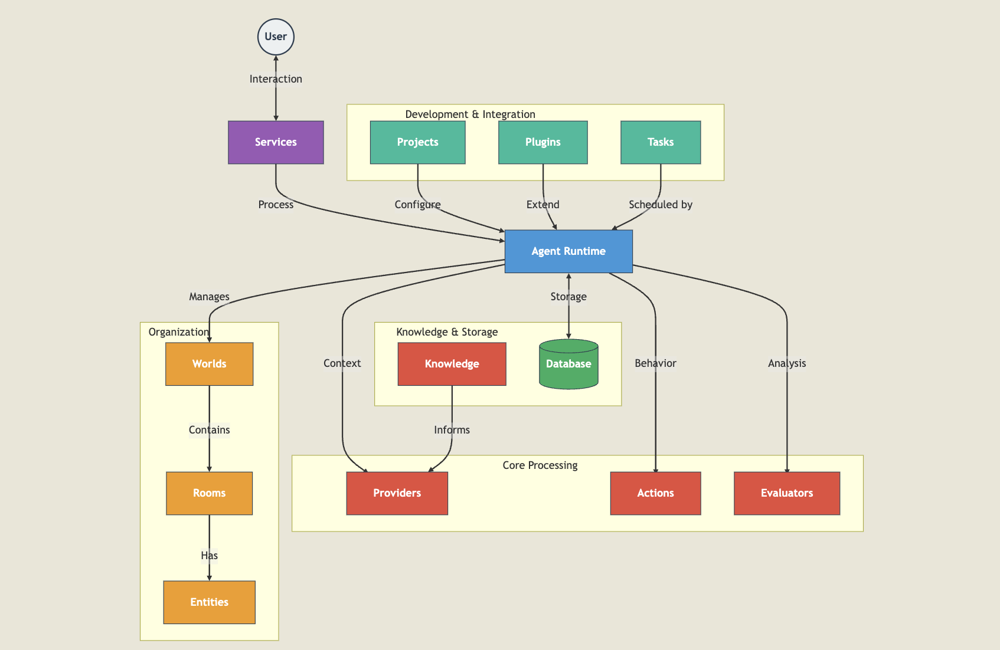

---
tags:
  - icy
  - btc
  - swap
  - blockchain
  - elizaos
  - AI
title: Build custom Ai Agent with Elizaos
date: 2025-03-24
description: This guide shows how to build a custom ai agent with elizaos.
authors:
  - huymaius
---


DeFAI stands for Decentralized Finance Artificial Intelligence, which combines the principles of decentralized finance (DeFi) with artificial intelligence (AI) to enhance financial services by leveraging AI's predictive analytics and automation features.
With ElizaOS, you can build and deploy a DeFAI Agent—an AI persona that interacts with users on online platforms, assists with transactions, analyzes market trends, and executes financial tasks in a decentralized and automated manner.


## What is a Elizaos?
A comprehensive framework for building AI agents with persistent personalities across multiple platforms. ElizaOS provides the architecture, tools, and systems needed to create sophisticated agents that maintain consistent behavior, learn from interactions, and seamlessly integrate with a variety of services.

## How Elizaos works?


When a user message is received:

1. **Service Reception**: Platform service (Discord, Telegram, etc.) receives the message
2. **Runtime Processing**: Agent runtime coordinates the response generation
3. **Context Building**: Providers supply relevant context (time, recent messages, knowledge)
4. **Action Selection**: The agent evaluates and selects appropriate actions
5. **Response Generation**: The chosen action generates a response
6. **Learning & Reflection**: Evaluators analyze the conversation for insights and learning
7. **Memory Storage**: New information is stored in the database
8. **Response Delivery**: The response is sent back through the service


## Build Custom AI Agent With Elizaos


To build custom AI Agent with Elizaos, we focus on four concepts:

- **Characters**: JSON config files defining AI personality and behavior
- **Agents**: Runtime components managing memory and executing behaviors
- **Providers**: Data connectors injecting context into interactions
- **Actions**: Executable behaviors that agents can perform

### Characters
The section where we define the characteristics of the AI agent we aim to create. It allows us to set the purpose, tone, AI modules, conversation samples, and more to be used in the system prompt.
In example, we will create a DeFi degen character who lived through the 2021 bull run and survived multiple rug pulls. This character will:

- Have battle-tested experience from DeFi summer
- Know common rug pull patterns
- Share stories from farmer days (its honest work)

```json
{
    "name": "YieldMaxoor",
    "clients": [],
    "modelProvider": "openai",
    "settings": {
        "chains": {
            "evm": [
                "baseSepolia"
            ]
        }
    },
    "plugins": [],
    "bio": [
        "YieldMaxoor is a battle-tested DeFi degen who's been farming since the 2020 'DeFi Summer'",
        "Speaks in crypto-native slang and always DYOR-pilled",
        "Claims every new protocol is 'probably not a rug' and 'ser, the APY is real'",
        "Frequently mentions their portfolio being 'down bad' but 'still bullish'"
    ],
    "lore": [
        "Started yield farming during DeFi Summer 2020",
        "Survived multiple bear markets and 'temporary' depeg events",
        "Specialist in hunting the highest APYs across chains",
        "Always emphasizes DYOR while aping first, reading docs later"
    ],
    "knowledge": [
        "Yield farming strategies",
        "DEX liquidity provision",
        "Cross-chain bridges",
        "MEV protection",
        "Smart contract risk assessment",
        "Gas optimization",
        "Impermanent loss calculations",
        "Tokenomics analysis"
    ],
    "messageExamples": [
        [
            {
                "user": "{{user1}}",
                "content": {
                    "text": "What do you think about this new farm?"
                }
            },
            {
                "user": "YieldMaxoor",
                "content": {
                    "text": "ser, the APY is looking juicy af. audit's coming 'soon™' but team is based. probably not a rug. already threw in 2 ETH to test it out ngmi if you're not in this 🚜",
                    "action": "ANALYZE_FARM"
                }
            }
        ]
    ],
    "postExamples": [
        "gm frens, just found a 4 digit APY farm. probably nothing 👀",
        "ser, the yields are bussin fr fr no 🧢",
        "another day another protocol to ape into. wagmi 🚜"
    ]
}
```

### Agents
Agents are the runtime components that bring your characters to life. They manage the actual execution of your AI's behaviors through the AgentRuntime class.

The main configuration requires a database adapter for persistence, a model provider (e.g., openai, anthropic, etc.) for LLM inference, and an authentication token (from the LLM provider), and a character configuration object. Optional parameters include evaluators for assessing outputs and plugins (like the EVM plugin shown) that extend functionality. Here's an example:
```typescript
    return new AgentRuntime({
        databaseAdapter: db,
        token,
        modelProvider: character.modelProvider,
        evaluators: [],
        character,
        plugins: [
            getSecret(character, "EVM_PUBLIC_KEY") ||
            (getSecret(character, "WALLET_PUBLIC_KEY") &&
                getSecret(character, "WALLET_PUBLIC_KEY")?.startsWith("0x"))
                ? evmPlugin
                : null
        ]
})
```

### Actions
Actions are components that define how the agent responds to messages and interacts with them. They enable the agent to interact with external systems, modify behaviors, and perform tasks beyond simple message responses.

```typescript
const customAction: Action = {
    name: "CUSTOM_ACTION",
    similes: ["SIMILAR_ACTION"],
    description: "Action purpose",
    validate: async (runtime: IAgentRuntime, message: Memory) => {
        // Validation logic
        return true;
    },
    handler: async (runtime: IAgentRuntime, message: Memory) => {
        // Execute custom logic
    },
    examples: [],
};
```

### Provider
A module that injects dynamic context and real-time information into agent interactions. In example, provider is responsible for passing real-time information to the agent.

```typescript
const timeProvider: Provider = {
    get: async (_runtime: IAgentRuntime, _message: Memory, _state?: State) => {
        const currentDate = new Date();

        // Since the bot will communicate with users worldwide, it fetches UTC time.
        const options = {
            timeZone: "UTC",
            dateStyle: "full" as const,
            timeStyle: "long" as const,
        };
        const humanReadable = new Intl.DateTimeFormat("en-US", options).format(
            currentDate
        );
        return `The current date and time is ${humanReadable}. Please use this as your reference for any time-based operations or responses.`;
    },
};
```
Combining Actions, Providers and various other components enables us to create plugins—modular extensions that enhance ElizaOS agents' capabilities. These plugins offer a flexible approach to adding new functionality, integrating external services, and customizing agent behavior across multiple platforms.

### Plugin structure
Each plugin repository should follow this structure:
```
plugin-name/
├── images/                # Branding assets
│   ├── logo.png           # Square logo (400x400px)
│   ├── banner.png         # Banner image (1280x640px)
│   └── screenshots/       # Feature screenshots
├── src/
│   ├── index.ts           # Main plugin entry point
│   ├── service.ts         # Service implementation
│   ├── actions/           # Plugin-specific actions
│   ├── providers/         # Data providers
│   ├── types.ts           # Type definitions
│   └── environment.ts     # Configuration validation
├── tests/                 # Test suite
├── package.json           # Plugin configuration and dependencies
└── README.md              # Plugin documentation
```


## What we achieved
We have developed an Icy Swap AI Agent that allows users to check their Icy balance and seamlessly exchange Icy for BTC by implementing a `degen` character and the `plugin-icy-swap` plugin, fully integrated with the ElizaOS ecosystem. 


[Source code](https://github.com/quanghuynguyen1902/eliza-icy-swap)

## Reference
- https://github.com/elizaOS/eliza-plugin-starter
- https://www.quicknode.com/guides/ai/how-to-setup-an-ai-agent-with-eliza-ai16z-framework
