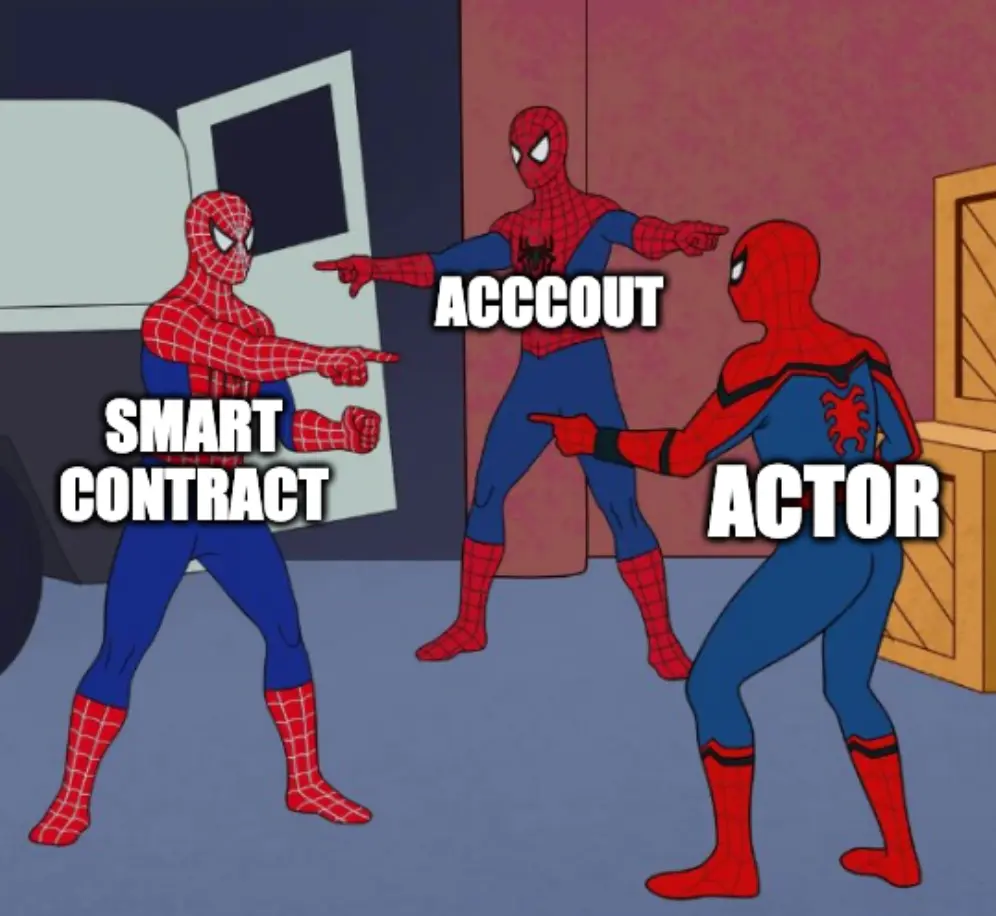
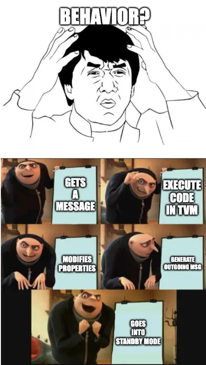
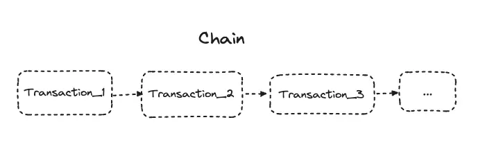
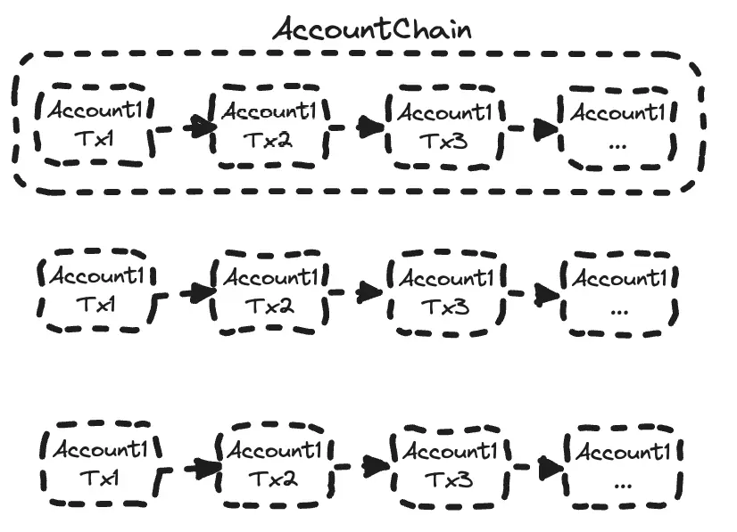
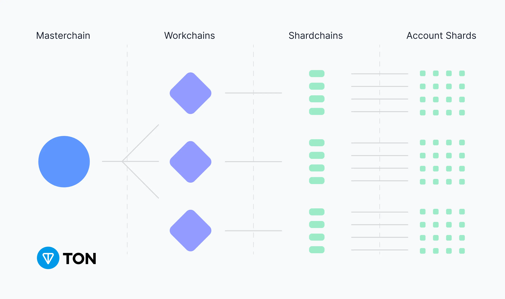
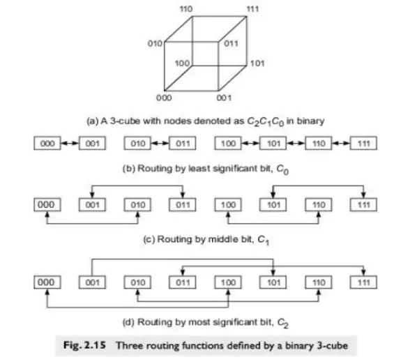

---
tags:
  - web3
  - blockchain
  - ton
title: 'Ton: Blockchain of blockchains'
date: 2024-07-11
description: 'Talk about TON and its core technologies. Why do we call TON the "Blockchain of blockchains"?'
authors:
  - bievh
---

TON (The Open Network) is a blockchain platform originally developed by the team behind Telegram Messenger. By taking advantage of unique sharding technology, Multi-blockchain architecture and Instant Hypercube Routing protocol, TON aims to enable fast transactions and smart contracts with a high level of scalability and security.

To understand what actually happen under these shiny names of technologies, this post will dissect one by one in the simplest way.

## Actor model, Everything is a Smart Contract

Firstly, TON is a concurrency model that facilitates the efficient execution of smart contracts and other decentralized applications by organizing computational entities (actors) that interact through message passing. So technically, every actor in TON is represented as a smart contract including our wallet which can be considered as a simple actor.

Each actor has its own storage and behavior. We can imagine that storage is the location where we will store the state of the actor or some other data. So we can temporarily avoid it here, and go to the detail in another post where we will prepare for writing our first smart contract on TON. The main point that I want to bring to you in this post is "What does the actor do?"

## Actor behavior

Take a look at the following image. It is actually the sequence of jobs that an actor actually does.

1. Event Trigger: An actor is typically activated upon receiving a message.
2. Event Handling: The actor routes the event to the appropriate handler in its `contract code`, utilizing its properties to process the event in the TVM (TON Virtual Machine).
3. State Modification: During event execution, the actor can modify its own properties such as its `contract code` or `data`.
4. Message Generation: Optionally, the actor can generate outgoing messages.
5. Standby Mode: After processing the event, the actor returns to standby mode to wait for the next event.

Finally, when we combine all the above steps together, it will result in a transaction.

## Chain and shard

We basically have a transaction after the behavior of any actor is done. Then when there is more than one transaction in a sequence, it may be called a **chain**. In case it is a chain of transactions that is owned by a single account, it is called `AccountChain`.

Then a group of account chains will be stored in the same location called shard called **AccountShard**. In the same way build an **AccountChain**, **ShardChain** which is a chain of **AccountShard**, and **BlockChain** which is the chain of all shards.

In TON, we can consider that have 2 types of **BlockChain**

- Workchain: Blockchain with your own rules - This is the Blockchain that will run normal transactions such as swaps, transfers, etc.
- Masterchain: Blockchain of Blockchains - This is the Blockchain that manages other Workchains for the synchronization of message routing and transaction execution. Under the hood, it is also considered as a Workchain.

Currently, TON has 2 chains, Masterchain and Basechain.

## Splitting and Merging, What makes TON more scalable?

Because a **ShardChain** is composed of distinct **AccountChains**, it can be easily divided.

For instance, if a **ShardChain** manages events for one million accounts but encounters a transaction volume too high for a single node to handle, we can split this chain.

By dividing it into two smaller **ShardChains**, each responsible for half a million accounts, we ensure each new chain is processed by a different subset of nodes.

Similarly, if certain shards become underutilized, they can be combined into a larger shard.​⬤

> Side note from TON document: To make splitting and merging deterministic, an aggregation of AccountChains into shards is based on the bit-representation of account addresses. For example, address looks like (shard prefix, address). That way, all accounts in the shardchain will have exactly the same binary prefix (for instance all addresses will start with 0b00101).

#### Instant Hypercube Routing

In the infinite sharding approach, every account aka smart contract is treated as if it were itself in a separate **ShardChain**. Accounts interact only by sending messages to one another, adhering to the actor model where each account operates as an independent actor.

So TON needs an efficient way to deliver and process messages between **ShardChain**. It is Instant Hypercube Routing with the following characteristics

- Hypercube Structure: Network as a hypercube with shards as vertices and communication paths as edges.
- Multi-Dimensional Routing: Shards are addressed by binary strings; routing involves flipping bits in the address.
- Scalability: Efficiently scales with more shards; each shard knows a logarithmic number of neighbors.
- Instant Routing: Rapid message propagation through direct communication paths.
- Fault Tolerance: Multiple alternative paths ensure robustness despite shard or path failures.

If it is hard to imagine, in some aspects, you can take a look at **E-Cube Routing** to get the idea.

## Conclusion

In summary, TON stands out as a “blockchain of blockchains” due to its advanced architecture and design principles. Its use of unique technologies like sharding, the Actor model, and Instant Hypercube Routing allows it to achieve high scalability, fast transactions, and robust security. By seamlessly integrating multiple blockchains into a unified network, TON not only enhances interoperability but also paves the way for a more connected and efficient decentralized ecosystem. Whether you’re a developer or a blockchain enthusiast, understanding the inner workings of TON offers valuable insights into the future of blockchain technology.
