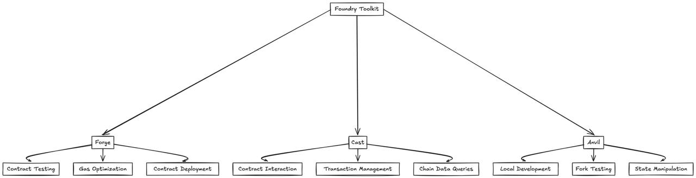

---
tags:
  - evm
  - web3
  - foundry
  - blockchain
title: Web3 Development with Foundry
date: 2025-03-19
description: Provides a comprehensive guide to Web3 development using Foundry, a modern, Rust-based toolkit for Ethereum smart contract development.
authors:
  - haongo1
toc: false
notice:
event_date:
---

## Overview of Foundry
Foundry is a blazingly fast, portable, and modular toolkit for Ethereum application development written in Rust. It consists of three main components:

- **Forge**: Testing framework for Ethereum smart contracts
- **Cast**: Swiss army knife for interacting with EVM smart contracts
- **Anvil**: Local Ethereum node designed for development



## Why Not Just Hardhat/Truffle?
While Hardhat and Truffle are established tools, Foundry offers several compelling advantages:

1. **Performance**: Written in Rust, Foundry executes tests up to 20x faster than JavaScript-based alternatives
2. **Native Solidity Testing**: Write tests in Solidity instead of JavaScript, reducing context switching
3. **Debugging Capabilities**: Superior debugging tools with detailed stack traces and gas reports
4. **Fuzz Testing**: Built-in fuzzing capabilities for robust contract testing


## Core Benefits of Foundry

1. **Development Speed**
   - Fast compilation and testing
   - Native Solidity testing environment
   - Quick feedback loop for development

2. **Modern Developer Experience**
   - Built-in fuzzing
   - Powerful debugging tools
   - Gas optimization features

3. **Flexibility**
   - Works with existing tools
   - Supports multiple EVM chains
   - Easy integration with CI/CD pipelines

## Dealing with Dependencies and Remapping

Foundry offers multiple approaches to manage dependencies. Here's a comprehensive comparison:

### 1. Git Submodules (Traditional Approach)
```bash
# Initialize submodules
forge install OpenZeppelin/openzeppelin-contracts --no-commit

# Update submodules
git submodule update --init --recursive
```

**Pros:**
- Native Foundry support
- Version control integration
- Precise version pinning
- Recommended by Foundry documentation

**Cons:**
- Complex submodule management
- Steeper learning curve for Git submodules
- Can be cumbersome in CI/CD pipelines

### 2. Package Managers (Modern Approach)

#### Using Bun
```bash
# Initialize project
bun init

# Add dependencies
bun add -d @openzeppelin/contracts
```

**Pros:**
- Familiar npm-like workflow
- Simpler dependency management
- Better integration with JavaScript tooling
- Faster installation speeds

**Cons:**
- Requires additional setup
- Not officially supported by Foundry

### Remapping Configuration

Regardless of the approach chosen, you'll need to configure remappings. Create a `remappings.txt` file:

```text:remappings.txt
# For package manager approach
@openzeppelin/=node_modules/@openzeppelin/
...
...
```


## Deploying and Testing a Smart Contract

### Contract Implementation

First, let's create an upgradeable ERC-1155 contract:

```solidity:src/GameItems.sol
// SPDX-License-Identifier: MIT
pragma solidity ^0.8.13;

import "@openzeppelin/contracts-upgradeable/token/ERC1155/ERC1155Upgradeable.sol";
import "@openzeppelin/contracts-upgradeable/access/OwnableUpgradeable.sol";
import "@openzeppelin/contracts-upgradeable/proxy/utils/Initializable.sol";
import "@openzeppelin/contracts-upgradeable/proxy/utils/UUPSUpgradeable.sol";

contract GameItems is Initializable, ERC1155Upgradeable, OwnableUpgradeable, UUPSUpgradeable {
    // Item IDs
    uint256 public constant GOLD = 0;
    uint256 public constant SILVER = 1;
    uint256 public constant SWORD = 2;
    uint256 public constant SHIELD = 3;

    /// @custom:oz-upgrades-unsafe-allow constructor
    constructor() {
        _disableInitializers();
    }

    function initialize() public initializer {
        __ERC1155_init("https://game.example/api/item/{id}.json");
        __Ownable_init();
        __UUPSUpgradeable_init();

        // Mint initial items
        _mint(msg.sender, GOLD, 10**18, "");
        _mint(msg.sender, SILVER, 10**27, "");
        _mint(msg.sender, SWORD, 1000, "");
        _mint(msg.sender, SHIELD, 1000, "");
    }

    function mint(address account, uint256 id, uint256 amount) 
        public 
        onlyOwner 
    {
        _mint(account, id, amount, "");
    }

    function _authorizeUpgrade(address newImplementation)
        internal
        onlyOwner
        override
    {}
}
```

### Testing Implementation

Create comprehensive tests for the contract:

```solidity:test/GameItems.t.sol
// SPDX-License-Identifier: UNLICENSED
pragma solidity ^0.8.13;

import "forge-std/Test.sol";
import "../src/GameItems.sol";
import "@openzeppelin/contracts/proxy/ERC1967/ERC1967Proxy.sol";

contract GameItemsTest is Test {
    GameItems public implementation;
    GameItems public gameItems;
    address public owner;
    address public user1;

    function setUp() public {
        owner = address(this);
        user1 = address(0x1);
        
        // Deploy implementation
        implementation = new GameItems();
        
        // Deploy proxy
        bytes memory initData = abi.encodeWithSelector(
            GameItems.initialize.selector
        );
        ERC1967Proxy proxy = new ERC1967Proxy(
            address(implementation),
            initData
        );
        gameItems = GameItems(address(proxy));
    }

    function testInitialBalance() public {
        assertEq(gameItems.balanceOf(owner, gameItems.GOLD()), 10**18);
        assertEq(gameItems.balanceOf(owner, gameItems.SILVER()), 10**27);
        assertEq(gameItems.balanceOf(owner, gameItems.SWORD()), 1000);
        assertEq(gameItems.balanceOf(owner, gameItems.SHIELD()), 1000);
    }

    function testMinting() public {
        gameItems.mint(user1, gameItems.GOLD(), 100);
        assertEq(gameItems.balanceOf(user1, gameItems.GOLD()), 100);
    }

    function testFailMintingUnauthorized() public {
        vm.prank(user1);
        vm.expectRevert("Ownable: caller is not the owner");
        gameItems.mint(user1, gameItems.GOLD(), 100);
    }

    function testBatchTransfer() public {
        uint256[] memory ids = new uint256[](2);
        ids[0] = gameItems.GOLD();
        ids[1] = gameItems.SILVER();
        
        uint256[] memory amounts = new uint256[](2);
        amounts[0] = 100;
        amounts[1] = 200;

        gameItems.safeBatchTransferFrom(
            owner,
            user1,
            ids,
            amounts,
            ""
        );

        assertEq(gameItems.balanceOf(user1, gameItems.GOLD()), 100);
        assertEq(gameItems.balanceOf(user1, gameItems.SILVER()), 200);
    }
}
```

### Deployment Script

Create a deployment script that handles both the implementation and proxy deployment:

```solidity:script/GameItems.s.sol
// SPDX-License-Identifier: UNLICENSED
pragma solidity ^0.8.13;

import "forge-std/Script.sol";
import "../src/GameItems.sol";
import "@openzeppelin/contracts/proxy/ERC1967/ERC1967Proxy.sol";

contract GameItemsScript is Script {
    function run() public {
        uint256 deployerPrivateKey = vm.envUint("PRIVATE_KEY");
        
        vm.startBroadcast(deployerPrivateKey);

        // Deploy implementation
        GameItems implementation = new GameItems();
        
        // Prepare initialization data
        bytes memory initData = abi.encodeWithSelector(
            GameItems.initialize.selector
        );

        // Deploy proxy
        ERC1967Proxy proxy = new ERC1967Proxy(
            address(implementation),
            initData
        );

        // Log addresses
        console.log("Implementation deployed to:", address(implementation));
        console.log("Proxy deployed to:", address(proxy));

        vm.stopBroadcast();
    }
}
```

### Deployment Commands

```bash
# Deploy to local network
forge script script/GameItems.s.sol --fork-url http://localhost:8545 --broadcast

# Deploy to testnet (e.g., Sepolia)
forge script script/GameItems.s.sol \
    --rpc-url $SEPOLIA_RPC_URL \
    --broadcast \
    --verify \
    -vvvv
```

This implementation showcases:
- Upgradeable ERC-1155 contract using UUPS pattern
- Comprehensive test suite covering initialization, minting, and transfers
- Deployment script handling both implementation and proxy contracts
- Usage of OpenZeppelin's upgradeable contracts
- Proper access control with `onlyOwner` modifier


## Limitations

1. **Learning Curve**
   - New tooling ecosystem to learn
   - Rust-based architecture might be unfamiliar
   - Different testing paradigm from JavaScript

2. **Ecosystem Maturity**
   - Younger ecosystem compared to Hardhat
   - Fewer plugins and integrations
   - Still evolving best practices

3. **Documentation Gaps**
   - Some advanced features lack detailed documentation
   - Community resources still growing

## Conclusion

Foundry represents a significant advancement in Ethereum development tooling, offering superior performance and developer experience. While it has some limitations and a learning curve, the benefits of faster testing, native Solidity testing, and powerful debugging capabilities make it an excellent choice for modern smart contract development.

Key takeaways:
- Exceptional performance for testing and deployment
- Native Solidity testing reduces context switching
- Modern features like fuzzing and detailed gas reports
- Growing ecosystem with strong community support
- Successfully integrates with modern package managers like Bun

For teams willing to invest in learning the tooling, Foundry provides a robust foundation for professional Ethereum development.