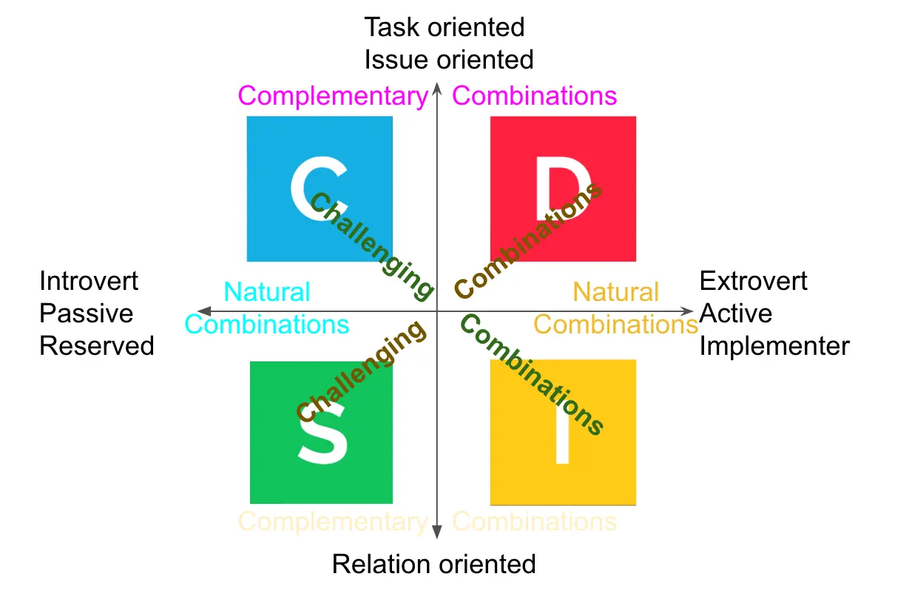

## What is DiSC?
DiSC is an acronym that stands for the four main personality profiles described in the DiSC model: (D)ominance, (i)nfluence, (S)teadiness and (C)onscientiousness.

## About each personality type
### D = Dominance (RED)
#### Red Indicators
> A person primarily in this DiSC quadrant places emphasis on accomplishing results and “seeing the big picture.” They are confident, sometimes blunt, outspoken, and demanding.

_Keywords: Keep distance from others, have powerful handshakes, lean forward aggressively, use direct eye contact, use controlling gestures, strong voice, quick_

#### How to work with Red
- Hurry up
- Speed up
- Speak and act more quickly
- Cut the small talk - clear and straightforward
- Stick to the topic!
- Deliver your opinion firmly
- Show that you work hard
- Be willing to take initiative

### i = influence (YELLOW)
#### Yellow Indicators
> A person in this DiSC quadrant places emphasis on influencing or persuading others. They tend to be enthusiastic, optimistic, open, trusting, and energetic.

_Keywords: Are tactile, are relaxed and jocular, show friendly eye contact, use expressive gestures, often come close, laughter, fun, intensity, energy, tempo_

#### How to work with Yellow
- Smile a lot, have fun, laugh
- Focus on the big questions, not details
- Showing that you follow your gut
- Allow Yellow to devote himself to latest thing
- Become approachable
- Prepare a plan of actions
- Tell him how important it is
- Create a structure for yellow
- Push him, but push gently
- Clarity

### S = Steadiness (GREEN)
#### Green indicator
> A person in this DiSC quadrant places emphasis on cooperation, sincerity, loyalty, and dependability. They tend to have calm, deliberate dispositions and don’t like to be rushed.

_Keywords: Are relaxed and come close, act methodically, tend to lead backward, use very friendly eye contact, prefer small-scale gestures, soft, warmth, slower pace, care about how people feel_

#### How to work with Green
- Allow Green his periods of peace, quiet, inactivity
- Explain, introduce, guide, be specific
- Be Careful when comment about Green behavior
- Be patience, take command

### C = Conscientiousness (BLUE)
#### Blue indicator
> A person in this DiSC quadrant places emphasis on quality and accuracy, expertise and competency. They enjoy their independence, demand the details, and often fear being wrong.

_Keywords: Prefer to keep others at a distance, either stand or sit, often have closed body language, use direct eye contact, speak without gestures, restrained, subdued, controlled impression, slow_

#### How to work with Blue
- Make sure you’ve well prepared
- Acknowledge that you don’t know
- Stick to the task, do one thing at a time
- Don’t ask personal things
- No day dreams or visions, stick to the fact
- Avoid dramatic body language
- Facts are the only things that matter
- Let Blue understand that you are doing quality work
- Double check/ triple check
- Be details, but tell Blue to be in a faster pace

## All colors as a team
### Complementary Combinations
#### Complementary Combination
- Blue and Red work together really well as they are tasks and issues-oriented, they don’t care (that) much about relations or scare that they will make other upset, it’s the results that count.
- Yellow and Green cares about how other feels and work more toward relationships

#### Natural Combinations
- Both Blue and Green are usually introverted and quite reserved, they will move slow and don’t want to change much, while
- Red and Yellow are both naturally extroverts and pretty active

#### Challenging Combinations
- Because of the steadiness and passive of Green, Red will find that working with Green will be pretty hard as they don’t see Green actively working toward their direction
- Blue will finds that Yellow is too day dreaming, not base on logic and facts.

But after all, as a team:

## Original source
https://www.notion.so/huytieu/DiSC-Personality-Types-in-team-work-ee16782a9c2f4d5abf313a268af5acef

## Reference
- [https://www.discprofile.com/what-is-disc/disc-styles](https://www.discprofile.com/what-is-disc/disc-styles)
- [https://www.amazon.com/Surrounded-by-Idiots-audiobook/dp/B07VCV4QMH/ref=sr_1_1?keywords=surrounded+by+idiots&qid=1662797546&sprefix=surrounded+b%2Caps%2C312&sr=8-1](https://www.amazon.com/Surrounded-by-Idiots-audiobook/dp/B07VCV4QMH/ref=sr_1_1?keywords=surrounded+by+idiots&qid=1662797546&sprefix=surrounded+b%2Caps%2C312&sr=8-1)
