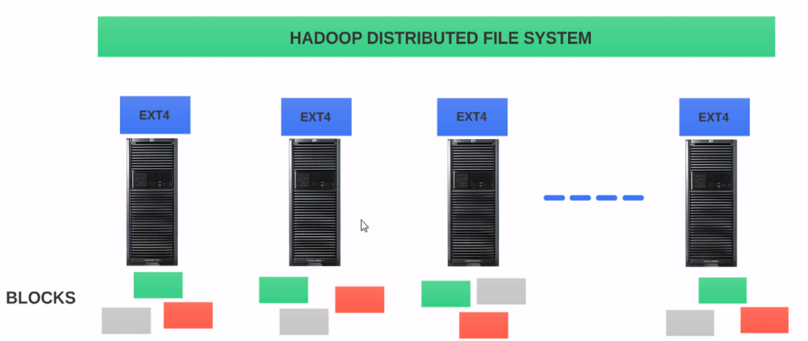

# Hadoop Distributed File System (HDFS)

## HDFS - Why Another FileSystem?

HDFS (Hadoop Distributed File System) takes care of all the storage related complexities in Hadoop. 
Why is there a need for another file system like HDFS? 

### File System

File system is an integral part of every operating system, it basically governs the storage in your hard disk.
For example, you give a person a book and you give another person pile of unordered papers from the same book, then ask each of them to go to chapter 34. Who do you think will get to chapter 34 faster? The one with the book because he can simply go to the index, look for chapter 34 look up the page number and go to the page. 
Whereas the one with the pile of papers has to go through the pile of papers and if he is lucky he might find chapter 34.
Just like a well organized book, a file system helps to navigate the data that is stored in your storage. 
Without the file system, the information stored in your hard disk will be one large body of data, but no way to tell where one piece of information stops and the next begins.

There are some of the major functions of a file system. 
File system controls how the data is stored and retrieved.
Basically, when you read and write files to your hard disk your request goes through a file system.
Next, file system has the metadata about your files and folders.
Metadata information like file name, size, owner, created/modified time, etc.
File system also takes care of permissions and security.
File system manages your storage space, so when you ask to write a file to hard disk file system helps figure out where in the hard disk it should write the file.
And it should write the file as efficient as possible. 

### Different File Systems

The most legendary file system from Microsoft is FAT32. Maximum file size that a Fat32 file system can support is 4GB.
If we have a file which is 5GB in size, we're out of luck with FAT32 and it has a 32GB volume limit or a logical drive limit.
Thefore, our drive can be of size 32GB and not more with FAT32. The size limits can be more or less based on the file system configuration. So, if we use windows 95 or 98, we probably use FAT32.

Next generation file system from Windows after FAT32 is NTFS (New Technology File System) and it supports 16 Exabyte file and volume limit of 16 Exabyte, that is a very huge number, which is 1024 Petabytes. Therefore, NTFS can clearly support huge volume of data.
Starting Windows Server 2012, Windows introduced ReFS (Resilient File System).

How about file systems from MAC? HFS (Hierarchical File System) is a legacy file system from Mac Apple started using HFS+ from MAC OS 8.1 and above.
For example, if we used iPod, we would have used HFS+. HFS+ can also handle huge volume of data up to 8 Exabytes in size.

Now, that is about Linux, ext is the most popular file system in Linux.
ext3 is the third generation file system in use since 2001, then came ext4.
ext4 can support individual file sizes up to 16 Terabytes and volumes up to 1 Exabyte.
Next,  XFS is created by Silicon Graphics and it can support up to 8 exabyte in file and volume limit.
We look up your file system in Linux with command `df -T`.

Clearly, we have file systems where we can store big data sets.
Then, what is the need for HDFS?
From section Understanding Big Data Problem of [Apache Hadoop and Big Data article](Apache%20Hadoop%20and%20Big%20Data.md), we know that to support truly parallel computation, we had to divide the data set into blocks and store them in different nodes
And to recover from data loss, we also replicated each block in more than one node.

Assume that we have a 10 node cluster and we have ext4 as the file system on each node like the above image.
We will refer ext4 on each node as the local file system.
The first task of our proposed file system is when we upload a file to this proposed file system, we need the file system to divide the data set into fixed size, i.e. blocks.
Although every file system has a concept of blocks, the concept of blocks and HDFS is very different when compared to the blocks and traditional file systems. We will see the differences in other article :)).

Next, our file system should have a distributed view of the files or blocks in the cluster which is not possible with our local file system which is ext4. As shown in the above image, our local ext4 file system on Node 1 has no idea what is on Node 2.
Similarly, Node 2 has no idea of what is in Node 1.
Since the ext4 file systems in both Node 1 and Node 2 are local to each node, there is no way they can have a global or distributed view of the entire 10 node cluster.
That is why we say the ext4 on individual nodes as local file systems.
Next important thing is replication which adds a lot of complexity.
Since ext4 in Node 1 has no idea about storage in any other node, it does not have the ability to replicate blocks in Node 1 to the other nodes.
Therefore, we are exposed to data loss.

Now, assume we have a file system on top of ext4 but only this time it spreads across all the nodes.
We call that file system, Hadoop Distributed File System
Then, when you upload a file to HDFS it will automatically be split into 128MB-fixed size blocks. 
In the older versions of Hadoop, the file was divided into 64MB-fixed size blocks.
HDFS takes care of placing the blocks in different nodes and also take care of replicating each block into more than one node.
By default, hdfs replicates a block to three nodes.
If we copy a 700 MB dataset into HDFS, HDFS will divide the data set into 128MB blocks.
Thus, we will have 5 equal sized 128MB block and one 60MB block.

Since hdfs has a distributed view of the cluster, it can easily decide which nodes should hold these 6 blocks and also pick the nodes to hold the replicated blocks
HDFS will continue to creep track of all the blocks and their node assignments all the time.
So when a user asked about the 700 MB data set, it knows how to construct the file from the blocks.

HDFS, by no means, is a replacement for the local file system.
Our operating systems still rely on the local file system. 
In fact, the operating system does not care about the presence of HDFS.
One more interesting thing, HDFS should still go through ext4 to save the blocks in the storage. 
Hence, HDFS is placed on top of the local file system. 

The true power of HDFS is that it is spread across all the nodes in the cluster and it has a distributed view of the cluster.
And hence it knows how to construct the 700 MB data set in the example from the underlying blocks whereas the ext4 does not have a distributed view and only knows about the blocks in its storage that it is managing.

### Benefits of HDFS

- HDFS supports the concept of blocks: When you upload a file into HDFS, the file is divided into fixed size blocks to support distributed computation and that is the key for Hadoop. Also HDFS keeps track of all the blocks in the cluster
- Data failures or data corruption are inevitable in any big data environment, even in small environments. HDFS maintains data integrity and help recover from data loss by replicating the blocks in more than one node.
- HDFS supports scaling: if we like to expand our cluster by adding more nodes, it's very easy to do with HDFS.
- Cost effective: we don't need any specialized hardware to run or operate HDFS and this is very important because we are refering about potentially hundreds of nodes. HDFS was built ground up to work with commodity computers.

## Blocks

## Working with HDFS

## HDFS - Read & Write

## Preferences