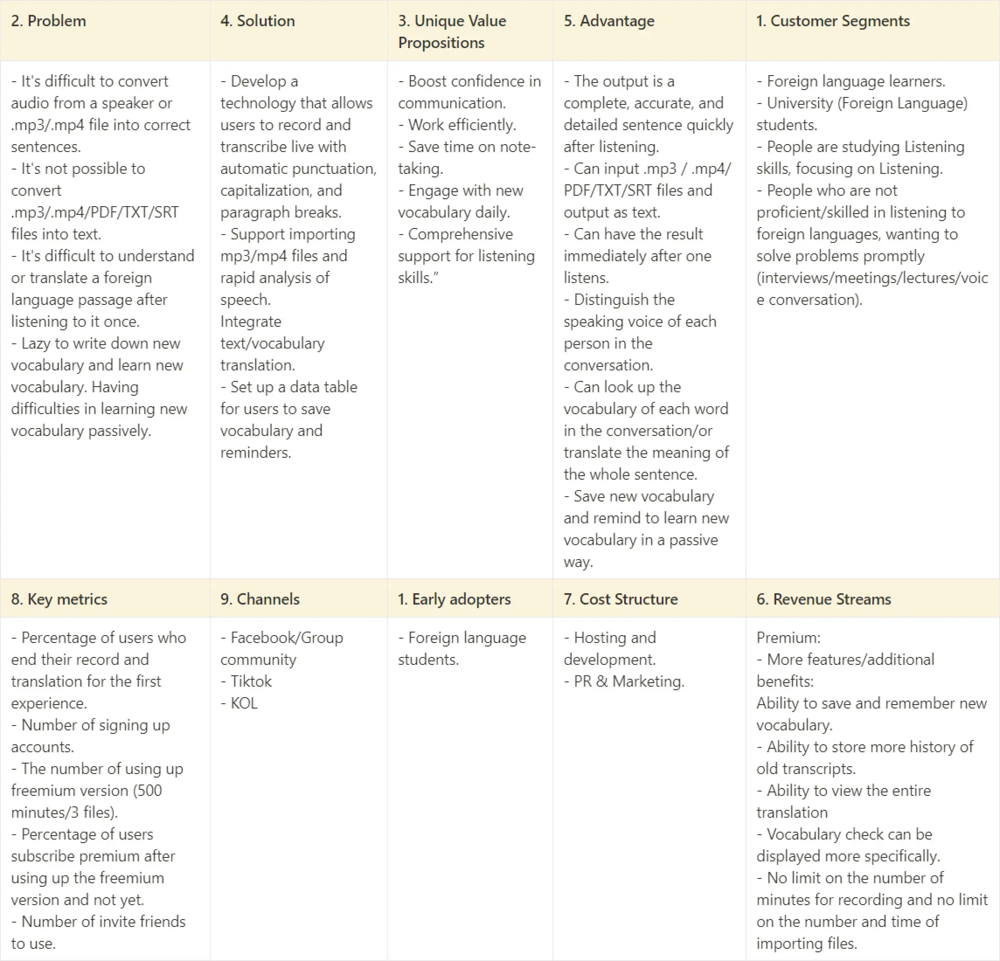
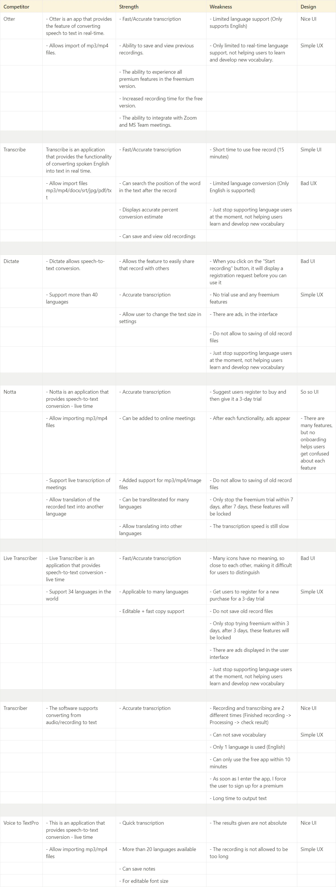
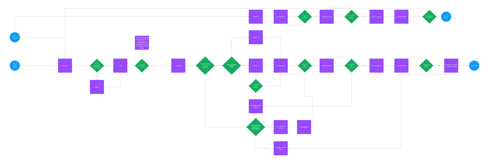

---
tags:
  - design
  - user-experience
  - ux
  - research
  - techniques
  - ux-research
author: Nam Bui
github_id: Maniub102
date: 2023-11-09
icy: 10
---

_User experience (UX) research is the foundation of any successful digital product or service. UX research helps companies understand their users, their needs, and their pain points. By using a variety of techniques, UX researchers can create products that are more user-friendly and more effective. In this article, we’ll explore eight key UX research methods that are essential for any UX researcher to know._

## Step 1. Lean Canvas
The first step in any UX research project is to create a Lean Canvas. A Lean Canvas is a one-page business plan that helps UX researchers identify their target audience, their value proposition, and their key metrics. By creating a Lean Canvas, UX researchers can focus on the most important aspects of their project and avoid getting bogged down in unnecessary details.

**Example**

## Step 2. Funnel
The next step in UX research is to create a funnel. A funnel is a visualization of the steps that users take as they interact with a digital product or service. By mapping out the funnel, UX researchers can identify points of friction and opportunities for improvement. This information can be used to optimize the user experience and increase conversion rates.

**Example**

## Step 3. Competitors
To create a product that stands out from the competition, UX researchers must first understand their competitors. By conducting competitor research, UX researchers can identify their competitors’ strengths and weaknesses. This information can be used to create a product that offers unique value to users.

**Example**

## Step 4. Personas
Personas are fictional representations of the target audience. By creating personas, UX researchers can better understand the needs and motivations of their users. This information can be used to create a product that meets the specific needs of the target audience.

**Example**

![[0208070e63b3a85c7cb1c81f167ed281_MD5.webp]]

## Step 5. User story
A user story is a narrative that describes how a user interacts with a product or service. By creating user stories, UX researchers can identify the most important features of a product and prioritize them accordingly. This information can be used to create a product that meets the needs of the target audience.

**Example**

## Step 6. User journey mapping
User journey mapping is a visualization of the steps that users take as they interact with a product or service. By mapping out the user journey, UX researchers can identify pain points and opportunities for improvement. This information can be used to create a product that offers a seamless user experience.

**Example**

## Step 7. Information Architecture
Information architecture is the organization and structure of digital content. By creating a clear and logical information architecture, UX researchers can make it easier for users to find what they are looking for. This information can be used to create a product that is more user-friendly and more effective.

**Example**

## Step 8. User flow
User flow is a visualization of the paths that users take as they interact with a digital product or service. By mapping out user flows, UX researchers can identify bottlenecks and opportunities for improvement. This information can be used to create a product that is more efficient and more effective.

_In conclusion, UX research is essential for creating digital products and services that meet the needs of users. By using a variety of techniques, UX researchers can gain a deep understanding of their users and create products that offer unique value. Whether you are a seasoned UX researcher or just starting out, these eight UX research methods are essential tools for success._
