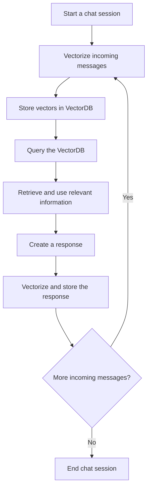

In the context of a chat application, one common challenge involves managing the growing volume of text in the context window of a Language Model. To overcome this, imagine utilizing a Vector Database to archive the conversation history, effectively transforming it into a form of "Long Term Memory". Such a setup can then query the database for the most pertinent details to feed into the model during an ongoing conversation. This approach significantly enhances the context window's length and imbues the application with increased robustness against abrupt topic shifts.

Basically, storing long-term memory in ChatGPT using VectorDB for a chat application would generally involve the following steps:

1.  **Begin a chat session**: When a user starts a conversation with the chatbot, create a new, unique session ID to track the chat session. All dialogues within this session will be linked to this ID.

2.  **Vectorize the incoming messages**: As the user and the chatbot exchange messages, use an embeddings model (like GTP or BERT) to convert each incoming and outgoing message into a vectorized embedding. The model you choose will depend on your specific needs, but it should be capable of effectively capturing the semantic content of the text.

3.  **Store vectors in VectorDB**: Each time a message is vectorized, store the vector representation, the original text of the message, the session ID, and any other relevant metadata (like the timestamp or the sender of the message) in a vector database (VectorDB). This database will serve as the chatbot's long-term memory.

4.  **Query the VectorDB**: Whenever the chatbot needs to respond to a user's message, query the VectorDB for the most relevant previous messages. This query will be based on the vector representation of the incoming message, and it will use cosine similarity or another relevant measure to find the vectors – and therefore the messages – that are most similar to the new message.

5.  **Retrieve and use relevant information**: Once the relevant messages are retrieved from the VectorDB, use this information to help generate a response. The specific manner in which this is done can depend on your requirements – you could feed the relevant messages into your language model as part of the context, use them to influence the decision-making process of the chatbot, or anything else that suits your needs.

6.  **Create a response**: Generate a response to the user's message using the chatbot's language model, incorporating the retrieved relevant information from the VectorDB as necessary.

7.  **Vectorize and store the response**: Once the response has been created, vectorize it and store it in the VectorDB, just like you did with the incoming messages. This ensures that the chatbot's responses are also part of its long-term memory and can be referred back to in future conversations.

8.  **Repeat the process**: Repeat steps 2-7 for each incoming message until the chat session is ended. As more and more conversations are stored in the VectorDB, the chatbot will be able to draw from a larger and larger pool of past dialogues when generating responses.

Remember, this is a general overview of the process and the exact details might differ based on the specific requirements of your application and the specifics of your chatbot's design.

---
<!-- cta -->
### Contributing

At Dwarves, we encourage our people to read, write, share what we learn with others, and [[CONTRIBUTING|contributing to the Brainery]] is an important part of our learning culture. For visitors, you are welcome to read them, contribute to them, and suggest additions. We maintain a monthly pool of $1500 to reward contributors who support our journey of lifelong growth in knowledge and network.

### Love what we are doing?

- Check out our [products](https://superbits.co)
- Hire us to [build your software](https://d.foundation)
- Join us, [we are also hiring](https://github.com/dwarvesf/WeAreHiring)
- Visit our [Discord Learning Site](https://discord.gg/dzNBpNTVEZ)
- Visit our [GitHub](https://github.com/dwarvesf)