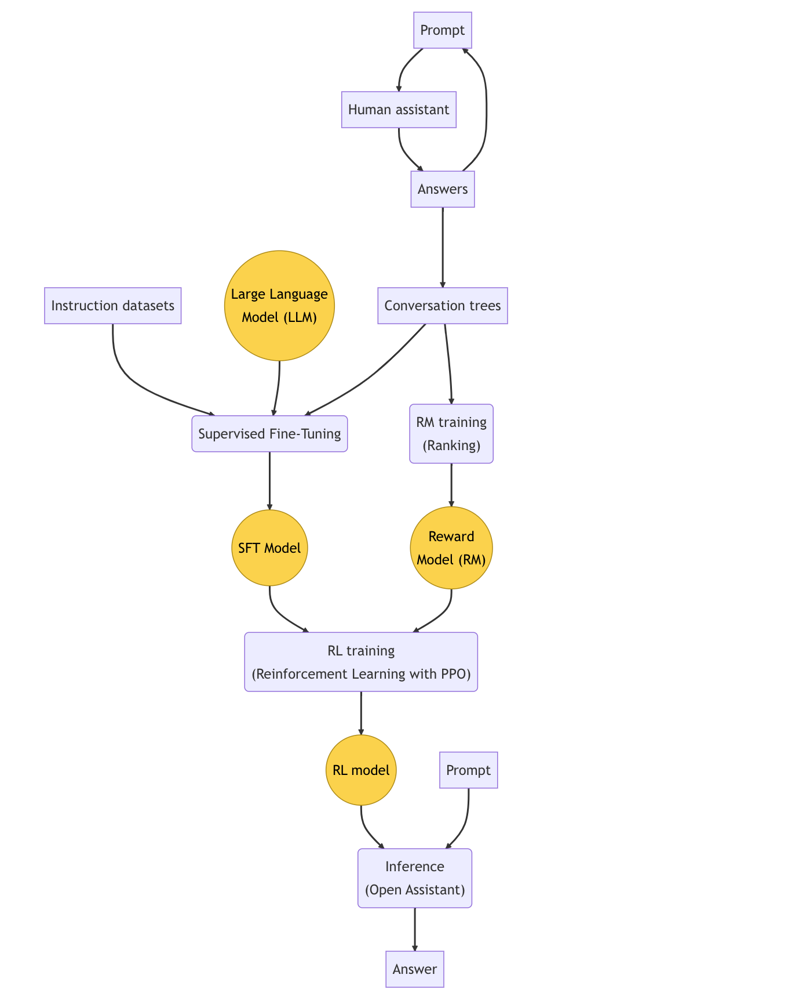

<iframe width="560" height="315" src="https://www.youtube.com/embed/9wNsV3TTo-I" title="YouTube video player" frameborder="0" allow="accelerometer; autoplay; clipboard-write; encrypted-media; gyroscope; picture-in-picture; web-share" allowfullscreen></iframe>

## What is Open Assistant?
Open Assistant (abbreviated as OA) is a chat-based and open-source assistant. The vision of the project is to make a large language model that can run on a single high-end consumer GPU. With some modifications, Open Assistant should also be able to interface with other third-party applications easily as well as retrieve information from databases and the Internet.

## How does OA work?
Consists in three steps:
1. Collect demonstration data and train a supervised policy: This step involves gathering examples of conversations between an assistant and a human that give instructions. These examples are used to train an existing LLM through supervised learning, known as Supervised Fine-Tuning (SFT). The resulting model is called the SFT model.
2. Collect comparison data and train a reward model: Conversations are sampled from the previous step, and a human ranks the different assistant answers for each prompt. This data is used to train a reward model (RM) that favors good answers. This step is called "RM training".
3. Optimize a policy against the reward model using reinforcement learning: A proximal policy optimization (PPO) algorithm is used to generate a new model from the fine-tuned model. The reward model obtained in the previous step is used to optimize the PPO, resulting in an RL model that is better at following instructions. This step is called "RL training"

### Open Assistant RLHF flow


## Recommended cloud provider:
One of the cloud providers we used to implement our RLHF flow is Redmond. Redmond.ai is a cloud computing service provider that specializes in offering accelerated cloud computing solutions for artificial intelligence (AI) and machine learning (ML) applications.
- https://redmond.ai/

## System requirements:
For our example, we use the [Pythia](https://www.eleuther.ai/papers-blog/pythia-a-suite-for-analyzing-large-language-modelsacross-training-and-scaling) as our LLM model. Mostly, system requirements are dependent on the model being used. For instance, 7 billion parameters may require a GPU that contains at least 400GB for RLHF learning. The important part is the amount of GPUs we have access to running our model. If there are other training steps and nuances, this requirement grows linearly.

Our example uses 12 billion parameters. Along with a few requirements for testing our models, we've used the below recommended system requirements to have enough leeway to train our model as well as test its runtime.

- 8xA100 80GB (224 vCPU 768GB RAM) (recommended)

## How to setup training for the model
Our training for the model will use the typical Pytorch and Jupyter setup. There are a few packages specific to the GPU we use (by NVidia), so we will also install `cuda` along with it.

### Setup environment
There are a few nuances with using `cuda` with specialized NVidia GPUs in the cloud. For our case on Redmond, we have to use Python 3.10 and `cuda` versions 11.8 to avoid any errors specific to our hardware.

```bash
mambaforge/bin/mamba install jupyterlab code-server jupyterhub jupyter-vscode-proxy jupyterlab-git python=3.10 pytorch pytorch-cuda=11.8 cuda=11.8 cuda-nvcc=11.8 ninja cxx-compiler==1.5.2 -c nvidia -c pytorch -y
```

Although for our example, we rarely use Jupyter and mostly use OpenAssistant, we have it here just in case.

### Setup repo
Since we're mainly using OpenAssistant as our client chatbot to interface with our language model, we will clone their repo as our step to setting up ours for testing. There will be a few helper scripts to generalize and simplify our training process.

Most of our work here will be updating the configuration of these scripts, as well as preparing our dataset, to nudge the language model to a more expected behavior.

```bash
git clone https://github.com/LAION-AI/Open-Assistant.git  #commit id: 0d4adb5f1ad6c38a828370414a584dd485165dce
cd ./Open-Assistant
cd ./model
mkdir -p .cache
mkdir -p .saved_models
export DATA_PATH=$PWD/.cache
export MODEL_PATH=$PWD/.saved_models
cd model_training
pip install -e .. --no-build-isolation
python -m pip install ../../oasst-data/
export PYTHONPATH=$PYTHONPATH:../../oasst-shared
```

### Supervised Fine-Tuning (SFT) training
Supervised Fine-Tuning is a process where a pre-trained model is fine-tuned on a specific dataset to adapt it to a particular task. We'll use Microsoft's [DeepSpeed](https://github.com/microsoft/DeepSpeed), an optimization library developed by Microsoft that will help us improve the training speed and efficiency of our model.
```bash
export BS=8
deepspeed --include=localhost:0,1,2,3,4,5,6,7 --master_port 61000 trainer_sft.py \
--config defaults <your dataset> <your model> \
--cache_dir $DATA_PATH --output_dir $MODEL_PATH/sft_model \
--per_device_eval_batch_size $BS --per_device_train_batch_size $BS \
--deepspeed
```

### Reward Model (RM) training
Reward Modeling involves training a model to predict which example in a pair is more relevant to the task at hand. We will use `trainer_rm.py` given in the OpenAssistant repository to run our RM training.

```bash
cd model_training

python trainer_rm.py --configs defaults_rm oasst-rm-2.1-pythia-1.4b \
--cache_dir /home/ubuntu/OA/model/model_training/.cache \
--output_dir ./rm_model
```

### Reinforcement Learning (RL) training
Reinforcement Learning is a process where an agent learns to make decisions by interacting with an environment. We will have to install a few packages to run RL training.

1. First install Singularity
   Singularity is a container platform to simplify the distribution and replication of scientific applications.

```bash
wget https://github.com/sylabs/singularity/releases/download/v3.11.4/singularity-ce_3.11.4-jammy_amd64.deb
sudo apt install uidmap
sudo dpkg -i singularity-ce_3.11.4-jammy_amd64.deb
```

2. Build tritonserver
   We run our Triton Inference Server from our Singularity context to help streamline AI inferencing for our RL training

```bash
singularity build --sandbox tritonserver-pyt.sif docker://nvcr.io/nvidia/tritonserver:22.08-pyt-python-py3
```

3. Process a trained RM model to use in a `tritonserver`
   We use one of the helper scripts in OpenAssistant to pass our configurations and process our trained RM model through the `tritonserver`

```bash
python to_triton.py --configs <your config> --triton_mode rm
python to_triton.py --configs <your config> --triton_mode sft
```

4. Run the RM model on a specified GPU
   Each GPU has a CUDA index, corresponding to the number of GPUs we deployed for our training. For our case, we will use `cuda` index `7` to run our RM model and `cuda` index `6` to run our SFT model through the `tritonserver`.

```bash
SINGULARITYENV_CUDA_VISIBLE_DEVICES=7 singularity run --nv --bind .triton_models/model_store_rm:/model_store tritonserver-pyt.sif tritonserver --model-repository=/model_store --http-port 8001 --grpc-port 8002 --metrics-port 8003
SINGULARITYENV_CUDA_VISIBLE_DEVICES=6 singularity run --nv --bind .triton_models/model_store_sft:/model_store tritonserver-pyt.sif tritonserver --model-repository=/model_store --http-port 8004 --grpc-port 8005 --metrics-port 8006
```

5. We then export our models to run on `trainer_rl.py`, so we can setup our environment from our models.

```bash
export TRITON_HOST_RM=localhost:8002/<RM_MODEL_NAME>
export TRITON_HOST_REF=localhost:8005/<REF_MODEL_NAME>

CUDA_VISIBLE_DEVICES=0,1,2,3,4,5 OMP_NUM_THREADS=1 accelerate launch --main_process_port 29501 --config_file configs/accelerate_config.yaml --num_processes 6 trainer_rl.py --configs defaults defaults_rlhf <your config> <your dataset>
```

## Conclusion
In conclusion, Open Assistant (OA) is a chat-based, open-source assistant designed to run on a single high-end consumer GPU. It aims to interface with third-party applications and retrieve information from databases and the internet. OA works in three steps: Supervised Fine-Tuning (SFT), Reward Model (RM) training, and Reinforcement Learning (RL) training. These steps help create a model that is better at following instructions and providing useful responses. When writing a conclusion, it is essential to reiterate the main idea, summarize the evidence presented, and bring the composition to a logical close. A conclusion can include a summary of the main points, a call to action, a question, or a proposed solution.

## References
- https://github.com/triton-inference-server/server
- https://github.com/sylabs/singularity/
- https://github.com/microsoft/DeepSpeed
- https://www.eleuther.ai/papers-blog/pythia-a-suite-for-analyzing-large-language-modelsacross-training-and-scaling
- https://projects.laion.ai/Open-Assistant/docs/guides/developers
- https://open-assistant.io/
- https://huggingface.co/EleutherAI

---
<!-- cta -->

### Contributing
At Dwarves, we encourage our people to read, write, share what we learn with others, and [[CONTRIBUTING|contributing to the Brainery]] is an important part of our learning culture. For visitors, you are welcome to read them, contribute to them, and suggest additions. We maintain a monthly pool of $1500 to reward contributors who support our journey of lifelong growth in knowledge and network.

### Love what we are doing?
- Check out our [products](https://superbits.co)
- Hire us to [build your software](https://d.foundation)
- Join us, [we are also hiring](https://github.com/dwarvesf/WeAreHiring)
- Visit our [Discord Learning Site](https://discord.gg/dzNBpNTVEZ)
- Visit our [GitHub](https://github.com/dwarvesf)