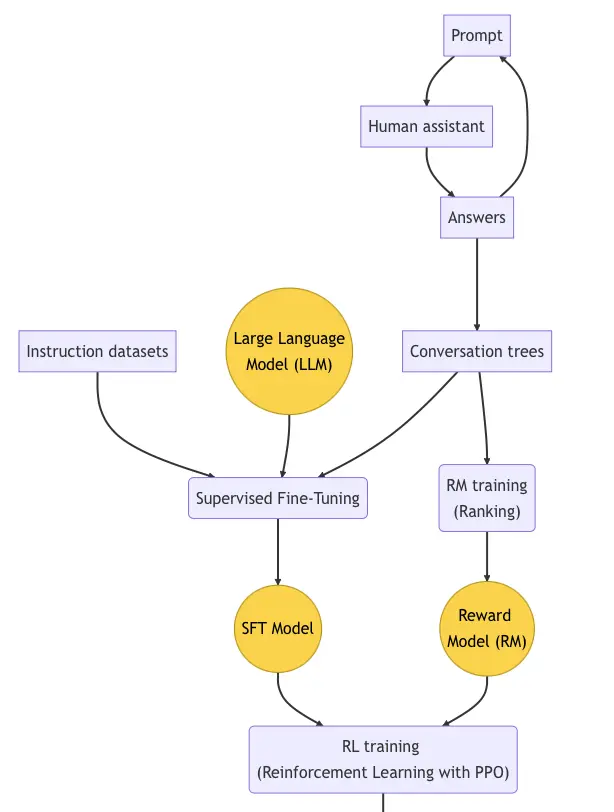

In [[Reinforcement Learning | reinforcement learning]], we are familiar with the function that computes rewards for an agent's actions in an environment. And these rewards are becoming increasingly complex for different machine learning programs, especially for programs where rewards are hard to define. For large language models, this reward is represented as a scoring system evaluating the model's answer quality, which helps the model generate better responses. The combination of reward models and reinforcement learning has enabled the widespread use of large language models by aligning models with acceptable human values. Reward modeling and RLHF are the most common terms in AI since the release of GPT-3.5.

## Common reward models
Reward models are often defined based on factors such as the agent's goals, environmental conditions, and specific problem rules and constraints. They can be represented as reward tables or functions, depending on the specific problem.

- **Sparse Reward**: Provides rewards infrequently and sparsely during the interaction process. Rewards are given only when the agent achieves a goal or meets certain specific conditions.
- **Dense Reward**: Provides relatively frequent and detailed rewards during the interaction process. Each action of the agent is evaluated and rewarded with a small reward value. This dense reward model can help the agent learn faster and generate better behavior.
- **Shaped Reward**: Uses shaped reward functions to provide rewards to the agent. Instead of providing binary rewards (0 or 1), it evaluates the level of achievement for each action with a continuous value.
- **Intrinsic Reward**: Rewards generated by the environment itself or by an intrinsic mechanism. It is not dependent on external goals that the agent needs to achieve but focuses on exploration and learning.
- **Adversarial Reward**: Evaluates rewards based on an opponent or competitive behavior. It is often used in competitive problems or two-player games.
- **Self-Supervised Rewards**: Another approach is to use self-supervised rewards, where the model generates its own reward signals based on auxiliary tasks or internally defined objectives. This allows the LLM to learn how to reward itself for behavior that aligns with its internal goals.
- **Contrastive Rewards**: The reward model can employ contrastive rewards to compare and evaluate the difference between two or more actions or states. This helps the model learn how to optimize its behavior to achieve better results compared to alternative choices.

## Applying Reward Model to LLM
The reward model can be used in a part of the LLM training process to determine the "correct" or "reasonable" level of the model's predictions. The reward model can generate reward signals to evaluate the quality of the answers generated by the LLM. Ultimately, the reward model helps improve the output of the model. The diagram below illustrates the application of the reward model in training to create a language model.



The training data for the reward model consists of ranked results of answers to the same question:

```
    {
        "text": "Why is the unemployment rate in Russia at its lowest in history?",
        "role": "prompter"
    },
    {
        "text": "The unemployment rate in Russia is at its lowest in history due to the expansion of business, which increases the demand for manpower, especially in the industrial sector.",
        "role": "assistant"
    },
    {
        "text": "The main reason is the expansion of business, which increases the demand for manpower, especially in the industrial sector.",
        "role": "assistant"
    },
    {
        "text": "The main reason is the expansion of business, which increases the demand for manpower, especially in the industrial sector. Additionally, due to sanctions from the West, Russian businesses have to seek domestic supply sources instead of importing from abroad. The Russian government aims to be self-sufficient in providing goods and services.",
        "role": "assistant"
    },
    {
        "text": "Due to limited labor resources, businesses are trying to attract employees by increasing salaries and improving working conditions.",
        "role": "assistant"
    },

```

### Characteristics of the reward model
- The reward model is also a large language model based on the transformer algorithm, so it can have a large number of parameters (billions of parameters).
- It utilizes multiple datasets for training to achieve better results:
  - It uses human-generated rankings and labels for evaluating the results of the LLM.
  - Humans create results from given prompts.
  - It leverages human chat history.
- The output of the reward model is a reward that is transformed into a scalar value from the input text.
- The foundation model of the reward model influences the quality of the reward.

### Some issues when applying the reward model
- RL models try to generate results to achieve high rewards without fully understanding the question or task.
- The model will optimize according to what the reward model is trained on, leading to suboptimal performance in other knowledge domains.
- Complex and costly feedback collection: Sometimes, collecting feedback from humans or experts can require significant effort and expenses.

## Conclusion
However, determining a suitable reward model is not always easy. Sometimes, defining a reasonable and appropriate reward model that aligns with the goals and constraints of the problem is a challenge for designers of reinforcement learning systems. Applying the reward model to the LLM training process becomes a crucial step in improving the quality and acceptance of answers from the LLM.

## References
- https://huggingface.co/docs/trl/main/en/reward_trainer
- https://explodinggradients.com/reward-modeling-for-large-language-models-with-code
- https://huggingface.co/docs/trl/main/en/detoxifying_a_lm
- https://openai.com/blog/chatgpt
