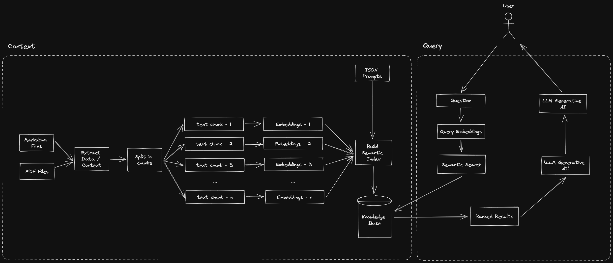

[Langchain](https://python.langchain.com/) is a framework that enables the development of applications that utilize language models. It provides support for various main modules, including Models, Prompts, Memory, Indexes, Chains, and Agents. LangChain believes that applications with the greatest power and differentiation will not only rely on calling out to a language model via an API but will also be aware of data and allow a language model to interact with its environment.

## What are document loaders in Langchain?
The [document loaders](https://python.langchain.com/en/latest/modules/indexes/document_loaders.html) in Langchain are used to get around the [[Workaround with OpenAI's token limit with Langchain|~4K token limit on OpenAI]] by using several strategies such as stuffing, map-reduce, refining, and map-rerank. These strategies are used to split documents into smaller sections or summaries that can fit into the 4K token limit and consolidate them as a summary that can fit into the 4K token limit. These strategies are also used to refine prompts to ChatGPT to refine its context prior to composing a final summary that will then be used to prime the conversation for the response.

These data are saved and indexed as vectors in a [[Vector Database|vector database]]. Vector indexes are used to capture word meaning and represent it in a continuous space. This helps the model to understand the context and generate more accurate responses.



### Question Answer Systems
In order to get question and answering from prompts, we follow 4 steps with langchain:
1.  Create an index
2.  Create a Retriever from that index
3.  Create a question answering chain
4.  Ask questions!

## Example agent with CSVs
Below is an example using a CSV file through an agent. This CSV contains `red-alert` channel data from Dwarves' discord as the context for our questions that we will be asking later.

0. First we load all of our `pip` packages
```sh
pip install langchain openai huggingface_hub gitpython chromadb tiktoken google-api-python-client llama-cpp-python
```
1. Then, with our `red_alert.csv` file, we create a loader with it on langchain and create a reference object by loading it.
```python
from langchain.document_loaders.csv_loader import CSVLoader

red_alert_csv_loader = CSVLoader(file_path='./example_data/red_alert.csv')
red_alert_docs = red_alert_csv_loader.load()
```
2. We then split our text and instantiate our embeddings. For our case, we will use OpenAI's embeddings.
```python
from langchain.chains import RetrievalQA
from langchain.indexes import VectorstoreIndexCreator
from langchain.text_splitter import CharacterTextSplitter
from langchain.embeddings import OpenAIEmbeddings
from langchain.vectorstores import Chroma

text_splitter = CharacterTextSplitter(chunk_size=1000, chunk_overlap=0)
red_alert_texts = text_splitter.split_documents(red_alert_docs)

embeddings = OpenAIEmbeddings()
```
3. We store our vector embeddings, that gets mapped from OpenAI, in ChromaDB and create a retriever while we're at it.
```python
red_alert_db = Chroma.from_documents(red_alert_texts, embeddings)
red_alert_retriever = red_alert_db.as_retriever()
```
4. We can then create our Retrieval QA system from our retriever and llm (OpenAI).
```python
red_alert_qa = RetrievalQA.from_chain_type(llm=openai_llm, chain_type="stuff", retriever=red_alert_retriever)
```
We can also immediately query from this system:
```python
query = 'Who wrote the article on "i18n Frontend Guideline"?'
red_alert_qa.run(query)

#  <@874125795549909082> wrote the article on "i18n Frontend Guideline".
```
5. To create our agent, we will need to apply it to our list of tools and initialize our agent (zero shot react) with those tools and OpenAI. We'll also add a Google Search tool as well for good measure.
```python
from langchain.agents import load_tools
from langchain.agents import AgentType
from langchain.agents import initialize_agent, Tool
from langchain.tools import BaseTool
from langchain import LLMMathChain, GoogleSearchAPIWrapper

google_search = GoogleSearchAPIWrapper()

tools = [
    Tool(
        name="Dwarves Red-alert QA System",
        func=red_alert_qa.run,
        description="everything concerning alerts and news on Dwarves Foundation Discord."
    ),
    Tool(
        name="Google Search",
        func=google_search.run,
        description="use on Google'ssearch engine"
    )
]

openai_agent = initialize_agent(tools, openai_llm, agent=AgentType.ZERO_SHOT_REACT_DESCRIPTION, verbose=True)
```
6. Finally, we have an agent that can give us based on data from our red alert QA system and the internet.
```python
query = 'What Discord username wrote "i18n Frontend Guideline"? What is his age in roman numerics?'
openai_agent.run(query)

# The username is An Tran and the age in Roman numerics is MMXXI.
```

## Conclusion
Hopefully, this gives you an idea of how langchain can be used to create an agent that take indexes and data from our transient vector database. A lot of the processing for generating these prompts happens behind the scenes, so that we only need to worry about loading and consolidating which data we need to use as indexes for LLMs.

## References
- https://python.langchain.com/en/latest/modules/indexes/getting_started.html
- https://github.com/kenhuangus/ChatGPT-FAQ/blob/main/vectorDB.md

---
<!-- cta -->

### Contributing
At Dwarves, we encourage our people to read, write, share what we learn with others, and [[CONTRIBUTING|contributing to the Brainery]] is an important part of our learning culture. For visitors, you are welcome to read them, contribute to them, and suggest additions. We maintain a monthly pool of $1500 to reward contributors who support our journey of lifelong growth in knowledge and network.

### Love what we are doing?
- Check out our [products](https://superbits.co)
- Hire us to [build your software](https://d.foundation)
- Join us, [we are also hiring](https://github.com/dwarvesf/WeAreHiring)
- Visit our [Discord Learning Site](https://discord.gg/dzNBpNTVEZ)
- Visit our [GitHub](https://github.com/dwarvesf)