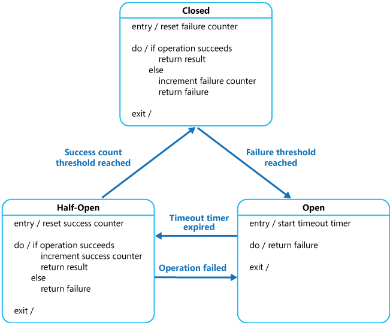

## The Problem Statement
The application we are developing required to call to remote resources. These resource servers can fail due to transient faults, such as slow network connections, timeouts, or the resources being temporarily unavailable. As we don't have the means to resolve these issues from the resource servers, we need a way to quickly fail the request if the resources are down or redirect to backup resources by adding a **circuit breaker** to our application.

## The circuit breaker pattern
A circuit break revolves around 3 states: **Closed**, **Open**, and **Half-Open**.

- **Closed**, requests sent to resources as usual. A **failure counter**, and a **duration** are defined. Within a period defines by the **duration** :
  - If a request fail, increment the **failure counter**.
  - If pass the time span with **duration**, the failure counter reset.
  - If the **failure counter** reached the thresh hold, the circuit breaker changes to **Open** state.
- **Open**, requests fail immediately and an exception is returned to the application. After a defined **timeout timer** is finished, the circuit break changes to **Half-Open** state.
- **Half-Open**, a limited number of requests are allowed to send to resources.
  - If the request success, increment the **success counter** until enough for the circuit breaker to switch to the **Closed** state.
  - If the request fails, return to the **Open** state.



## Using circuit breaker in Go
First, we need to init a new go project with [go mod init](https://go.dev/doc/tutorial/getting-started)

Libraries included in this example:

- [go circuit breaker](https://github.com/sony/gobreaker) for using circuit breaker
- [go server with echo](https://github.com/labstack/echo) for endpoint settings

### Init the circuit breaker
Each circuit breaker will require a setting config

```go
    var setting gobreaker.Settings
```

The common circuit breaker setting includes

```go
    setting.Name = "HTTP GET v2/resource"   // name of the CB

    setting.MaxRequests = 2                 // maximum number of requests allowed to go through during HALF-OPEN state

    setting.Interval = time.Second          // the cyclic period of the closed state for the CircuitBreaker to clear the internal Counts. If the Interval is less than or equal to 0, the circuit breaker doesn't clear internal Counts during the closed state.

    setting.Timeout = 5 * time.Second       // the period of the open state, after which the state of the CB becomes HALF-OPEN
```

For more Setting options, can go to [gobreaker Settings](https://pkg.go.dev/github.com/sony/gobreaker@v0.5.0#Settings)

After finishing configuring options to the Setting, we can init the circuit breaker with

```go
    resourceCircuitBreaker := gobreaker.NewCircuitBreaker(setting)
```

### Call the resource server through the circuit breaker
Execution of a request through the circuit breaker is created by using `resourceCircuitBreaker.Execute()`. Where `func(interface{}, error)` is a function wrapper, inside contains the code to call for the resource server:

```go
    func getResourceWithCircuitBreaker(resourceCircuitBreaker gobreaker.CircuitBreaker) {
        response, err := resourceCircuitBreaker.Execute(func() (interface{}, error) {
                        return getResource(resourceServerURL)
        })
        // do something with response/err
    }

    func getResource(resourceServerURL string) (interface{}, error) {
        resp, err := http.Get(resourceServerURL)
        if err != nil {
            return nil, err
        }

        if resp.StatusCode != http.StatusOK {
            return nil, fmt.Errorf("resource server failed, code: %v", resp.StatusCode)
        }

        defer resp.Body.Close()
        body, err := ioutil.ReadAll(resp.Body)
        if err != nil {
            return nil, err
        }

        return body, nil
    }
```

`getResource()` is a sample HTTP request func to call the resource server given `resourceServerURL`

Return of the `resourceCircuitBreaker.Execute()` includes:

- The response of the resource server
- The error from the resource server/from the circuit breaker:
  - If the circuit breaker is in `CLOSED` state, return the error from the resource server
  - If the circuit breaker is in `HALF-OPEN` state:
    - if the number of ongoing requests does not exceed `MaxRequests`, return the error from the resource server
    - if the number of ongoing requests exceeds `MaxRequests`, return `gobreaker.ErrTooManyRequests`
  - If the circuit breaker is in `OPEN` state, return `gobreaker.ErrOpenState`

## Error handling
An application invoking an exception when requesting through a circuit breaker must be prepared to handle the exceptions raised.

After receiving the response from the circuit breaker, the system should log all failed requests (and possibly successful requests) to enable an administrator to monitor the health of the operation.

### Remote server error
for `4xx` errors. As these errors mostly cause by incorrect inputs, we can ignore the error returns to the circuit breaker to not increase the circuit breaker's failure counter, and use logging instead.

for `5xx` or connection errors, we can choose to start circuit breaking for specific errors even if the circuit breaker's failure counter is still under the limit by adding a custom function to `setting.ReadyToTrip`

### Adding custom behaviors to the circuit breaker's state life cycle
When in `OPEN/HALF-OPEN`:

- When encountering circuit breaker errors, rather than return the error quickly to the client, we can make a redirect call to a backup remote service.

- If the same request is fluctuate between success/failure, we can save the success response on local and return that when the circuit breaker enters `OPEN/HALF-OPEN` state.

During the cycle transition between `OPEN/HALF-OPEN`:

- Testing Failed Operations. In the `OPEN` state, rather than using a timer(by default) to determine when to switch to the `HALF-OPEN` state, a circuit breaker can instead periodically ping the remote service or resource to determine whether it's become available again. This ping could take the form of an attempt to invoke an operation that had previously failed, or it could use a special operation provided by the remote service specifically for testing the health of the service with [health-check-apis](https://www.ibm.com/garage/method/practices/manage/health-check-apis/).

## Use cases
We should apply the circuit breaker pattern when the application trying to invoke a remote service which highly likely to fail (unstable API, request restriction, traffic overload, etc...). The samples system includes:

- Metrics applications that crawl data from external sites.
- IOT applications that frequently check on connected devices for information.
- Peer to Peer systems, chatroom, online games.

**Notes**

- A circuit breaker should only cover one/many remote services with similar recovery patterns, and business use cases.

- Inappropriate Timeouts on External Services. If the timeout is too long, a large number of requests might be blocked for an extended period before the circuit breaker indicates that the operation has failed. At this time, all the requests are tied up and eventually fail.

## References
- [Azure's Circuit-breaker patterns](https://learn.microsoft.com/en-us/azure/architecture/patterns/circuit-breaker)
- [sony/gobreaker](https://github.com/sony/gobreaker)

---
<!-- cta -->

### Contributing
At Dwarves, we encourage our people to read, write, share what we learn with others, and [[CONTRIBUTING|contributing to the Brainery]] is an important part of our learning culture. For visitors, you are welcome to read them, contribute to them, and suggest additions. We maintain a monthly pool of $1500 to reward contributors who support our journey of lifelong growth in knowledge and network.

### Love what we are doing?
- Check out our [products](https://superbits.co)
- Hire us to [build your software](https://d.foundation)
- Join us, [we are also hiring](https://github.com/dwarvesf/WeAreHiring)
- Visit our [Discord Learning Site](https://discord.gg/dzNBpNTVEZ)
- Visit our [GitHub](https://github.com/dwarvesf)