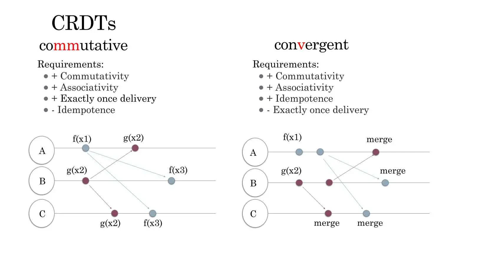

---
tags:
  - engineering
  - engineering/backend
  - distributed-system
  - crdt
  - eventual-consistency
  - coordination
  - replication
  - data-types
  - data-structures
author: Nguyen Tan Phat
github_id: fuatto
date: 2023-11-5
icy: 10
---

## What is CRDT?
Conflict-free Replicated Data Types (CRDTs) (aka convergent replicated data type or commutative replicated data type) are data structures that can be replicated across multiple computers in a network, where the replicas can be updated independently and concurrently without coordination between them, and enable operations to always converge to a final state consistent among all replicas.

## Why CRDT?
### Addressing Data Modification Dilemma
There are two approaches to handling concurrent modifications in distributed systems:

1. **Strongly Consistent Replication**: In this approach, replicas coordinate for modifications to ensure strong consistency. However, this coordination sacrifices performance and can be limited by the [[CAP theorem]]. The CAP theorem states that in a distributed system, it's impossible to simultaneously guarantee consistency (every read receives the most recent write), availability (every request receives a response), and partition tolerance (the system continues to operate despite network partitions).
2. **Optimistic Replication**: In optimistic replication, users can independently modify data without coordination, which enhances performance. However, this approach may lead to conflicts when multiple replicas receive conflicting modifications. To address conflicts, replicas communicate and resolve conflicts automatically.

### Role of CRDTs
CRDTs (Conflict-free Replicated Data Types) play a crucial role in **optimistic replication systems**. They enable seamless merging of data modifications by performing replication as commutative operations. CRDTs ensure that conflicting modifications from different replicas are resolved automatically, eliminating the need for special conflict resolution code or user intervention. This makes CRDTs a valuable tool for maintaining consistency in distributed systems while maximizing performance.

## How to use CRDT?
CRDTs (Conflict-free Replicated Data Types) are a powerful tool for ensuring data consistency and synchronization in various applications. Here are some examples of how CRDTs can be applied:

**Applications of CRDTs**

- _Mobile Apps_: CRDTs enable seamless synchronization of data across multiple devices used by a single user. This ensures that the user can access and modify their data from any device without conflicts or inconsistencies.
- _Distributed Databases_: CRDTs play a crucial role in maintaining data integrity in distributed databases. They allow replicas of the database to be located in different locations while still ensuring that updates and modifications to the data are propagated correctly across all replicas.
- _Collaboration Software_: CRDTs are particularly useful in collaboration software where multiple users can simultaneously make changes to the same file or data. By using CRDTs, conflicts between concurrent changes can be automatically resolved without the need for centralized coordination or locking mechanisms.
- _Large-scale Data Storage Systems_: CRDTs are instrumental in building large-scale data storage systems that require global scalability. By replicating data using CRDTs, these systems can handle high volumes of data and distribute it across multiple nodes, allowing for efficient and reliable access to the data.

**Decentralized Operation**

- One of the key advantages of CRDTs is that they support decentralized operation. Unlike traditional systems that rely on a single server, CRDTs can thrive in peer-to-peer networks and other decentralized settings. This makes them well-suited for applications and environments where a central authority is not desirable or feasible.

## Conclusion
In short, Conflict-free Replicated Data Types (CRDTs) play a pivotal role in managing conflict resolution. It guarantees the seamless merging of data into a coherent state, irrespective of the modifications made on distinct replicas. Importantly, CRDTs automate this merging process, eliminating the necessity for specialized conflict resolution code or user intervention.

Unlike systems relying on algorithms utilized by platforms such as Google Docs, Trello, and Figma, CRDTs don't presuppose the reliance on a single server. This distinctive quality allows CRDTs to seamlessly integrate into peer-to-peer networks and various decentralized settings, setting them apart in the landscape of distributed data management.

## References
- https://crdt.tech/
- https://redis.com/blog/diving-into-crdts/
- https://jakelazaroff.com/words/an-interactive-intro-to-crdts/#user-content-fn-cvrdt
- https://www.infoq.com/presentations/crdt-production/

---
<!-- cta -->

### Contributing
At Dwarves, we encourage our people to read, write, share what we learn with others, and [[CONTRIBUTING|contributing to the Brainery]] is an important part of our learning culture. For visitors, you are welcome to read them, contribute to them, and suggest additions. We maintain a monthly pool of $1500 to reward contributors who support our journey of lifelong growth in knowledge and network.

### Love what we are doing?
- Check out our [products](https://superbits.co)
- Hire us to [build your software](https://d.foundation)
- Join us, [we are also hiring](https://github.com/dwarvesf/WeAreHiring)
- Visit our [Discord Learning Site](https://discord.gg/dzNBpNTVEZ)
- Visit our [GitHub](https://github.com/dwarvesf)