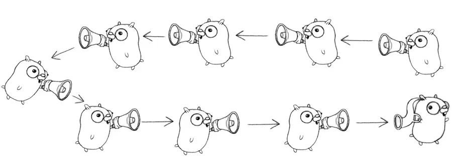

## Preamble
If we look around in the world at large, what you see is a lot of independently executing things like there's people doing their own things out side, there's cars going by, all of those things are independent agents in side the world. If you think about writting a computer program, if you want to simulate or interact with that environment, a single sequential execution is not a very good approach. So concurrency is really a way of writting or structuring your program to deal with the real world, may be simulate the real world or behave as an agent inisde the real world and be a good actor in that environment. By definition, concurrency is defined as the composition of independently executing computations. First of all, I want to stress that concurrency is not parallelism, but today we're not going to talk about this, if you interest, please let me know and I will write one about this topic later on.

## Unexpected Go concurrency pitfalls
With concurrency primitives built-in to the language. By using the  `go` keyword to create goroutines, and by using channels together with other concurrency synchronization techniques provided in Go, concurrent programming become easy, flexible, enjoyable. On the other hand, Go doesn't prevent programmers from making some concurrent programming mistakes which are caused by either carelessness or lacking of experience. Below is some unexpected pitfalls when using the concurrency features provided by the Go programming language.

### No Synchronizations When Synchronizations Are Needed
**Take-away**: [Code lines might be not executed by their appearance order.](https://go101.org/article/memory-model.html)
There are 2 mistakes in the following program.
	 - First, the read of `b` in the main goroutine and the write of `b` in the new goroutine might cause data races.
	 - Second, the condition `b == true` can't ensure that `a != nil` in the main goroutine. Compilers and CPUs may make optimizations by reordering instructions in the new goroutine, so the assignment of `b` may happen before the assignment of `a`  at run time, which makes that slice `a` is still `nil` when the elements of `a` are modified in the main goroutine.

```go
package main

import (
	"time"
	"runtime"
)

func main() {
	var a []int // nil
	var b bool  // false

	// a new goroutine
	go func () {
		a = make([]int, 3)
		b = true // write b
	}()

	for !b { // read b
		time.Sleep(time.Second)
		runtime.Gosched()
	}
	a[0], a[1], a[2] = 0, 1, 2 // might panic
}
```

The above program may run well on one computer, but may panic on another one, or it runs well when it is compiled by one compiler, but panics when another compiler is used.
We should use channels or the synchronization techniques provided in the `sync` standard package to ensure the memory orders. For example, 

```go
package main

func main() {
	var a []int = nil
	c := make(chan struct{})  // The type of channel in this case is not important

	go func () {
		a = make([]int, 3)
		c <- struct{}{}
	}()

	<-c
	// The next line will not panic for sure.
	a[0], a[1], a[2] = 0, 1, 2
}
```

### Not Pay Attention to Too Many Resources Are Consumed by Calls to the `time.After` Function
**Take-away**: Take greate care when using `time.After` function.
The `After` function in the `time` standard package returns [a channel for delay notification](https://pkg.go.dev/time#After). The function is convenient, however each of its calls will create a new value of the `time.Timer` type. The new created `Timer` value will keep alive in the duration specified by the passed argument to the `After` function. If the function is called many times in a certain period, there will be many alive `Timer` values accumulated so that much memory and computation is consumed.

For example, if the following `longRunning` function is called and there are millions of messages coming in one minute, then there will be millions of `Timer` values alive in a certain small period (several seconds), even if most of these `Timer` values have already become useless.

```go
import (
	"fmt"
	"time"
)

// The function will return if a message
// arrival interval is larger than one minute.
func longRunning(messages <-chan string) {
	for {
		select {
		case <-time.After(time.Minute):
			return
		case msg := <-messages:
			fmt.Println(msg)
		}
	}
}
```

To avoid too many `Timer` values being created in the above code, we should use (and reuse) a single `Timer` value to do the same job.

```go
func longRunning(messages <-chan string) {
	timer := time.NewTimer(time.Minute)
	defer timer.Stop()

	for {
		select {
		case <-timer.C: // expires (timeout)
			return
		case msg := <-messages:
			fmt.Println(msg)

			// This "if" block is important.
			if !timer.Stop() {
				<-timer.C
			}
		}

		// Reset to reuse.
		timer.Reset(time.Minute)
	}
}
```

Note: the `if` code block is used to discard/drain a possible timer notification which is sent in the small period when executing the second branch code block in this example is `fmt.Println(msg)` while in real use case it might be some time cost computations.

### Use `time.Timer` Values Incorrectly
**Take-away**: Take greate care when using `time.Timer` values.
An idiomatic use example of `time.Timer` values has been shown in the last section. Some explanations:
	- The `Stop` method of a `*Timer` value returns `false` if the corresponding `Timer` value has already expired or been stopped. If the `Stop` method returns `false`, and we know the `Timer` value has not been stopped yet, then the `Timer` value must have already expired.
	- After a `Timer` value is stopped, its `C` channel field can only contain most one timeout notification.
	- We should take out the timeout notification, if it hasn't been taken out, from a timeout `Timer` value after the `Timer` value is stopped and before resetting then reusing the `Timer` value. This is the meaningfulness of the `if` code block in the example in the last section.

The `Reset` method of a `*Timer` value must be called when the corresponding `Timer` value has already expired or been stopped, otherwise, a data race may occur between the `Reset` call and a possible notification send to the `C` channel field of the `Timer` value.

If the first `case` branch of the `select` block is selected, it means the `Timer` value has already expired, so we don't need to stop it, for the sent notification has already been taken out. However, we must stop the timer in the second branch to check whether or not a timeout notification exists. If it does exist, we should drain it before reusing the timer, otherwise, the notification will be fired immediately in the next loop step.

For example, the following program is very possible to exit in about one second, instead of ten seconds. More importantly, the program is not data race free.

```go
package main

import (
	"fmt"
	"time"
)

func main() {
	start := time.Now()
	timer := time.NewTimer(time.Second/2)
	select {
	case <-timer.C:
	default:
		// Most likely go here.
		time.Sleep(time.Second)
	}
	// Potential data race in the next line.
	timer.Reset(time.Second * 10)
	<-timer.C
	fmt.Println(time.Since(start)) // about 1s
}
```

A `time.Timer` value can be leaved in non-stopping status when it is not used any more, but it is recommended to stop it in the end.

It is bug prone and not recommended to use a `time.Timer` value concurrently among multiple goroutines.

We should not rely on the return value of a `Reset` method call. The return result of the `Reset` method exists just for compatibility purpose.

### Copy Values of the Types in the `sync` Standard Package
**Take-away**: Use pointer when dealing with structs that contain values from the `sync` standard package.
In practice, values of the types (except the `Locker` interface values) in the `sync` standard package [should never be copied](https://pkg.go.dev/sync#pkg-overview). We should only copy pointers of such values.

The following is bad concurrent programming example. In this example, when the `Counter.Value` method is called, a `Counter` receiver value will be copied. As a field of the receiver value, the respective `Mutex` field of the `Counter` receiver value will also be copied. The copy is not synchronized, so the copied `Mutex` value might be corrupted. Even if it is not corrupted, what it protects is the use of the copied field `n`, which is meaningless generally.

```go
import "sync"

type Counter struct {
	sync.Mutex
	n int64
}

// This method is okay.
func (c *Counter) Increase(d int64) (r int64) {
	c.Lock()
	c.n += d
	r = c.n
	c.Unlock()
	return
}

// The method is bad. When it is called,
// the Counter receiver value will be copied.
func (c Counter) Value() (r int64) {
	c.Lock()
	r = c.n
	c.Unlock()
	return
}
```

We should change the receiver type of the `Value` method to the pointer type `*Counter` to avoid copying `sync.Mutex` values.

The `go vet` command provided in Go Toolchain will report potential bad value copies.

### Use Channels as Futures/Promises Improperly
In the next section, we will learn some handy concurrency pattern in Go which will have something calls a `Channel Factory` which is a fancy name for Go functions/methods that return a receive-only channels (which is usually called futures/promises) which can actually receive values from it. Assume `fa` and `fb` are two such functions, then the following call uses future arguments improperly.

```go
doSomethingWithFutureArguments(<-fa(), <-fb())
```

In the above code line, the generations of the two arguments are processed sequentially, instead of concurrently. We should modify it as the following to process them concurrently.

```go
ca, cb := fa(), fb()
doSomethingWithFutureArguments(<-ca, <-cb)
```

## Some handy concurrency patterns in Go
### Launching our first goroutine
 Here we have a trivial Go program, which launch a single additional goroutine. By using a trick `time.Sleep` we can show that both main and the launched goroutine are running.
 
```go
func main() {
	go boring("boring!")
	fmt.Println("I'm listening.")
	time.Sleep(2 * time.Second)
	fmt.Println("You're boring; I'm leaving")
}
```

```
I'm listening.
boring! 0
boring! 1
boring! 2
boring! 3
boring! 4
boring! 5
You're boring; I'm leaving
```

But our concurrent program example above actually cheated: the main function couldn't see the ouput from the other goroutine. It was just printed to the screen, where we pretended we saw a conversation. Because the goroutines were independently executing, but they were not communicating or synchronizing their behavior in any way. 

**Real convesations require communication**. To do a proper concurrent program, we need to be able to communicate among the goroutines inside it. To do that, there's a concept of a channel in Go, channels are sort of a fundamental concept in Go and they're also the first-class citizen in the language.

### Channels
Let's use channels to do something. Let's make the above program a little more honest.

```go
func main() {
	c := make(chan string)
	go boring("boring!", c)
	for i := 0; i < 5; i++ {
		fmt.Printf("You say: %q\n", <-c) // Receive expression is just a value.
	}
	fmt.Println("You're boring: I'm leaving.")
}
  
func boring(msg string, c chan string) {
	for i := 0; ; i++ {
		c <- fmt.Sprintf("%s %d", msg, i) // Expression to be sent can be any suitable value.
		time.Sleep(time.Duration(rand.Intn(1e3)) * time.Millisecond)
	}
}
```

This is more honest, the main and the boring function are independently executing, but they're also communicating in a strong sense. So there's a point about what's going on here, which is:
- Obviously when you read from a channel, you have to wait for there to be a value there. It's a blocking operation.
- But also when you send to a channel, it's a blocking operation. When you send a value to a channel, the channel blocks until somebody's ready to receive it.
- As a result, if the 2 goroutines are independently executing, this one's sending, this one's receiving, whatever they're doing, when they're finally reach the point where the send and receive are happening, we know that's like a lockstep position. Those 2 goroutines are at that communication point - the send on this side - the receive on the other side. 
- It's also a synchronization operation as well as a send - receive operations. An channels thus communicate and synchronize in a single operation. 

### An aside about buffered channels
- Go channels can also be created with a buffer with syntax `ch := make(chan type, capacity)` .
- Buffering removes synchronization.
- Buffered channels are important for some problems but they are more subtle to reason about.
- We won't need them today.

### The Go approach
Given this idea of communication coupled with synchronization that Go's channels provide, the Go approach to concurrent software can be characterized as: "**Don't communicate by sharing memory, share memory by communicating**". In other words, you don't have some blob of memory then put locks,mutexes, condition variables around it to protect it from parallel access. Instead, you actually use the channel to pass the data back and forth between the goroutines and make your concurrent program operate that way. 

So based on those "principles", we can now start to explore some what I call "concurrency patterns". I put those into quotes because I don't want you to think of these as being like "object-oriented patterns". They're just very simple, little, tiny examples that do interesting things.

### Channel factory (Or Generator): function that returns a channel
Channels are first-class values, just like strings or integers. The first and probably most important concurrency pattern is what I call a generator (or a channel factory), which is a function that returns a "receive-only" channel. 

```go
func main() {
	c := boring("boring") // Function returning a channel.
	for i := 0; i < 5; i++ {
		fmt.Printf("You say: %q\n", <-c) // Receive expression is just a value.
	}
	fmt.Println("You're boring: I'm leaving.")
}

func boring(msg string) <-chan string {
	c := make(chan string)
	go func() { // We launch the goroutine from inside the function.
	for i := 0; ; i++ {
		c <- fmt.Sprintf("%s %d", msg, i)
		time.Sleep(time.Duration(rand.Intn(1e3)) * time.Millisecond)
	}
	}()
	return c // Return the channel to the caller.
}
```

Note that, the `boring` function return parameter type is a receive-only channel of type string which indicates to the caller that must not send values to this channel. 

In this case, in the main function, we call the `boring` function, and it returns a channel. Instead of sort of looping forever with a goroutine being launched in main, we actually launch the goroutine inside the `boring` function itself. You can see that we wrap the loop that we have before inside an anonymous function literal and launch that function as a goroutine with a `go` keyword at the top. This starts the computations running concurrently then returns back to the caller the channel with which to communicate to the other goroutine.

If we run this, this will just behave exactly the same way, but now we've got a much nicer pattern for constructing this service. In fact, this very much like having a "service". Let's say the total interface of the `boring` service is a receive-only channel, nowhere does the main function here know what that channel has behind it, it just a function in the background that's doing something, it could be an arbitrarily complex computation, and once you realize that that channel is, in effect, the capability to a service, for unit testing, you can mock this service behavior easily by wrapping our function with interface.

```go
	type borer interface{
		boring(string) <-chan string
}

```

### Channels as a handle on service
Our boring function returns a channel that lets us communicate with the boring service it provides. We can have more instances of the service.

```go
func main() {
	bob, alice := boring("Bob"), boring("Alice") // Function returning a channel.
	for i := 0; i < 5; i++ {
		fmt.Println(<-bob)
		fmt.Println(<-alice)
	}
	fmt.Println("You're boring: I'm leaving.")
}
```

It's exactly the same boring function as previously. We're just using it in a different way.

```
Bob 0
Alice 0
Bob 1
Alice 1
Bob 2
Alice 2
Bob 3
Alice 3
Bob 4
Alice 4
You're boring: I'm leaving.
```

Inside here, we're reading values from `Alice` and `Bob`, and because of the synchronization nature of the channels, the 2 guys are taking turns, not only in printing the values out, but also in executing them. Because if `Bob` is ready to send a value but `Alice` hasn't done that yet, `Bob` will still be blocked, waiting to deliver the value to main. 

Well, that's a little annoying because maybe `Alice` is more talkative and `Bob` doesn't want to wait around. We can get around that by writting a fan-in function or a multiplexer.

### Multiplexing
These programs make `Bob` and `Alice` count in lockstep. We can instead use a fan-in function to let whosoever is ready talk.

```go
func main() {
	bob, alice := boring("Bob"), boring("Alice")
	c := fanIn(bob, alice)
	for i := 0; i < 10; i++ {
		fmt.Println(<-c)
	}
	fmt.Println("You're boring: I'm leaving.")
}

  
func fanIn(input1, input2 <-chan string) <-chan string {
	c := make(chan string)
	go func() {
		for {
		c <- <-input1
		}
	}()

	go func() {
		for {
		c <- <-input2
		}
	}()
	return c
}
```

To do that, we can implement a "fan-in" function as above which actually stitch 2 guys together with the `fanIn`  function and construct a single channel, from which we can receive from both of them


Again, using the "generator" pattern, the `fanIn` function is itself a function that returns a channel, it takes 2 channels as inputs and return another channel as it return value. What we do is again, make the channel and return it, but internally we launched 2 independent goroutines, one copy the ouput from input1 to the channel, and the other one copy from input2 to the channel

```
Alice 0
Bob 0
Bob 1
Alice 1
Bob 2
Alice 2
Bob 3
Alice 3
Bob 4
Alice 4
You're boring: I'm leaving.
```

Observing the result, we can say that `Alice` and `Bob` are now completely independent, because they ran in not necessarily sequential order since `Bob` gives 2 communications in a row be fore `Alice` has anything to say. So that helps decouple the execution of those guys, even though it's all synchronous, they can independently execute. 

What if, for some reason, we actually don't want that? And we want to have them be totally lockstep and synchronous instead?

### Restoring sequencing
- Send a channel on a channel (channels are first-class citizen in Go), making goroutine wait its turn.
- Receive all messages, then enable them again by sending on a private channel.
- First we define a message type that contains a channel for the reply which plays the role of "signaler" in this approach, and the goroutines will block on the wait channel until the caller says: "OK, I want you to go ahead".

```go
type Message struct {
	str string
	wait chan bool
}
```

This approach implies sending inside a channel another channel to be used for the answer to comeback.

```go
func main() {
	bob, alice := boring("Bob"), boring("Alice")
	c := fanIn(bob, alice)
	for i := 0; i < 5; i++ {
		msg1 := <-c
		fmt.Println(msg1.str)
		msg2 := <-c
		fmt.Println(msg2.str)
		msg1.wait <- true
		msg2.wait <- true
	}
}

func fanIn(input1, input2 <-chan Message) <-chan Message {
	c := make(chan Message)
	go func() {
		for {
			c <- <-input1
		}
	}()
	go func() {
		for {
			c <- <-input2
		}
	}()
	return c
}

func boring(msg string) <-chan Message {
	c := make(chan Message)
	waitForIt := make(chan bool) // Shared between all messages
	go func() { // We launch the goroutine from inside the function.
		for i := 0; ; i++ {
			c <- Message{
				str: fmt.Sprintf("%s %d", msg, i),
				wait: waitForIt
				}
			time.Sleep(time.Duration(rand.Intn(2e3)) * time.Millisecond)
			<-waitForIt
		}
	}()
	return c // Return the channel to the caller.
}
```

```
Bob 0
Alice 0
Bob 1
Alice 1
Bob 2
Alice 2
Bob 3
Alice 3
Bob 4
Alice 4
```

Inside the `boring` functions, now we have this  `waitForIt` channel, then everybody blocks waiting for a signal to advance. Observing the result, you can see they're back in lockstep, because even though the timing is random, the sequencing here with `ms1.wait <- true` and `ms2.wait <- true` means that the independently executing goroutines are waiting on different channels for the signal to advance. 

### Select
We can make it a little more interesting by using the next part of concurrency in Go, which is the `select` statement. A control structure unique to concurrency, it is also the reason channels and goroutines are built into the language.

The select statement is a control structure, somewhat like a switch, that lets you control the behaviour of your program based on what communications are able to proceed at any moment (for the  `switch`  statement each case is an expression while with  `select` each case is actually a communication). In fact, the `select` statement is really sort of a key part of why concurrency is built into Go as features of the language, rather than just a library.

Below are some facts about the `select` statement:
- When the control get to the top of the  `select` statement, it evaluates all of the channels that could be used for communication inside the cases.
- Selection blocks until one communication can proceed, which then does.
- If multiple can proceed, select choose pseudo-randomly.
- A default clause, if present, executes immediately if no channel is ready. So if there's no default, then the `select` will block forever until the channel can proceed.

Let's rewrite our original `fanIn` function using the `select` statement. Only one goroutine is needed.

```go
func fanIn(input1, input2 <-chan Message) <-chan Message {
	c := make(chan Message)
	go func() {
		for {
			select {
			case s := <-input1: c <- s
			case s := <-input2: c <- s
			}
		}
	}()
	return c
}
```

This has exactly the same behaviorand result as the other one, except that we're only launching one goroutine inside the `fanIn` function. Same idea, different implementation.

### Timeout using select
One of the most important is we can use `select` statement to time out a communication. If you're talking to somebody who's very boring, chances are you don't want to wait very long for them to get around to say something. In this case, we can simulate that with a call to a function in the library called [time.After](https://pkg.go.dev/time#After).
The `time.After` function returns a channel that blocks for the specified duration. After the interval, the channel delivers the current time, once.

```go
func main() {
	c := boring("Bob")
	for {
		select {
		case s := <-c:
			fmt.Println(s)
		case <-time.After(time.Second):
			fmt.Println("You're too slow.")
			return
		}
	}
}
```

Here, this `select` statement says either we can get a message from Bob, or a second's gone by, and he hasn't said anything, in which case we just get out of here. `time.After` is a function inside the standard library that returns a channel that will deliver a value after the specified interval.

```
{Bob 0}
{Bob 1}
{Bob 2}
{Bob 3}
{Bob 4}
You're too slow.
```

Observing the result, we can say that in this excecution `Bob` , only 4 times returns the result less than one second, the 5th times he exceeded the deadline in which case we just terminate the program.

### Timeout for whole conversation using select
Now we can do that another way. We might decide, instead of having a conversation where each message is at most one second, we might just want a total time elapsed. To do that, we can use the `time.After` channel more directly by just saving it inside a "timeout" channel and using the "timeout" channel inside the select statement. 

```go
func main() {
	c := boring("Bob")
	timeout := time.After(5 * time.Second)
	for {
		select {
		case s := <-c:
			fmt.Println(s)
		case <-timeout:
			fmt.Println("You talk to much.")
			return
		}
	}
}
```

In this case, this entire loop will time out after 5 seconds. 

```
{Bob 0}
{Bob 1}
{Bob 2}
{Bob 3}
{Bob 4}
{Bob 5}
{Bob 6}
You talk to much.
```

So doesn't matter how many times `Bob` says anything. After 5 seconds, we're out of there.

### Quit channel
Another thing we can do with the `select` statement is instead of using a timeout, we could actually deterministically says something like: "OK, I'm done, stop now.". We can turn this around and tell `Bob` to stop when we're tired of listening to him.

```go
func main() {
	rand.Seed(time.Now().UnixNano())
	quit := make(chan bool)  // channel type is not important, I just picked bool for light weight messages
	c := boring("Bob", quit)
	for i := rand.Intn(10); i >= 0; i-- {
		fmt.Println(<-c)
	}
	quit <- true
}

func boring(msg string, quit chan bool) <-chan Message {
	c := make(chan Message)
	go func() { // We launch the goroutine from inside the function.
		for i := 0; ; i++ {
			select {
			case c <- Message{str: fmt.Sprintf("%s %d", msg, i)}:
				time.Sleep(time.Duration(rand.Intn(1000)) * time.Millisecond)
// do nothing
			case <-quit:
				return
			}
		}
	}()
	return c // Return the channel to the caller.
}
```

After we've pritned as many times as `Bob` has to say, we signal him and say: "OK, I'm done" with `quit <- true`, so at that point, the second case of the `select` statement inside the  inner loop of the `boring` function can proceed because the first case is not communicating and will eventually stop.

Actually, there's a problem with this model, though. Because in here, in this case, what if after the work load is done (`case <-quit`), he needs to do something inside there to clean up things? Remember that when main returns from a Go program, the whole thing shuts down. Maybe he's got to remove some temporary files or something like that. We want to make sure that he's finished before we really exit, so we need to do a slightly more sophisticated communication.

### Receive on quit channel
How do we know it's finished? Wait for it to tell us it's done: receive on the quit channel.

```go
func main() {
	rand.Seed(time.Now().UnixNano())
	quit := make(chan string)
	c := boring("Bob", quit)
	for i := rand.Intn(10); i >= 0; i-- {
		fmt.Println(<-c)
	}
	quit <- "Bye!"
	fmt.Printf("Bob says: %q\n", <-quit)
}

func boring(msg string, quit chan string) <-chan Message {
	c := make(chan Message)
	go func() { // We launch the goroutine from inside the function.
	for i := 0; ; i++ {
		select {
		case c <- Message{str: fmt.Sprintf("%s %d", msg, i)}:
			time.Sleep(time.Duration(rand.Intn(1000)) * time.Millisecond)
			// do nothing
		case <-quit:
			cleanup()
			quit <- "See you!"
			return
		}
	}
	}()
	return c // Return the channel to the caller.
}
```

It's very easy to do that. We just turn around and say to `Bob`, send me a message back when you're done. In this case, we say "Bye!" but then `Bob` gets the message on the quit statement, does a cleanup, then tells you: "Ok, I'm done". This gives synchronization for 2 goroutines, to make their sure that they're both where they want to be. So in this case, you see the caller tell `Bob` "Bye!" Then the `<-quit` fires, `Bob` do whatever cleanup is required and then respond but now `Bob` is telling the caller that he's done for sure, so it's safe for the caller to exit. We call this is a round-trip communication.

### Daisy-chain
Speaking of round-trips, we can also make this crazy by having a ridiculously long sequence of goroutines, one talking to another one.

Think of it like this



We've got a bunch of gophers who want to do a Chinese Whispers game. You see the idea, here the first guy (on the right most at the top) sends a message to the next left one, and keep forwards it in the same direction until the last guy receives the message then prints it out. Firstly, I want to stress that this is not a loop, this is just going all the way around the chain, back to the answer here. 

```go
func gopher(left, right chan int) {
	left <- 1 + <-right
}

func main() {
	const goroutines = 100000
	leftmost := make(chan int)
	right := leftmost
	left := leftmost
	for i := 0; i < goroutines; i++ {
		right = make(chan int)
		go gopher(left, right)
		left = right
	}
	go func(c chan int) { c <- 1 }(right)
	fmt.Println(<-leftmost) // 100001
}
```

The `gopher` func receives value from the right then send to the left. The whole idea is actually sort of subtle, and I don't want to explain it all. But all it does is bassically construct the above diagram using channels to send the answers along. Then everbdy's waiting for the first thing to be sent, so we launch the value into the first channel and then wait for it to come out to the `leftmost` goroutine. 

For the sake of fun, you can try to run the above snippet then see how long it takes to do 100,000 goroutines and all the communication.

### Example: Google Search
So far, everything we've been doing is very toy-like. What we're going to do is buid sort of a Google search engine, it's still going to be a toy, obviously we can't develop a Google search engine in less than an hour. 

Think about what a Google search does, if you're going to the Google web page and you run a search, you get a bunch of answers back. Some might be web pages, there could be videos, there could be song clips, or weather reports, ads, or whatever, so there's a bunch of independently executing **back ends** that are looking at that search for you and finding results that are interesting. So in parallel, you want to send all of these things out to the **back ends** then gather all the answers back and deliver them. How do we actually structure that

```go
type Search func(query string) Result

func fakeSearch(kind string) Search {
	return func(query string) Result {
		time.Sleep(time.Duration(rand.Intn(100)) * time.Millisecond)
		return Result(fmt.Sprintf("%s result for %q\n", kind, query))
	}
}

type Result string
```

Well, let's fake it, completely. Let's construct a thing caleld a `fakeSearch`, all our `fakeSearch` is going to do is sleep for a while then return whatever the fake answer is that it wants, which is very uninteresting, it says, here's your result. But the point is that there's multiple of them. Notice here, this `Search` is a new type of a function that takes a query an returns a `Result`, so that's sort of a type definition for what a search actually does. We construct these functions for a web, an image, and a video service. Very simple, all they do is pause for a while, then print. They're set to wait for up to 100 milliseconds.

### Google Search 1.0
The `Google` function takes a query and returns a slice of `Result` (which are just strings). `Google` invokes Web, Image, Video searches serially, appending them to the result slice.

```go
func Google(query string) (results []Result) {
	Web := fakeSearch("web")
	Image := fakeSearch("image")
	Video := fakeSearch("video")
	return append(results, Web(query), Image(query), Video(query))
}
```

Let's test the frame work

```go
func main() {
	rand.Seed(time.Now().UnixNano())
	start := time.Now()
	results := Google("golang")
	elapesed := time.Since(start)
	fmt.Println(results)
	fmt.Println(elapesed)
}
```

We start the timer, get the results from the search, then print out how long it took. Remember each of these goroutines could take up to about 100 milliseconds, so we could see up to, like 300 milliseconds, maybe. 

```
[web result for "golang"
 image result for "golang"
 video result for "golang"
]
106.673291ms
```

106 millisecond, that was the quick one. 

The problem is that if you think about it, this is running one goroutine, waiting for his answer to come back, running another one, waiting for his anwser to comeback, running a third one, waiting for his answer to come back. Well, you know where this is going, why don't we launch them in goroutines. 

```go
func Google(query string) (results []Result) {
	Web := fakeSearch("web")
	Image := fakeSearch("image")
	Video := fakeSearch("video")
	c := make(chan Result)
	go func() { c <- Web(query) }()
	go func() { c <- Image(query) }()
	go func() { c <- Video(query) }()
  
	for i := 0; i < 3; i++ {
		result := <-c
		results = append(results, result)
	}
	return
}
```

Now for each of the **back ends**, we independently launch a goroutine to do the search, we got the **fan-in** pattern that gets the data back on the same channel then we can just print them out as they arrive. So they're going to come out of order now, but we're going to get all 3 of them back. But they're running concurrently, and actually in parallel in this case so we don't have to wait around nearly as long.

```
[image result for "golang"
 video result for "golang"
 web result for "golang"
]
46.304875ms
```

Now we're really only waiting for the single slowest web search. Notice that this is a parallel program now with multiple **back ends** running. But we don't have any mutexes or locks or condition variables or callbacks. The model of Go's concurrency is taking care of the intricacy of setting up and running this safely. 

### Google Search 2.1
Now sometimes, servers take a long time, they can be really, really slow. Remember, we set these up for 100 milliseconds. Once in a while, an individual search might take more than 80 milliseconds. Let's say we don't want to wait more than a total of 80 milliseconds for the whole thing to run. We want to use the *timeout* pattern now.

```go
func Google(query string) (results []Result) {
	Web := fakeSearch("web")
	Image := fakeSearch("image")
	Video := fakeSearch("video")
	c := make(chan Result)
	go func() { c <- Web(query) }()
	go func() { c <- Image(query) }()
	go func() { c <- Video(query) }()
  
	timeout := time.After(80 * time.Millisecond)
	for i := 0; i < 3; i++ {
		select {
		case result := <-c:
			results = append(results, result)
		case <-timeout:
			fmt.Println("timed out")
		return
		}
	}
	return
}
```

So here we got the **fan-in** pattern, and the `timeout` for the whole conversation. 

```
[image result for "golang"
 video result for "golang"
 web result for "golang"
]
19.336541ms
```

With version 2.1 the results seems even better, they typically 80 milliseconds of less, which is what they should be, because we never wait. But if we run this piece of code enough, we can observe some result like

```
timed out
[]
80.221375ms
timed out
[image result for "golang"
]
81.199333ms
```

Here, we timed out because, in this case, all 2 queries took too long. So we got back only the "image" result. We didn't get the other 2. That's a kind of nice idea. We know that we're going to be able to get you an answer within 80 milliseconds. 

However, timing out a communication is kinda annoying. What if the server really is going to take a long time?

### Avoid timeout (using Replication)
Q: How do we avoid discarding results from the slow servers?
A: Replicate the servers. Send requests to multiple replicas, then use the first response.

If we run 3 instances of the service, say, or 5, then one of them is likey to comeback before the timeout expires. If only one of them is having a problem, the other ones can all be efficient. So how do we structure that? 

```go
func First(query string, replicas ...Search) Result {
	c := make(chan Result)
	searchReplica := func(i int) { c <- replicas[i](query) }
	for i := range replicas {
		go searchReplica(i) // See, all these guys are going to the channel
	}
	return <-c  // But only the first - earliest one can come back
}
```

Well, here's our familiar pattern by now. We actually write a function called `First` that takes a query and a set of `replicas`. We make a channel of `Result`,  launch the same search multiple times then return the first one that come back. So this will give us the first result from all those back end guys. 

### Using the First function
Here's a simple use of it, where we run 2 replicas. 

```go
func main() {
	rand.Seed(time.Now().UnixNano())
	start := time.Now()
	results := First("golang", 
		fakeSearch("replica 1"), 
	  . fakeSearch("replica 2"))
	elapesed := time.Since(start)
	fmt.Println(results)
	fmt.Println(elapesed)
}
```

```
replica 2 result for "golang"
118.833µs
```

 You can see, it's which ever one comes back first. For fun and demonstration, after running this several times I got the result from `replica 2` within `118.833µs`.

 With this little tool, now, we can build the next piece, which is to stitch all of these little magic together.

### Google Search 3.0
Now this is full on, it's got everything in it. 

```go
func Google(query string) (results []Result) {
	Web1 := fakeSearch("web")
	Web2 := fakeSearch("web")
	Image1 := fakeSearch("image")
	Image2 := fakeSearch("image")
	Video1 := fakeSearch("video")
	Video2 := fakeSearch("video")
	c := make(chan Result)
	go func() { c <- First(query, Web1, Web2) }()
	go func() { c <- First(query, Image1, Image2) }()
	go func() { c <- First(query, Video1, Video2) }()
	timeout := time.After(80 * time.Millisecond)
	for i := 0; i < 3; i++ {
		select {
		case result := <-c:
			results = append(results, result)
		case <-timeout:
			fmt.Println("timed out")
			return
		}
	}
	return
}
```

It has the **fan-in** function, it's got the replicated **back end** stuffs, it's got a timeout on everybody. We should, with very, very high probability now, get all 3 of our web search results back in less than 80 milliseconds. 

```
[web result for "golang"
 image result for "golang"
 video result for "golang"
]
21.560166ms
```

Try running our new function, you will notice that they're always all 3 there. There's no timeouts. This is obviously a toy example, but you can see how we're using the concurrency ideas in Go to build, really, a fairly sophisticated, parallel, replicated, robust thing. Still no locks, mutexes, callbacks, condition variables, etc.

More important, the individual elements of the program are all just straightforward sequential code. And we were composing their independent executions to give us the behavior of the total server.

## Summary
- Don't communicate by sharing memory, share memory by communicating.
- In just a few simple transfromations we used Go's concurrency primitives to convert a slow, sequential, failure-sensitive (at least we pretended it is) program into one that is fast, concurrent, replicated, robust.
- Goroutines and channels are big ideas and they're tools for program constrction. They're fun to play with, but don't overuse these ideas, because sometimes maybe all you need is just a reference counter like if you only need to count the number of times somebody hits your page.
- Go has `sync` and `sync/atomic` packages that provide mutexes, condition variables, etc. They provide tools for smaller problems.
- Often, these things will work together to solve a bigger problem.
- Always use the right tool for the right job. 

## References
- https://www.youtube.com/watch?v=f6kdp27TYZs
- https://go101.org/article/concurrent-common-mistakes.html
- https://pkg.go.dev/time

---
<!-- cta -->

### Contributing
At Dwarves, we encourage our people to read, write, share what we learn with others, and [[CONTRIBUTING|contributing to the Brainery]] is an important part of our learning culture. For visitors, you are welcome to read them, contribute to them, and suggest additions. We maintain a monthly pool of $1500 to reward contributors who support our journey of lifelong growth in knowledge and network.

### Love what we are doing?
- Check out our [products](https://superbits.co)
- Hire us to [build your software](https://d.foundation)
- Join us, [we are also hiring](https://github.com/dwarvesf/WeAreHiring)
- Visit our [Discord Learning Site](https://discord.gg/dzNBpNTVEZ)
- Visit our [GitHub](https://github.com/dwarvesf)