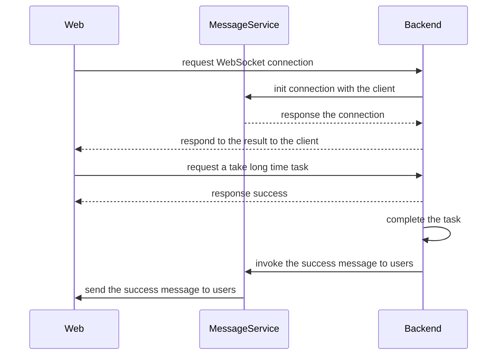

pg2 is an erlang module that implements **process groups**. Each message may be sent to one, some, or all group members.

## pg

[Pg](https://www.erlang.org/doc/man/pg.html) is a replacement for pg2, which is deprecated from OTP 24. pg stands for Process Groups that can send sen message to one, some, or all group members.

The simplest explanation is that pg enables the creation of a group and the subsequent connection of processes to the group. As a result, the **name** is mapped to the PID list. All local or remote processes are listed in the PID list. A pg group is made visible to all system-connected nodes the moment it is created. Each node can call create without making a mistake because a pg group can be established numerous times without failing.

## In practice

Before I continue, let me mention that there are many methods to handle my specific situation; this is just how I did it. If we can think of a more practical approach to the issue or its resolution, it can be applied in numerous ways.
In our real problem with DF's product. We have been using Elixir to build a trading platform. We defined a service with some instances inside, a message publishing service. My team used this service to send messages to end-users via Web socket. The flow is described as follows:
1. Users connect to the server using the [WebSocket](https://en.wikipedia.org/wiki/WebSocket) protocol.
2. The server and web clients keep a connection.
3. Users invoke a take long time task
4. Servers respond to the success of the request.
5. After completing the complex task, the servers send a message that informs users

The Message service is deployed on K8s infrastructure. The good news is we can scale the service to treat the huge of users. The BAD issues are:
- How can we broadcast the message to all users?
- How can we know which service is treating the user?
- How can we keep the existing connection with users when the server dies?

### Temporary solution

- We are providing RESTful APIs to communicate with another service.
- Using pub-sub service to connect [pods](https://kubernetes.io/docs/concepts/workloads/pods/)
The solution can work on a small scale. However, the cost to maintain the communication between the pods is too HUGE. We spent time and money on the 3rd-party communication service.

### Practice using PG

pg library can solve the first problem. The idea is we make a GenServer in the service called Synchronization. When the Synchronization module is started, we have a process id. We make a group of processes in the [global](https://www.erlang.org/doc/man/global.html) context called the **Internal channel** group. When a new instance of service is born and joins the cluster of the Message publishing service, We add them to the **Internal channel**. When the backend server needs to broadcast the message to end-users via WebSocket, the backend server invokes one of the cluster's children. The message can be sent to all of **the remaining children**.

## Implement the solution

1. Init `:pg` supervisor in our Application
2. Make a Synchronization GenServer
3. Make the broadcast message function
4. Receive the message from the other children

In the origin pg document, we need to init the supervisor before interacting with it.
```elixir
# lib/pgdemo/application.ex
defmodule Pgdemo.Application do
  use Application
  
  def start(_type, _args) do
    children = [
        %{
          id: :pg,
          start: {:pg, :start_link, []}
        },
        Pgdemo.Synchronization
    ]
    opts = [strategy: :one_for_one, name: Pgdemo.Supervisor]
    Supervisor.start_link(children, opts)
  end
end
```

When init Synchronization GenServer, we add the current PID to the `:internal_channel` group. In the `update` function, we sent messages to all processes except the current process. We will receive the message by `handle_info` callback.
```elixir
# lib/pgdemo/synchronization.ex
defmodule Pgdemo.Synchronization do
  use GenServer

  def start_link([]) do
    GenServer.start_link(__MODULE__, [], name: __MODULE__)
  end

  def init([]) do
    :pg.join(:internal_channel, self())
    
    {:ok, []}
  end

  def update(some_param) do
    :pg.get_members(:internal_channel)
    |> Kernel.--(:pg.get_local_members(:internal_channel))
    |> Enum.each(fn pid ->
      IO.puts("Sending update to #{inspect(pid)}")
      send(pid, {:broadcast, {:update, some_param}})
    end)
  end

  def handle_info({:broadcast, {:update, some_param}}, state) do
    IO.puts("Received update with data:}")
    IO.inspect(some_param)
    
    {:noreply, state}
  end

end
```

### Simulate the solution locally

We start two instances of a server with a specific name, connect them together and publish the message from an instance. We can see the message that is broadcast to another.

```bash
$ > iex --name 1@127.0.0.1 -S mix

# New terminal with new execution
$ > iex --name 2@127.0.0.1 -S mix

# Connect two instances of service together
iex(2@127.0.0.1)2> Pgdemo.connect()

# Broadcast the message
iex(1@127.0.0.1)1> Pgdemo.update()
```

## Other features of the PG library

### Leave the group

In some cases, we can restart the GenServer. PG provides `:pg.leave/2`, `:pg.leave/3` for this purpose.
```elixir
defmodule Pgdemo.Synchronization do
  def handle_info({:EXIT, _pid, :client_down}, state) do  
    :pg.leave(:internal_channel, self())
    
    {:noreply, state}  
  end  
end
```

### Monitoring the group changes

PG library provides features to monitor the global process group. The changes are new children join(leave) the group. We can subscribe to the group to know the new child joining the service cluster:
- :pg.monitor/1 or :pg.monitor/2: to start the monitoring feature
- :pg.demonitor/1 or :pg.demonitor/2: to stop the monitoring feature

```elixir
defmodule Pgdemo.Synchronization do
  ...
  
  def init([]) do
    :pg.join(:internal_channel, self())
    {ref, pid} = :pg.monitor(:internal_channel)
    
    IO.inspect(ref)
    IO.inspect(pid)
    {:ok, []}
  end

  def handle_info({ref, join, group, pids}, state) do
    IO.inspect(ref)
    IO.inspect(join)
    IO.inspect(group)
    IO.inspect(pids)
    
    {:noreply, state}
  end
end
```

The use-case can be when a new child joins the cluster, we can sync data from the old ones.

### Scope in PG

The difference between pg and pg2 is scope. In the pg2 version, we can classify the processes by an upper layer. You can imagine we build a super app using the same global: order service, payment service, message service,... In some cases, we just broadcast the message inner the service. On the other hand, we can broadcast the message to all of the services in our system.

## Conclusion

Before OTP 23, we can use [pg2](https://www.erlang.org/docs/18/man/pg2.html) to use the group process management feature. In the meantime, the pg replaces the old one with the upgraded feature set and improves the performance. From DF, we solved the communication services problem without 3rd-party services.

## References

- https://stephenbussey.com/2018/02/17/pg2-basics-use-process-groups-for-orchestration-across-a-cluster.html
- https://www.erlang.org/doc/man/pg.html
- https://stackoverflow.com/questions/67957826/what-is-the-correct-way-to-start-pgs-default-scope-in-an-elixir-1-12-applica