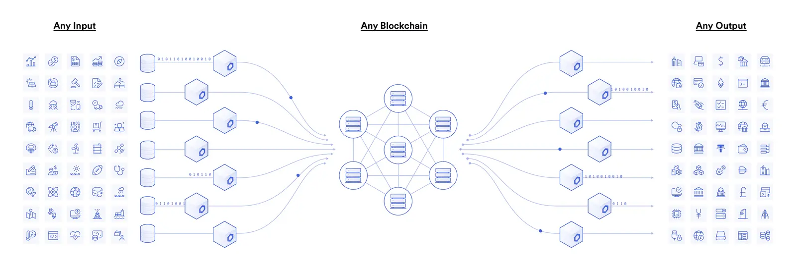

## The blockchain oracle problem
Blockchains have a fundamental limitation: they cannot natively communicate with systems of the outside world. This lack of external connectivity, known as "the oracle problem", prevents smart contracts from verifying external events, trigger actions on existing systems, and providing users the full range of functionality.

## What is a blockchain oracle?
A blockchain oracle is a third-party service that connects smart contracts with the outside world, primarily to feed information in about the world around, but the reverse is also true.

 _Blockchain oracles connect blockchains to inputs and outputs of the real world (Image source: [Chainlink](https://chain.link/))_

## Types of blockchain oracles
### Input oracles
The most widely recognized type of oracle today is known as an “input oracle”, which fetches data from the real-world(off-chain) and delivers it onto a blockchain network for smart contracts consumption. A good example of this are the Chainlink Price Feeds.

### Output oracles
The opposite of input oracles are "output oracles", which allow smart contracts to send commands to off-chain systems to trigger and execute certain actions.

### Cross-chain oracles
This type of oracle can read and write information between different blockchains. Cross-chain oracles enable interoperability for moving both data and assets between blockchains.

### Compute-enabled oracles
This type of oracle provides decentralized services with secure, off-chain computation that would otherwise be impractical to do on the blockchain due to technical, legal, or financial constraints.

## Notable blockchain oracles
- Chainlink (LINK)
- Band Protocol (BAND)
- Teller (TRB)
- Decentralized Information Asset (DIA)
- API3

#### Reference
- [Wikipedia - Blockchain oracle](https://en.wikipedia.org/wiki/Blockchain_oracle#:~:text=A%20blockchain%20oracle%20is%20a,that%20decentralised%20knowledge%20is%20obtained.)
- [https://chain.link/education/blockchain-oracles](https://chain.link/education/blockchain-oracles)
- [https://coin98.net/what-is-blockchain-oracle](https://coin98.net/what-is-blockchain-oracle)

---
<!-- cta -->

### Contributing
At Dwarves, we encourage our people to read, write, share what we learn with others, and [[CONTRIBUTING|contributing to the Brainery]] is an important part of our learning culture. For visitors, you are welcome to read them, contribute to them, and suggest additions. We maintain a monthly pool of $1500 to reward contributors who support our journey of lifelong growth in knowledge and network.

### Love what we are doing?
- Check out our [products](https://superbits.co)
- Hire us to [build your software](https://d.foundation)
- Join us, [we are also hiring](https://github.com/dwarvesf/WeAreHiring)
- Visit our [Discord Learning Site](https://discord.gg/dzNBpNTVEZ)
- Visit our [GitHub](https://github.com/dwarvesf)