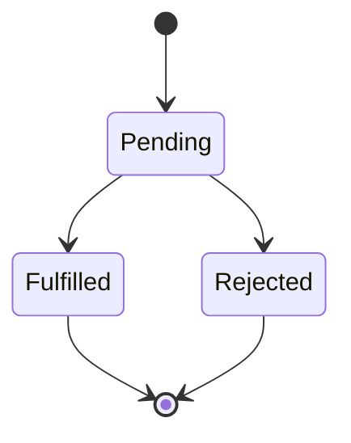

Javascript is a single-threaded programming language that has single-threaded at the runtime. It has a single call stack so it can do one thing simultaneously. JavaScript has a runtime model based on an **event loop**, which is responsible for executing the code, collecting and processing events, and executing queued sub-tasks. Javascript is a single-threaded, non-blocking asynchronous concurrent language. A JavaScript runtime uses a message queue, a list of messages to be processed. Each message has an associated function that gets called to handle the message.

```javascript
while (queue.waitForMessage()) {
  queue.processNextMessage()
}
```

Each message is processed completely before any other message is processed. There are three components in the runtime concepts: stack, heap, and queue.

- Stack: contains the function calls. Each function call creates a stack frame that includes the statement and expression in the function. When that function returns a value or void, its frame is popped out, and the next function will begin executing. If we call a function inside another function, a frame will be created for each.
- Heap: is a largely unstructured area of memory allocated to the objects in our code.
- Callback queue: is a data structure, message queue, that stores a list of messages to be processed. Each message has an associated function that gets called to handle the message.

```javascript
function mult(a, b) {
  return a * b
}
function square(n) {
  return mult(n, n)
}
function printSquare(n) {
  let squared = square(n)
  console.log(squared)
}

printSquare(4)
```

When running the above program, the Javascript will run the function step-by-step and add the function call to the `stack`. The first is: that the `printSquare()` function is added to the stack. The next functions are `square()`, `mult()`. The items in the `stack` will be executed orderly.

## Javascript is a single-threaded language
In reality, we always execute many tasks for a long time. These are opening a big file, downloading an image, or invoking a third-party service... We need to wait for the function call to be completed. How do we deal with the function call with the execution time too long? The Javascript runtime that is supported from the web browser, node.js. The web browser, or JS engines,... provides the APIs that help us run the task outside the `stack`. It means the long-time functions have already been finished in the stack, and the following function in the `stack` won't be blocked.


After the JS engine executes the task, it will push the callback onto the `callback queue`. If the `stack` is empty, it takes the first thing on the `callback queue` and makes it onto the `stack`. In conclusion, JavaScript code is single-threaded and only does one thing at a time; however, the **Javascript runtime** executes the task asynchronously as multi-threaded. Once that background thread completes, and the current call stack finishes executing, your callback function is pushed onto the (now empty) call stack and run to completion. However, the developer faced a new issue called Callback Hell. Which is essentially nested callbacks stacked below one another, forming a pyramid structure. Every callback depends/waits for the previous callback, thereby making a pyramid structure that affects the readability and maintainability of the code. We solved the problem by the data structures or built-in functions.

## Implement using callback in reality
We can implement a feature called `payMyBill()` that will read the invoice total from the backend, call the third-party service API to charge money, update the billing status, and update the cart. Assuming the `getInvoiceTotal()`, `chargeMoney()`, `updateBilling()`, and `updateCart()`.

```javascript
let getInvoiceTotal = (invoiceId, callback) => {
  let invoiceData = fetch('/invoice/#{invoiceId}')
  callback(invoiceData)
}
let chargeMoney = (total, callback) => {
  rs = chargeAPI('/charges/#{total}')
  callback(rs)
}
let updateBilling = (data, callback) => {
  let res = fetch('PUT', '/invoice/#{invoiceId}', data)
  callback(res)
}
let updateCart = (data, callback) => {
  Cart.update(data)
  callback(true)
}

let payMyBill = (invoiceId) => {
  return getInvoiceTotal(invoiceId, function (invoice) {
    chargeMoney(invoice.total, function (isSuccess) {
      updateBilling(isSuccess, function (updated) {
        updateCart(updated, function (cart) {
          return cart // callback hell
        })
      })
    })
  })
}
```

## Promise
A Promise is a Javascript object that allows us to make async calls. It produces a value when the async operation completes successfully or an error if it doesn't complete. A Promise object has two main components: state of the execution and result.

- Pending: when the execution function starts.
- Fulfilled: when the promise resolves successfully.
- Rejected: when the promise rejects or gets an error.



In the `promise` implementation, we can find out they use `setTimeout()` function. It ensures the task is always running asynchronously. We can use the Promise chaining to flatten the logic of the callback chain.

```javascript
let getInvoiceTotal = (invoiceId) => {...}; // return the Promise
let chargeMoney = (total) => {...}; // return the Promise
let updateBilling = (data) => {...}; // return the Promise
let updateCart = (data) => {...}; // return the Promise

let payMyBill = (invoiceId) => {
  return getInvoiceTotal(invoiceId)
     .then(invoice => chargeMoney(invoice.total))
     .then(isSuccess => updateBilling(isSuccess))
     .then(updated => updateCart(updated))
     .then(cart => {
       return cart;
     });
};
```

## async and await
ES2017 introduced the `async`/`await` that helps you write the code cleaner than the promise chaining technique.

- `async` keyword allows us to define a function that handles asynchronous operations.
- `await` keyword to wait for a `Promise` to settle either in the resolved or rejected state.

```javascript
let payMyBill = async (invoiceId) => {
  let invoice = await getInvoiceTotal(invoiceId)
  let isSuccess = await chargeMoney(invoice.total)
  let updated = await updateBilling(isSuccess)
  let cart = await updateCart(updated)

  return cart
}
```

To get the most out of our single-threaded program, we need to invoke JavaScript’s event loop superpowers. We can queue two async operations and wait for both to complete. In our example, we should make `updateBilling` and `updateCart` run simultaneously. We used `Promise.all()` to wait for concurrent operations to finish, then aggregated the results to update the `Cart`. The `Promise.all()` function works just fine for a few concurrent spots, but code quickly devolves when you alternate between chunks of code that can be executed concurrently and others that are serial. This intrinsic ugliness is not much improved with `async` functions.

## Race condition
The term "race condition" usually refers to a conflict when accessing shared variables in a multithreading environment. Although your Javascript code is only executed by one thread at a time, it is still possible to encounter similar problems. This is a common issue when people make their functions 'async' without thinking about the consequences. The best way to avoid these issues is to prevent using async functions when they are not necessary. A pure function is described as:

- A referentially transparent `function` will always return the same output for the same input.
- Have no side effects - it doesn't affect the outside world. The referential transparency and the lack of side effects make pure functions more applicable. Other benefits are better composability, unit testing, parallelization, easier debugging, etc.

## Conclusion
Concurrent code is preferable to sequential code because it is non-blocking and can handle several events simultaneously. The JavaScript’s event loop helps us solve the concurrency problem. We can handle shared states by combining results inside a single thread. The new syntax or library supported JS developers' coding experience. We solved callback hell by Promise; `async`/`await` keyword. Remember, _JavaScript is a single-threaded language and, at the same time, also non-blocking, asynchronous, and concurrent_

## References
https://developer.mozilla.org/en-US/docs/Web/JavaScript/EventLoop https://www.promisejs.org/implementing/ https://www.geeksforgeeks.org/what-to-understand-callback-and-callback-hell-in-javascript https://javascript.info/promise-chaining https://www.javascripttutorial.net/es-next/javascript-async-await/

---
<!-- cta -->

### Contributing
At Dwarves, we encourage our people to read, write, share what we learn with others, and [[CONTRIBUTING|contributing to the Brainery]] is an important part of our learning culture. For visitors, you are welcome to read them, contribute to them, and suggest additions. We maintain a monthly pool of $1500 to reward contributors who support our journey of lifelong growth in knowledge and network.

### Love what we are doing?
- Check out our [products](https://superbits.co)
- Hire us to [build your software](https://d.foundation)
- Join us, [we are also hiring](https://github.com/dwarvesf/WeAreHiring)
- Visit our [Discord Learning Site](https://discord.gg/dzNBpNTVEZ)
- Visit our [GitHub](https://github.com/dwarvesf)