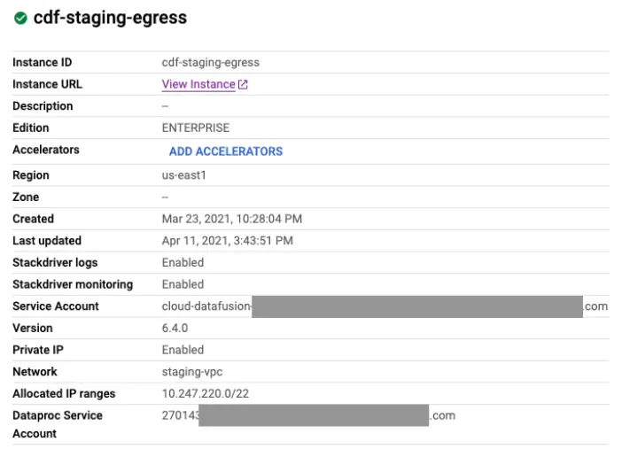
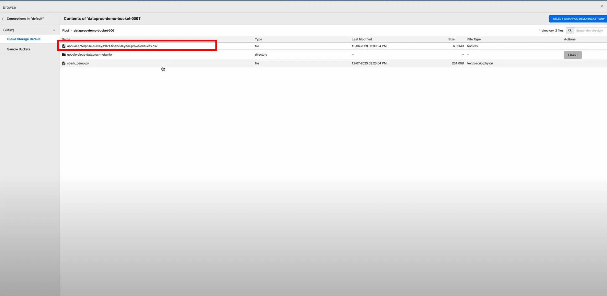
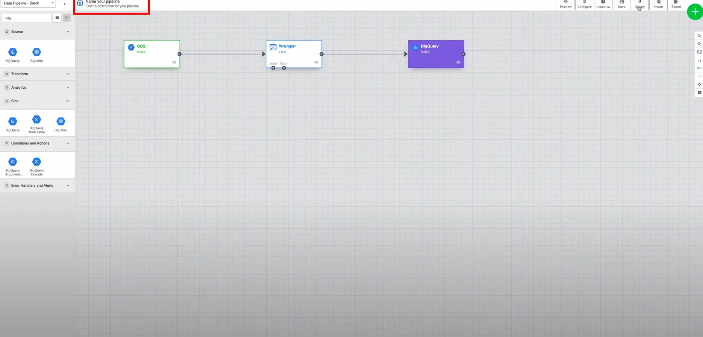
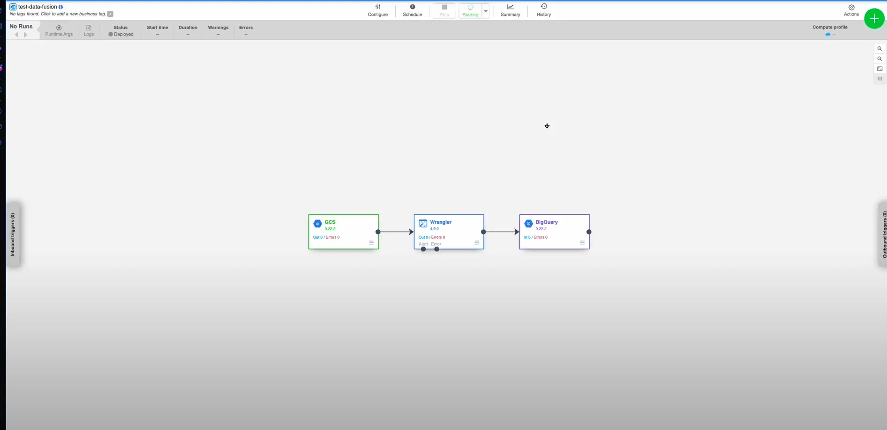
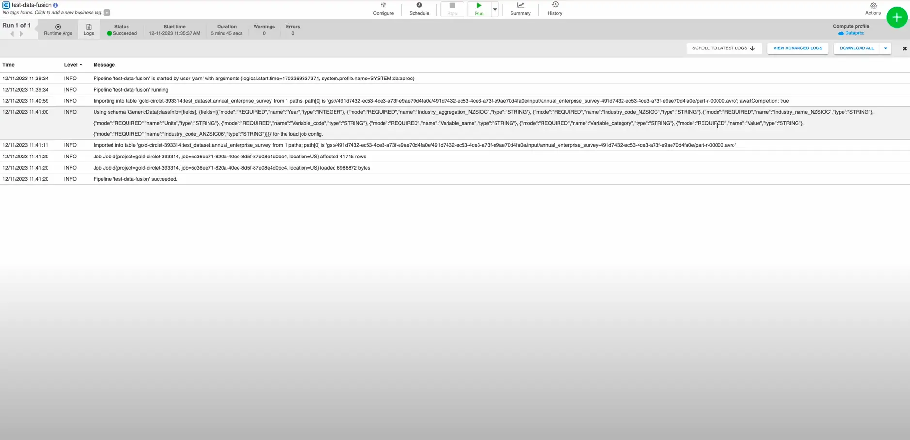

---
tags:
  - engineering/data
  - devops
  - google-cloud
  - Google-Data-Studio
  - google-data-fusion
  - ETL
  - reliability
  - CDAP
  - data-engineering
author: Nguyen Hieu Nghia
github_id: mickwan1234
date: 2024-01-22
icy: 10
---

## Introduction
Google Data Fusion is a fully managed, cloud-native data integration service that enables users to efficiently build and manage ETL/ELT data pipelines. It is designed to streamline data engineering tasks for enterprise users and is built on top of the open-source project CDAP

. Key features and benefits of Google Data Fusion include:

- **Graphical User Interface**: Data Fusion offers a convenient drag-and-drop interface for building data pipelines, making it easier for users to focus on insights and actions rather than writing code.
- **Flexibility**: While the UI provides a quick and easy way to create pipelines, Data Fusion is also extensible, allowing users to add custom code when needed**[2](https://gcloud.devoteam.com/blog/what-is-google-cloud-data-fusion/)**.
- **GCP-native Architecture**: Data Fusion is fully integrated and supported by Google Cloud Platform, unlocking the scalability, reliability, security, and privacy guarantees of Google Cloud.
- **Data Governance**: Data Fusion includes built-in features for data governance, such as end-to-end data lineage, integration metadata, and cloud-native security and data protection services.
- **Integration with Google Cloud Services**: Data Fusion connects with various Google Cloud services, such as Cloud Storage, BigQuery, and Cloud Spanner, allowing users to create, manage, and analyze data in a centralized manner.

Overall, Google Data Fusion simplifies data engineering tasks and enables users to focus on data analytics and deriving insights for better customer service and operational efficiency

## Use Cases
Google Cloud Data Fusion is a powerful tool for building and managing data pipelines, and its use cases are diverse and expanding. Here are some of the most common and impactful ways organizations are using it:

**Data Integration and ETL:**

- **Consolidating data from multiple sources:** Data Fusion simplifies data ingestion from various on-premises, cloud, and SaaS applications, unifying it into a single repository for analysis. Examples include CRM, ERP, social media, and sensor data.
- **Transforming and enriching data:** Data Fusion offers a wide range of data transformation tools, including filtering, sorting, aggregation, and joining, enabling you to clean, enrich, and prepare data for specific use cases.
- **Building data warehouses and lakes:** Data Fusion seamlessly integrates with Google BigQuery and other data storage solutions, facilitating the creation of centralized data repositories for analytics and reporting.

**Data Migration and Modernization:**

- **Migrating data to the cloud:** Data Fusion simplifies the process of migrating on-premises data to Google Cloud, providing a managed and scalable solution for organizations looking to modernize their data infrastructure.
- **Replicating data between cloud platforms:** Data Fusion enables seamless data replication between different cloud environments, including Google Cloud Platform, AWS, and Azure, ensuring data consistency and availability.

**Real-time Data Processing and Analytics:**

- **Building real-time data pipelines:** Data Fusion supports Apache Spark, allowing you to create real-time data pipelines for near-instantaneous insights and decision-making based on streaming data feeds.
- **Enabling real-time dashboards and reports:** Data Fusion can be used to feed data into real-time dashboards and reports, providing stakeholders with immediate visibility into critical business metrics.
- **Triggering actions based on data events:** Data Fusion can be used to trigger actions based on specific data events, such as sending alerts, updating records, or initiating workflows in other systems.

**Additional Use Cases:**

- **Data governance and compliance:** Data Fusion offers features like data lineage tracking and auditing, ensuring data quality and compliance with regulations.
- **Self-service data access:** Data Fusion empowers business users with self-service data access capabilities, allowing them to explore and analyze data without needing technical expertise.
- **Building custom data connectors:** Data Fusion provides a framework for building custom connectors to integrate with niche applications and data sources.

These are just a few examples, and the possibilities for using Data Fusion are vast. Its flexibility, scalability, and ease of use make it a valuable tool for organizations looking to unlock the potential of their data.

## Pricing
Google Data Fusion have some pricing tier in the following table:


Comparison between the tiers:


## How to setup Data fusion:
### Prerequisites:
1. **Google Cloud Platform Account:** Ensure that you have a Google Cloud Platform (GCP) account. If you don't have one, you can sign up [here](https://cloud.google.com/).
2. **Enable the Cloud Data Fusion API:** In the GCP Console, navigate to the API & Services > Dashboard. Search for "Cloud Data Fusion API" and enable it.
3. **Install and Configure Google Cloud SDK:** Install the [Google Cloud SDK](https://cloud.google.com/sdk) on your local machine. After installation, run **`gcloud init`** to set up your credentials and project.

### Steps to Set Up Google Cloud Data Fusion:
1. **Create a Cloud Storage Bucket:** Create a Cloud Storage bucket to store the artifacts and metadata required by Cloud Data Fusion. Replace **`[BUCKET_NAME]`** with your desired bucket name.
    
    ```bash
    bashCopy code
    gsutil mb -l [REGION] gs://[BUCKET_NAME]
    
    ```
    
2. **Create a Cloud Data Fusion Instance:** Use the following command to create a Cloud Data Fusion instance. Replace **`[INSTANCE_NAME]`** with your desired instance name, and **`[REGION]`** with the region where you want to deploy the instance.
    
    ```bash
    bashCopy code
    gcloud data-fusion instances create [INSTANCE_NAME] \\
      --region=[REGION] \\
      --zone=[ZONE] \\
      --network=[NETWORK_NAME] \\
      --subnet=[SUBNET_NAME] \\
      --bucket-uri=gs://[BUCKET_NAME]/[DIRECTORY]
    
    ```
    
    - **`-zone`**: Specify the zone for the instance.
    - **`-network`**: Specify the VPC network name.
    - **`-subnet`**: Specify the subnet within the network.
    - **`-bucket-uri`**: Specify the Cloud Storage bucket URI.
3. **Access Cloud Data Fusion UI:** After the instance is created, you can access the Cloud Data Fusion UI using the generated endpoint. Navigate to the URL displayed in the command output.
    
    ```bash
    bashCopy code
    gcloud data-fusion instances describe [INSTANCE_NAME] --region=[REGION]
    
    ```
    
4. **Connect to the Cloud Data Fusion UI:** Open the provided URL in a web browser to access the Cloud Data Fusion UI. Log in using your Google Cloud credentials.
    
5. **Explore and Create Pipelines:** Once you're in the Cloud Data Fusion UI, you can start exploring and creating ETL pipelines using the visual interface.
    

Remember to replace placeholders like **`[REGION]`**, **`[BUCKET_NAME]`**, **`[INSTANCE_NAME]`**

## How to setup a simple ETL with Google Data Fusion ( with GCP console):
In this demo we’ll setup a simple ETL pipeline to import, transform load a csv file to a Google Big query data table

### Step 1: go to the Big Query console page and create a dataset and table:
- On the top left corner of the main page of Big query select add and add a dataset. Then click on the three dot simple on the left side of the data set name to add a table. Right after that. you should see this screem to add a table.
	- 
- Fill in the table name (the only mandatory field that left blank after you do the previous step). You can tweak others setting if you want to. Then click Create Table.

## Step 2: Go to your Google Data Fusion instance
- Go to your Data Fusion page and locate your data fusion instance. You should be see it listed right after you go the main page of Data fusion console.
- Click on the instance you should be able to see a prompt like this:
	- 
- Click the View Instance link. You should see the landing page of Google Data Fusion instance. Click on Studio button to start designing pipelines. You should see a screen like this:
	- 

## Step 3: Preparing you CSV file on GCS
- Create a bucket and push you CSV to the storage. I prepared mine like this.
	- 

### Step 4: Start designing your first pipeline
- We’ll create a GCS as a source of data so on the search bar, search for ‘gcs’ and drag the ‘GCS’ simple in the `Source` section to the canvas
	- 
- Click on `Properties` and you should be able to see a screen like this.
	- 
- Click on `Browse` to browse through the files you uploaded to GCS. Locate your csv data source file and select it.
	- 
- (Optional) Enable the `Enable Quoted Values` and `Use First Row as Header` toggles and click on `Get Schema`. You should able to find your data schema on the right side of the screen
	- 
- You finished setting up the source CSV. Go on and click the `X` button on the top right next to `Validate` button.
- Next, you’ll need to transform data to match you expected schema. Search for `wrangler` on the search bar and drag out `Wrangler` in the  `Transform` section and drag an arrow from `GCS` box to it for Wrangler to recognize the input schema.
	- 
- Then click on `properties` of the the `Wrangler` box.
	- 
- Here you can transform your data. Defines you output schema on the left and properties in the middle section. Here I’ll just left it like it is since it a simple demo.
- Click on the top right `X` button to go back to the canvas.
- Next, you’ll need a storage for you output data. Search `bigquery` in the search box and drag out `Bigquery` box from the `Sink` section and connect it to the `Wrangler` box.
	- 
- Click on `Properties` of the Bigquery box you’ll find this screen.
	- 
- You can find you input data schema on the left side of the screen. Here click on `Browse` to locate your Bigquery data table that you created in step 1 (Mine is `annual_enterprise_survey` in this case) and select it by double click.
	- 
- (Optional) you can force the destination table of match you input schema by turn on these toggle.
	- 
- Click on the `X` again to go back to the canvas. You completed your first pipeline.

### Step 5: Deploy and Run your pipeline
- Naming your pipeline ( the name must be unique in the instance). Click on the `Name your pipeline` text on the top left of the screen.
	- 
- Then click on `Deploy` button on the top right to deploy the pipeline.
	- 
- Wait for the deploy process to complete. You will face this screen
	- 
- Click on the `Run` button at the top center of the screen and wait for it to execute pipelines.
	- 
- After the the status show `Succeeded` you can check your destination table for the output data.
	- 
- Here is the end result data in your Bigquery data table.
	- 

And that’s it, you’re done. Congrat on your first data pipeline with Google Data Fusion.
