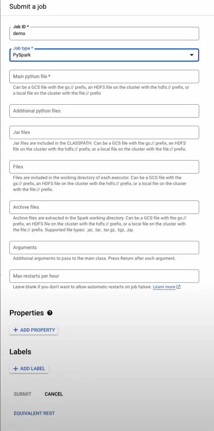
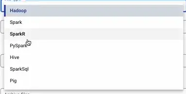

---
tags:
  - engineering/data
  - data
  - data-engineering
  - google-dataproc
  - hadoop
  - streaming
  - ETL
author: Nguyen Hieu Nghia
github_id: mickwan1234
date: 2024-01-22
icy: 10
---

## Introduction
Google Dataproc is a fast and easy-to-use, fully managed cloud service for running Apache Spark and Hadoop workloads. It allows users to process and analyze large-scale data efficiently and at scale. Key features and benefits of Google Dataproc include:

- **Fast and Scalable Processing**: Dataproc enables users to run Apache Spark and Hadoop workloads on Google Cloud Platform, taking advantage of its scalable infrastructure and resources.
- **Integration with Google Cloud Services**: Dataproc integrates seamlessly with other Google Cloud services, such as BigQuery, Cloud Storage, and Cloud Spanner, allowing users to access and analyze data in a centralized manner**[1](https://cloud.google.com/dataproc)**
- **Data Analytics and Machine Learning**: Dataproc supports data scientists and engineers in building and deploying machine learning models, as well as analyzing data using custom-built applications and open-source libraries.
- **Managed and Secure Environment**: Google Dataproc provides a fully managed and secure environment for running data processing workloads, ensuring that users can focus on their data analysis and insights without worrying about infrastructure management**[1](https://cloud.google.com/dataproc)**.

Overall, Google Dataproc simplifies big data processing and analysis by providing a fast, scalable, and integrated platform for running Apache Spark and Hadoop workloads on Google Cloud Platform.

## Use cases
Google Cloud Dataproc has a wide range of use cases for processing large datasets and running big data applications. Here are some of the most popular examples:

**Batch processing:**

- **Data warehousing and ETL:** Dataproc can be used to extract, transform, and load (ETL) data from various sources into data warehouses like BigQuery. It can also be used to process and clean large datasets for data analysis.
- **Log processing:** Dataproc can be used to analyze massive log files from web applications, servers, and other systems to identify trends and troubleshoot issues.
- **Financial analysis:** Dataproc can be used to analyze large financial datasets for fraud detection, risk assessment, and portfolio management.
- **Scientific simulations:** Dataproc can be used to run large-scale scientific simulations in fields like physics, chemistry, and biology.
- **Image processing:** Dataproc can be used to process and analyze large collections of images and videos for applications like object recognition, facial recognition, and image classification.

**Real-time processing:**

- **Data streaming:** Dataproc can be used to process data streams in real-time for applications like fraud detection, anomaly detection, and event processing.
- **Internet of Things (IoT):** Dataproc can be used to analyze data from IoT devices in real-time for applications like environmental monitoring, predictive maintenance, and smart city management.
- **Machine learning:** Dataproc can be used to train and deploy machine learning models on large datasets.

**Other use cases:**

- **Web scraping:** Dataproc can be used to scrape data from websites at scale.
- **Social media analysis:** Dataproc can be used to analyze large social media datasets for sentiment analysis, topic modeling, and social network analysis.
- **Genomics:** Dataproc can be used to analyze large genomic datasets for research and clinical applications.

## Pricing
[Dataproc on Compute Engine](https://cloud.google.com/dataproc) pricing is based on the size of Dataproc clusters and the duration of time that they run. The size of a cluster is based on the aggregate number of [virtual CPUs (vCPUs)](https://cloud.google.com/compute/docs/machine-types) across the entire cluster, including the master and worker nodes. The duration of a cluster is the length of time between cluster creation and cluster stopping or deletion.

The Dataproc pricing formula is: `$0.010 * # of vCPUs * hourly duration`.

Although the pricing formula is expressed as an hourly rate, Dataproc is billed by the second, and all Dataproc clusters are billed in one-second clock-time increments, subject to a 1-minute minimum billing. Usage is stated in fractional hours (for example, 30 minutes is expressed as 0.5 hours) in order to apply hourly pricing to second-by-second use.

Dataproc pricing is in addition to the [Compute Engine per-instance price](https://cloud.google.com/compute/pricing) for each virtual machine (see [Use of other Google Cloud resources](https://cloud.google.com/dataproc/pricing#use_of_other_google_cloud_resources)).

As an example, consider a cluster (with master and worker nodes) that has the following configuration:

|Item|Machine Type|Virtual CPUs|Attached persistent disk|Number in cluster|
|---|---|---|---|---|
|Master Node|n1-standard-4|4|500 GB|1|
|Worker Nodes|n1-standard-4|4|500 GB|5|

This Dataproc cluster has 24 virtual CPUs, 4 for the master and 20 spread across the workers. For Dataproc billing purposes, the pricing for this cluster would be based on those 24 virtual CPUs and the length of time the cluster ran (assuming no nodes are scaled down or preempted). If the cluster runs for 2 hours, the Dataproc pricing would use the following formula:

`Dataproc charge = # of vCPUs * hours * Dataproc price = 24 * 2 * $0.01 = $0.48`

In this example, the cluster would also incur charges for Compute Engine and Standard Persistent Disk Provisioned Space in addition to the Dataproc charge (see [Use of other Google Cloud resources](https://cloud.google.com/dataproc/pricing#use_of_other_google_cloud_resources)). The [billing calculator](https://cloud.google.com/products/calculator) can be used to determine separate Google Cloud resource costs.

## How to setup a Dataproc cluster
### ****Prerequisites:****
1. **Google Cloud Platform Account:**
    - You need a GCP account. If you don't have one, you can sign up for a free trial at [Google Cloud Console](https://console.cloud.google.com/).
2. **Enable Billing:**
    - Make sure you have billing enabled for your GCP project.
3. **Install Google Cloud SDK:**
    - Install the [Google Cloud SDK](https://cloud.google.com/sdk/docs/install) on your local machine. This SDK includes the **`gcloud`** command-line tool, which you'll use to interact with GCP.
4. **Create a GCP Project:**
    - Create a GCP project if you don't already have one. You can do this through the [GCP Console](https://console.cloud.google.com/).
5. **Enable APIs:**
    - Enable the necessary APIs for Dataproc and other services. You can do this through the [APIs & Services > Dashboard](https://console.cloud.google.com/apis/dashboard) section in the GCP Console.

### **Set Up a Dataproc Cluster:**
Now that you have the prerequisites in place, you can proceed to set up a Dataproc cluster:

1. **Open Cloud Shell:**
    
    - Open the [Google Cloud Console](https://console.cloud.google.com/).
    - Click on the "Activate Cloud Shell" button in the upper right corner.
2. **Create a Dataproc Cluster:**
    
    - Use the following **`gcloud`** command to create a Dataproc cluster. Adjust the parameters as needed.
        
        ```bash
        bashCopy code
        gcloud dataproc clusters create CLUSTER_NAME \\
          --region REGION \\
          --num-workers NUM_WORKERS \\
          --worker-machine-type MACHINE_TYPE \\
          --master-machine-type MASTER_MACHINE_TYPE
        ```
        
        Replace the placeholders (**`CLUSTER_NAME`**, **`REGION`**, **`NUM_WORKERS`**, **`MACHINE_TYPE`**, **`MASTER_MACHINE_TYPE`**) with your desired values.
        
3. **Access the Cluster:**
    
    - Once the cluster is created, you can access the master node using SSH. You can find the SSH command in the Dataproc cluster details in the GCP Console.
4. **Run Jobs:**
    
    - Submit jobs to your Dataproc cluster using tools like Apache Spark or Hadoop. You can submit jobs using the **`gcloud dataproc jobs submit`** command.
5. **Delete the Cluster:**
    
    - When you're done with the cluster, remember to delete it to avoid incurring unnecessary costs.
        
        ```bash
        bashCopy code
        gcloud dataproc clusters delete CLUSTER_NAME --region REGION
        ```
        
        Replace the placeholders with your cluster's name and region.
        

## How to deploy a Spark job on Dataproc (Using Google cloud console)
### Step 1: In the created cluster click on `Submit Job` button on the top right of the main console screen


### Step 2: Fill all necessary field in the job creation modal:

- Job ID: job unique name across the cluster
- Job Type: the type of the job that you submit to Dataproc including (in this demo we’ll use PySpark):

- Main file: the directory of main job file from GCS or HDFS or inside the compute engine.
- All others field is optional.
- After you fill in the necessary input i should be something like this:


- Then press `Submit` to submit the job

### Step 3:
After submitting the job you should be able to similar screen to this:


Wait for the job status change to succeeded (or failed):


And that is how you run a Spark ( or Hadoop) job on Google Cloud Dataproc.
Full video step by step:
![[_assets/Google Dataproc/830c086903ad2dcaf7bdece0af8e3647_MD5.mp4]]

---
<!-- cta -->

### Contributing
At Dwarves, we encourage our people to read, write, share what we learn with others, and [[CONTRIBUTING|contributing to the Brainery]] is an important part of our learning culture. For visitors, you are welcome to read them, contribute to them, and suggest additions. We maintain a monthly pool of $1500 to reward contributors who support our journey of lifelong growth in knowledge and network.

### Love what we are doing?
- Check out our [products](https://superbits.co)
- Hire us to [build your software](https://d.foundation)
- Join us, [we are also hiring](https://github.com/dwarvesf/WeAreHiring)
- Visit our [Discord Learning Site](https://discord.gg/dzNBpNTVEZ)
- Visit our [GitHub](https://github.com/dwarvesf)