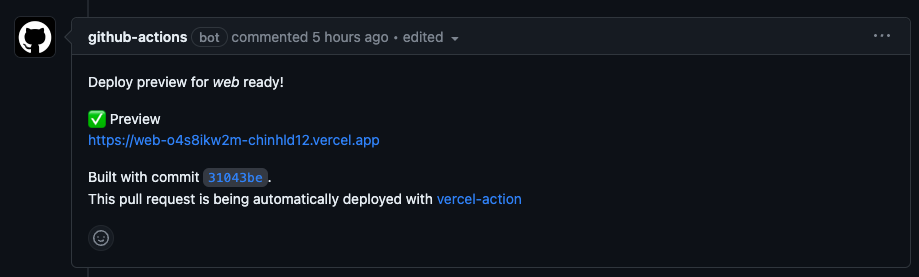
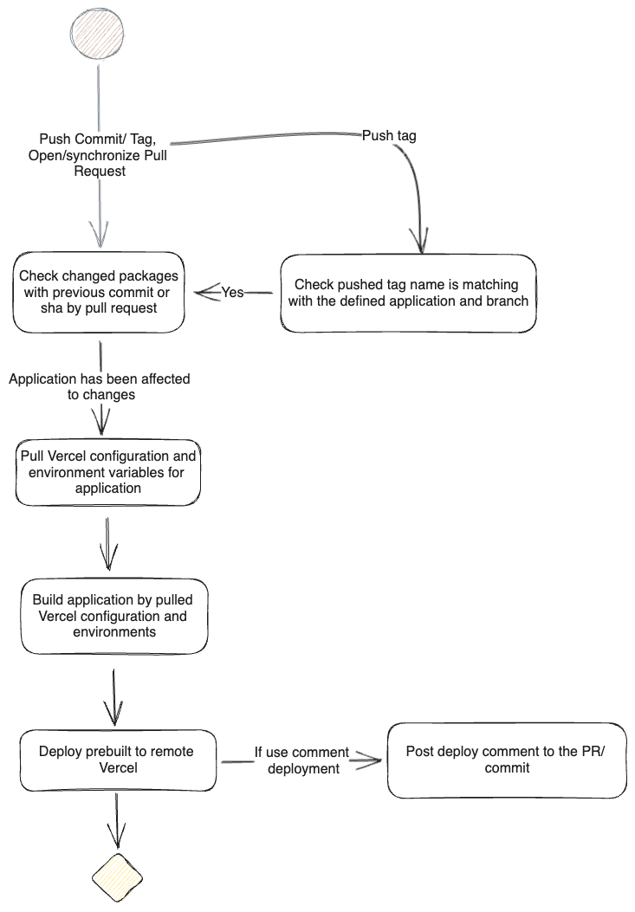

## Introduction
When we have multiple applications within a monorepo project and we integrate Vercel with our version control system like GitHub, we may encounter a significant obstacle in deploying only a specific app for a particular branch. In this situation, all Vercel project applications will be built automatically whenever we push a commit to the branch. The only option available to us is manually canceling the build for the applications we do not intend to deploy across specific Vercel projects.

To tackle this challenge, we can utilize a combination of GitHub Actions and the Vercel CLI. This article will explore the solutions to address and overcome these difficulties.

## Requirement
To meet the primary requirement, we need to pre-configure the Vercel Projects settings to ensure the proper retrieval of environment variables and configure the projects for deployment on Vercel.

## Challenge
The main challenge faced when using Vercel CLI is the inability to use a specific branch and environment exclusively for the target branch during deployment using the `vercel deploy` command, as this functionality is currently not supported.

To overcome these challenges, the proposed solution focuses on building for a specific branch while considering the corresponding environment variables and configuration declared within the Vercel Project. Additionally, leveraging built cache and checking for ignored builds based on changes can optimize the deployment process.

## Approach
The following steps outline the implementation approach:

1. Execute the turbo repo `build dry` in order to generate a JSON file containing details about the workspaces affected by changes in application or shared package dependencies.
2. For each step in the process of building the Vercel applications, analyze the packages listed in the `dry JSON` to identify the applications that need to be built.
3. Since the Vercel Deploy CLI lacks support for deploying to specific branches, an alternative method can be employed. Retrieve the Vercel Project Environment and configuration associated with the desired branch, and then use this information proceed to locally pre-build the application using within the GitHub Actions CI, and finally push the pre-built application to Vercel remotely.

## Implementation
The implementation of this approach consists of the following steps:

1. Setup Vercel Project Configuration for lately using on the vercel build with the build command, output direct, root directory and project environment matching with every single branch.
2. Setup Github Secrets and Variables to using in workflows.
3. We create a workflow to run turbo `dry json` to getting all the applications needs to be built by detecting the changes, You can dynamically add conditionals to the jobs before the build.

   ```yaml
   # .github/workflows/changed-packages.yml

   name: 'Determine changed packages'
   on:
     workflow_call:
       outputs:
         package_changed:
           description: 'Dry run of turbo to determine which packages have changed since the last release'
           value: ${{ jobs.dry-run.outputs.package_changed }}
   jobs:
     dry-run:
       runs-on: ubuntu-latest
       env:
         # The turbo filter here varies depending on if we're using this workflow in a PR or on a push to a branch
         # For PRs, we want to use `github.event.pull_request.base.sha` to tell turbo to see which packages changed since that SHA
         # For a branch push/merges, the above sha isn't available, so instead, we reference `HEAD^` to determine the previous `HEAD` of the branch we just pushed onto
         TURBO_REF_FILTER: ${{ github.event_name == 'pull_request' && github.event.pull_request.base.sha || 'HEAD^' }}
       outputs:
         # Defining a job output for used by the next jobs:
         package_changed: ${{ steps.changeset.outputs.result }}

       steps:
         - uses: actions/checkout@v2
           with:
             # we set to `0` so the referenced all commits history are available for the command below
             fetch-depth: 0

         - name: Changeset
           id: changeset
           shell: bash
           # 1. We need the 'output' of a turbo dry-run to get a json with all affected packages of these run.
           # 2. The multi line json string is wrapped in EOF delimeters to make the GHA happy: https://docs.github.com/en/actions/using-workflows/workflow-commands-for-github-actions#multiline-strings
           run: |
             echo 'result<<CHANGESET_DELIMITER' >> $GITHUB_OUTPUT
             echo "$(npx -y turbo build --dry-run=json --filter=...[$TURBO_REF_FILTER])" >> $GITHUB_OUTPUT
             echo 'CHANGESET_DELIMITER' >> $GITHUB_OUTPUT
   ```

4. Create workflow to deploy by the tag for specific branch like example below:

   4.1. Create Environment and workflow event

   ```yaml
   # .github/workflows/release.yml

   name: Release

   env:
     # The `VERCEL_ORG_ID` must be defined in the GitHub Secrets and used as a environment variable
     # for Vercel commands. It represents the Vercel Organization ID or Team ID.
     VERCEL_ORG_ID: ${{ secrets.VERCEL_ORG_ID }}

     # We can declare two environment variables to indicate to Vercel that we using remote caching for
     # the application build.
     # TURBO_TOKEN is the Vercel Access token we can get in Account Settings
     # TURBO_TEAM is the Vercel Team that we our projects belongs to
     TURBO_TOKEN: ${{ secrets.TURBO_TOKEN }}
     TURBO_TEAM: ${{ vars.TURBO_TEAM }}
   on:
     push:
       tags:
         # Utilize regular expressions to selectively trigger workflows
         # based on specific tags. For example, the workflow below will be triggered
         # when the tags have prefixes such as `web` or `docs`,
         # or when only the version is specified, indicating a need to run builds for all apps.
         # Ex: web-v1.0.0-beta, docs-v.1.3.6.3-beta.2, v2.0.1
         - 'web-v*.*.*'
         - 'docs-v*.*.*'
         - 'v*.*.*'

   jobs: ...
   ```

   In the `jobs` we will create following jobs: `check-app`, `changed-packges`, `deploy-app` and `deploy-all-apps`

   4.2 `Check-app` will help us to detect the application, branch, pull arguments

   ```yaml
   check-app:
     runs-on: ubuntu-latest
     outputs:
       # We utilize these outputs to define conditionals for building
       # specific applications or building all applications on a
       # specific branch, along with matching the Vercel config arguments
       # to the branch.
       app: ${{ steps.project-info.outputs.app }}
       branch: ${{ steps.project-info.outputs.branch }}
       pull_args: ${{ steps.project-info.outputs.pull_args }}
     steps:
       # This script extracts information from a given tag using a regular expression pattern.
       # It performs the following steps:

       - name: Extract Tag Info
         id: tag-info-raw
         uses: actions/github-script@v6
         with:
           script: |
             // 1. Get the tag value from the GitHub reference.
             const tag = "${{ github.ref }}";

             // 2. Remove the "refs/tags/" prefix from the tag.
             const tripTag = tag.replace('refs/tags/', '');

             // 3. Define a regular expression pattern to match against the tag.
             const regex = /^([a-z]+-)?v(\d+\.\d+(\.\d+)?)(-([a-z]+)(\.(\d+))?)?$/;

             // 4. Attempt to match the tag against the regular expression.
             const match = tripTag.match(regex);

             if (match) {
               // If there is a match, extract specific components from the tag.

               // 5. Extract the prefix from match group 1, removing the trailing hyphen.
               const prefix = match[1] ? match[1].slice(0, -1) : null;

               // 6. Extract the version from match group 2.
               const version = match[2];

               // 7. Extract the suffix from match group 5.
               const suffix = match[5] ? match[5] : null;

               // 8. Extract the revision from match group 7.
               const revision = match[7] ? match[7] : null;

               return {
                 app: prefix,
                 version: version,
                 branch: suffix,
                 revision: revision
               }
              } else {
               // If there is no match, indicate that the input string does not match the expected format.
               console.log('Input string does not match expected format');
               return {
                 app: null,
                 version: null,
                 branch: null,
                 revision: null
               };
             }

       - name: Extract tag to project info
         id: project-info
         run: |
           VERCEL_PULL_ARGS=""

           # From the output of the step above we will getting the application name and branch
           # and assign them for APP and BRANCH variable to check if them match with Vercel Project
           APP=$(echo ${{ fromJson(steps.tag-info-raw.outputs.result).app }})
           BRANCH=$(echo ${{ fromJson(steps.tag-info-raw.outputs.result).branch }})
           ENV=""

           if [[ $APP == "docs" ]]; then
             # If the APP is "docs" then do nothing
           elif [[ $APP == "web" ]]; then
             # If the APP is "web" then do nothing
           elif [[ -z $APP ]]; then
             # If the APP is not specified then do nothing
           else
             # Mean that the APP specified is not valid as we
             # Must end the flow by exit failure
             echo "App name is not valid"
             # Exit to prevent further execution
             exit 1
           fi

           if [[ $BRANCH == "beta" ]]; then
             # At here the branch is beta with mean is staging
             # then we assign to staging and the pull Vercel Config
             # is Preview and the Git Branch is related
             BRANCH="staging"
             VERCEL_PULL_ARGS="--environment=preview --git-branch=staging"
           elif [[ $BRANCH == "alpha" ]]; then
             # The same with alpha is stand for Testing
             BRANCH="testing"
             VERCEL_PULL_ARGS="--environment=preview --git-branch=testing"
           else
             # Else the is deploying for production
             # The branch we must assign to main or master
             # And the pull configuration is production
             BRANCH="main"
             VERCEL_PULL_ARGS="--environment=production"
           fi

           # Assign the output for the steps to pull_args, branch and app
           echo "pull_args=$VERCEL_PULL_ARGS" >> $GITHUB_OUTPUT
           echo "branch=$BRANCH" >> $GITHUB_OUTPUT
           echo "app=$APP" >> $GITHUB_OUTPUT
   ```

   4.3 `changed-packages` job will run the workflow we already created above

   ```yaml
   changed-packages:
     # We needs check app job need to be done before run this job to make sure the
     # workflow run is valid
     needs: [check-app]
     name: Determine which apps changed
     uses: ./.github/workflows/changed-packages
   ```

   4.4 `Deploy-app` will indicate for build for specific application from the tag we got from `check-app` job above

   ```yaml
     Deploy-app:
       runs-on: ubuntu-latest
       # At here we must check app is run, and detect is the app is not empty
       # and branch must be truthy to run deploy for a single application and the changed packages
       # must be contain the app name
       needs: [check-app, changed-packages]
       if: ${{ needs.check-app.outputs.app != '' && needs.check-app.outputs.branch != '' && contains(toJson(fromJson(needs.changed-packages.outputs.package_changed).packages), needs.check-app.outputs.app) }}
       steps:
         - name: Checkout code
           uses: actions/checkout@v3
             # We can define the based `github.ref` for only checkout code of
             # the tag commit, but the Vercel only can assign custom Domain to
             # only specific BRANCH, the we must use the branch output we checked above
             ref: ${{ needs.check-app.outputs.branch }}
         - name: Setup node
           uses: actions/setup-node@v3
           with:
             node-version: 16
         # At this place we can using action/cache to
         # cache the npm package management to speedup setup and installation
         # time for the next build. At the example below
         # we get the yarn cache dir
         - name: Get yarn cache directory path
           id: yarn-cache-dir-path
           run: echo "dir=$(yarn cache dir)" >> $GITHUB_OUTPUT

         # We use the above yarn cache dir to restore the cached yarn
         # and post the cache at the end of the flow
         - name: Cache node_modules
           uses: actions/cache@v3
           id: yarn-cache
           with:
             path: ${{ steps.yarn-cache-dir-path.outputs.dir }}
             key: ${{ runner.os }}-yarn-${{ hashFiles('yarn.lock') }}
             restore-keys: |
             ${{ runner.os }}-yarn-

         # Install the packages modules
         - name: Install Packages
           run: yarn install --frozen-lockfile
           env:
             CI: true

         # Install Vercel CLI as global
         - name: Install Vercel CLI
           run: yarn global add vercel@30.2.0

         # We pull the Vercel Project config included build command, application root, built dir... and
         # environment variables with specific branch by the `pull_args` which we got from above job.
         # The Vercel Token we can create from the Account Settings
         - name: Get Env
           env:
             # We provide the vercel project id environment for the command by the application we got from the tag
             VERCEL_PROJECT_ID: ${{ needs.check-app.outputs.app == "web" && secrets.VERCEL_WEB_PROJECT_ID || secrets.VERCEL_DOCS_PROJECT_ID }}
           run: vercel pull ${{ needs.check-app.outputs.pull_args }} --token=${{ secrets.VERCEL_TOKEN }}

         # For build command we need to check this is production or not, since the environment currently
         # the build CLI support are only 'production' or 'preview'
         # --prod is for production, leave empty is for preview'
         - name: Vercel build local
           run: vercel build ${{ needs.check-app.outputs.branch == 'main' && '--prod' || '' }}

         # Then we deploy the prebuilt of the vercel to matching with production or preview (specified by branch)
         - name: Deploy Prebuilt to Vercel
           # At Vercel will use the Vercel Configuration and Information we already pulled above to deploy
           run: vercel deploy --prebuilt ${{ needs.check-app.outputs.branch == 'main' && '--prod' || '' }} --token=${{ secrets.VERCEL_TOKEN }}

         # Other flows go here...(like post deployments, create release...)
         ...
   ```

   For the build steps from install Vercel CLI to Vercel Deploy we can refactor them into an action and reuse them for workflows like below:

   ```yaml
   # .github/actions/build/action.yml

   name: Build package

   inputs:
     vercel-token:
       description: 'Token to access the vercel'
       required: true
     pull-env-args:
       description: 'Arguments to pull env from vercel'
       required: true
     build-env-args:
       description: 'Arguments to build env'
       required: true

   runs:
     using: 'composite'
     steps:
       - name: Install Vercel CLI
         shell: bash
         run: yarn global add vercel@30.2.0

       - name: Get Env
         shell: bash
         run: vercel pull ${{ inputs.pull-env-args }} --token=${{ inputs.vercel-token }}

       - name: Vercel build local
         shell: bash
         run: vercel build ${{ inputs.build-env-args }}

       - name: Deploy Prebuilt to Vercel
         shell: bash
         run: vercel deploy --prebuilt ${{ inputs.build-env-args }} --token=${{ inputs.vercel-token }}
   ```

   4.5 `Deploy-all-apps` This flow will indicate for build for all applications if the application name we got from the deployed tag is empty

   ```yaml
     Deploy-all-apps:
       runs-on: ubuntu-latest
       # At here we must check app is run, and detect is the app is empty
       # and branch must be truthy to run deploy for a single application
       needs: [check-app, , changed-packages]
       if: ${{ needs.check-app.outputs.app_id == '' && needs.check-app.outputs.branch != '' }}
       steps:
         ...
         ## For initials CI environment use the same of above job

         # For each Vercel Project Id we do the same deployment like single application
         # job above just different in the VERCEL_PROJECT_ID for each deployments like above

         - name: Deploy Web to Vercel
           # Check changed packaged contain "web"
           if: contains(toJson(fromJson(needs.changed-packages.outputs.package_changed).packages), "web")
           env:
             VERCEL_PROJECT_ID: ${{ secrets.VERCEL_WEB_PROJECT_ID }}
           # the action build is created from 3 steps: pull, build and deploy from the action we created above
           uses: ./.github/actions/build
           with:
             # Use the input in the actions
             vercel-token: ${{ secrets.VERCEL_TOKEN }}
             pull-env-args: ${{ needs.check-app.outputs.pull_args }}
             build-env-args: ${{ needs.check-app.outputs.branch == 'main' && '--prod' || '' }}

         # Deploy for Docs
         - name: Deploy Docs to Vercel
           # Changed packages contain "docs" and the `Always` meaning that the steps still run regardless the above steps failed
           if: contains(toJson(fromJson(needs.changed-packages.outputs.package_changed).packages), "docs") && always()
           env:
             VERCEL_PROJECT_ID: ${{ secrets.VERCEL_DOCS_PROJECT_ID }}
           uses: ./.github/actions/build
           with:
             vercel-token: ${{ secrets.VERCEL_TOKEN }}
             pull-env-args: ${{ needs.check-app.outputs.pull_args }}
             build-env-args: ${{ needs.check-app.outputs.branch == 'main' && '--prod' || '' }}
   ```

   For the `push` and `pull_request` workflow events, we can reuse the same build jobs as mentioned earlier. The approach would involve detecting the changes and adding a job with a condition to build each application. The deployment has no comments for the PR by default, we can use a third-party action to comment and deploy replace for `vercel deploy` is `amondnet/vercel-action`. 

## Diagrams


## Limitation
Although the proposed solution provides significant advantages, it does come with some limitations:

- The deployment is limited to a specific custom domain for a particular tag/release deployment, as the Vercel CLI only supports deployment based on the hashed branch reference.
- Multiple steps need to be created to deploy multiple applications since each application has a different Vercel Project ID.

## Conclusion
In summary, implementing the strategy of retrieving environment variables, configuring, building, and deploying on the established platform proves to be a successful solution for targeted branch deployments.

---
<!-- cta -->

### Contributing
At Dwarves, we encourage our people to read, write, share what we learn with others, and [[CONTRIBUTING|contributing to the Brainery]] is an important part of our learning culture. For visitors, you are welcome to read them, contribute to them, and suggest additions. We maintain a monthly pool of $1500 to reward contributors who support our journey of lifelong growth in knowledge and network.

### Love what we are doing?
- Check out our [products](https://superbits.co)
- Hire us to [build your software](https://d.foundation)
- Join us, [we are also hiring](https://github.com/dwarvesf/WeAreHiring)
- Visit our [Discord Learning Site](https://discord.gg/dzNBpNTVEZ)
- Visit our [GitHub](https://github.com/dwarvesf)