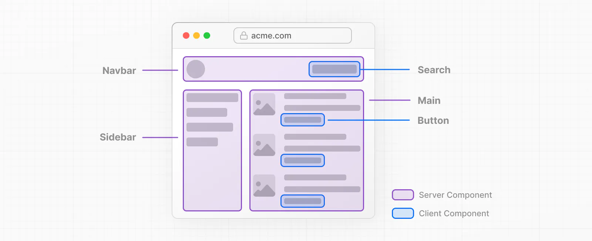

# React Server Components, NextJs Route and Data Fetching
React Server Components (RSCs) offer the flexibility to decide where to render components based on their purpose, diverging from the client-side rendering approach of Single-Page Applications. By breaking down the page into smaller components, it becomes evident that many components are non-interactive and can be rendered on the server as Server Components. This can improve performance, reduce bundle size and also improve the initial page loading time.

## What are React Server Components?
- React Server Components are server-side components that facilitate seamless collaboration between server and Client Components (”use client”) for rendering React applications. RSCs are stateless components designed to run on the server, enhancing the transition between server-rendered content and client-side interactivity.
- RSCs also allow data fetching to be part of the component tree, using top-level await and server-side data serialization.
- RSCs prioritize server-side rendering and generate static content on the server.
- They use a protocol that lets the client request parts of the component tree from the server, enabling a hybrid of Single-Page Application (SPA) and Multi-Page Application (MPA) architectures.
- They depend on frameworks to implement them, and the React team expects them to become widely used and change the ecosystem.
- They also support async/await for data fetching and plan to add a “use()” hook for client-side data loading.

## Why Server Components?
Server Components make your app load faster and use less JavaScript. The base runtime is fixed and cacheable, and more JavaScript is only added when you need client-side interactivity with Client Components.

Next.js renders the initial HTML on the server and sends it to the browser. The browser then enhances the HTML with interactivity by loading the Next.js and React runtime asynchronously. This lets the client take over the app and handle user interactions.

## **How to use Server Components in Next.js?**
In the latest release of Next.js, they have introduced Server Components as essential requirements to be utilized in the construction of their single-page applications (SPAs).

To enhance code maintainability and readability, it is recommended to use the file naming convention of **`.server.(jsx|tsx)`** for Server components, and **`.client.(jsx|tsx)`**  for Client components.

In Client components use the `use client` directive at the top of any file that contains client-side components or logic. This will mark the boundary between server-only and client.



Here is an example of a simple RSC that fetches some data from a database and renders it on the server:

```jsx
// app/Greeting.server.js
import db from './db';

export default function Greeting({ name }) {
 // Fetch data from the database on the server
 const message = db.getGreeting(name);
 
 // Return a plain object with the data
 return { message };
}
```

And here is how you can use it in your client-side component:

```jsx
// app/Homepage.client.js
'use client'; // Mark this file as client-only
import Greeting from './Greeting.server'; // Import the RSC

export default function Homepage() {
 // Use the RSC as a regular component
 return (
  <div>
   <h1>Welcome to Next.js!</h1>
   <Greeting name="Alice" /> // Render the RSC
  </div>
 );
}
```


`use client` marks the transition from server-only to client code. It goes at the top of a file, before any imports, to indicate that everything below it belongs to the client bundle. This includes any modules or components that are imported in the file.

Server Components are incompatible with custom hooks that use state, effects, or browser-only APIs.

## What are the benefits of using Server Components with Next.js?
Using RSC with Next.js can bring several benefits to your application, such as:

- Improved performance: reduce the amount of data that needs to be transferred between the server and the client, as well as the amount of code that needs to be parsed and executed on the client. This can result in faster page loads and better user experience.
- Reduced bundle size: this allows you to move large dependencies or logic that are only needed on the server to RSC files, which are not included in the client bundle. This can reduce the size of your client-side code and improve performance and caching.
- Simplified data fetching: eliminate the need for using APIs or fetching data on the client for some parts of your application via access directly to backend resources. This can simplify your code, reduce dependencies complexity, errors and keep sensitive information on the backend.

## Pattern for using Server Components
- To optimize our component tree, we aim to relocate client components to the leaf nodes whenever feasible. Rather than designating the entire component as a client component, we extract the interactive logic and place it in a client-specific component, such as `<SearchBar />, <Input />...` and so on. Meanwhile, we maintain static components like `<Layout />, <List />...` as server components. This approach eliminates the need to transmit the entire JavaScript code for the layout to the client.
- Server and Client Components can be combined in the same component tree, which means:
  - On the server, React renders **all** Server Components **before** sending the result to the client.
  - On the client, React renders Client Components and *slots in* the rendered result of Server Components, merging the work done on the server and client.
- Importing Server Components in Client Components is **not supported**, so Server Components will treat as **Client Components.**

```jsx
'use client';

<ClientComponents>
  <ServerComponents>
</ClientComponents>
```

- We suggest passing Server Components as `children` props to Client Components and importing and nesting `<ClientComponent>` in a parent component. We can use this way for both libraries and context that only work on the client or was not added `use client` in their files.

```jsx
<ClientComponents>
  {children} // The children is Server Components 
</ClientComponents>
```

- Both Server and Client Components can share JavaScript modules, but this can cause security issues if some code with sensitive data that should only run on the server gets exposed to the client. To avoid this, we can use packages like `server-only` that keep the server-only code separate from the client code. We can use this package by importing `server-only` in any modules like this:

```jsx
import 'server-only';
 
export async function getData() {
 // Do get the data
}
```

## Server Components Data Fetching in Next.js
With the new features implemented to the `fetch` WebAPI and make the use of `async/await` in Server Components, now the `fetch` can provide us a higher performance on caching/revalidating fetched data and prevent memory caching duplicate requests.

Next.js caches the data from fetch requests by default. When Next.js renders a page on the server and comes across a fetch, it will look for the data in the cache first. If the data is there, it will use it. If not, it will fetch and store the data for later requests. Or we can use native `cache` function of react to manually cache the data if unable to use `fetch` WebAPI.

For revalidating the cache data, that the `fetch` API introduced two ways are:

- [Background revalidate](https://nextjs.org/docs/app/building-your-application/data-fetching/revalidating#background-revalidation) at a specific time interval
- On-Demand revalidate by using [revalidatePath](https://nextjs.org/docs/app/api-reference/functions/revalidatePath) (for app route) or [revalidateTag](https://nextjs.org/docs/app/api-reference/functions/revalidateTag) (the tag of the `fetch` request)

We can use the [Server Actions](https://nextjs.org/docs/app/building-your-application/data-fetching/server-actions) in handling actions in Client Components interactive actions by adding `use server` in the handling action:

```jsx
export default function Form() {
  async function handleSubmit() {
    'use server';
    // ...
  }
 
  async function submitPicture() {
    'use server';
    // ...
  }
 
  return (
    <form action={handleSubmit}>
      <input type="text" name="name" />
      <input type="image" formAction={submitImage} />
      <button type="submit">Submit</button>
    </form>
  );
}
```

If we don’t use `fetch` to cache the API on server code, we can still fetch data on the client side. We suggest using libraries like `SWR` or `React Query` with Client Components. Later, we’ll also be able to use React’s [use()](https://nextjs.org/docs/app/building-your-application/data-fetching/fetching#use-in-client-components) hook to fetch data in Client Components.

If we planning to use `react-query` on the project, we can use the approach with [initialData](https://tanstack.com/query/v4/docs/react/guides/ssr#using-initialdata-2) in `useQuery` or [Hydrate](https://tanstack.com/query/v4/docs/react/guides/ssr#using-hydrate) .

## Conclusion
In summary, React Server Components (RSCs) provide a powerful way to render React applications by enabling collaboration between server and client components. They improve performance, reduce bundle size, and enhance initial page loading time. By breaking down the page into smaller components, non-interactive parts can be rendered on the server as Server Components, resulting in faster page loads and better user experience. RSCs in Next.js offer benefits such as improved performance, reduced bundle size, and simplified data fetching. Overall, RSCs offer developers a more efficient and seamless rendering experience for React applications.

## References
- [SSR | TanStack Query Docs](https://tanstack.com/query/v4/docs/react/guides/ssr#using-hydrate)
- [Getting Started | Next.js (nextjs.org)](https://nextjs.org/docs/getting-started/react-essentials)
- [Introducing Zero-Bundle-Size React Server Components – React](https://react.dev/blog/2020/12/21/data-fetching-with-react-server-components)

---
<!-- cta -->

### Contributing
At Dwarves, we encourage our people to read, write, share what we learn with others, and [[CONTRIBUTING|contributing to the Brainery]] is an important part of our learning culture. For visitors, you are welcome to read them, contribute to them, and suggest additions. We maintain a monthly pool of $1500 to reward contributors who support our journey of lifelong growth in knowledge and network.

### Love what we are doing?
- Check out our [products](https://superbits.co)
- Hire us to [build your software](https://d.foundation)
- Join us, [we are also hiring](https://github.com/dwarvesf/WeAreHiring)
- Visit our [Discord Learning Site](https://discord.gg/dzNBpNTVEZ)
- Visit our [GitHub](https://github.com/dwarvesf)