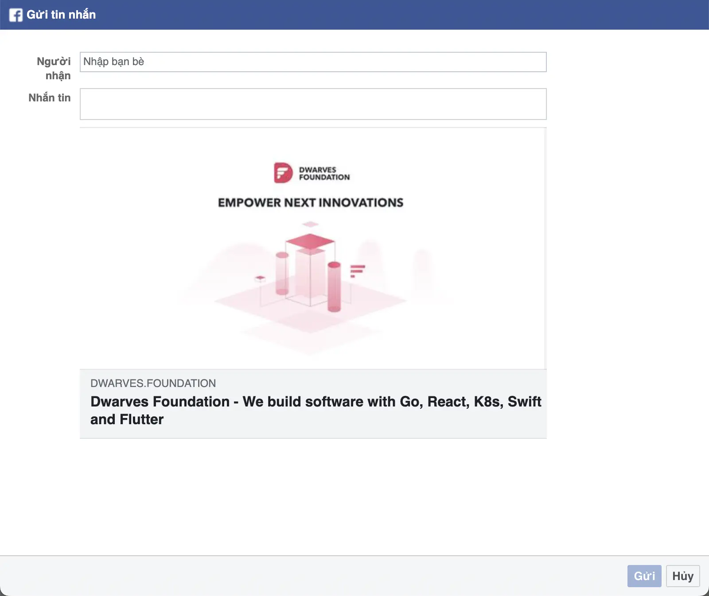

## Why?
With the rise of social platforms like Facebook, Twitter and LinkedIn, it's easier than ever to share URLs with a large audience quickly and efficiently. However, each social network has its own unique way of handling URLs, and understanding the correct formatting can make a significant difference in the visibility and engagement of your shared content.

## Facebook
```javascript
`https://www.facebook.com/sharer.php?u=${url}`
```

This format allows you to share a specific URL with your [Facebook](https://about.meta.com/technologies/facebook-app/) friends and followers. By replacing `url` with the actual URL, you can create a link that shows a dialog with the content you want to share.


## Messenger
Sharing via [Messenger](https://about.meta.com/technologies/messenger/) is another way to share a URL with your Facebook friends and contacts.

```javascript
`https://www.facebook.com/dialog/send?app_id=${appId}&display=popup&link=${url}&redirect_uri=${url}`
```

To use this format, you'll need to replace `${appId}` with your Facebook app ID and `${url}` with the URL you want to share.

> Follow this [documentation](https://developers.facebook.com/docs/development/create-an-app) to create a Facebook app and get the app ID.



## Zalo
To share a URL via [Zalo](https://zalo.me/pc), a widely used messaging app in Vietnam, you need to create a JSON object containing a key of `"url"` and the value of the URL you want to share. Then stringify and encode the string in the base64 format.

```javascript
function encodeB64(str: string) {
	return window.btoa(str)
}

const sharingUrl = `https://button-share.zalo.me/share_external?d=${encodeB64(
	JSON.stringify({ url }),
)}`
```


## Other platforms
Check out some other formats that allow you to share a URL via some social networks.

| Platform | URL format                                                              |
| -------- | ----------------------------------------------------------------------- |
| LinkedIn | <pre>`https://www.linkedin.com/sharing/share-offsite/?url=${url}`</pre> |
| Twitter  | <pre>`http://twitter.com/share?url=${url}`</pre>                        |
| Telegram | <pre>`https://telegram.me/share/?url=${url}`</pre>                      |
| Reddit   | <pre>`https://www.reddit.com/submit?url=${url}&title=${title}`</pre>    |
