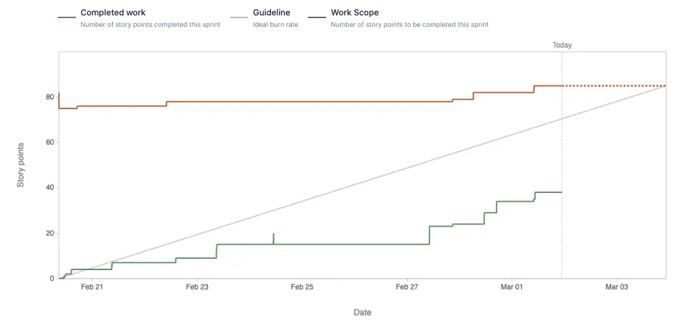

From the team product, when the Project Manager want to report with their client for the question: "How is our project coming along?", to have a catch-up on the product's process.

Then, definitely, they will need some type of the report like the specific chart, to show with their client on the progress for the product development, instead of just saying something like: "Everything is on track".

There are 2 different types of chart can follow up: Burnup and Burndown.

## What is a Burndown chart?
For this chart, we are using for visualizing the amount of work left to complete in a specific project development, to see if how quickly a team is moving forward to reach the common goal.

Based on the reference documents, those are 4 items to show how and when we use the Burndown chart:

> - Actual velocity or speed of the entire team
> - Estimated speed per sprint
> - Total work complete at each point in time
> - Remaining tasks versus time remaining

## What is a Burnup chart?
With this chart, it is used to track how much of a specific project, features has been completed within a planning timeline. To see if the product team is making thing on the exact timeline that they had planned.

Same with the Burndown chart, we will have 4 items to show how and when we use the Burnup chart as well:

> - The number of overall tasks completed
> - The amount of time each task took to complete
> - If a project is on time
> - Work that is added to the scope or into an existing sprint

## Differences between Burndown and Burnup
Basically, when wanting to see what is left to be completed on the giving timeline, we can use Burndown chart to track. On the other hands, if we want to see what are the things that the team had done to highlight, also for checking if there any popup work is added into the timeline to have an impact on it.

## Reference
- [Burndown and Burnup charts: What's the Difference and How to use them](https://rindle.com/blog/burndown-and-burnup-charts-whats-the-difference-and-how-to-use-them)
- [Burndown vs Burnup Chart](https://www.projectmanagement.com/blog/blogPostingView.cfm?blogPostingID=40731&thisPageURL=/blog-post/40731/Burndown-vs-Burnup-Chart#_=_)

---
<!-- cta -->

### Contributing
At Dwarves, we encourage our people to read, write, share what we learn with others, and [[CONTRIBUTING|contributing to the Brainery]] is an important part of our learning culture. For visitors, you are welcome to read them, contribute to them, and suggest additions. We maintain a monthly pool of $1500 to reward contributors who support our journey of lifelong growth in knowledge and network.

### Love what we are doing?
- Check out our [products](https://superbits.co)
- Hire us to [build your software](https://d.foundation)
- Join us, [we are also hiring](https://github.com/dwarvesf/WeAreHiring)
- Visit our [Discord Learning Site](https://discord.gg/dzNBpNTVEZ)
- Visit our [GitHub](https://github.com/dwarvesf)