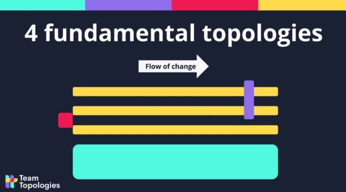
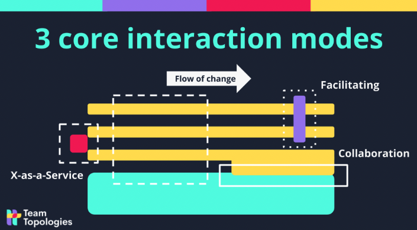

Many organizations experience problems with software delivery because they have an unhelpful model of what software development is really about. An obsession with “feature delivery” ignores human-related and team-related dynamics inherent in modern software development, leading to disengagement from staff, especially when there are high cognitive loads.

The Team Topologies pattern enables teams to address all these points by establishing a [[Team first thinking | team-first approach]] to software delivery based on four fundamental team types, three patterns of interaction between teams, and ways of turning difficulties in delivery into signals for the self-steering organization.

A software organization can be run with only four team types:

- **[[Stream-aligned team | Stream aligned]]**: a team that is aligned with the main flow of business change, with cross-functional skills and the ability to deliver significant increments, can move forward without waiting on another team..
- **Platform**: a team that develops the underlying platform supporting stream-aligned teams in delivery, thereby simplifying otherwise complex technology and reducing cognitive load for teams that use it.
- **[[Enabling team | Enabling]]**: a team that trains and supports other teams in adopting and modifying software as part of a transition or learning period.
- **Complicated subsystem**: a team that is responsible for a subsystem too complicated (mathematics/calculation/...) to be handled by a normal stream-aligned team or platform team. Optional and only used when necessary.

Effective software delivery requires the combination of specific team types, but the interaction modes between these four fundamental team topologies are vitally important to understanding and nurturing effective software delivery:

- **Collaboration mode**: teams that work together on a shared goal—especially those working to discover new technology or approaches—generally have an advantage over individual workers. The rapid pace of learning is an important asset.
- **X-as-a-Service mode**: One team uses something provided by another team (such as an API, a tool, or a full software product). Collaboration is minimal.
- **Facilitating mode**: one team (usually an enabling team) support another team in learning or adopting a new approach.

## References
- _Team Topologies: Organizing Business and Technology Teams for Fast Flow by Manuel Pais and Matthew Skelton_
- https://teamtopologies.com/key-concepts
